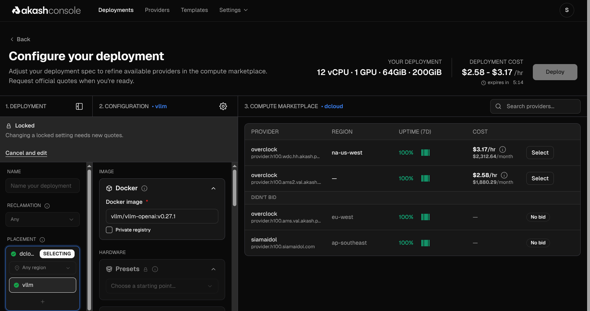
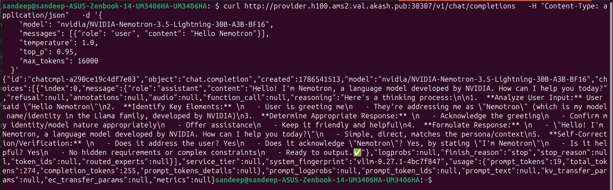

*Last updated: August 2026*

You can run NVIDIA Nemotron 3.5 Lightning with [vLLM](/blog/running-vllm-on-akash/) on a single 80GB GPU: one H100 or one A100 serves the BF16 build, which needs roughly 60GB of VRAM. Nemotron 3.5 Lightning is an open 30-billion-parameter Mixture-of-Experts model (3B active) that NVIDIA released on August 11, 2026, built for the high-volume execution layer of long-running AI agents.

**TL;DR**

- **GPU and VRAM requirements:** runs on a single 80GB GPU, either one H100 or one A100. The BF16 weights need about 60GB of VRAM; the NVFP4 (4-bit) build needs far less and also fits a GeForce RTX 5090 or a DGX Spark.
- **[vLLM](/blog/running-vllm-on-akash/) setup:** serve it with vLLM (Docker image `vllm/vllm-openai:v0.27.1`) behind an OpenAI-compatible API on port 8000. Ready-to-deploy Akash SDL manifests for both H100 and A100 are included below.
- **H100 vs A100:** both hold the ~60GB BF16 weights on one 80GB card. The A100 is the cheaper choice for standard serving; step up to the H100 for higher throughput per GPU and NVFP4 speculative decoding.
- **Size and design:** 30B total parameters, 3B active per token, on a hybrid Mamba-2 + MoE + attention architecture, with a context window up to 1M tokens.
- **Performance:** scores 81.6 on MMLU Pro, 75.6 on GPQA Diamond, and 52.8 on SWE-bench Verified (NVFP4 checkpoint). It ties gpt-oss-120b on the Artificial Analysis Intelligence Index (24) at roughly a quarter of the total parameters.
- **Speed and cost:** the fastest model in its class in Artificial Analysis testing at roughly 669 tokens per second, up to 4x the output speed of similar-sized models. On [Akash](/pricing/gpus/), checked August 13, 2026, an A100 is priced at \$1.86/GPU-hr and an H100 at \$2.58/GPU-hr, a fraction of hyperscaler on-demand rates.

Need bare-metal GPU access, or affordable, high-performance GPU compute? From training models to running inference to deploying containerized apps, [Akash](/pricing/gpus/) covers all your compute needs — see the [GPUs on demand](/gpus-on-demand/) form for large clusters or reserved capacity in any quantity.

## What GPU do you need to run Nemotron 3.5 Lightning?

Nemotron 3.5 Lightning runs on a single GPU. For a data-center deployment the practical choice is one 80GB card, either an H100 or an A100, and the model also runs on a DGX Spark (GB10) or a GeForce RTX 5090.

How much VRAM you need depends on the checkpoint. The BF16 weights are about 60GB, which is why they fit on a single 80GB H100 or A100 with room left for KV cache. The NVFP4 (4-bit) checkpoint is far smaller, roughly the mid-teens of gigabytes, so it leaves more headroom for concurrency and long context, and it also serves through W4A16 kernels on older Ampere-class cards. In short: 80GB is the comfortable target for the BF16 build, and NVFP4 lowers the bar from there.

For a broader look at how 80GB-and-up cards stack up on memory and price, see our [B300 vs B200 vs H200 self-hosting comparison](/bits/nvidia-b300-vs-b200-vs-h200-best-gpu-for-self-hosting-ai/).

| Deployment target | GPU / memory | Precision | Notes |
|---|---|---|---|
| Data center (max throughput) | 1x NVIDIA H100 (80GB) | NVFP4 | Serves the full 1M-token context by default |
| Data center (Blackwell) | 1x GB200 | NVFP4 | Highest-end single-GPU path |
| Long-context, multi-GPU | 8x H100 (TP8 + expert parallel) | NVFP4 | For high concurrency at 1M context |
| Desktop / edge | 1x DGX Spark (GB10) | NVFP4 | Local agents, data stays on device |
| Consumer | GeForce RTX 5090 | NVFP4 | Local inference on a single card |
| Data center (Ampere) | 1x NVIDIA A100 (80GB) | BF16 | Fits the ~60GB BF16 weights on one card |
| Older hardware | Ampere-class GPUs | W4A16 | Quantized checkpoint via W4A16 kernels |

Source: [NVIDIA model card](https://huggingface.co/nvidia/NVIDIA-Nemotron-3.5-Lightning-30B-A3B-NVFP4), as of August 2026.

The takeaway: unlike 100B-plus models that demand multi-GPU nodes, Nemotron 3.5 Lightning targets a single accelerator. That single-GPU footprint is what makes it cheap to serve at scale, because you can pack more independent agent workers per node and rent smaller, more available GPUs to run them.

### H100 or A100: which one should you rent?

Pick the A100 for standard BF16 serving at the lowest cost per GPU-hour, and pick the H100 when you need the extra throughput or plan to run the NVFP4 checkpoint with speculative decoding. Both are 80GB cards and both hold the ~60GB BF16 weights with headroom for KV cache, so memory capacity doesn't decide this one — throughput and price do.

| Factor | A100 (80GB) | H100 (80GB) |
|---|---|---|
| Fits BF16 weights (~60GB) | Yes | Yes |
| Memory bandwidth | 2.0 TB/s | 3.35 TB/s |
| Native FP4/FP8 tensor cores | No (BF16/W4A16 paths) | Yes (NVFP4-accelerated) |
| Akash price (checked Aug 13, 2026) | \$1.86/GPU-hr | \$2.58/GPU-hr |
| Best fit | Cost-sensitive BF16 serving | High-throughput or NVFP4 serving |

The takeaway: if you're serving the BF16 checkpoint at moderate concurrency, the A100 does the job for roughly 28% less per hour. Reach for the H100 when concurrency climbs, when you want NVFP4's speculative-decoding speedup, or when you're running the full 1M-token context at scale.

## How do you run Nemotron 3.5 Lightning with vLLM?

You run Nemotron 3.5 Lightning with [vLLM](/blog/running-vllm-on-akash/), which serves it behind an OpenAI-compatible API so existing client code works with just a changed base URL. Use vLLM v0.27.1 or newer (Docker image `vllm/vllm-openai:v0.27.1`), since the hybrid Mamba-2 architecture needs the Mamba serving path that recent vLLM builds add. NVIDIA recommends sampling at temperature 1.0 and top_p 0.95.

A minimal [vLLM](/blog/running-vllm-on-akash/) launch on a single H100 or A100 looks like this:

```shell
vllm serve --model nvidia/NVIDIA-Nemotron-3.5-Lightning-30B-A3B-NVFP4 \
    --max-num-seqs 256 \
    --enable-prefix-caching \
    --reasoning-parser nemotron_v3 \
    --tool-call-parser qwen3_coder \
    --enable-auto-tool-choice
```

The model exposes a reasoning toggle (thinking on by default, off for direct answers) through chat-template arguments, plus native tool-calling via the `qwen3_coder` parser. For agent builds, NVIDIA notes you should set `force_nonempty_content` in the chat-template kwargs.

Speculative decoding is where the speed comes from, and it ships in the box. Nemotron 3.5 Lightning was pre-trained with Multi-Token Prediction (MTP) and also ships two external draft models: DSpark (recommended for DGX Spark and low-concurrency data-center serving) and DFlash (a block-diffusion drafter). MTP suits medium-to-high concurrency, with the optimal draft length shrinking as concurrency rises. All of this detail comes from the [NVIDIA technical blog](https://developer.nvidia.com/blog/nvidia-nemotron-3-5-lightning-delivers-fast-accurate-specialized-task-execution-for-long-running-agents/) and the model card.

If you would rather not run a server at all, the weights are available on [Hugging Face](https://huggingface.co/nvidia/NVIDIA-Nemotron-3.5-Lightning-30B-A3B-NVFP4), and hosted inference is offered by providers including DeepInfra, Fireworks, FriendliAI, CoreWeave, GMI Cloud, Nebius, and Crusoe. For a walkthrough of self-hosting a similar MoE model end to end, see our [Kimi K3 vs GLM-5.2 vs DeepSeek V4 Flash self-host guide](/bits/kimi-k3-vs-glm-5-2-vs-deepseek-v4-flash-0731-self-host-guide/).

## Where should you deploy Nemotron 3.5 Lightning?

Deploy it by self-hosting on raw GPUs through [Akash Console](https://console.akash.network/), an open GPU marketplace that prices compute through a reverse auction rather than fixed retail rates, and routinely lands well below hyperscaler pricing. You rent a single H100, A100, H200, or an RTX 5090, deploy a container running [vLLM](/blog/running-vllm-on-akash/), and keep full control of routing, data residency, and the serving config, at marketplace prices. (Akash uses a reverse auction: you submit a workload and a maximum price, and providers bid the rate down.) A working, tested SDL for this exact deployment is in the next section.

## How do you deploy Nemotron 3.5 Lightning on Akash with an SDL?

You deploy Nemotron 3.5 Lightning on Akash with a short SDL (Stack Definition Language, the YAML manifest that tells Akash what container to run and what hardware to rent). Both manifests below serve the BF16 checkpoint through [vLLM](/blog/running-vllm-on-akash/) and expose an OpenAI-compatible API on port 8000; they differ only in the GPU they request, an H100 or an A100. Paste the one matching the card you want into [Akash Console](https://console.akash.network/), add your Hugging Face token, and deploy.



### For an H100 (80GB)

This manifest serves the BF16 checkpoint through [vLLM](/blog/running-vllm-on-akash/) on a single H100.

```yaml
---
version: "2.0"
services:
  vllm:
    image: vllm/vllm-openai:v0.27.1
    expose:
      - port: 8000
        as: 8000
        to:
          - global: true
    command:
      - bash
      - "-c"
    args:
      - >-
        vllm serve --model $MODEL_CKPT --host 0.0.0.0 --port 8000 --max-num-seqs
        128 --enable-prefix-caching --async-scheduling --mamba-backend
        flashinfer --mamba-ssm-cache-dtype float16
        --enable-mamba-cache-stochastic-rounding --mamba-cache-philox-rounds 5
        --reasoning-parser nemotron_v3 --tool-call-parser qwen3_coder
        --enable-auto-tool-choice
    env:
      - MODEL_CKPT=nvidia/NVIDIA-Nemotron-3.5-Lightning-30B-A3B-BF16
      - HF_TOKEN=hf_XXXXXXXXXXXXXXXX
      - HF_HOME=/root/.cache/huggingface
profiles:
  compute:
    vllm:
      resources:
        cpu:
          units: 12
        memory:
          size: 64Gi
        storage:
          - size: 200Gi
        gpu:
          units: 1
          attributes:
            vendor:
              nvidia:
                - model: h100
                  ram: 80Gi
                  interface: sxm
  placement:
    dcloud:
      pricing:
        vllm:
          denom: uact
          amount: 100000
deployment:
  vllm:
    dcloud:
      profile: vllm
      count: 1
```

### For an A100 (80GB)

If you would rather run on an A100, this manifest requests one instead. It is identical apart from the GPU model line (and it drops the `interface: sxm` requirement, so the scheduler can place you on either the SXM or PCIe A100). The A100 has plenty of memory for the roughly 60GB BF16 weights.

```yaml
---
version: "2.0"
services:
  nemotron:
    image: vllm/vllm-openai:v0.27.1
    expose:
      - port: 8000
        as: 8000
        to:
          - global: true
    command:
      - bash
      - "-c"
    args:
      - >-
        vllm serve $MODEL_CKPT --host 0.0.0.0 --port 8000 --max-num-seqs 128
        --enable-prefix-caching --async-scheduling --mamba-backend flashinfer
        --mamba-ssm-cache-dtype float16 --enable-mamba-cache-stochastic-rounding
        --mamba-cache-philox-rounds 5 --reasoning-parser nemotron_v3
        --tool-call-parser qwen3_coder --enable-auto-tool-choice
    env:
      - MODEL_CKPT=nvidia/NVIDIA-Nemotron-3.5-Lightning-30B-A3B-BF16
      - HF_TOKEN=hf_XXXXXXXXXXXXXXXXX
      - HF_HOME=/root/.cache/huggingface
profiles:
  compute:
    nemotron:
      resources:
        cpu:
          units: 12
        memory:
          size: 64Gi
        storage:
          - size: 200Gi
        gpu:
          units: 1
          attributes:
            vendor:
              nvidia:
                - model: a100
                  ram: 80Gi
  placement:
    dcloud:
      pricing:
        nemotron:
          denom: uact
          amount: 100000
deployment:
  nemotron:
    dcloud:
      profile: nemotron
      count: 1
```

Three things to change before you deploy either manifest. First, swap the `HF_TOKEN` placeholder for your own Hugging Face access token, since the weights are gated behind license acceptance. Second, confirm `MODEL_CKPT` points to the checkpoint you want (both recipes use the BF16 build). Third, set `placement.dcloud.pricing.amount` to your maximum bid; providers on the marketplace bid down from that ceiling. One naming rule to keep in mind: in an Akash SDL the service name, the compute profile, the pricing key, and the deployment profile must all match, which is why the H100 manifest uses `vllm` throughout and the A100 manifest uses `nemotron` throughout.

Both manifests request the same supporting resources, and that profile is what keeps the model on a single GPU:

| SDL field | Value | What it does |
|---|---|---|
| `gpu.units` / model | 1x NVIDIA H100 or A100 | Rents one GPU (change the model line to pick) |
| `gpu.attributes.ram` | 80Gi | Requires an 80GB card |
| `gpu.attributes.interface` | sxm (H100 only) | The H100 manifest pins SXM; the A100 manifest omits it |
| `cpu.units` | 12 | vCPUs for the serving process |
| `memory.size` | 64Gi | System RAM |
| `storage.size` | 200Gi | Holds the weights plus the model cache |
| `expose.port` | 8000 (global) | Public OpenAI-compatible endpoint |

A note on precision. Both recipes serve the BF16 checkpoint and set `--mamba-ssm-cache-dtype float16` to keep the roughly 60GB of BF16 weights plus cache inside the 80GB card, which is why concurrency is capped at 128. If you want more KV-cache headroom, higher concurrency, or a smaller and cheaper card, switch `MODEL_CKPT` to the NVFP4 (4-bit) checkpoint (`nvidia/NVIDIA-Nemotron-3.5-Lightning-30B-A3B-NVFP4`), whose weights are far smaller. Either way you get one GPU, one manifest, and a standard OpenAI-compatible endpoint, at reverse-auction pricing rather than a hyperscaler's fixed rate.

### Testing the deployment

Once the lease is active, Akash gives you a public URL for the provider running your container. Call it with a standard OpenAI-compatible `chat/completions` request:

```shell
curl http://provider.h100.ams2.val.akash.pub:30307/v1/chat/completions \
  -H "Content-Type: application/json" \
  -d '{
    "model": "nvidia/NVIDIA-Nemotron-3.5-Lightning-30B-A3B-BF16",
    "messages": [{"role": "user", "content": "Hello Nemotron"}],
    "temperature": 1.0,
    "top_p": 0.95,
    "max_tokens": 16000
  }'
```



The response comes back as a standard OpenAI-style completion object, with the model's reply in `choices[0].message.content` and token usage in `usage`. Swap the host in the URL for whatever provider hostname Akash Console assigns to your own lease.

## What is NVIDIA Nemotron 3.5 Lightning?

NVIDIA Nemotron 3.5 Lightning is a 30B open-weights Mixture-of-Experts (MoE) large language model with 3B active parameters (31.6B total and 3.6B active, to be exact), released on August 11, 2026. A MoE routes each token to only a few of its many "expert" sub-networks, so the model runs at the compute cost of a small model while keeping the capacity of a larger one. It is text-only and supports a context window of up to 1 million tokens.

Nemotron 3.5 Lightning is the smallest member of NVIDIA's Nemotron 3 family and the successor to Nemotron 3 Nano 30B A3B. NVIDIA positions it as the execution layer of "always-on" agents: the model that handles the routine, high-volume work (tool calls, validating outputs, delegating to sub-agents) while a larger frontier model handles planning. It ships under the permissive OpenMDW-1.1 license with open weights, training data, and recipes, so teams can download, run, fine-tune, and modify it freely.

The release also matters as a strategy signal. NVIDIA describes it as the company's first open-source model since CEO Jensen Huang publicly argued for open models in late July 2026, telling Axios that ["free AI should be great for hardware."](https://www.cnbc.com/2026/08/11/nvidia-releases-nemotron-3point5-lightning-open-source-ai-model-.html) Open models still need GPUs to run, which lines up neatly with NVIDIA's hardware business.

The model architecture is a hybrid: interleaved Mamba-2 and MoE layers with select attention layers, trained on more than 20 trillion tokens. Its pre-training data has a cutoff of September 2025 and its post-training data a cutoff of May 2026, per the [official model card](https://huggingface.co/nvidia/NVIDIA-Nemotron-3.5-Lightning-30B-A3B-NVFP4).

## How does Nemotron 3.5 Lightning perform?

Nemotron 3.5 Lightning delivers frontier-adjacent accuracy for its size and does it fast. On the Artificial Analysis Intelligence Index it scores 24, a 9-point jump over Nemotron 3 Nano's 15, which puts it level with OpenAI's gpt-oss-120b (24) and just behind Nemotron 3 Super (26), a model roughly four times its size, according to [Artificial Analysis](https://artificialanalysis.ai/articles/nemotron-3-5-lightning-launch).

The table below shows NVIDIA's own benchmark results for the NVFP4 checkpoint, measured under a consistent evaluation harness. Vendors measure differently, so treat cross-model comparisons as directional.

| Benchmark (NVFP4 checkpoint) | Score | What it measures |
|---|---|---|
| MMLU Pro | 81.62 | General knowledge and reasoning |
| GPQA Diamond (no tools) | 75.57 | Graduate-level science reasoning |
| SWE-bench Verified | 52.80 | Real-world software bug fixing |
| Terminal-Bench 2.1 | 23.46 | Agentic command-line task completion |
| PinchBench | 83.43 | Agentic tool-use accuracy |
| IFBench (loose) | 72.88 | Instruction following |
| AA-LCR | 49.19 | Long-context reasoning |
| GDPval-AA-V2 (Elo) | 865 | Economically valuable agent tasks |

Source: [NVIDIA model card, as of August 11, 2026](https://huggingface.co/nvidia/NVIDIA-Nemotron-3.5-Lightning-30B-A3B-NVFP4). Scores are for the NVFP4 (4-bit) checkpoint; the BF16 checkpoint posts slightly different numbers. These are NVIDIA's own reported figures; independent harnesses like Artificial Analysis report different absolute values, so compare within a table rather than across tables.

Raw accuracy is only half the story for agents. NVIDIA reports that on PinchBench, Nemotron 3.5 Lightning reaches 86% accuracy while completing 10,000 tasks 30% faster than Qwen3.6 35B at similar accuracy, and delivers up to 4x the output speed of comparable-sized models. For a model that spends its day on high-frequency, low-latency execution steps, that throughput advantage is the point.

## How does Nemotron 3.5 Lightning compare to gpt-oss-120b, Qwen3.6, and other Nemotron models?

Nemotron 3.5 Lightning matches OpenAI's gpt-oss-120b on overall intelligence while using roughly a quarter of the total parameters, and it leads on agentic tasks. The independent benchmark platform Artificial Analysis scores it 24 on its Intelligence Index (v4.1.1), tying gpt-oss-120b (24) and sitting just behind NVIDIA's own Nemotron 3 Super (26), a model about four times larger.

| Model | Total params | AA Intelligence Index | GDPval-AA v2 Elo (agentic) |
|---|---|---|---|
| Nemotron 3.5 Lightning | 31.6B (3.6B active) | 24 | 824 |
| gpt-oss-120b | ~120B | 24 | 800 |
| Nemotron 3 Super (120B A12B) | 120B (12B active) | 26 | 698 |
| Nemotron 3 Nano 30B A3B (predecessor) | 30B (3B active) | 15 | not reported |
| Qwen3.6 35B A3B | 35B (3B active) | 32 | not reported |

Source: [Artificial Analysis](https://artificialanalysis.ai/articles/nemotron-3-5-lightning-launch) and [The Decoder](https://the-decoder.com/nvidias-open-weight-nemotron-3-5-lightning-prioritizes-speed-over-maximum-intelligence/), August 2026.

The takeaway: Nemotron 3.5 Lightning ties gpt-oss-120b on the Intelligence Index at about one quarter of the total parameters, and on the GDPval-AA v2 agentic Elo it actually beats both gpt-oss-120b (800) and the far larger Nemotron 3 Super (698). Smarter small models exist, such as Qwen3.6 35B A3B (32) and Meta's Muse Glimmer (35), so Lightning is not the most intelligent model in its size class. NVIDIA optimized it for a different point on the frontier: speed and cost per agentic task.

## How fast is Nemotron 3.5 Lightning?

Nemotron 3.5 Lightning is the fastest model in its comparison set. In Artificial Analysis pre-release testing on the NVFP4 weights, it reached a median output speed of roughly 669 tokens per second, nearly twice the 386 tokens per second of Google's Gemini 3.5 Flash-Lite. That speed shows up as dramatically shorter task completion times.

| Model | Time to complete one Intelligence Index task |
|---|---|
| Nemotron 3.5 Lightning | ~0.5 min |
| gpt-oss-120b | ~3.4 min |
| Qwen3.6 35B A3B | ~3.5 min |
| Gemma 4 31B | ~5.8 min |

Source: [Artificial Analysis](https://artificialanalysis.ai/articles/nemotron-3-5-lightning-launch), pre-release NVFP4 measurements, August 2026.

The takeaway: Nemotron 3.5 Lightning finishes a representative agent task in about half a minute, roughly 7x faster than gpt-oss-120b and Qwen3.6 35B A3B at similar or better agentic accuracy. For always-on agents doing thousands of steps a day, that speed is what makes it economical to run.

## How much does it cost to run Nemotron 3.5 Lightning on GPU cloud?

Because Nemotron 3.5 Lightning fits on one 80GB GPU, its serving cost is essentially the price of a single GPU-hour, and that price varies widely by provider. On the [Akash marketplace](/pricing/gpus/), checked August 13, 2026, an A100 is priced at \$1.86/GPU-hr and an H100 at \$2.58/GPU-hr, a fraction of hyperscaler on-demand rates. Since the model runs fine on an A100, picking the A100 is the cheaper way to serve it.

| Provider (GPU, on-demand) | Approx. \$/GPU-hour | As of |
|---|---|---|
| Akash (A100, 80GB SXM4) | \$1.86 (starting rate) | Aug 13, 2026 |
| Akash (H100, 80GB SXM5) | \$2.58 (starting rate) | Aug 13, 2026 |
| Vast.ai (H100, spot) | ~\$1.49 | Feb 2026 |
| Broad H100 market | \$1.40 to \$8.00+ | May 2026 |
| Hyperscaler H100 (Azure/GCP) | ~\$7 to over \$10 | 2026 |

Sources: [Akash live GPU pricing](/pricing/gpus/), [CloudZero](https://www.cloudzero.com/blog/h100-gpu-cost/), and [AIMultiple GPU index](https://aimultiple.com/gpu-index). Akash rates move with the reverse auction; check current Akash A100 and H100 rates at [akash.network/pricing/gpus](/pricing/gpus/) before deploying, since they change as providers bid.

The takeaway: the same Nemotron 3.5 Lightning inference workload can cost several times more on a hyperscaler than on a marketplace like Akash, and because the model runs on a single card, the A100 is the cheapest on-demand way to serve it here. For always-on agents that keep a GPU busy 24/7, that per-hour gap compounds directly into monthly burn.

## FAQs

**Is Nemotron 3.5 Lightning open source?** Yes. NVIDIA released Nemotron 3.5 Lightning under the permissive OpenMDW-1.1 license on August 11, 2026, with open weights, training data, and recipes. It is free to download, use, modify, and deploy commercially, and NVIDIA describes it as its first open-source model since Jensen Huang publicly backed open models in July 2026.

**How many parameters does Nemotron 3.5 Lightning have?** Nemotron 3.5 Lightning has 30 billion total parameters with 3 billion active per token. It is a Mixture-of-Experts model, so only a fraction of its parameters run for any given token, which gives it the accuracy of a larger model at the speed and cost of a much smaller one.

**Can Nemotron 3.5 Lightning run on a single GPU?** Yes. Nemotron 3.5 Lightning is designed for single-GPU deployment on one 80GB card, either an H100 or an A100. Thanks to its 4-bit NVFP4 checkpoint it also runs on a GeForce RTX 5090, a DGX Spark, and, through W4A16 kernels, on older Ampere-class GPUs. Multi-GPU setups are only needed for very high concurrency at the full 1M-token context.

**Should you run Nemotron 3.5 Lightning on an H100 or an A100?** Both work, since both are 80GB cards that hold the ~60GB BF16 weights. The A100, priced at \$1.86/GPU-hr on Akash as of August 13, 2026, is the cheaper choice for standard serving. The H100, at \$2.58/GPU-hr, is worth the premium for higher throughput or NVFP4 speculative decoding.

**How much VRAM does Nemotron 3.5 Lightning need?** It depends on the checkpoint. The BF16 build needs roughly 60GB of VRAM for weights, so a single 80GB H100 or A100 holds it with headroom for KV cache. The NVFP4 (4-bit) build is much smaller, in the mid-teens of gigabytes, which is why it fits a 32GB GeForce RTX 5090 and leaves more room for concurrency and long context on an 80GB card.

**How does Nemotron 3.5 Lightning compare to gpt-oss-120b?** On the Artificial Analysis Intelligence Index, Nemotron 3.5 Lightning scores 24, matching gpt-oss-120b, while using roughly a quarter of the total parameters (30B versus 120B). That smaller footprint means it fits on one H100 and serves faster, which is the tradeoff NVIDIA optimized for.

**What is the context length of Nemotron 3.5 Lightning?** Nemotron 3.5 Lightning supports a context window of up to 1 million tokens. The default [vLLM](/blog/running-vllm-on-akash/) serving recipe serves the full 1M window; if you are memory-constrained or want more KV-cache headroom at high concurrency, you can lower the maximum sequence length.

**How do you serve Nemotron 3.5 Lightning with vLLM, and which version?** Use [vLLM](/blog/running-vllm-on-akash/) v0.27.1 or newer (Docker image `vllm/vllm-openai:v0.27.1`), which includes the Mamba serving path the hybrid architecture needs. Run `vllm serve` with the NVIDIA checkpoint, then call the OpenAI-compatible endpoint on port 8000. The exact command and flags, plus ready-to-deploy Akash manifests for H100 and A100, are in the setup and deployment sections above. It also runs locally through LM Studio, llama.cpp, Ollama, and Unsloth.

**How do you deploy Nemotron 3.5 Lightning on Akash?** Write an SDL manifest that requests a single H100 or A100, runs the `vllm/vllm-openai` server image, and sets a maximum bid, then deploy it through Akash Console. Complete working manifests for both an H100 and an A100 are in the deployment section above. You add your Hugging Face token, deploy, and get an OpenAI-compatible endpoint on port 8000, with providers bidding your GPU-hour price down through the reverse auction.

**How much does it cost to run Nemotron 3.5 Lightning?** Since the model fits on one GPU, cost tracks a single GPU-hour. On the Akash marketplace, checked August 13, 2026, an A100 runs \$1.86/GPU-hr and an H100 runs \$2.58/GPU-hr, versus roughly \$7 to \$10-plus per hour for hyperscaler H100 on-demand pricing. Because Nemotron 3.5 Lightning runs on an A100, the lower A100 rate is the cheapest way to keep it served, and for always-on agents that per-hour choice compounds directly into monthly spend.
