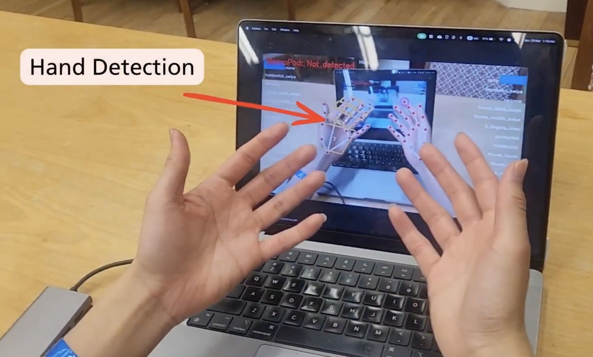
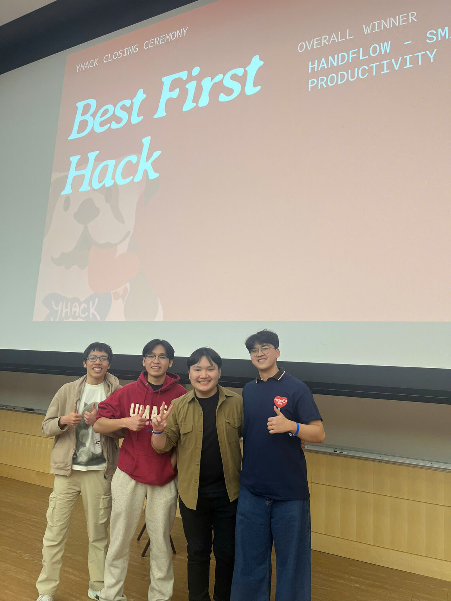

By Michelle Javed

## Akash Agents: Simplified AI Agent Deployment

[Akash Agents](http://agents.akash.network) is a community-built tool by [Sandeep Narahari](https://x.com/waiting4ragi) that gives developers a web-based interface for deploying AI agent frameworks on Akash without touching a terminal, writing YAML, or managing cloud infrastructure.

**The [core problem](https://x.com/akashnet/status/2046621913070362977/photo/1) it solves:** deploying AI agents today typically means navigating GPU provisioning, cloud setup, and opaque pricing before you even get to write agent logic, and Akash Agents strips away most of that friction.

Users select a supported framework like [Hermes](https://hermes-agent.nousresearch.com/?_gl=1*snaljg*_ga*OTU4ODE4OTAyLjE3NjkxODMzMzU.*_ga_4KWYPJ8SPY*czE3Nzg3MTY2MDQkbzEyJGcwJHQxNzc4NzE2NjA0JGo2MCRsMCRoMA..) by Nous Research or OpenClaw, plug in their API keys, and get a running agent instance on Akash compute without the usual infrastructure overhead.

Hermes in particular ships with over 40 built-in tools, persistent memory, and subagent parallelization out of the box, so developers can focus on their agent's logic and capabilities rather than deployment plumbing. The tool is live and free to try at agents.akash.network.

## HandFlow: AI-Powered Smart Glasses

HandFlow is a project by Akash Student Ambassadors Kien Nguyen and Andy Huynh, two UMass Amherst CS students who won Best First Hack at YHack 2026 at Yale.

The idea is a low-cost camera mounted on regular glasses that turns your hands and nearby surfaces into input devices for your computer. Using computer vision and a custom gesture detection model, HandFlow can recognize hand movements and map them to keyboard shortcuts, macros, and automated tasks, essentially turning any pair of glasses into a productivity tool without the price tag of commercial smart glasses. Features include gesture control, a paper-based 24-button controller, knuckle hotkeys, a virtual touchscreen, and pinch-to-capture with Gemini integration.

They used Akash to train their custom TCN (Temporal Convolutional Network) model on GPU during the hackathon, running parallel training deployments through a custom agent called AkashTrainer that automated the entire pipeline: push training scripts to GitHub, spin up deployments on Akash, train, push results back, and close the deployment automatically. The full training run took about an hour on Akash, which they said was significantly faster than training locally and far cheaper and easier to set up than AWS or Google Colab. In a 24-hour hackathon where every minute counts, that speed and simplicity let them focus on building rather than fighting infrastructure.

<iframe width="100%" height="315" src="https://www.youtube.com/embed/pJZUeKDYaQk" title="HandFlow demo video" frameborder="0" allow="accelerometer; autoplay; clipboard-write; encrypted-media; gyroscope; picture-in-picture; web-share" referrerpolicy="strict-origin-when-cross-origin" allowfullscreen></iframe>

## ElderShield: Autonomous Scam Protection for Older Adults

ElderShield is an autonomous AI agent that monitors a family's inbox, opens every suspicious link in a real remote browser, and classifies scam risk before a human ever has to click. It won Best Use of Akash at the Ship to Prod Agentic Engineering Hackathon, and the project was motivated by a personal story: the developer's grandmother lost $14,000 to a fake Medicare call that used a website convincing enough to fool someone who was sharp and careful.

That tracks with the broader numbers, as the FBI reported $3.4 billion in elder fraud losses in 2023 alone, with older adults targeted three times more often than younger people.

The system connects to a Slack workspace and sweeps for new messages every 15 seconds via Nexla. When it finds a URL, it opens it in an actual remote browser through TinyFish, not just a URL parser, so it sees exactly what the recipient would see.

A memory-augmented classifier powered by Redis Agent Memory then scores the link as safe, suspicious, or scam, drawing on both per-session working memory and long-term semantic memory across all monitored households. That memory layer is what makes it meaningfully better than a simple heuristic, because it can recall that a domain appeared in a scam attempt last week or that a specific household has been targeted by fake bank logins before, and that context is often the difference between flagging something as suspicious versus catching it as a confirmed scam.

The whole pipeline, including the API, Redis, browser analysis, database, and live dashboard, runs in a single Akash deployment for under $3 a month. The developer specifically called out that this cost structure matters for the use case, since the people who need this kind of protection most are often in households that can't afford enterprise security software, and decentralized infrastructure means there's no cloud vendor lock-in or centralized dependency holding patient or family data.

View the full [project details](https://devpost.com/software/eldershield?_gl=1*ffbucd*_gcl_au*MTA2MzcxMTY5MS4xNzc3MjY3MDgw*_ga*ODcyNzU4NjMxLjE3NzcyNjcwODA.*_ga_0YHJK3Y10M*czE3NzgxNzY5ODAkbzgkZzEkdDE3NzgxNzcwMTEkajI5JGwwJGgw) and [GitHub repo](https://github.com/lopkiloinm/eldershield).

## BioVault Agent: Autonomous Clinical Safety Monitoring

BioVault Agent is an autonomous AI watchdog built by a developer whose father passed away from a chemotherapy treatment error in Bangladesh, not from his cancer. The project won first place on the Akash Track at the Open Agents Hackathon and addresses a problem that kills more people globally than most realize: clinical treatment errors buried under hospital bureaucracy.

BioVault runs 24/7 without human intervention, polling for new clinical documents every 30 seconds and running them through a four-stage pipeline. MiniMax Vision extracts structured data from handwritten chemotherapy charts and prescription sheets, AkashML standardizes and enriches it with ICD-10 coding, a custom FHIR R4 builder converts it to the international healthcare data standard, and a safety validator checks for dose variances, unrecognized drug names, protocol deviations, and missing required fields.

When it catches something critical, like a Daunorubicin dose drop of more than 10%, it raises a structured alert, logs the action with full observability, and fires a webhook to any external system listening.

The entire system, inference, storage, alerting, and live dashboard, runs in a single container deployed on Akash for several dollars a month. That cost matters because the target users are small clinics and hospitals in low and middle income countries that can't afford enterprise medical software or trust centralized cloud infrastructure with patient data. The developer noted that Akash handled the deployment cleanly, the provider was stable, and the pricing makes this genuinely viable for the resource-constrained settings where treatment errors are most deadly.

<iframe width="100%" height="315" src="https://www.youtube.com/embed/WyToslTc560" title="BioVault Agent demo video" frameborder="0" allow="accelerometer; autoplay; clipboard-write; encrypted-media; gyroscope; picture-in-picture; web-share" referrerpolicy="strict-origin-when-cross-origin" allowfullscreen></iframe>

Check out BioVault's [full project summary](https://devpost.com/software/biovault-agent?_gl=1*1ng4eq1*_gcl_au*ODExMDcwNjg1LjE3NzAwMTU3NTA.*_ga*MTIyMTM2MjE3NC4xNzcwMDE1NzUw*_ga_0YHJK3Y10M*czE3NzIxNjUzOTUkbzE0JGcxJHQxNzcyMTY1NDMyJGoyMyRsMCRoMA) and [GitHub repo](https://github.com/AUW160150/biovault-agent/actions).

## Dramaalert: Autonomous Prediction Market Trading Bot

Dramaalert is a project by Akash Student Ambassadors Tharun Ekambaram and Nick Hardy from Indiana University, who took home wins at both the hackathon and research competition at the Penn Blockchain Conference 2026.

Dramaalert is an autonomous trading agent for Polymarket, the largest on-chain prediction market, that ingests over 20 real-time data sources including order flow, cross-platform pricing from Kalshi and Metaculus, Wikipedia edit velocity, Reddit sentiment, GDELT global news, and LLM-powered reasoning, then fuses them through a Bayesian inference engine and executes Kelly-sized positions without any human intervention.

The bot exploits three specific inefficiencies in prediction markets: information latency gaps where the same event is priced differently across platforms, pre-news signals from social and editorial sources that move faster than most traders, and Bayesian miscalibration where participants anchor too heavily on current market price and update too slowly.

The team used Akash to power their research competition entry, which involved downloading and analyzing a full year of Cronos blockchain data to build a comprehensive short thesis on $CRO that won first place.

Rather than trying to pull that volume of chain data on individual laptops, they created a de facto node of Akash deployments to pull the information in parallel, then combined it and sent the outputs to a single H100 machine on Akash where they did the actual analysis, running compute-intensive valuation methodologies and generating metrics that couldn't be indexed on the fly. They described the shift as going from a "what can we fit" problem to a "what do we want to find" problem, and said the same workload would have taken multiple days on local machines. They also noted that compared to AWS and Azure, the pricing on Akash was significantly lower and the setup was far simpler, which mattered a lot when they were running on roughly three hours of sleep over two nights at Penn.

Want to be featured in the next list?

Stay up to date with upcoming hackathons on our [events page](https://akash.network/community/events/) or follow our event manager, Amanda Keay on [X](http://@vakaytion).

If you're a university student, apply for the [Akash Student Ambassador program](https://docs.google.com/forms/d/e/1FAIpQLScyLLN4ubVjmxPxWUAgsN5ZuvxImmiOj5fCXQ103z8S-X9J4g/viewform) and have your hackathon projects shared with over 127k followers on our [X](https://x.com/akashnet).
