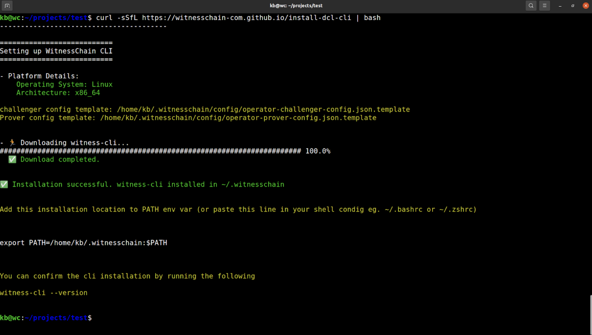
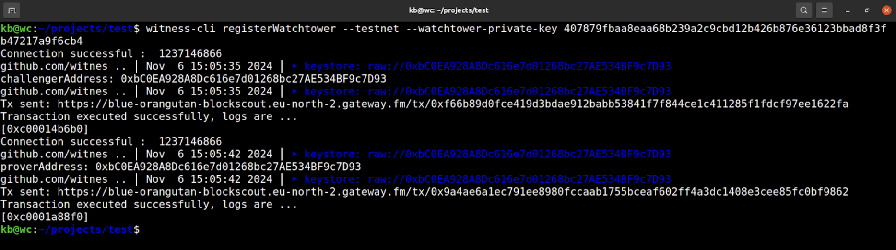
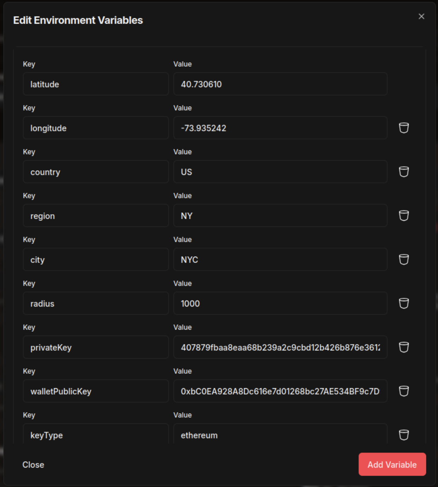
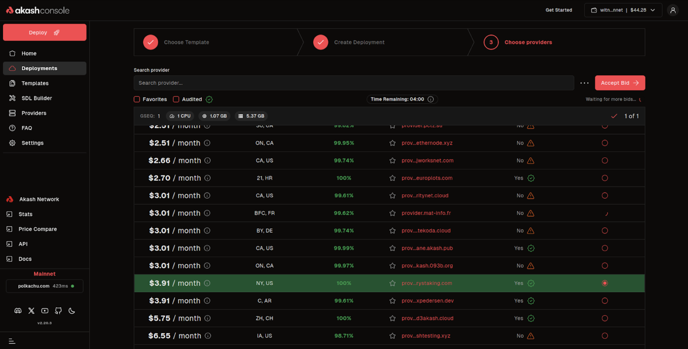
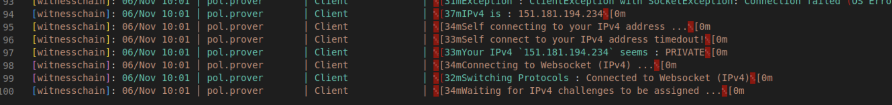

[Witness Chain](https://www.witnesschain.com/) is transforming blockchains by bridging the cyber-physical divide by introducing a verifiable observation layer that captures and authenticates real-world attributes. Through a network of "Watchtowers," which are nodes that actively witness and validate real-time data from the physical world, Witness Chain ensures that essential attributes like location, connectivity, and compute are not only recorded but verifiably accurate.

This process of recording and verification is achieved through protocols that achieve consensus on physical state, such as Proof of Location, Proof of Bandwidth, and Proof of Diligence. These proofs are secured by over $8 billion in restaked ETH on Eigenlayer, which makes it prohibitively costly to manipulate an asset’s location or other physical attributes.

## Enabling Proof of Location
Proof of Location (PoL) is a core proof in Witness Chain. PoL is a decentralized protocol designed to verify the physical location of any smart asset. The verification process involves a watchtower node network that performs internet telemetry-based delay measurements to validate the asset's location. The asset acts as a prover, and the watchtower nodes act as beacons, using cryptographic pings to determine the delay between themselves and the asset. 
These real-world witnesses are combined in a byzantine-fault-tolerant way to accurately determine location. Through protocols like these, Witness Chain is expanding the scope of what blockchains can do, building a foundation that will enable trustless and transparent applications across industries ranging from logistics to finance.

## Integrating Witness Chain with Akash
The integration between Witness Chain and Akash marks a significant step towards decentralizing the infrastructure behind the Proof of Location (PoL) protocol. By leveraging Akash’s decentralized cloud, Witness Chain can deploy and operate Watchtower nodes, which are essential for validating real-world attributes, in a fully decentralized, scalable, and cost-efficient manner.

This integration enables Witness Chain to leverage Akash’s secure and reliable compute resources for its watchtower nodes, which conduct cryptographic pings to confirm an asset’s physical location and connectivity. Through Akash, the network of watchtower nodes becomes even more resilient and censorship-resistant, supporting Witness Chain’s goal of creating a verifiable observation layer for real-world attributes.

In addition, this integration paves the way for Akash to explore PoL as a potential tool for measuring and validating the decentralization of its own cloud network. By leveraging PoL to verify the physical distribution of Akash nodes, both platforms can set a higher standard of transparency, ensuring that Akash remains resistant to centralization while providing reliable cloud resources.

## Running a Witness Chain Watchtower on Akash
This is a step-by-step guide for successfully running a Witness Chain watchtower from Akash Console.

### Register with Witness Chain
The first step in running a watchtower with Akash is registering the address on the Witness Chain network. It is recommended that users uses a dedicated key pair for the Watchtower, which is not required to be funded.

To register your address, follow these steps:
Download and install the witness CLI by running the command below.

`curl -sSfL https://witnesschain-com.github.io/install-dcl-cli | bash`

After the installation is completed, register your watchtower key on Witness Chain's Layer 2 chain.

`witness-cli registerWatchtower --testnet --watchtower-private-key <your-watchtower-private-key-without-0x-prefix>`

### Deploying the Watchtower
1. Navigate to the Watchtower template on the [Akash Console](https://console.akash.network/templates/akash-network-awesome-akash-witnesschain-watchtower).
2. Click `Deploy` and define the Watchtower configuration parameters in `Environment Variables`.

    

    `latitude`: is the geographical latitude of the node’s location. This is based on the region where you choose to deploy the watchtower. For a list of all regions supported by Akash, please refer to the Akash Provider page.

    `longitude`: the geographical longitude of the node’s location (similar to latitude). This is based on the provider node’s location.

    `country`: the 2-letter country code as seen on Akash Provider’s page.

    `region`: the provider region as seen on the Akash Provider’s page.

    `city` (optional): users can choose to add a `city` at the chosen latitude and longitude of your region.

    `radius`: a suggested value of `1000` is the acceptable uncertainty in the location (please input a value between `1000-1500`).

    `privateKey`: the private key of Watchtower.

    `walletPublicKey`: the ETH address of the Watchtower.

    Others: users can leave the remaining fields to the preset default values. To learn more, refer to the official [Witness Chain documentation](https://docs.witnesschain.com/).
3. Click `create deployment`, choose your provider based on your location configuration from the list, and click `Accept Bid` to deploy.

    

## How to validate the Watchtower setup
To validate that the Watchtower setup was successful, check the logs, which should indicate that the Watchtower is waiting for the challenge to prove itself (similar to the example in the image below).

Learn more about Witness Chain
Explore more detailed instructions and troubleshooting tips in the [official Witness Chain documentation](https://docs.witnesschain.com/depin-coordination-layer/proof-of-location-testnet/run-a-watchtower/for-partner-node-runners/running-on-akash-cloud). To stay up to date with the latest news, announcements, and more — follow [Witness Chain on X](https://x.com/witnesschain) or [join the Discord](https://discord.gg/HwnzU5CYDp).

To keep up with the latest news and updates, follow [Akash on X](https://x.com/akashnet_), and join the official [Akash Discord](https://discord.akash.network).