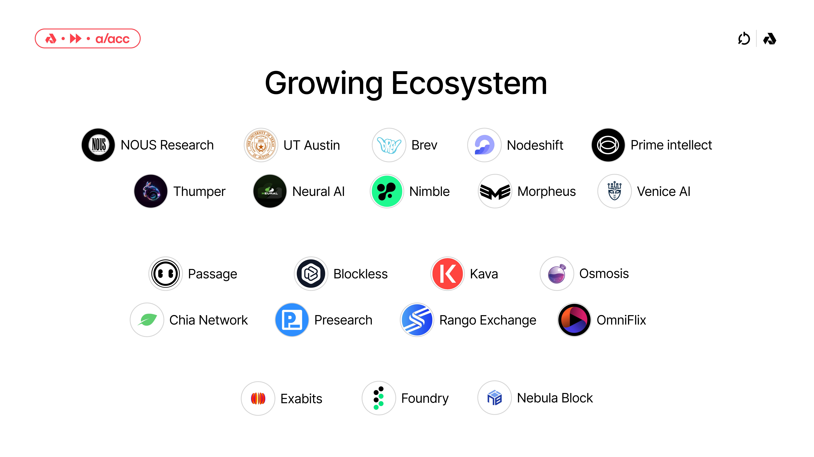

On Tuesday, May 28th, the Akash core team and community held the network’s [first-ever full-day summit](https://akash.network/akash-accelerate-2024/) focused on the growth of permissionless compute and Decentralized AI (DeAI). Hundreds of the brightest minds in the decentralized compute space gathered in Austin, TX to connect, share ideas, and explore the potential of decentralized compute and Decentralized Physical Infrastructure Networks (DePIN) to address the most pressing problems facing our society today.

The presentations and panels focused on critical areas of development for DePIN and Decentralized AI.

## The State of Akash Network

The Akash ecosystem has seen remarkable growth over the past few years, attracting a wide range of companies, projects, and protocols. These entities are drawn to Akash's Supercloud, which offers high-performance compute, scalability, and permissionless access — features that set decentralized networks like Akash apart from centralized counterparts.

From leading institutions like the University of Texas at Austin to AI companies like [Nous Research](https://nousresearch.com/), [Brev.dev](https://brev.dev/), and [Morpheus](https://mor.org/), the Akash ecosystem is rapidly expanding to include a wide range of participants who recognize the potential of truly decentralized infrastructure networks.

The University of Texas at Austin, known for its cutting-edge research in computer science and AI, is looking to the Akash Supercloud to support researchers in need of high-performance GPUs. By leveraging Akash's decentralized infrastructure, researchers have access to powerful GPUs without the constraints and costs associated with traditional hyperscale cloud providers, enabling them to pursue new areas of research that have previously been out of reach due to the massive costs of centralized compute.

Similarly, leading AI companies such as Nous Research, Brev.dev, and Morpheus leverage Akash to power their growth. These companies and protocols are at the forefront of AI development, developing applications and networks that not only benefit from but require permissionless access to compute. The Akash Supercloud provides them with the scalability and flexibility they need to train and fine-tune LLMs, process large datasets, and offer their users permissionless access to compute.

Beyond the benefits of lower costs and scalability, Akash's permissionless access model is a significant draw for many projects in the ecosystem. Unlike centralized cloud providers that impose strict control over their platforms, Akash enables developers to deploy and run applications without seeking access permissions or adhering to restrictive policies. This opens up new possibilities, enabling startups and established companies to experiment with novel ideas and quickly bring their products to market.

As the demand for cloud computing continues to soar and the limitations of centralized providers become increasingly apparent, Akash's decentralized Supercloud is emerging and solidifying its position as a compelling alternative. The growing ecosystem of projects, protocols, and companies building on Akash is a testament to the platform's potential to reshape the future of cloud compute. With its high-performance compute, scalability, and permissionless access, Akash is poised to become the backbone of a new era of decentralized AI.

Listen to Greg Osuri’s [keynote presentation](https://youtu.be/fVYeAVvuNLI?si=qfcMhCIxIwAjUPQc&t=20) at Akash Accelerate to learn about the new roadmap for Akash over the next few years and beyond.

## The Power of Permissionless
Akash is built with self-sovereignty at its heart. The network is composed to afford significant flexibility and scalability, allowing users to provide and access compute resources with very little top-down control or censorship. This open architecture lays a foundation for a wide range of application types that rely on a fundamentally permissionless infrastructure layer. This dynamic is most prominent in the attention captured by the concept of “Permissionless AI.”

Permissionless AI refers to the development and deployment of AI models and applications without the need for centralized control or approval. It enables individuals and organizations to freely create, train, and share AI models, reducing the barrier to entry and promoting open collaboration. By eliminating the requirement to secure permission from a central authority, permissionless AI democratizes access to powerful AI tools and encourages experimentation.

In Akash Accelerate’s most anticipated conversation, [Greg Osuri](https://x.com/gregosuri) and [Erik Voorhees](https://x.com/ErikVoorhees) discussed how decentralized, permissionless systems can reduce the risk of overreliance on the goodwill of centralized companies.

The debate between open-source and closed-source AI models has taken center stage, with open-source models like Llama 3 demonstrating capabilities on par with their closed-source counterparts. While the availability of high-quality open-source models is encouraging, there is a significant risk if large tech companies stop open-sourcing powerful models in the future.

To mitigate this risk, the decentralized community must find ways to train models independently. This could involve fostering a decentralized network of contributors, exploring alternative training methods, and advocating for the continued open-sourcing of powerful models by engaging with large tech companies.

The decentralized community should collaborate and pool resources to create a resilient ecosystem that is not reliant on a few large players. By exploring efficient algorithms, transfer learning techniques and novel architectures, the community can develop models with comparable performance using less data and computational power.

Building strong partnerships and demonstrating the value of open-source contributions can encourage large tech companies to maintain their commitment to open-source AI. The future of AI depends on the decentralized community's ability to work together and find solutions to ensure the long-term sustainability and accessibility of the value that will be created by AI models and systems over the next decade and beyond.

### Decentralized AI
Decentralized AI seeks to build the core infrastructure needed to train, fine-tune, and run inference on AI models while avoiding centralization and top-down control that come with closed-source systems and companies. By utilizing permissionless and scalable infrastructure, AI developers can train and deploy models in a distributed manner, protecting data privacy and reducing dependence on centralized cloud providers. This allows for greater collaboration and resource sharing and the ability to create novel AI applications that may not be possible within the confines of centralized systems.

One critical advantage of decentralized AI is the increased security and resilience it provides. Distributing data and computational resources across a network of nodes dramatically reduces the risk of a single point of failure. Cryptographic techniques also ensure that data remains private and secure, even when shared among multiple parties.

As AI evolves, decentralized approaches will likely play an increasingly important role in shaping its future development and applications.

In the "Decentralized AI Revealed" panel with David Johnston (OSS Contributor to Morpheus), Teana Baker Taylor (COO, Venice AI), Sam Padilla (Co-founder and head of product at Eidon AI), Cameron Fairchild (Software developer at Bittensor) — the panelists discussed how Decentralized AI enables new kinds of applications that are unique to decentralized networks. They explored how decentralized AI enhances privacy, security, and collaboration among network participants, allowing for the development of new and novel applications.

The panelists also discussed the potential for decentralized AI to make powerful AI tools and resources more widely available, enabling open access for developers and organizations. By leveraging decentralized networks, the future of AI is poised to become more open and transparent — bringing open AI development to a global scale.

## How Decentralized Networks Can Enable Privacy-Preserving Learning
[Sriram Vishwanath](https://www.ece.utexas.edu/people/faculty/sriram-vishwanath), a professor at the University of Texas at Austin, presented a vision for how decentralized networks like Akash can unlock a unique path forward—especially for [6G networks](https://en.wikipedia.org/wiki/6G) and healthcare. In Professor Vishwanath’s view, “Decentralized AI is not just essential; it is critical.” 

There are two primary algorithms for decentralized AI. The first is Fully Distributed Learning, and the second is Federated Learning. Both of these are only possible with decentralized networks like Akash. As these networks evolve, four key areas give decentralized systems an advantage over centralized systems:
1. Privacy: Keeping data on edge servers, which is naturally privacy-preserving.
2. Bandwidth Conservation: Only model parameter updates are transferred, as opposed to the data itself, which is vastly more efficient.
3. Locality: Models are local and tuned to local variations.
4. Latency: Improvements in model inference and management as opposed to centralized systems.

In healthcare, privacy is a key concern that drives much of the decision-making for healthcare providers. Locality is also critical to healthcare providers, as patient data is inherently hyper-local. Patients in different parts of the world have vastly different characteristics and profiles. AI applications in healthcare must pull data from specific localities, which is a challenge best addressed by decentralized networks, given their distributed nature.

6G networks are another area that will significantly benefit from decentralized systems. Building the infrastructure to support 6G networks is happening now, and tens of billions will be spent each year on 6G. Edge AI and Federated AI are the most promising architectures to support the development of robust 6G networks. Crucially, these are architectures only possible with decentralized systems, and it is doubtful that centralized AI could support the development of 6G networks at scale. These decentralized models could predict congestion points, where applications must be served (provisioning and tracking), and network security.

## Building with the Supercloud: The Akash Builder Showcase

### Passage
[Passage](https://www.passage.io/) is a platform that empowers creators to build immersive virtual worlds, fostering solid connections between creators and their communities. The platform provides an environment for designing, launching, and managing custom metaverse experiences. Recently, Passage [launched their first metaverse world powered by permissionless Akash compute](https://www.passage.io/post/akash). By leveraging Akash's decentralized cloud infrastructure, Passage has reduced the cost of hosting by an impressive 70% compared to traditional centralized hosting solutions. This substantial cost reduction benefits Passage as a company and enables creators to allocate more resources toward developing engaging content and experiences for their communities. Akash's permissionless and scalable compute infrastructure has proven to be an excellent fit for Passage, providing them with the flexibility, reliability, and cost-efficiency needed to build and grow their platform. With this successful integration, Passage is able to continue pushing the boundaries of virtual world creation while ensuring a cost-effective and performant platform for creators and users alike.

<iframe width="100%" height="315" src="https://www.youtube.com/embed/fVYeAVvuNLI?si=z8QgFe2OxMKTVD9D&amp;start=8228" title="YouTube video player" frameborder="0" allow="accelerometer; autoplay; clipboard-write; encrypted-media; gyroscope; picture-in-picture; web-share" referrerpolicy="strict-origin-when-cross-origin" allowfullscreen></iframe>

### Brev.dev
[Brev.dev](https://brev.dev/) is an AI deployment platform that aims to fill a critical market gap by providing "the missing Google Colab pro tier." The platform is designed to simplify the process of accessing the necessary compute resources for AI developers to train, fine-tune, and deploy their models effectively. By offering a user-friendly interface and a range of powerful tools, Brev empowers developers to focus on their core tasks without allocating unnecessary time to complex infrastructure setup and maintenance.

Recently, Brev has taken a significant step forward by [integrating Akash compute into its platform](https://akash.network/blog/brev-dev-leverages-akash-networks-permissionless-gpu-infrastructure-to-seamlessly-scale/). This integration allows Brev users to access cutting-edge NVIDIA hardware, including H100s, A100s, and A6000s, directly from the Brev Console. By leveraging Akash's decentralized compute network, Brev can provide its users access to high-performance GPU resources on-demand, enabling their users to tackle even the most demanding AI workloads easily.

<iframe width="100%" height="315" src="https://www.youtube.com/embed/fVYeAVvuNLI?si=C7b4XuE32y_PVcJn&amp;start=9277" title="YouTube video player" frameborder="0" allow="accelerometer; autoplay; clipboard-write; encrypted-media; gyroscope; picture-in-picture; web-share" referrerpolicy="strict-origin-when-cross-origin" allowfullscreen></iframe>

### Flock.io
[Flock.io](https://www.flock.io/#/) is a platform focused on federated machine learning. Federated learning is a distributed approach to training AI models where the data remains decentralized, allowing for privacy-preserving and collaborative learning. Flock.io aims to empower businesses and developers to harness the power of federated learning by providing a secure and scalable infrastructure. By enabling the training of models on distributed data without the need for centralized storage, Flock.io helps address data privacy concerns while still leveraging collective insights from multiple sources. The platform offers a range of tools and APIs to facilitate the development, deployment, and monitoring of federated learning models, making it easier for organizations to adopt this innovative technology. With Flock.io, companies can unlock the potential of collaborative learning while ensuring data security and compliance with privacy regulations.

<iframe width="100%" height="315" src="https://www.youtube.com/embed/fVYeAVvuNLI?si=vGafvEk50EGUt9CL&amp;start=10415" title="YouTube video player" frameborder="0" allow="accelerometer; autoplay; clipboard-write; encrypted-media; gyroscope; picture-in-picture; web-share" referrerpolicy="strict-origin-when-cross-origin" allowfullscreen></iframe>

## Akash Accelerate ‘24 Panels and Presentations
Check out the complete list of presentations and panels from Akash Accelerate ‘24, and watch each recording with the links below.

- [Keynote Presentation from Greg Osuri](https://youtu.be/fVYeAVvuNLI?si=KwPVzWOgDc9RP06g&t=20)
- [Decentralized AI Revealed: Real-World Applications](https://youtu.be/fVYeAVvuNLI?si=7peT7gkKutDa38oy&t=1674)
- [Greg Osuri & Erik Voorhees In Conversation](https://youtu.be/fVYeAVvuNLI?si=3WXQPLenrl4YLxQp&t=2960)
- [What Does DeAI Mass Adoption Look Like?](https://youtu.be/fVYeAVvuNLI?si=8R5egF22Pu0CjlWT&t=4414)
    - [Lex Avellino](https://x.com/lexavellino) (Passage)
    - [Robert Myers](https://x.com/0xcarro) (Manifold Labs)
    - [David Johnston](https://x.com/DJohnstonEC) (Morpheus AI)
- [The Growth of Decentralized Compute](https://youtu.be/fVYeAVvuNLI?si=BqTusCxRmlBhbfnl&t=6930) 
    - [Stefaan Vervaet](https://x.com/stefaanweb3) (Akave)
    - [Dean Nelson](https://www.linkedin.com/in/deannelson/) (Cato Digital)
    - [Daniel Keller](https://x.com/dak_flux) (Flux)
    - [David Johnston](https://x.com/DJohnstonEC) (Morpheus)
- [Akash Network Builder Showcase](https://youtu.be/fVYeAVvuNLI?si=a_5YRUo9GCtJIOFx&t=8227)
    - [Arel Avellino](https://x.com/ArelAvellino) (Passage)
    - [Ishan Dhanani](https://x.com/0xishand) & [Anish Maddipoti](https://x.com/athreesh) (Brev.dev)
    - [Jiahao Sun](https://x.com/0x7SUN) (Flock.io)
- [Decentralized AI and Privacy-Preserving Learning](https://youtu.be/fVYeAVvuNLI?si=W-dQ1sMTQCtlymO0&t=11500)
    - [Sriram Vishwanath](https://www.ece.utexas.edu/people/faculty/sriram-vishwanath) (University of Texas at Austin)
- [Unpacking the Potential of DePIN](https://youtu.be/fVYeAVvuNLI?si=3gpOBoqh3NYnUFbm&t=12878)
    - [Rahul Arulkumaran](https://x.com/RahulKumaran4) (Foundry)
    - [Megan Klimen](https://x.com/tinkmk) (Filecoin Foundation)
    - [Kevin Denman](https://x.com/kcdenman) (Edge & Node)
    - [Micah Casella](https://x.com/CabronElBufon) (Messari)
- [Q&A with Greg Osuri](https://youtu.be/fVYeAVvuNLI?si=jMFPoXs0vSLoDq10&t=14168)

## Connect with Akash
Watch the [full recording of Akash Accelerate '24](https://youtu.be/fVYeAVvuNLI?si=H8z3--zyEMomd0Sh) to dive deeper into all the presentations and panels. The recording gives you the chance to thoroughly explore the valuable content shared at the summit. You'll hear directly from industry experts and thought leaders about the latest trends and innovations in cloud computing and decentralized infrastructure. The recording includes keynote speeches, technical deep dives, and insightful discussions. You can rewatch key moments, learn new things, and really understand the transformative potential of Akash Network. Don't miss this opportunity to get the full value from Akash Accelerate '24.

<iframe width="100%" height="315" src="https://www.youtube.com/embed/fVYeAVvuNLI?si=-oxtTIokJHq_GOUg" title="YouTube video player" frameborder="0" allow="accelerometer; autoplay; clipboard-write; encrypted-media; gyroscope; picture-in-picture; web-share" referrerpolicy="strict-origin-when-cross-origin" allowfullscreen></iframe>

To connect with [Akash](https://akash.network/), follow the network on [X (Twitter)](https://x.com/akashnet_) and [sign up to hear about the latest announcements and updates](https://akt.fyi/3kpRwVM).
