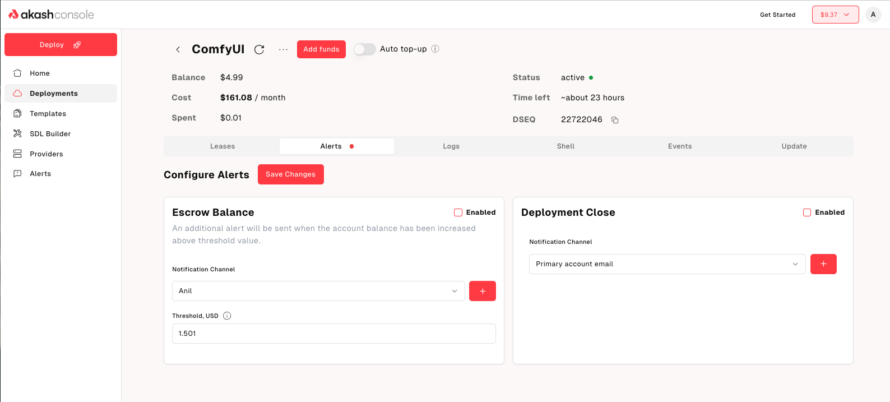
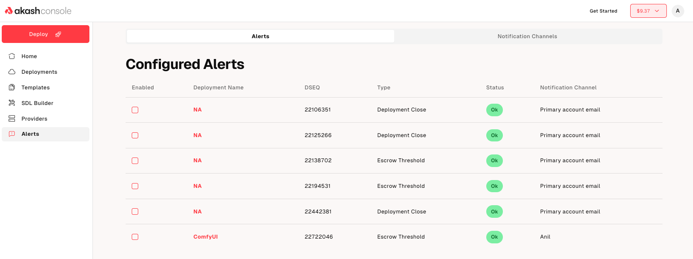

> **TL;DR:** Akash Console's new Alerts & Notifications system (AEP-33, AEP-71) sends email alerts before your escrow balance runs low or your deployment closes unexpectedly — configurable per deployment with custom thresholds, multiple email addresses, and a global alerts dashboard.

Waking up to find your service offline without warning is a terrible thing. Akash Console introduced a new **Alerts & Notifications** system earlier this year that ensures you’re the first to know when balances run low or deployments close, so you can act before users feel any impact. The Akash Core team built this capability by turning the ideas captured in **AEP‑33** and **AEP‑71** into reality.

- [AEP‑33](/roadmap/aep-33/) pinpointed a common pain point: leases were expiring because escrow balances depleted unexpectedly. It proposed giving users control over low‑balance alerts, letting them set thresholds and choose how they’re notified.
- [AEP‑71](/roadmap/aep-71/) expanded the scope to include notifications whenever a deployment closes for any reason

The result was two types of alerts - one for **Low Escrow Balance** and another for **Deployment Closure**.

## Flexible Configuration Per Deployment

The deployment details page now features an **Alerts** tab that lets you configure and enable/ disable both types of alerts. For each alert you get to specify multiple email addresses for notifications and you can choose to get alerted on different email addresses for each alert. For example, the escrow balance alert could go to the finance department (finance@company.com) while the deployment closure alert goes to your Ops team (ops@company.com).

## View Alert List Globally

There is also a global alerts list in your account settings, giving you a birds‑eye view across all deployments. You can enable or disable alerts with ease from this page or edit notification channels.

## Stay ahead of issues

Create as many alerts as you need—each with its own threshold (for escrow balance alerts) or trigger (for closure alerts). You decide the threshold that matters to you and choose the notification channel. The result? You’ll get an email well before your deployment is in danger. Alternatively, if you prefer a low noise, hands off approach to deal with escrow balance, check out the Auto Top-Up feature, announced earlier this year.

For technical support or any questions about the Alerts & Notifications features, please head over to the [Akash Discord](https://www.google.com/url?q=https://discord.akash.network/&sa=D&source=editors&ust=1755510677030273&usg=AOvVaw3kR_Oea0LTitSXlzHEBwQV) server, where technical members of the Akash community are available around the clock and ready to assist.

## Frequently Asked Questions

**What alert types does Akash Console support?**
Two types: Low Escrow Balance alerts (triggered when balance drops below your threshold) and Deployment Closure alerts (triggered whenever a deployment closes for any reason).

**How do I configure alerts for a deployment?**
Go to the deployment details page in Akash Console, click the Alerts tab, and configure thresholds, email addresses, and notification preferences per deployment.

**Can I send different alerts to different email addresses?**
Yes — you can specify multiple email addresses per alert and route different alert types to different teams (e.g., escrow alerts to finance@company.com, closure alerts to ops@company.com).

**Is there a global view of all my alerts?**
Yes — a global alerts list in account settings shows all configured alerts across all deployments, with enable/disable toggles and notification channel editing in one place.

**What are AEP-33 and AEP-71?**
Akash Enhancement Proposals that identified the need for escrow balance alerts (AEP-33) and deployment closure notifications (AEP-71) — both are now live in Akash Console.

**How is this different from Auto-Top-Up?**
Alerts notify you so you can act manually — Auto-Top-Up acts automatically. For a fully hands-off approach, use Auto-Top-Up; for visibility and manual control, use Alerts.

**Where can I get support for Alerts & Notifications?**
Join the Akash Discord at discord.akash.network — technical community members are available around the clock to assist with configuration and troubleshooting.

