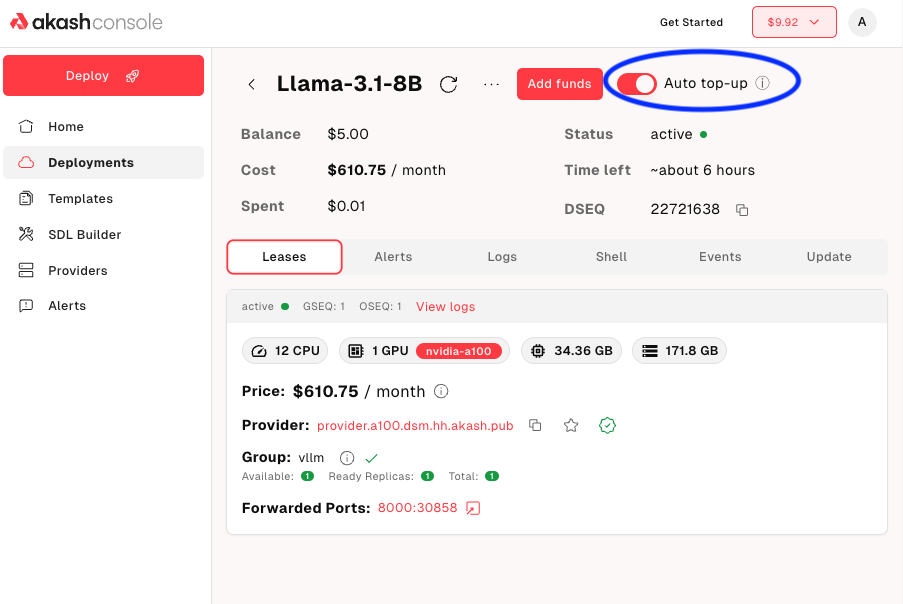
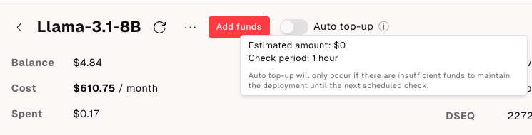
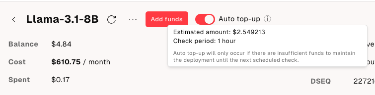

Keeping your applications online should be effortless. In the early days of Akash, if a deployment’s escrow account ran dry, the lease was closed and your app went dark, often without warning. That manual chore of watching balances and topping up funds became a thing of the past earlier this year with the introduction of Automatic Escrow Top Up functionality.

[AEP‑57](/roadmap/aep-57/) identified two key components to make this possible: a simple settings control for turning on automatic top‑ups and a backend worker that watches every deployment’s balance and adds funds before it hits zero. Those ideas came to life in Akash Console a few months ago.

## Never worry about downtime again

Head to the **Deployments** → **Specific Deployment** and flip the **Auto‑Top‑Up switch**. Behind the scenes, a software job continuously checks the remaining balance on that deployment, estimates when it will run out and initiates a top‑up transaction before the lease expires, as long as there are funds available in the account

## Granular control under the hood

To give customers maximum flexibility, we designed the feature around per‑deployment settings, giving users fine‑grained control over which deployments auto‑fund and how long each top‑up should last. A new /v1/deployments REST endpoint also lets your own tools read and update these settings programmatically, if you prefer that.

## Only for Credit Card Users (for now)

The escrow top up feature is only available for users who pay using a credit card for now. We hope to offer a similar capability for crypto users in the future. As a side note, credit card payments still use crypto tokens under the hood for deployment. For details on Credit Card payments and how to use them, consult [this announcement blog post](/blog/introducing-credit-card-payments-in-akash-console/.).

## Completing the circle with Credit Card Auto-Reload

Automatic escrow top-up keeps your deployments running as long as you have enough funds (credits) in your account. Which means you have to check your account periodically and make sure it has enough funds to cover all deployments. We recommend doing so periodically (one a week or month) and making sure to purchase enough funds to cover a slightly longer duration on all active deployments.

Soon you will not need to do that with [AEP-74](/roadmap/aep-74/) on the near-term roadmap.

For technical support or any questions about the escrow top-up, please head over to the [Akash Discord](https://discord.akash.network) server, where technical members of the Akash community are available around the clock and ready to assist.
