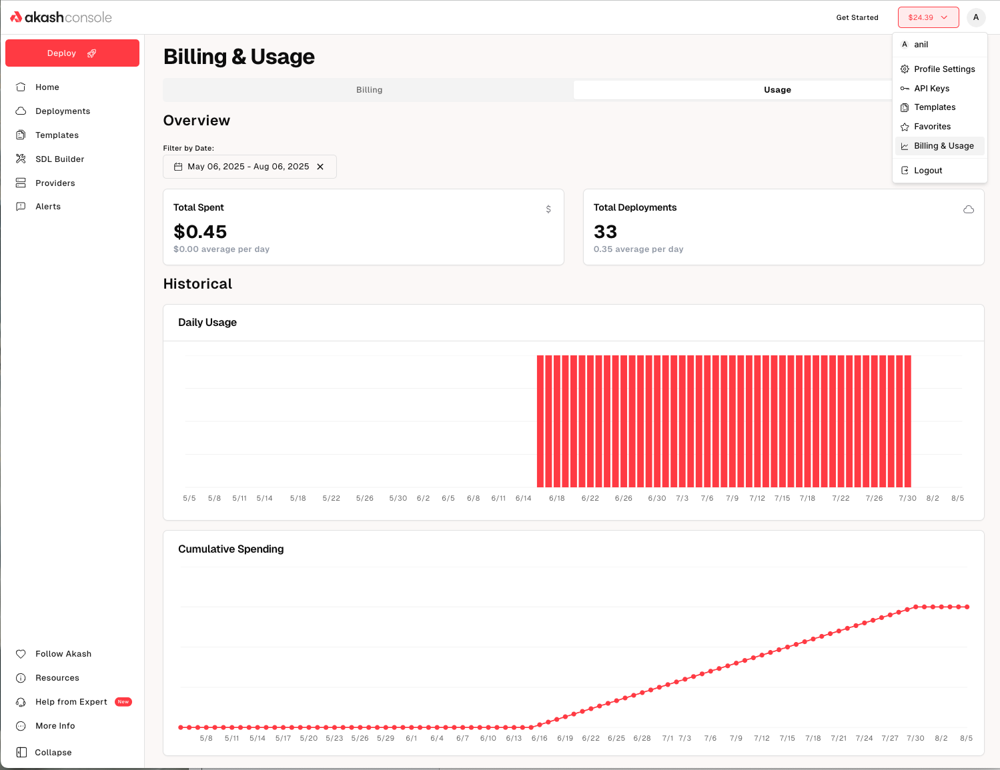
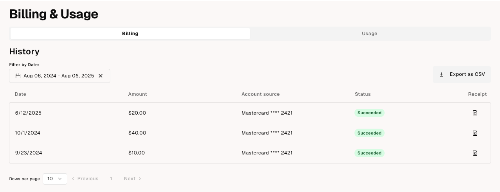
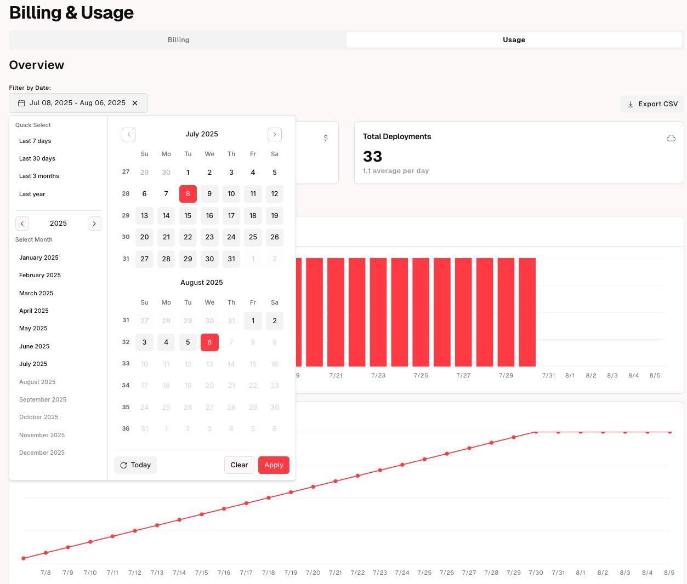

As more Akash users pay for compute with credit cards, they expect the same billing transparency they get from traditional cloud providers and SaaS services. [AEP‑68](/roadmap/aep-68/) noted that while crypto wallet users can see token transfers on a block explorer, credit‑card users have no such tracking and often ask for billing information. Users also want to see how much of their funds are being used and for what, similar to AWS billing pages.

The new **Billing & Usage** feature introduces a new page in Account Settings that surfaces this information.

The two tabs display the following information:

- **Credit Purchase History**: A table lists all transactions where credits were added to the user’s balance. Each entry shows the date, amount, payment method, status and provides links to download a copy of the receipt. There is also an option to export all transactions as a csv file for easy record keeping or ingesting into internal systems. A date range picker allows users to filter to a specific time range.

- **Usage Charts:** In the “Usage” tab users can see a summary of their total spend and total deployments and charts showing usage over time as well as cumulative spending over time. Here too, users can switch between weekly, monthly or annual views or select a custom date range.

Together, these elements give credit‑card users the insight they need to manage their budgets. Users can download receipts, see when credits were added and understand how their compute spend evolves over time.

For technical support or any questions about the Billing & Usage, please head over to the [Akash Discord](https://discord.akash.network/) server, where technical members of the Akash community are available around the clock and ready to assist.
