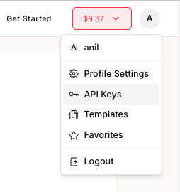
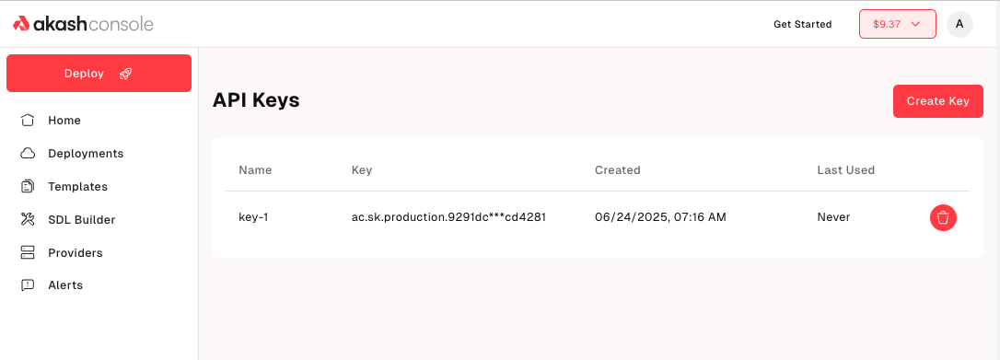
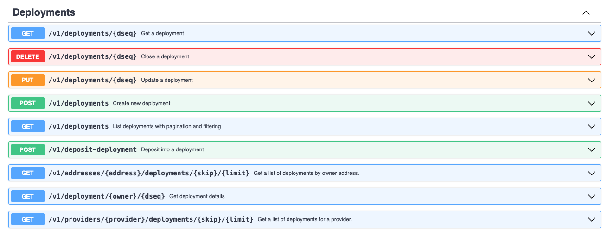
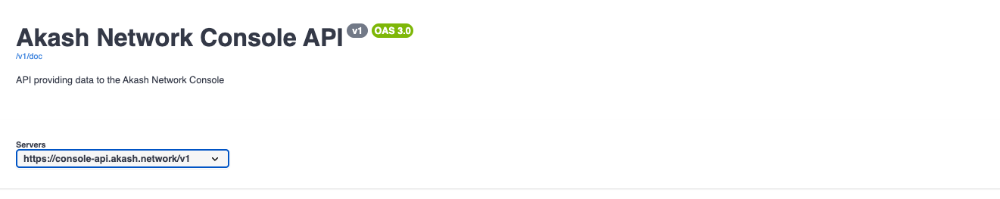

You shouldn’t have to be a crypto expert to deploy on the decentralized cloud. The [Credit Card payments functionality](/blog/introducing-credit-card-payments-in-akash-console/), introduced last year solved that problem. Earlier this year, the Akash core team took that one step further by allowing credit‑card users to programmatically manage workloads without worrying about crypto or blockchain specific parameters or functions.

Crypto users of Akash Network have had the [AkashJS](https://github.com/akash-network/akashjs) SDK for programmatic deployments for several years. For non-crypto users (aka “normies”) AkashJS was practically unusable as it required mnemonics, wallets and Cosmos SDK know-how. [AEP‑63](/roadmap/aep-63/) identified this gap, noting that the growing number of credit card users of Akash needed a simple, developer‑friendly API. The result is the **Managed Wallets API v1**: a set of REST endpoints that make Akash accessible to teams that prefer to pay with credit cards.

## Build fast without blockchain knowledge

[AEP‑63](/roadmap/aep-63/) envisioned a world where developers could provision, scale and tear down deployments using familiar HTTP calls. That vision is now reality. No more managing private keys or mnemonics – just generate an API key from the Console, then use API endpoints to automate everything from certificate creation to bidding, leasing and deployment closure

The API covers:

- **API key management**: Generate, list or revoke keys. Each key is scoped to your account and validated automatically, so you stay secure.
- **Certificate management**: Use endpoints to create, view or revoke TLS certificates. These certificates are required for secure HTTPS deployments.
- **Deployment lifecycle**: Programmatically create deployments, list all your deployments, fetch specific deployment details and close deployments when you’re done.
- **Funding Deployments**: Check your escrow balance and deposit additional funds on the fly.
- And more!

**Documentation & UI**: To help you get started, we’ve added a user‑friendly [API key management page](https://console.akash.network/user/api-keys) in Console and published comprehensive [docs via Swagger](https://console-api.akash.network/v1/swagger)

## Looking Ahead

In the spirit of continuous improvement, [AEP-70](/roadmap/aep-70/) on the Akash Network near term roadmap will make this API even easier and more useful by adding the following features:

- Use of JWT Authentication: Users will not have to worry about creating and managing certificates
- Retrieving Events & Logs associated with a deployment

For technical support or any questions about the new Console API, please head over to the [Akash Discord](https://discord.akash.network/) server, where technical members of the Akash community are available around the clock and ready to assist.
