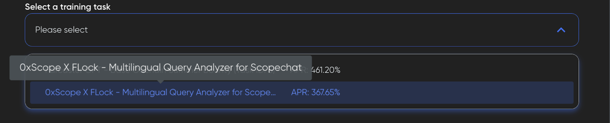
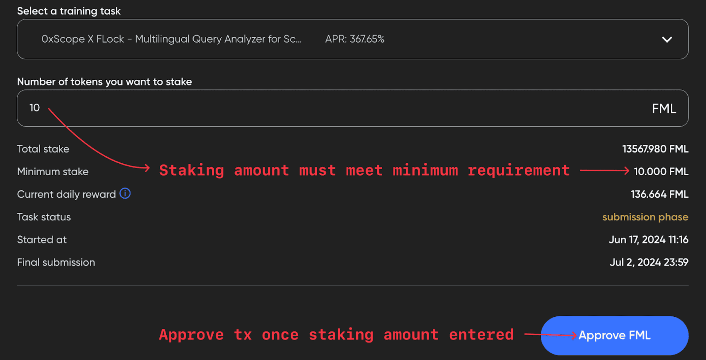

Developing truly open and decentralized AI is one of society's most critical challenges. The networks, platforms, and clients we build will help guide this development, from open compute networks like Akash to platforms like FLock.io that make it easy to train and fine-tune AI models. Integrating these projects simplifies the user experience, enabling greater access that puts AI development directly in the hands of people around the world.

This case study outlines the integration between Akash and [FLock.io](https://www.flock.io/#/) that enables users to easily train AI models on decentralized compute. It illustrates how Akash, the first open-source Supercloud, gives AI developers access to the high-performance compute resources needed to train AI models with FLock.io, a platform for decentralized machine learning.

- Section 1: An introduction to FLock.io
- Section 2: The decentralized AI training pipeline
- Section 3: The integration between Akash and FLock.io
- Section 4: A step-by-step guide for running FLock.io nodes on Akash

## An Introduction to FLock.io

FLock’s mission is to democratize AI through decentralized, blockchain-based systems. FLock facilitates an open and collaborative environment where participants can contribute models, data, and computing resources, in exchange for on-chain rewards based on their traceable contributions.

FLock is a platform focused on federated machine learning. Federated learning is a distributed approach to training AI models where the data remains decentralized, allowing for privacy-preserving and collaborative learning. FLock aims to empower businesses and developers to harness the power of federated learning by providing a secure and scalable infrastructure. By enabling the training of models on distributed data without the need for centralized storage, FLock helps address data privacy concerns while still leveraging collective insights from multiple sources. The platform offers a range of tools and APIs to facilitate the development, deployment, and monitoring of federated learning models, making it easier for organizations to adopt this innovative technology. With FLock, companies can unlock the potential of collaborative learning while ensuring data security and compliance with privacy regulations.
 
The team recently launched [train.FLock](https://train.flock.io/), FLock’s flagship decentralized AI training platform deployed on Base Sepolia, marking a major milestone on the path to making the FLock mission a reality.

AI Arena, a pillar product on the train.flock.io platform, is a [Kaggle](https://www.kaggle.com/)-like competition wherein AI & ML engineers compete to finetune the best models for a given dataset. Participants stake FML, FLock.io’s testnet token, and are rewarded based on the quality of their contributions. AI Arena has 4 participant types:
- Task Creators: Define desired models and submit tasks to the platform
- Training Nodes: Develop or finetune models required by task creators
- Validators: Evaluate the models submitted by training nodes
- Delegators: Delegate tokens to validators, increasing reward distribution

## The Decentralized AI Training Pipeline
An AI model is a mathematical representation of a real-world process, designed to make predictions or decisions based on input data. It is the output of training a machine learning algorithm on a dataset, resulting in a set of parameters and rules that can be used to map new input data to the desired output.

AI model training is built around three foundational components: data, algorithms, and compute resources. Data provides the examples and patterns that the AI model learns from to make accurate predictions or decisions. Algorithms define the mathematical models and learning processes that enable the AI system to extract insights and knowledge from the data. Compute resources provide the computational power and infrastructure required to process large amounts of data, execute complex algorithms, and train sophisticated AI models efficiently.

Once a model is initially trained, there are two approaches for updating or improving it: bring the data to the model, or bring the model to the data. The former is often referred to as traditional machine learning, the latter as federated machine learning (or simply ‘federated learning’). In traditional machine learning, data is collected and centralized in a single location, where models are trained using the available compute resources, typically owned or controlled by a single entity. In contrast, federated learning enables models to be trained on distributed data across multiple devices or nodes, without the need to centralize the data. Federated learning allows for collaborative model training while preserving data privacy, whereas traditional machine learning requires data to be shared and processed in a central location.

Although these two approaches are not mutually exclusive, the heuristic is helpful when discussing AI training pipelines and how they differ in centralized and decentralized contexts.

FLock’s core user base (Task Creators, Training Nodes, and Validators) - reflect, at a high level, the AI training pipeline. Some training tasks are defined based on a base model and dataset (task creation). The model is improved based on new data and/or parameter tuning (training), and then its performance is measured by some score (e.g., loss), and this score is validated on a subset of data that the model hasn’t seen before (validation) in order to update the model. The implementation details vary widely depending on the approach (traditional machine learning vs federated learning) and whether pipeline tasks take place in a centralized or decentralized context.

Given the overlap, separating what we mean by centralized and decentralized AI model training is important. The key questions to ask are:
- Who controls task definition?
- Who owns the data used for task definition? What are the processes by which the data is collected? To what extent is the data public or private?
- Who owns the compute resources used for training and validation? Who controls access to these compute resources?
- How transparent are the inner workings of the model (e.g. parameters and algorithms)?
- Which aspects of the training pipeline are open-source and accessible to the public?
- To what extent can users update the model for their own domain-specific use cases?
- Who governs the model, and who governs the AI training process?

Indeed, the reason Big Tech firms like OpenAI, Meta, Google, and NVIDIA dominate the AI space is because they’ve vertically integrated the AI training stack. Such a centralized AI training process has clear advantages, including more granular control over the training pipeline. However, this approach is fraught with risks and ethical concerns. Decentralized AI training, especially based on blockchain tech, offers a better path forward but is not without its own set of challenges.

The UX for decentralized AI model training has room for improvement. The experience is disjointed and requires significant technical expertise that spans machine learning, blockchain interoperability knowledge, and network engineering. Even top-skilled machine learning engineers with Web2 backgrounds struggle to take advantage of capabilities unlocked with a decentralized AI training approach due to high barriers to entry.

These are the precise barriers to entry that Akash and FLock.io aim to break down.

## Birds of a Feather: Akash & FLock.io
As the adage goes, “birds of a feather flock together.” As the decentralized AI movement takes flight, Akash and FLock.io are flying in unison. Akash is an open network that lets users buy and sell computing resources securely and efficiently. FLock.io is an open network that lets users train, validate, and govern AI models democratically and transparently. 

Akash is purpose-built for public utility. Compute is available to anyone on the network through Akash’s peer-to-peer marketplace, and the network does not limit the types of tasks or workloads that can be deployed. Similarly, FLock.io is built for and by the community, and the platform does not restrict where models are trained, validated, hosted, and/or deployed.

With a clear alignment on visions for the future and shared values of openness, permissionlessness, and composability, it’s clear to see why Akash and FLock.io are closely aligned.

As the first open-source Supercloud, Akash enables users to permissionlessly access cloud resources — including high-performance NVIDIA H100s, A100s, A6000s, 4090s, and many more. This is a massive unlock as it gives AI developers access to state-of-the-art GPUs to perform training and validation at affordable prices. Not only that, the Akash Console provides a user-friendly interface that abstracts away the complexity of compute resource management – a key friction point in the AI training pipeline – that allows AI developers to spend more time and energy focusing on what they are best at.

This is why, as we’ll see in the following sections, FLock.io has integrated with Akash to create 1-click templates that make it easy to run FLock.io nodes on the Akash Supercloud.

Did you know that Jiahao Sun, FLock.io’s Founder & CEO, presented at [Akash Accelerate ‘24](https://akash.network/blog/akash-accelerate-24-the-path-forward-for-permissionless-compute/)? Check out the video here:
<iframe width="560" height="315" src="https://www.youtube.com/embed/fVYeAVvuNLI?si=BttHfSZCUQzRCsMo&amp;start=10416" title="YouTube video player" frameborder="0" allow="accelerometer; autoplay; clipboard-write; encrypted-media; gyroscope; picture-in-picture; web-share" referrerpolicy="strict-origin-when-cross-origin" allowfullscreen></iframe>

## Running FLock.io Nodes on Akash
This section is a step-by-step guide for successfully deploying a [FLock Training Node](https://console.akash.network/templates/akash-network-awesome-akash-FLock-training-node) or [FLock Validator](https://console.akash.network/templates/akash-network-awesome-akash-FLock-validator) directly from the Akash Console. 

### Pre-Requisites 
Before running FLock.io Validator and/or Training Nodes on Akash, users must have the following:
1. Whitelisted Ethereum address on train.flock.io. Not whitelisted? Complete FLock.io [whitelist form](https://blog.flock.io/news/trainflock)*.
2. Ethereum-supported Web3 wallet, such as MetaMask (used to stake FML, FLock.io’s testnet token on Base Sepolia).
3. IBC-compatible Web3 wallet, such as Keplr (funded with AKT or USDC used to pay for Akash compute).
4. `HF_USERNAME` and `HF_TOKEN` from a [HuggingFace](https://huggingface.co/) account.

*At the time of writing FLock.io’s decentralized training platform is still in private beta. Whitelist restrictions will be lifted in the coming months as the team progressively opens the platform up to the community.*

### Set up train.flock.io
Before you deploy on Akash, you must first do the following on train.flock.io:
- Stake FML on the task you wish to participate in
- Get the Task ID
- Get your API key

Staking FML makes you eligible to participate in the training task as a Training Node or Validator. Once staked you will need the Task ID and your API key in order to run the deployments on Akash. 

#### 1. Select the task you want to stake
*NOTE: On the Stake page, be sure you are on the Training Node or Validator tab, depending on how you want to participate in the training task.*


#### 2. Stake FML tokens on the task


#### 3. Get the Task ID & API Key
You can find the Task ID on the Tasks tab, and the API key can be found by clicking the upper right button where your address is displayed.

Now that you’ve successfully staked, and retrieved the Task ID and API key, you are ready to deploy a FLock.io node on Akash.

### Running a FLock.io Training Node on Akash
On the [Templates page](https://console.akash.network/templates) in Akash Console, search and select “FLock-Training-Node”. The SDL (Stack Definition Language) is a pre-populated template of FLock’s [`testnet-training-node-quickstart`](https://github.com/FLock-io/testnet-training-node-quickstart) script (`image: public.ecr.aws/e7z6j8c3/flock:training-quickstart-akash`). 

This script automates the training process and submits up to 6 models per day. Click “Deploy” and update the SDL with the following environment variables: 
- `FLOCK_API_KEY` - API key from [train.flock.io](https://train.flock.io/)
- `HF_USERNAME` - HuggingFace username
- `TASK_ID` - ID for the task that you staked on through train.flock.io
- `HF_TOKEN` - token associated with your HuggingFace account
 
You will also notice an optional `GIT_URL` environment variable. Trainers who wish to further customize training beyond the out-of-the-box `dataset demo_data.jsonl` or `training_args.yml` included in the training script can update `GIT_URL`.

Here’s a full look at the `deploy.yml` SDL:

```
---
version: "2.0"

services:
  flock-train:
    image: public.ecr.aws/e7z6j8c3/flock:training-quickstart-akash
    env:
      - FLOCK_API_KEY=
      - HF_USERNAME=
      - TASK_ID=
      - HF_TOKEN=
      # Choose whether to use your own dataset demo_data.jsonl or training_args.yml
      #- GIT_URL=
    expose:
      - port: 3000
        as: 80
        to:
          - global: true

profiles:
  compute:
    flock-train:
      resources:
        cpu:
          units: 8
        memory:
          size: 24Gi
        storage:
          size: 100Gi
        gpu:
          units: 1
          attributes:
            vendor:
              nvidia:
                - model: h100
                - model: a100
                - model: rtx3090
                - model: rtx4090
                - model: rtx8000
                - model: rtxa6000
                - model: a40
                - model: p40
  placement:
    akash:
      pricing:
        flock-train:
          denom: uakt
          amount: 10000

deployment:
  flock-train:
    akash:
      profile: flock-train
      count: 1
```

After you’ve created your deployment, choose a GPU provider commensurate with the task. Most training tasks can be completed using GPU with 16GB vRAM, though 24GB is recommended if you would like to train larger model. 

### Running a FLock.io Validator Node on Akash

On the [Templates](https://console.akash.network/templates) page in Akash Console, search and select `FLock Validator`. The SDL is a pre-populated template of FLock’s [`llm-loss-validator`](https://github.com/FLock-io/llm-loss-validator/tree/main) script (`image: ghcr.io/flock-io/llm-loss-validator:v0.0.6`). 

This script listens for submissions from Training Nodes, then picks up and completes validation assignments. Click “Deploy” and update the SDL with the following environment variables: 
- `FLOCK_API_KEY` - API key from train.flock.io
- `TASK_ID` - ID for the task that you staked on through train.flock.io
- `HF_TOKEN` - token associated with your HuggingFace account
 

Here’s a full look at the `deploy.yml` SDL:

```
---
version: "2.0"

services:
  flock-validater:
    image: ghcr.io/flock-io/llm-loss-validator:v0.0.6
    env:
      - FLOCK_API_KEY=
      # support multi_task, such as 1,2,3
      - TASK_ID=
      - HF_TOKEN=
    expose:
      - port: 3000
        as: 80
        to:
          - global: true

profiles:
  compute:
    flock-validater:
      resources:
        cpu:
          units: 8
        memory:
          size: 24Gi
        storage:
          size: 100Gi
        gpu:
          units: 1
          attributes:
            vendor:
              nvidia:
                - model: h100
                - model: a100
                - model: rtx3090
                - model: rtx4090
                - model: rtx8000
                - model: rtxa6000
                - model: a40
                - model: p40
  placement:
    akash:
      pricing:
        flock-validater:
          denom: uakt
          amount: 10000

deployment:
  flock-validater:
    akash:
      profile: flock-validater
      count: 1
```

After you’ve created your deployment, choose a compute provider commensurate with the task. Validation assignments require minimal compute so it is possible to complete the task with many of the less resource-intensive options available.

## How To Get Started
To get up and running with your FLock deployment, complete the following steps.
1. Complete the FLock.io [whitelist form](https://blog.flock.io/news/trainflock).
2. Stake FML at [train.flock.io](https://train.flock.io/).
3. Deploy a [FLock Training Node](https://console.akash.network/templates/akash-network-awesome-akash-FLock-training-node) from Akash Console.
4. Deploy a [FLock Validator](https://console.akash.network/templates/akash-network-awesome-akash-FLock-validator) from Akash Console.

To connect with [Akash](https://akash.network/), follow the network on [X (Twitter)](https://x.com/akashnet_) and [sign up to hear about the latest announcements and updates](https://akashnet.typeform.com/to/awKX5bPw?typeform-source=akash.network).

