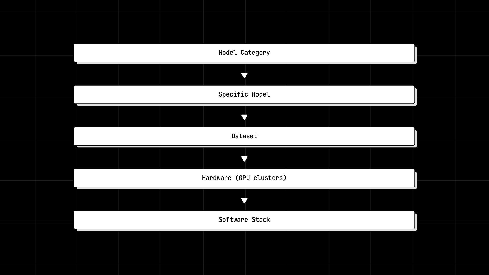
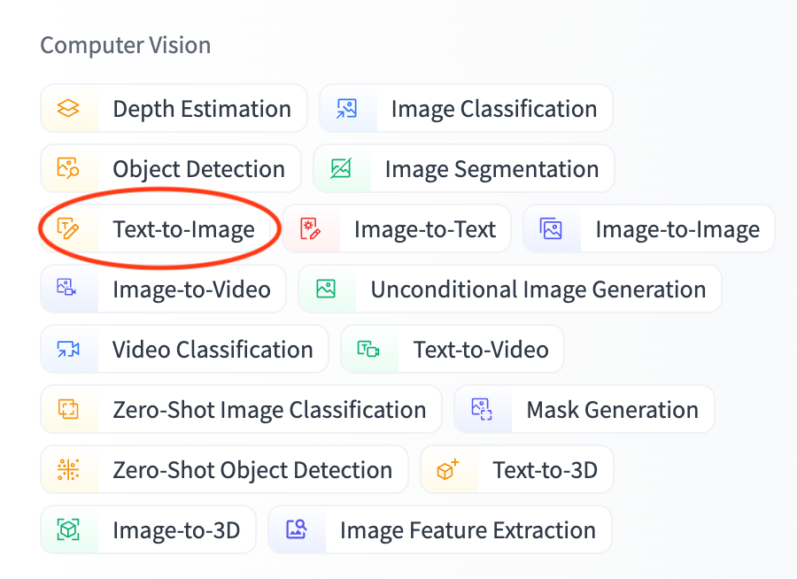
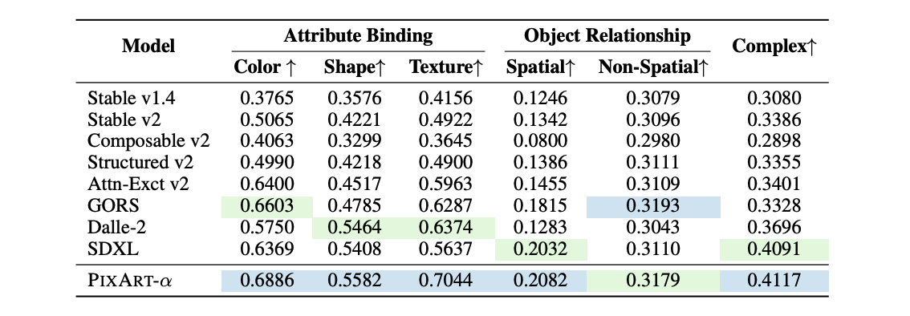
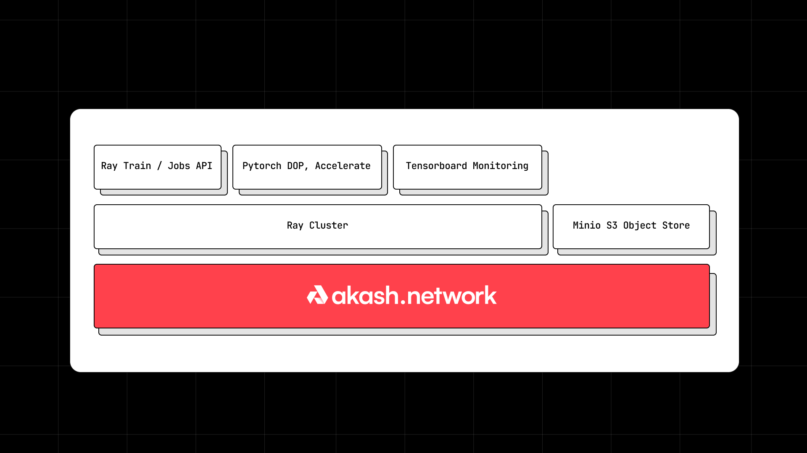
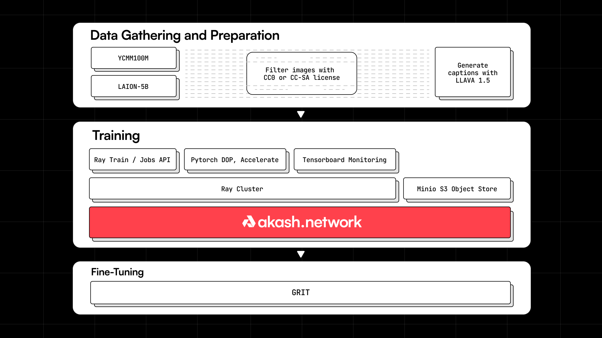
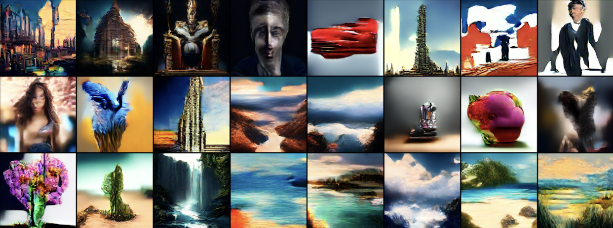

[Anil Murty](https://twitter.com/_Anil_Murty_) & [Logan Cerkovnik](https://www.linkedin.com/in/logancerkovnik/)

Towards the end of 2023, Overclock Labs (core team behind Akash Network) and ThumperAI (generative AI startup) decided to embark on a mission to train a foundation model on Akash GPUs. This post delves into the why and how of the training exercise and also talks about the outcomes and next steps.

## Why Train a Foundation Model? 
Generative AI Foundation model training is one of the most important and challenging jobs for cloud compute platforms due to the cost, hardware requirements and software complexity.  Most decentralized compute marketplaces today are unable to meet these requirements for AI startups and so we thought it would be a great way to set a high bar by attempting to do so on Akash Network.

Besides the above common/overarching goal, the two teams (Overclock Labs and ThumperAI) had the following individual goals.

## ThumperAI’s Goals:
ThumperAI is building [Lora Trainer](https://loratrainer.com/) - a service that makes it easy for AI developers to use LoRA techniques to fine-tune foundation models. So, offering their own foundation model would add credibility to their mission. And success with this would potentially lead to them following up by running the LoraTrainer service on Akash as well (which currently runs on a centralized cloud provider).

## Akash Network and Overclock Labs’ Goals:
- Demonstrating that AI model training can be conducted on Akash Network's decentralized cloud platform, thereby attracting AI and ML developers (web3 and web2) to Akash Network.
- Positioning GPU providers for success (by generating demand).
- Rounding out AI use cases, by adding model training (Inference and fine tuning had already been demonstrated).
- Strengthening Akash Networks’ open source commitment by building and contributing an open source AI model to the broader OSS community.
- Contribute an Image generation AI Model to the broader open source community that can be used with less risk of copyright infringement.
- Demonstrating how to deploy and run Ray Clusters on Akash Network.

## Decisions & Tradeoffs
As with any significant project, we had to make a number of decisions and tradeoffs before we embarked on the mission. Here’s a quick rundown of the key ones.

## Model Category Choice

There are obviously several categories of models that we could choose from (the category list from HuggingFace on the right here provides a good reference). 

This was our thought process in arriving at a category:

1. Arguably the two categories of models that have garnered most mainstream media attention are Large Language Models (or LLMs) and Image Generation Models. This is hugely attributable to the success of companies like OpenAI, StabilityAI and Midjourney to name a few.
2. Image generation models tend to be cheaper to train that large-language models because they are relatively  often much smaller in terms of number of parameters, oftentime use convolutional layers instead of transformers throughout the model, and tend to train faster than llms. 
3. There have been [several articles published](https://www.theverge.com/2023/1/17/23558516/ai-art-copyright-stable-diffusion-getty-images-lawsuit) about copyright infringement lawsuits made against image generation models that were trained on proprietary datasets like Getty Images. Having an AI model that did not have these limitations would be a great thing

On the 3rd point specifically, we thought it would be a good experiment to try to train an image generation model using a copyright free image data set like [creative commons](https://creativecommons.org/public-domain/cc0/) and so that is what we decided to pursue. 

## Base Model Choice
Once we decided on working with an Image generation model, the next decision was which specific model to work with. The 3 most popular ImageGen models at the time (arguably even now) were [Stable Diffusion](https://stability.ai/stable-image), Midjourney and DALL-E. Stable Diffusion was an easy choice because it is [open source](https://github.com/Stability-AI/stablediffusion) while the others aren’t, so initially that was what we had decided to go with and that was what was written in the [proposal](https://github.com/orgs/akash-network/discussions/300) submitted to the Akash community for discussion. We chose to use Stable Diffusion 1.5 in order to meet budget constraints outlined in the proposal.

As we got closer to starting the actual training exercise, MosiacML [published a paper](https://ar5iv.labs.arxiv.org/html/2310.16825) indicating that they were also looking at training Stable Diffusion with a creative commons data set, but were planning to use Stable Diffusion 2.0. Luckily we were able to find a new model called [Pixart-Alpha](https://pixart-alpha.github.io/) that had performance benchmarks very comparable to SDXL (the state of the art Stable Diffusion Model at the time).  We ultimately ended up going with a slightly different Pixart-Alpha-inspired architecture proposed by [Alexandru Papiu](https://github.com/apapiu/transformer_latent_diffusion) after we had some training issues with the Pixart-Alpha Architecture.

## Dataset Choice
We created a Creative Commons licensed dataset by filtering [YFCC100M](https://registry.opendata.aws/multimedia-commons/) and [LAION-5B](https://laion.ai/blog/laion-5b/) for images with CC0 or CC-SA licenses.  

Those datasets can be found at their huggingface pages here:
- [https://huggingface.co/datasets/laion/laion5B-index](https://huggingface.co/datasets/laion/laion5B-index)
- [https://huggingface.co/datasets/dalle-mini/YFCC100M_OpenAI_subset](https://huggingface.co/datasets/dalle-mini/YFCC100M_OpenAI_subset)

For fine tuning we used a curated collection of 2M AI Generated images that were published under  MS-PL license that were taken from [https://huggingface.co/datasets/zzliang/GRIT](https://huggingface.co/datasets/zzliang/GRIT) 

To create our initial dataset, we used two of the largest dataset with Creative Commons License data included in them and filtered for images that had either CC0 or CC-SA creative commons licenses. These dataset were chosen for their size and inclusion of license metadata. We believe some of the challenges we have encountered with the model training is very likely due to the lower quality and diversity of this dataset.  During the fine tuning portion of the model training we shifted to AI generated images licensed under the MS-PL license.  It would appear that this dataset was insufficient to improve the models performance. For training purposes we always used cached text and vae embedding layers to improve the training efficiency.  Captions were generated using the LLAVA 1.5 model.  

## Hardware Choice
For the actual training cluster, we used the following GPU cluster set up and managed by the [Europlots](https://console.akash.network/providers/akash18ga02jzaq8cw52anyhzkwta5wygufgu6zsz6xc) provider on Akash:
- 32x A100 80GB (PCIe interconnect) GPUs
- 1024 vCPUs
- 4096GB of Memory,
- 32TB NVMe Storage 
- 1920GB SSD

We also used 16 RTX8000 GPUs from the [FoundryStaking](https://console.akash.network/providers/akash17gqmzu0lnh2uclx9flm755arylrhgqy7udj3el?network) provider for the fine-tuning portion of training. 

## Software Stack
We used Ray Clusters to run distributed training across the 48 GPUs across two providers. If you are curious about Ray and how to use it to run distributed ML workloads across Akash GPUs, check out our [detailed blog post](https://akash.network/blog/distributed-machine-learning-on-akash-network-with-ray/) on the topic.

The architecture of the system we utilized for it can be described with the following blocks:

## Training
The end-to-end training pipeline can be summarized with the following block diagram:

## Outcomes
Here are some images generated from the model:

The model’s performance on image generation is heavily influenced by the training dataset’s bias towards paintings at the expense of photos.  This is likely due to photos being released under creative commons licenses less frequently than other image content.  

While the image output from this first model is far from perfect, that has more to do with the data sets than the cloud and ability to run workloads on Akash. With that in mind, we feel pretty good about  achieving the objectives we set out to achieve but here’s a quick rundown of the goals we had hoped to achieve and how we think we did on them:

## Goals

1. Demonstrating that AI model training can be conducted on Akash Network's decentralized cloud platform, thereby attracting AI and ML developers (web3 and web2) to Akash Network.
2. Positioning GPU providers for success (by generating demand).
3. Rounding out AI use cases, by adding model training (Inference and fine tuning had already been demonstrated in the testnet and beyond).
4. Strengthening Akash Networks’ open source commitment by building and contributing an open source AI model to the broader OSS community.
5. Contribute an Image generation AI Model to the broader open source community that can be used with less risk of copyright infringement.
6. Demonstrating how to deploy and run Ray Clusters on Akash Network.

## Outcomes

1. While the model output isn’t as great as we had hoped it would be we showed that it is feasible to train foundation models on akash and identified areas to improve for the future including: 
    - Making it easier to increase shm for workloads, 
    - Improving  benchmarking, and 
    - Using streaming dataloaders during training  
2. We were able to work with two providers (Europlots and Foundystaking) and reliably use them for training - and that has enabled us to reference the work towards attracting several other teams building GenAI applications to utilize Akash compute.
3. Prior to this work, no one had trained a foundational model on Akash before. The foundation model training stack has different requirements from inference and fine-tuning. Knowledge learned from this will help inform future foundation model training on akash. The core team has already identified 2-3 other teams that will be training foundation models in the days and weeks to come.
4. The source code for conducting the model training is open-source: [https://github.com/thumper-ai/at1](https://github.com/thumper-ai/at1)
5. The training and inference code is available here: [https://huggingface.co/thumperai/akash-thumper-v1](https://huggingface.co/thumperai/akash-thumper-v1). We have released the model weights on HuggingFace as well: [https://huggingface.co/thumperai/akash-thumper-v1](https://huggingface.co/thumperai/akash-thumper-v1).
6. We have added SDLs for Ray Cluster’s to the Awesome-Akash repo: [https://github.com/akash-network/awesome-akash/tree/master/ray](https://github.com/akash-network/awesome-akash/tree/master/ray).

## Learnings
- Ray Jobs - Due to the inability to remount persistent volumes in Akash we had to keep the same ray cluster up for an extended period of time and could not rebuild the container for additional retraining or tweaks to the codebase.  We also used the Ray dependency management to maintain several virtual environments for the different stages of training.  
- Caching Latent Images - The most efficient way of training text to image models today is to train off of presaved latent images.  
- Streaming Dataloaders - We went with ray datasets with a webdataset format.  We found that the webdataset format was the best format for supporting saved numpy or torch tensors in a steam 
- Logging -  Used Ray Dashboard, Tensorboard logs,  and Weights and Biases for logging training information. Weights and Biases is nice because its logs GPU temperature and additional hardware metrics that are not present in the ray dashboard. It’ll be great to have some of these metrics be natively available in Akash provider dashboards.
- Storage - We used both Backblaze and akash minio deployments for s3-compatible object storage. The challenge with akash hosted minio deployments is that oftentimes the gpu providers lack sufficient additional disk space to function as long term storage provider for models logs and weights. The core team has since been working to add several providers with larger disk storage to the network.

### Additional Considerations for using Ray on Akash:
- **Getting Bids for a large GPU cluster:** Make sure the cluster generates bids in a small configuration with minimal gpu, cpu, and storage requirements. Make sure the gpu tag is right. Some providers will have different tags for a gpu model eg nvidia-a100 vs a100. After the small configuration generates bids you can increase resources gradually in the deployment until it reaches your requirements. The provider dashboard and script will sometimes overestimate the resources available due to resource fragmentation. Contact the Akash provider if they can help you tweak the resource profile if you are having trouble. 
- **S3 compatible object storage:** You should consider which s3 compatible object storage service you may want to use.  Syncing FSDP checkpoints during ray train jobs requires an s3 compatible storage service or a network file drive. You can use a self-hosted minio deployment or a 3rd party storage provider such as backblaze.

- **Enabling SHM:** Ray Cluster’s plasma object store is most performant when running in-memory and is often set to consume 20-30% of RAM.  Docker containers and k8s pods default shm resources to ~2Mb which is too low for pytorch dataloaders and ray clusters during ML training jobs. For k8s platforms, an empty directory volume mount is needed to increase shm. Please coordinate with your provider on Discord before deploying so they can enable the increased shm setting. (link to provider guide to enabling SHM). Once shm is enabled you should see a larger object store in the ray cluster dashboard. If the deployment gets restarted you will need to have the provider
repeat the process. The core team has prioritized supporting setting SHM as part of their roadmap here: [https://github.com/orgs/akash-network/projects/5/views/1?pane=issue&itemId=50909379](https://github.com/orgs/akash-network/projects/5/views/1?pane=issue&itemId=50909379) 

We had some initial training issues with the model being patchy with the Pixart-Alpha architecture and shifted early on to the latent transformer architecture proposed by Alexandru Papiu.  This makes some changes to Pixart to add a Convolutional layer to help the model learn  spatial patterns easier.  We also have experimented with perceptual loss [https://arxiv.org/abs/2401.00110](https://arxiv.org/abs/2401.00110) although we did not see a significant improvement with that either. 

## What’s next
There are two potential next projects that the two teams will consider leveraging Akash Network for, based on the learnings from this AT-1 training exercise:

- While the The AT-1 model training exercise was a great first step it is clear that the current performance is not good enough to be competitive with text-to-image models today. Further, while the goal was noble, there doesn’t appear to be a viable path to improving the model on purely creative commons datasets at this point in time.  Thumper has decided to pivot away from creative commons models and will consider training and releasing a model merge or further fine tuned version of AT-1 at a future date that would include non-creative commons data/models.  
- The Thumper team will look into migrating [https://loratrainer.com/](https://loratrainer.com/) to run on Akash Network as they look to scale that service, so as to take advantage of the lower costs (relative to their current centralized provider) and variety of GPUs available on the network. One of the features needed before they can do this is the ability to [request a max SHM size](https://github.com/akash-network/support/issues/179) through the Akash SDL. That feature is about to be made available on the network through an upgrade.
