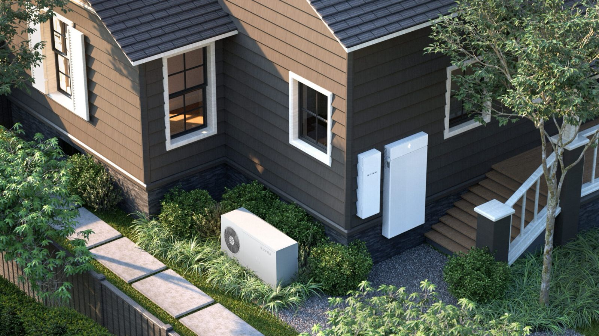

For the last decade, scaling AI meant one thing: build bigger datacenters. Pour billions into hyperscale facilities. Negotiate with utility companies for hundreds of megawatts. Quietly hope the local grid can handle it.

However, that model is breaking.

Power constraints, zoning battles, water usage controversies, and political pushback have made the traditional datacenter buildout slower and more expensive than the AI industry can tolerate. Demand for compute is growing faster than the grid can support new centralized facilities.

The answer is becoming clear: the home is the new datacenter.

Earlier this month, NVIDIA confirmed what Akash has been building toward for years. In partnership with Span and homebuilder PulteGroup, NVIDIA [announced an initiative](https://fortune.com/2026/05/15/startups-tiny-data-centers-beleaguered-electrical-grid-heata-span/) to install GPU cabinets on the exterior of new homes. In Q1 2026, Akash began rolling out its first phase of **Homenode**, a software platform that lets anyone with a capable gaming PC plug into the Akash Network and start earning from their idle compute.

On the surface, these two initiatives share a similar underlying thesis. And simultaneously have very different paths to get there.

Here's how they compare.

## **The NVIDIA + Span Approach: New Hardware, New Homes, New Infrastructure**

The NVIDIA/Span [model](https://arstechnica.com/ai/2026/05/the-newest-ai-boom-pitch-host-a-mini-data-center-at-your-home/) installs company-owned cabinets containing liquid-cooled RTX PRO 6000 Blackwell GPUs on the exterior of homes. The homeowner provides electrical capacity and wall space. In exchange, they receive a utility credit on their monthly bill.

It's an elegant idea. But the rollout requirements are significant:

* **New construction partnership.** The initial deployment is tied to PulteGroup, a homebuilder. The cabinets are being designed into new homes, not retrofitted onto existing ones.  
* **Homeownership required.** Renters are out. Apartment dwellers are out. Anyone with an HOA that doesn't want an industrial-looking cabinet bolted to the side of their home is out.  
* **Electrical capacity required.** The system is designed to power up to 16 RTX PRO 6000s. That's a serious electrical service most existing homes don't have without an upgrade.  
* **Climate and siting considerations.** Exterior cabinets need appropriate placement, ventilation, and protection.  
* **A six-figure piece of hardware sitting outside your house.** That's a real consideration for a lot of people.  
* **Timeline uncertainty.** This is a pilot tied to new home construction. Mass rollout is a multi-year process at minimum.

For the small slice of the population that's building a brand new home with PulteGroup and wants to host a cabinet, this is a genuinely interesting offer. But it's not a solution most people can act on.

The startup SPAN envisions a 100-home pilot deployment of XFRA nodes in 2026 followed by rapid scaling in 2027. Credit: SPAN

## **The Akash Homenode Approach: Use What You Already Have**

Homenode takes the opposite path.

Instead of shipping new hardware to new homes, Homenode is software. If you already own a capable GPU - an RTX 30,40,50 series, or Quadro RTX 6000 Ada - you download an ISO image, plug into the Akash Network, and your machine starts earning from real compute demand on a permissionless marketplace.

Here's what that unlocks:

* **No new hardware purchase required for existing GPU owners.** Use the rig you already built.  
* **No new construction required.** Works in any home, any apartment, any setup with power and internet.  
* **No homeownership required.** Renters can participate.  
* **Available immediately.** Not a multi-year rollout. The software is what's being built, and it's coming soon.  
* **You keep your machine.** When you're not earning, you're gaming, running local models, or doing whatever you bought the rig for in the first place. It's still your sovereign GPU.  
* **You own the hardware.** You participate directly in the marketplace.

The addressable population is dramatically larger than any new-construction program could reach, because Homenode meets people where their hardware already lives.

## **Where the Two Models Diverge**

The fundamental difference comes down to who the program is *for*.

NVIDIA + Span is designed for **new homes being built right now**, with the electrical capacity and physical space to host a centrally-managed cabinet. That's a small and very specific group.

Homenode is designed for **anyone who already owns a capable GPU**. Gamers. AI tinkerers. Workstation owners. Crypto miners pivoting to compute. That's millions of machines already plugged in, already paid for, already sitting idle most of the day.

One requires you to wait for new infrastructure to reach you. The other meets you where you already are.

## **Why Both Matter**

This isn't a zero-sum story. The fact that NVIDIA is moving into home-based compute validates the entire thesis Akash has been building on: centralized hyperscale data centers can't scale fast enough, and the latent capacity sitting in homes is enormous.

The two approaches can even be complementary over time. As more GPUs get deployed at the edge - whether through Span cabinets or consumer rigs - the need for an open, permissionless control plane to coordinate that compute only grows. That's exactly what Akash provides.

The home is the new data center. The only real question for anyone reading this is: how soon do you want to participate?

If you're building a new house with PulteGroup, the NVIDIA/Span option may be worth a look in the years ahead.

If you have a gaming rig sitting in your office right now, Homenode is the path that's available to you today. Sign up for the Akash Homenode Pilot Testing, and start earning.
