In December last year, Akash [launched credit card payments in Akash Console](https://akash.network/blog/introducing-credit-card-payments-in-akash-console/). This eliminates one of the most significant barriers faced by (mainstream) developers trying to use Akash Network. The next hurdle many developers face is the challenge of having to containerize their applications and knowing how to create a [Stack Definition Language (SDL)](https://akash.network/docs/getting-started/stack-definition-language/) file for deployment onto Akash Network. To this end, Akash Network has also added a new user experience within [Akash Console](https://console.akash.network/) that features workflows for four distinct user types who make up the primary user groups for Akash Network.

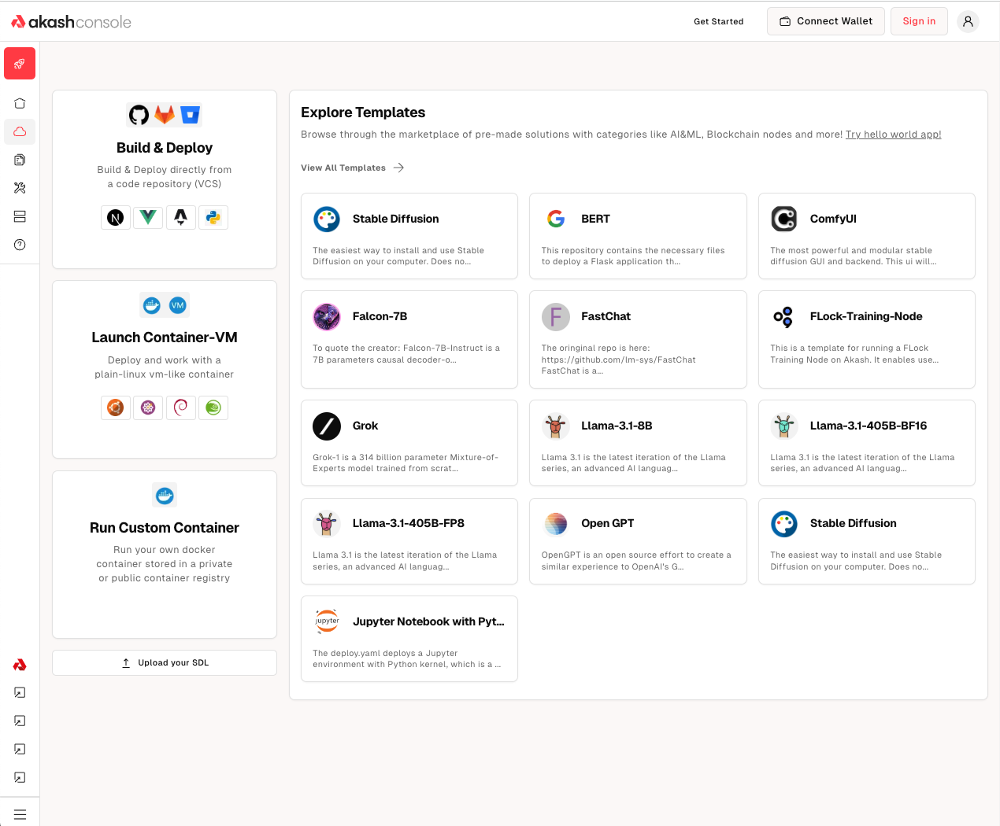

# Four workflows for four types of users
In speaking with many existing cloud IaaS and PaaS users and onboarding several customers, the Akash core team and community discovered that these users tend to come from multiple different backgrounds, in terms of their technical skills and the products and services they used in the past and use today. At the same time, there is a lot of nuance to this, which can result in 10s of different workflows, asking the question: “How Akash savvy is the user?” which results in bucketing Akash users into four primary user groups.

Note that “Akash Savviness” is the willingness of the user to deal with things like understanding the infrastructure needs of their applications at a detailed level and being able to package their application or service into a form that allows for deployment onto Akash Network.

| **Developer Type** | **Akash Savviness** | **Desired Workflow** |
| :---- | :---- | :---- |
| Web Developers (Including AI/ ML app developers and Data Scientists) | Low | Would like to be able not to have to worry about infrastructure selection, provisioning, dockerization, or “Akashization” at all Typically use Platform-as-a-Service (PaaS) products like Vercel, Netlify, or Heroku. |
| Ops/ Infra Engineers | Low-Med | Are used to being able to just get a Virtual Machine with their SSH pub keys copied into it so that they can SSH from a terminal and copy/ run what they need. Are fine specifying infrastructure requirements (number of GPUs/ CPUs, amount of Memory & Storage, locations, etc) at a very detailed level Typically use Infrastructure-as-a-Service (IaaS) products like AWS EC2, Azure-VM, GCE-VM or Digital Ocean droplet |
| DevOps Engineers  | Med-High | Are comfortable dockerizing applications and building deployment workflows (for CI/ CD, etc), specifying infrastructure requirements, and setting up automatic infrastructure scaling with load balancers. They can figure out how to write an AkashSDL for their needs but there’s a potential b Typically, they may use managed Kubernetes services (like AWS EKS) or may obtain Virtual Machines and run their own Kubernetes clusters with applications and services deployed as containers |
| Akash Champions | Very High | These users understand how Akash works and likely have an SDL file ready (or a repository of SDL files) that they have deployed before and want to deploy again as quickly as possible. |

Akash Console has now built workflows to help each of those four user types get started with less friction than before by trying to provide them with a workflow that looks familiar to what they are used to. Here are the four workflow types and how they map to the user groups outlined above. Each of these workflows correspond with one of the four options after clicking `Deploy` in Akash Console.

| **Developer Type** | **Akash Console Workflow** |
| :---- | ----- |
| Web Developers  | Build & Deploy |
| Ops/ Infra Engineers | Launch Container - VM |
| DevOps Engineers  | Run Custom Container |
| Akash Champions | Upload an SDL |

Let’s look at each of those workflows individually.

## Build & Deploy Workflow
This workflow (as the name suggests) takes care of building AND deploying user applications on Akash and also supports redeploying on a Git commit (PR merge) and rolling back to a past deployed version (if there are issues with a deployment). This workflow currently only supports NodeJS (javascript/ react) based applications with other programming languages (like Python and Ruby) planned for the future. 

Users start by clicking the “Build & Deploy” tile from the [new deployment](https://console.akash.network/new-deployment) page in Console which brings up a configuration screen that looks like this:

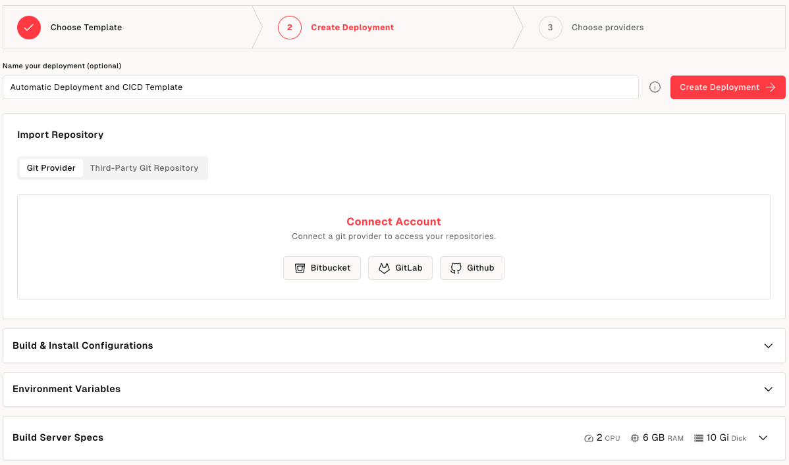

On that screen, the user starts by specifying the location where their application code resides. They can do this by either authenticating with their VCS provider (Github, Gitlab, Bitbucket) account or choosing the “Third-Party Git Repository” option where they can enter the URL of their public Git repository. Once connected the user can pick a repository and a branch, as shown below.

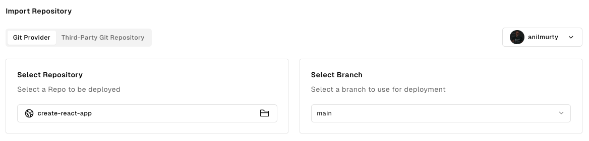

They can then (optionally) modify the build & install configuration and any environment variables that their application may need.

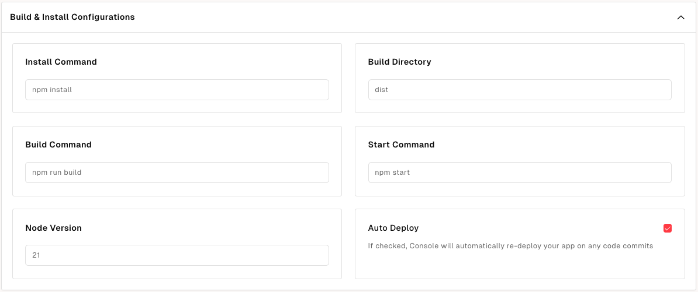

Note that there is also an “Auto Deploy” option, which is checked by default. When checked this will automatically rebuild and redeploy a new version of the app when a change is made to the connected code repository (typically through a PR merge and git commit).

The last part of this configuration screen lets the user modify the specs of the build server that will be provisioned on Akash to build and deploy the application. The user can change this, but this is typically for advanced users who know their application’s infrastructure requirements.

Once the user has chosen a provider to deploy to, they’ll be able to see logs that indicate that the application source code is being cloned onto the build server (provisioned on the chosen provider).  

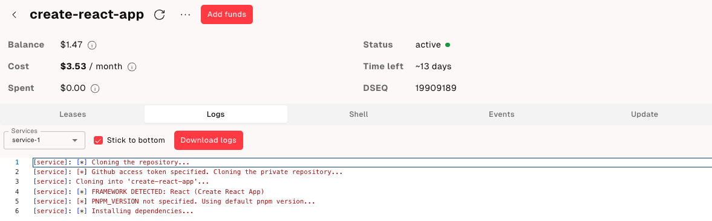

Once built, the react application is served, as shown in the last portion of the logs.  

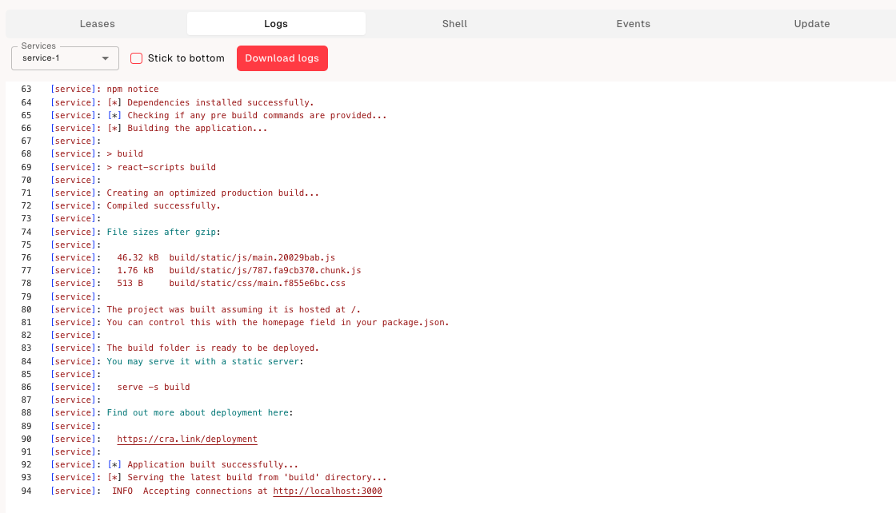

The “Leases” tab displays the URL that can be used to access the application.

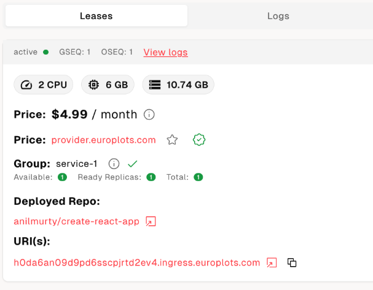

Merging a pull request into the code repository connected to the console will trigger an automatic re-build and re-deploy of the application, which can be observed in the logs.

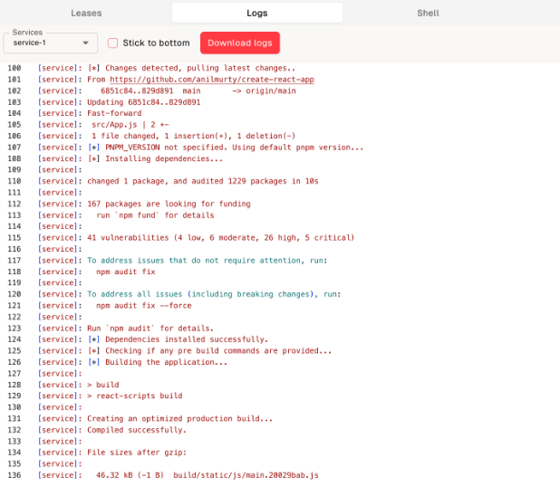

Lastly, rollbacks are supported. This feature can be accessed from the “update” tab. Clicking “Select” allows users to choose a specific past application version to roll back to. This is useful for quickly reverting to a previous version of the application if a new deployment has issues.

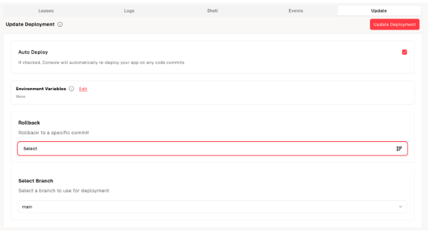

## Container VM Workflow
This workflow is for users who typically like to work with Virtual Machines. They do this by having the compute provider copy their public SSH key into the machine. Then, SSH into the machine with the corresponding private SSH key, copy any files or data they need to, and build and deploy any apps they need to, pretty much like they would on their machine. 

The challenge with enabling this on Akash is that because Akash uses Kubernetes to manage workloads, all workloads need to be docker containers to run on Akash. This means it was left to the user to figure out how to set up a plain Linux container with the Linux distribution of their choice and how to connect to get the command line on that running container instance so that they could copy things into it.

This has been solved in two ways:

1. Building container images that bundle in an SSH daemon. The Akash community maintains a few of these in the awesome-akash repository: [https://github.com/akash-network/awesome-akash/tree/master/base-ssh](https://github.com/akash-network/awesome-akash/tree/master/base-ssh)   
2. Building a workflow in Akash Console that lets the user choose one of those base images and be able to input an SSH public key (that will be copied into the base Linux container). In fact, if the user does not have an SSH key, Console will generate one for them.

Users start by choosing the “Launch Container-VM” option from the new deployment screen, which brings them to this screen where they can select a base Linux image and provide an SSH public key.

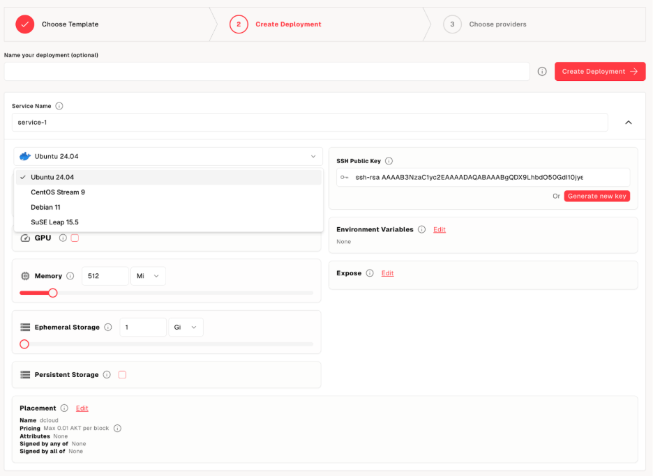

Once the user clicks Create Deployment, chooses a provider, and deploys, they can SSH into the Linux container with their SSH key. Instructions for doing so are also provided in the “Leases” tab:

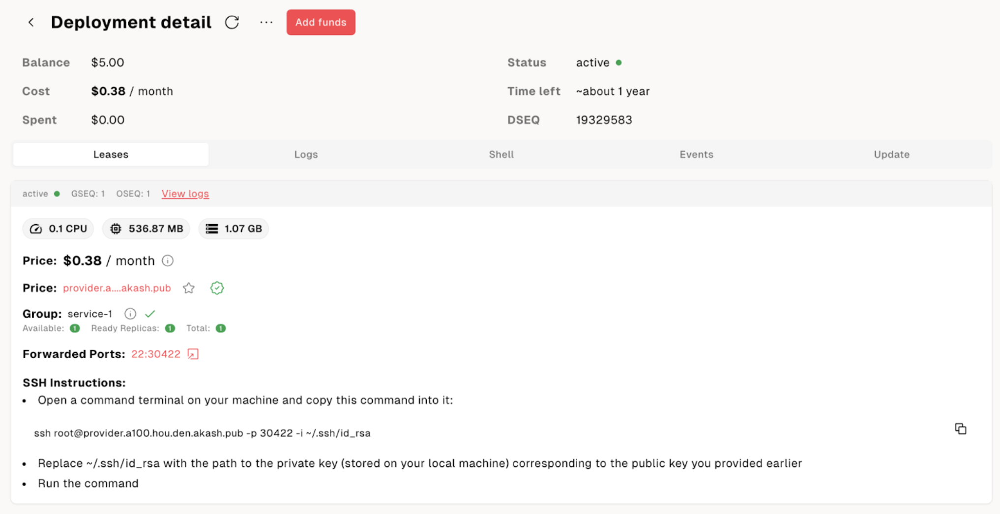

## Custom Container Workflow
This workflow is designed for users who have a dockerized application or can dockerize their application. Users start by clicking the “Custom Container” tile from the new deployment page in Akash Console. This brings them to a page that looks like this:

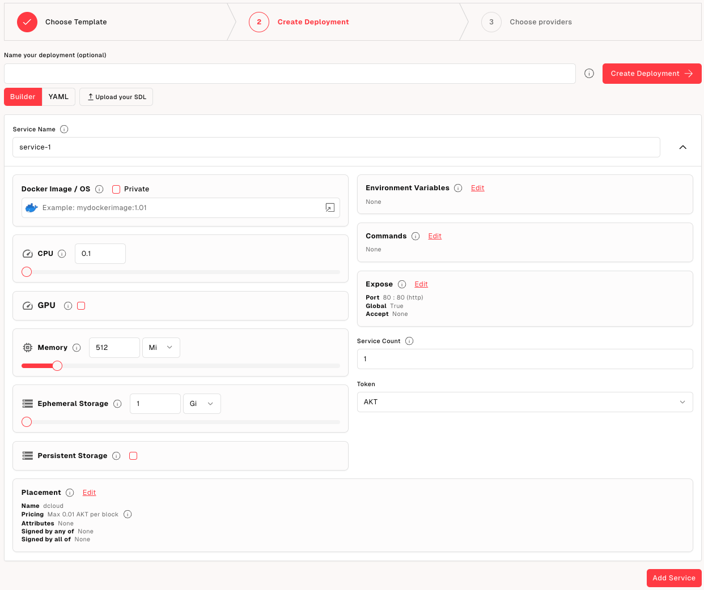

The user also has the option to choose a privately hosted container image by selecting the “private” option and entering authentication information for the private container registry.

Once that is done, the rest of the workflow is like any deployment on Akash.

## Upload SDL option
Last but not least important is the upload SDL option for the “Akash Champion.” As you would imagine, clicking the “upload SDL” button allows the user to select an SDL (`deploy.yaml`) file and leads them to a page where they can make any changes and deploy it.

## Community-contributed Templates
In addition to the user-specific workflows noted above, Akash Console features a rich collection of community-contributed templates for users who want less customization and want to get started with just a few clicks. 

There are a few templates that are featured up front on the new-deployment page that are primarily focused on launching AI inference services using leading open-source AI models like [Meta’s Llama Models](https://www.llama.com/), [Falcon-7B](https://falconllm.tii.ae/falcon-models.html), [ComfyUI](https://www.comfy.org/en/), [Stable Diffusion](https://stability.ai/stable-image), and [Google’s BERT](https://research.google/pubs/bert-pre-training-of-deep-bidirectional-transformers-for-language-understanding/).

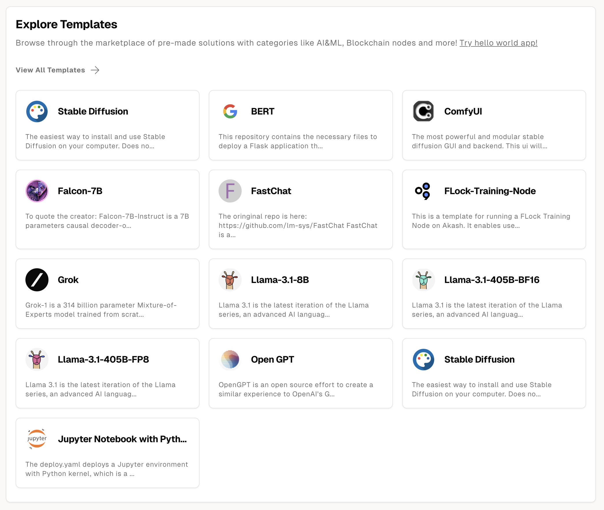

Further, clicking the “View All Templates” link takes the user to a categorized library of reference templates, including databases, blockchain nodes, games, and more. Users can click a specific category or search for templates using keywords. 

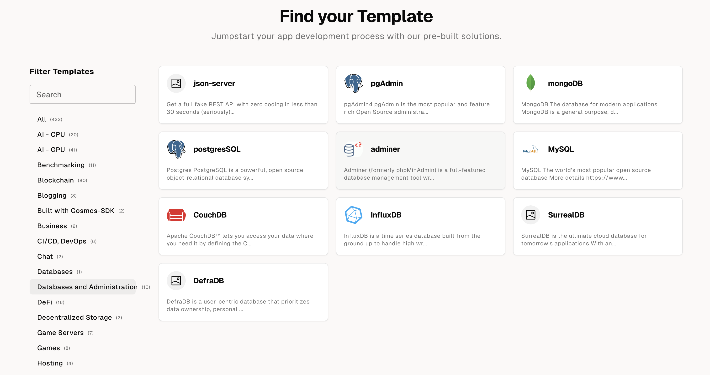

All these templates are powered by community contributions to [https://github.com/akash-network/awesome-akash](https://github.com/akash-network/awesome-akash), and Akash welcomes you to submit a PR!

## Looking Ahead
While there is still a lot more to build to improve the lifecycle of an Akash user (explore the [Akash Roadmap for 2025 and beyond](https://akash.network/blog/roadmap-2025/)), the Akash core team thinks that these new features, coupled with credit card payments, should eliminate a lot of the toil that users of Akash face before for getting started. If you have feedback about any of these features or ideas on how we can make things even easier, please [reach out to the Akash community on Discord](https://discord.com/invite/akash).