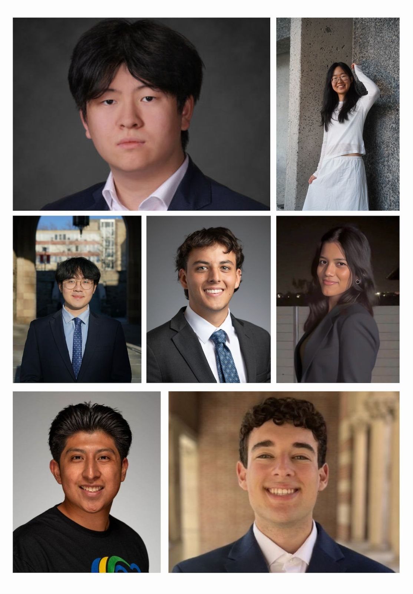

Supported by: Michelle Javed

This generation of young builders never experienced the internet the way it was designed to be.

They grew up on AWS, locked into vendor contracts and walled gardens. They've only known cloud computing as something controlled by three companies that dictate terms, set prices, and decide who gets to build.

But they're not accepting it.

Students today are wired differently. They want to build freely, without constraints. They refuse vendor lock-in. They won't tolerate infrastructure that requires permission or approval. And they're looking for alternatives that actually match how they think the internet should work: open, distributed, and community-owned.

That's why we're bringing Akash to campuses across the U.S. with the launch of the [Akash Student Ambassador Program](https://discord.gg/6cynyNtKz2): a way to welcome like-minded students into the space early and give them real ownership in building the decentralized cloud ecosystem alongside us.

This program exists for one core purpose: **ecosystem development through students**.

We're investing in builders, thinkers, and community catalysts who want to help shape the future of open-source, decentralized compute.​​

These ambassadors will spread awareness, drive engagement, and build community from the ground up. Not as passive participants, but as co-creators.

As they host events, publish content, engage with developers, and launch their own ideas, ambassadors will gain leadership skills while actively defining how this program evolves.

## Our First Cohort

  

The students from our inaugural cohort reign from prestigious institutions across the country: Princeton University, Cornell University, the University of Southern California, and UT Austin.

Each was drawn to the program for different reasons. They're studying different courses, come from diverse backgrounds, and have varying levels of exposure to web3 and decentralized systems.

When we brought our first cohort together for onboarding, we didn't know what to expect.

But immediately something clicked…

Within an hour, they connected like they'd known each other for years.

They were finishing each other's thoughts, riffing on ideas, connecting dots across disciplines.

Watching it happen in real time confirmed what we already believed: **when people share a mission, community forms naturally.**

Here's what drew some of our ambassadors to the program:

**Ayesha, UT Austin**

Ayesha's first encounter with decentralized compute revealed just how fragile and inefficient traditional cloud infrastructure can be. Centralized providers create cost, bottlenecks, and risk. Akash stood out to her as a return to the internet's original spirit: open, distributed, and community-powered.

**Alon, USC**

Alon isn't someone who just reads about emerging technology, he gathers people around it. For him, becoming an Akash Student Ambassador was a chance to build community, share knowledge, and introduce others to the decentralized cloud.

**Alex, USC**

Alex is drawn to the mathematical underpinnings of blockchain and cryptography. He sees Akash as the bridge between theory and real-world application, giving him a way to apply his academic interests directly to web3 infrastructure.

**Brian, Cornell**

For Brian, Akash represents a solution to one of the most pressing challenges in tech: over-centralization. Just as Bitcoin decentralized finance, Akash is decentralizing compute. For him, it's about more than cost. It's about ensuring the next wave of innovation comes from a broad, diverse community, not a handful of tech giants.

## Early Contributions

In the first week after onboarding, Alex presented Akash Network as an alternative to AWS at the USC Data Science Club. He learned something new, saw an opportunity and immediately put it to work on campus. He didn't wait for permission, didn't overthink, he just began shipping. Alex's drive and mentality is exactly why he makes a strong leader for the Akash Ambassador Program.

Ayesha followed with a [post explaining](https://www.linkedin.com/feed/update/urn:li:activity:7399526451764543488/) how centralization works until it doesn't, and why opening up unused computing capacity around the world will "bring back something the internet once had."

Her framing is sharp: "The best ideas often start this way. Obvious only in hindsight."

Lucas went even further, [explaining Akash's value proposition](https://www.linkedin.com/feed/update/urn:li:activity:7401319694118395904/) and made his thoughts clear, actionable, and easy for any student or developer to understand why they should care.

Helen, our latest member from Princeton, [published her first piece on why blockchain will reshape AI training](https://www.linkedin.com/pulse/why-blockchain-reshape-modern-ai-training-how-you-can-helen-hui-dzqhe/?trackingId=MqCnIheOS6yoA4uCtCN%2F1A%3D%3D). She tackles the bottlenecks holding AI back: data concentration, compute scarcity, and opaque provenance. Her call to action is direct: students don't need decades of experience or enterprise resources to contribute meaningfully. They need curiosity, technical versatility, and willingness to experiment at the boundary of two transformative technologies.

Over the coming months, ambassadors will publish monthly content (YouTube tutorials, blog posts, X threads, technical write-ups), host on-campus events (workshops, meetups, speaker nights), participate actively in the [Student-Union Discord](https://discord.gg/6cynyNtKz2), and contribute technically to the ecosystem, from improving GitHub documentation to deploying on the [Akash Console](https://console.akash.network).

## Become an Ambassador

This is our pilot cohort, and we're building it in real time with students at the center of its direction. At the time of writing, students in our first cohort have already onboarded 15 new members to the Discord community.

If you have ideas, feedback, or want to get involved, join us in the [Akash Student-Union Discord](https://discord.gg/6cynyNtKz2) or follow along for real time updates on [X](https://x.com/AkashStudents).

We're excited to see how this community grows, and how our ambassadors will push adoption for decentralized cloud forward.
