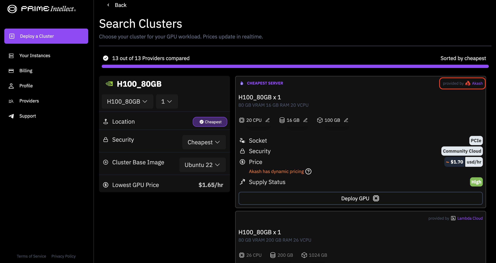

Today, high-performance GPUs from the Akash Supercloud, including NVIDIA H100, A100, and more, have been added to the [Prime Intellect](https://www.primeintellect.ai/) platform. This creates an entirely new way to access GPUs from the Akash Supercloud and allows Akash’s unique permissionless and peer-to-peer marketplace to reach a new cohort of AI developers in need of high-performance GPUs.

[Prime Intellect](https://www.primeintellect.ai/) is on a mission to democratize AI development. By gathering a wide range of the best compute providers on the same platform, it’s now easier than ever for AI developers to find the compute necessary to train, fine-tune, and run inference on AI models. This greatly improves the user experience of accessing compute, and especially permissionless compute from the Akash Supercloud.

## A New Way to Access GPUs

The Prime Intellect platform makes it easy to configure a GPU cluster through a familiar user interface. Users can select their desired chip specifications and easily pay with platform credits (which can be purchased with a credit card directly through the Prime Intellect platform).

The intuitive interface streamlines the process of setting up and managing GPU resources, enabling users to focus on their AI projects without the need to focus on infrastructure management. With just a few clicks, users can allocate the necessary GPU power and start running their AI workloads efficiently.

## The Expanding Supercloud

By integrating with best-in-class platforms, including [Brev.dev](https://akash.network/blog/brev-dev-leverages-akash-networks-permissionless-gpu-infrastructure-to-seamlessly-scale/), [FLock.io](https://akash.network/blog/decentralized-ai-model-training-on-akash-with-flockio/), [Morpheus](https://mor.org/), and others, the Akash Supercloud can reach users wherever they prefer to deploy. These integrations allow developers and businesses to access Akash's powerful GPU resources directly from their preferred platforms, eliminating the need to switch between multiple interfaces. Whether users choose Brev.dev for AI deployments, FLock.io for AI model training, or Morpheus for AI development, they can seamlessly tap into Akash's GPU infrastructure.

By integrating widely across many platforms, Akash can reach new cohorts of users and expand the network's reach significantly. This strategic approach enhances user convenience and drives the adoption of the Akash Supercloud across a wide range of developer communities, researchers, and startups. As more platforms integrate with Akash, the Supercloud becomes an increasingly accessible and versatile solution for accelerating AI development.

## Get Started with an Akash GPU Cluster on Prime Intellect

To start with an Akash GPU deployment via Prime Intellect, head to [primeintellect.ai](http://primeintellect.ai) and look for the Akash logo on the GPU provider selection page of the GPU cluster setup process.

To connect with Akash, follow the network on [X (Twitter)](https://x.com/akashnet_) and [sign up to hear about the latest announcements and updates](https://akt.fyi/3kpRwVM).
