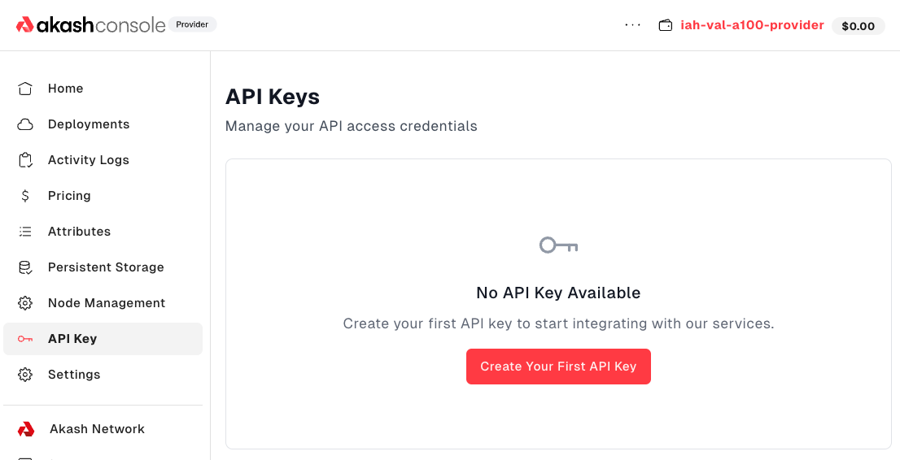
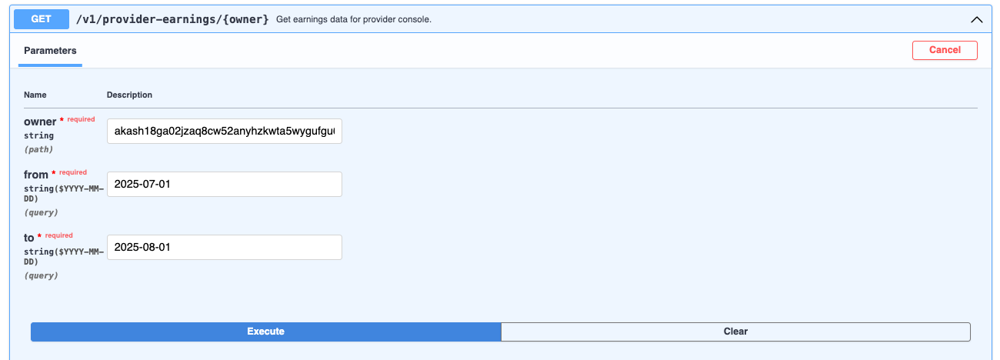
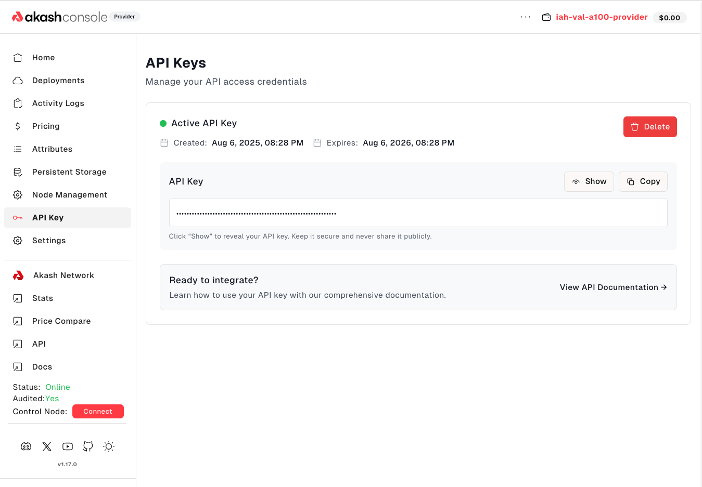

Providers who manage their clusters with Akash Provider Console requested an API to be able to query earnings data for the infrastructure they list on Akash Network. [AEP‑69](/roadmap/aep-69/) spelled out these requirements, calling for daily, weekly and monthly revenue metrics and insight into net earnings after Akash’s take rate. It also highlighted the need for providers to integrate earnings data into internal tools for forecasting and reporting. The core team took that feedback and built the **Provider Console Earnings API (v1)**.

## Unlock revenue insights

The Earnings API gives providers a simple yet powerful way to query their income over any period. Specify **from** and **to** timestamps to get total earnings for a day, week or month. The backend aggregates revenue and checks it against blockchain records to ensure accuracy. You’ll know exactly what you earned and when.

## Secure API built for providers

Generate and revoke API keys directly from the [Provider Console API Key page](https://provider-console.akash.network/api-keys). Each key is scoped to provider‑specific actions, includes rate limiting and can be revoked at any time. Documentation and example queries are provided to help you integrate quickly.

## Build your own dashboards

AEP‑69 envisioned a world where providers could pull their earnings into internal dashboards and accounting systems. Our v1 API takes the first step towards that vision. Use it to automate payouts, create financial reports or display real‑time revenue on your monitoring screens. Future iterations will add utilisation metrics (such as GPU hours by model) and take‑rate calculations, further enhancing your insights.

Whether you’re a single GPU provider or a large data‑center operator, the Earnings API empowers you to understand your business and plan for growth.

If you are a datacenter operator, new to Akash Network and interested in becoming a provider, get started with [Akash Provider Console](https://provider-console.akash.network/)

For technical support or any questions about Akash Provider Console or the Provider Console API, please head over to the [Akash Discord](https://discord.akash.network/) server, where technical members of the Akash community are available around the clock and ready to assist.
