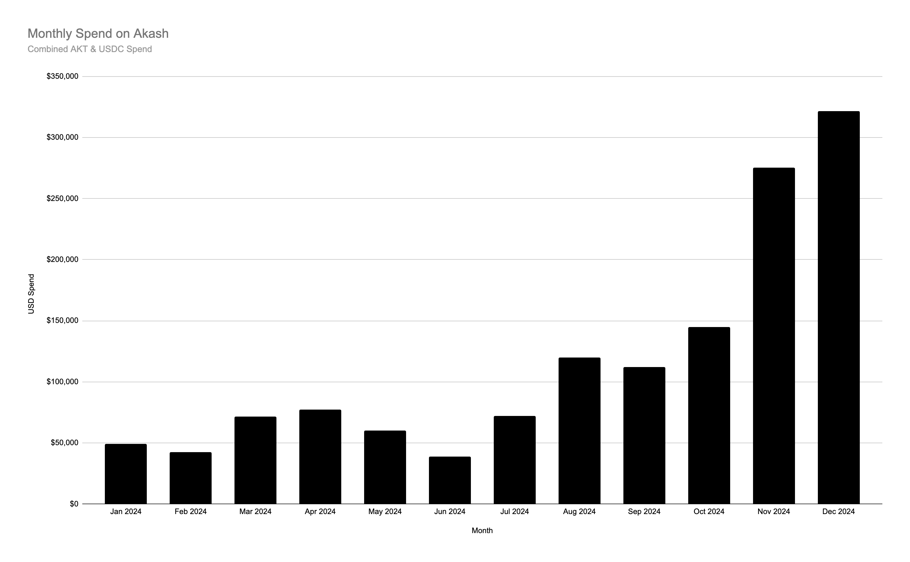
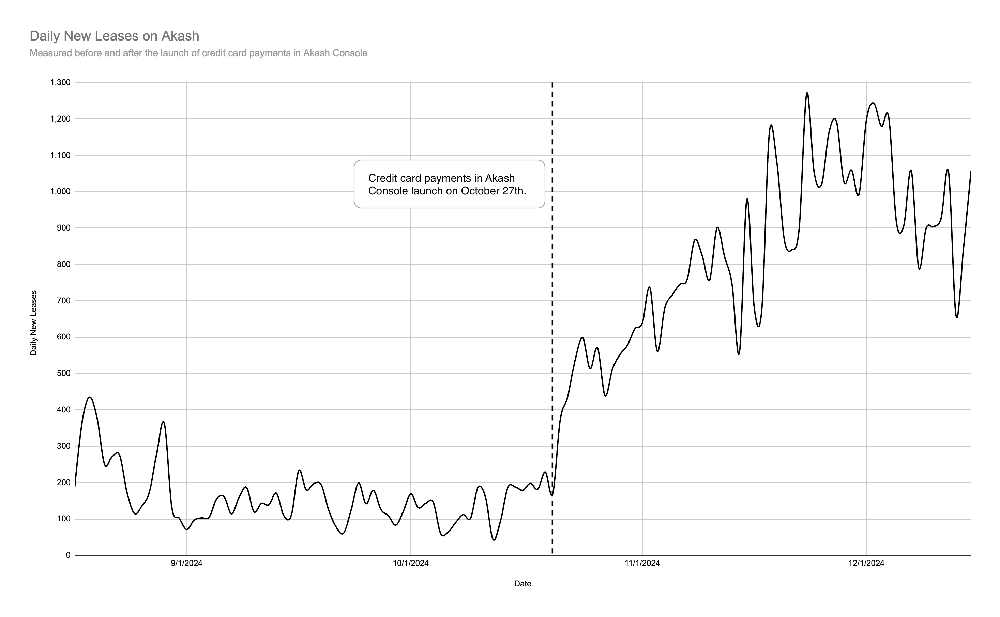

*A year of growth and adoption for Akash in 2024 and the vision for 2025 and beyond*

---

This is the decade that will define the next century. Last year, we wrote about two competing forces: one in favor of slowing (or even reversing) progress and another stronger force pushing for accelerating progress. As 2024 unfolded, the world seemed to tip decisively toward acceleration. We see it manifested in open infrastructures, the push for abundant energy, and the belief that broader access to compute benefits all of society. Akash is positioned entirely for a world that demands acceleration.

Overclock Labs, the creators and largest contributors to Akash, has long championed a radically open approach to building permissionless infrastructure. This ethic is rooted in solid fundamentals, which genuinely matter when building for the future. 2024 was the year that tested and ultimately affirmed our open approach to development. From record-breaking network growth to strategic integrations, from expansions into new regions to steadily climbing adoption, every milestone was propelled by the same undercurrent — open collaboration that thrives in public.

Below, we’ll cover the achievements that defined this banner year and examine where they lead us next. Beyond the perpetual hype cycle that often pervades AI and crypto, there is tangible, foundational progress at work that keeps propelling Akash, both as a network and a community, onto an ever-broadening global stage.

Here is the story of this moment in time: how momentum gathered in favor of acceleration, the fundamentals that give Akash real staying power, and the road ahead through 2025 and beyond.

## A Year of Foundational Network Growth in 2024
2024 was a pivotal year for Akash, underpinned by soaring adoption and significant growth on nearly every key metric. These achievements further expanded an already thriving ecosystem, cementing Akash’s position as a reliable, cost-effective, and truly permissionless network for compute.

### Significant Growth in Network Metrics
Akash experienced a surge in usage throughout 2024, most vividly reflected by its order-of-magnitude increase in USD-denominated spend (including AKT and USDC spend in a single metric). On January 1st, 2024, the network registered approximately $1,299 in daily spend, which increased to $11,038 by December 31st, 2024, representing a **749% increase**.

The growing daily spend also increased the trajectory of cumulative network spending. By October 27th, 2024, Akash had surpassed $1 million in cumulative spend. As of this writing, that number has climbed to $1.62 million. This represents a **609% increase** in total network spending over the year, underscoring market demand for compute.

Several factors contributed to these gains, including a **391% increase** in average daily new leases, comparing the 2-month periods before and after the [launch of credit card payments in Akash Console](https://akash.network/blog/introducing-credit-card-payments-in-akash-console/) on October 27th. By improving the network user experience for those more accustomed to traditional payment options, Akash significantly broadened its total addressable audience, quickly reflected in the network metrics across the board. Growth metrics from October, [announced on social channels](https://x.com/akashnet_/status/1845976505853071864) and backed by [real-time data](https://stats.akash.network), further signaled that this momentum is built on fundamentals. As more users recognize the value of Akash’s unique, open-source approach to cloud compute, the network’s growth trajectory appears poised to continue well into 2025 and beyond.

[Network data from Q3 2024](https://x.com/akashnet_/status/1845976505853071864) tells a story of evolving quality and quantity on Akash. Comparing Q3 2024 to Q3 2023, app deployments (leases) **grew by 1,729%**, while the average fee per lease **increased by 688%**. This signals that users are deploying more often and are willing to pay significantly higher fees for workloads that stay online longer and demand greater compute resources. Compared to Q2 2024, the average fee per lease **increased by 192%** — jumping from $6.42 to $18.75. This indicates that resource-intensive deployments drive revenue, an indicator that GPU-intensive workloads for AI and machine learning development are driving real growth for the Akash Supercloud.

Looking ahead to 2025, the momentum of network growth is poised to accelerate even further. The core team is rolling out new features to boost user acquisition and retention, reflecting the network’s commitment to meeting growing demand. These insights are derived from on-chain data indexed by [stats.akash.network](https://stats.akash.network), with verifiable transactions on [Mintscan](https://www.mintscan.io/akash). This transparency enables anyone to review, audit, and validate network activity.

In December 2023, [AkashChat](https://chat.akash.network), a free-to-use chat interface that allows users to interact with the leading open-source AI models, was launched to the public. Following the launch and substantial growth in usage throughout early 2024, AkashChat expanded to offer direct [API access](https://chatapi.akash.network/) to the underlying open-source AI models hosted on the Akash Supercloud. By the end of the year, the [AkashChat API had processed over **15 billion tokens**](https://x.com/search?q=from%3Aakashnet_%20akash%20chat%20api&src=typed_query). The API currently offers access to Llama 3.1 (8B, 70B, and 405B), Llama 3.2 3B, and Llama 3.3 70B, with Deepseek-V3 coming soon (Deepseek is currently the most capable open-source AI model available today, directly rivaling the [performance of 3.5 Sonnet and GPT 4o](https://huggingface.co/deepseek-ai/DeepSeek-V3)).

Expanding on the early success of AkashChat, the Akash core team built and launched [AkashGen](https://gen.akash.network/), an easy-to-use interface powered by [Stable Diffusion 3.5](https://stability.ai/news/introducing-stable-diffusion-3-5) that allows users to create AI-generated images. The launch of AkashGen was met with significant attention on social media, with the launch announcement achieving over 250,000 impressions. AkashGen saw an immediate spike in usage with sustained image generation output over time.

### The Key Network Integrations of 2024
Throughout 2024, a wave of new entrants joined the Akash ecosystem, each drawn by the platform’s unique open-source nature and compute resources. From AI-focused companies and projects to academic research teams, these integrations underscore Akash’s growing appeal as a true Supercloud that is open-source and community-led while offering the resources needed to power production applications and cutting-edge academic research. Each integration brings Akash to a new set of users and demonstrates how strategic integrations can accelerate broader adoption.

#### Brev.dev
In April, [Brev.dev](https://www.nvidia.com/en-us/launchables/) integrated the Akash Supercloud to expand its platform compute offerings by leveraging NVIDIA GPUs from Akash. This integration increased demand for GPUs on Akash while giving Brev users a wider selection of GPUs at a range of price points. Brev and Akash also co-sponsored a booth at NVIDIA GTC in San Jose — and only a few months later, [Brev was acquired by NVIDIA](https://x.com/NaderLikeLadder/status/1813286240093151412).

#### Venice.ai
[Venice.ai](http://Venice.ai) integrated with Akash to [access GPUs for inference of the leading open-source AI models](https://x.com/akashnet_/status/1838650155987566899). By leveraging the Akash Supercloud, Venice.ai gave users access to the most capable AI models (including Llama 3.1 405B) through a permissionless and privacy-preserving chat application. The integration demonstrated impressive performance metrics, handling hundreds of thousands of user requests and processing billions of tokens in the months following the integration.

#### Passage.io
[Passage.io](http://Passage.io) tapped into the Akash Supercloud to render immersive virtual worlds and significantly reduced compute costs. By leveraging Akash's decentralized marketplace, [Passage reduced cloud computing costs by an average of 50%](https://akash.network/blog/passage-reduces-cloud-spend-by-50-with-akash/) (up to 70% in some cases) compared to traditional providers. This integration enabled Passage to maintain its zero-compromise approach to browser-based virtual experiences while significantly reducing infrastructure costs. This integration further validates the scale and cost-effectiveness of Akash's permissionless model and positions Passage to accelerate platform development and feature expansion for creators worldwide.

#### Prime Intellect
[Prime Intellect](https://www.primeintellect.ai/) expanded its GPU marketplace by [incorporating Akash’s wide range of high-performance GPUs](https://x.com/akashnet_/status/1807865087161405460), including NVIDIA H100, A100, A6000, and more. Using Akash's decentralized infrastructure, developers can quickly configure and deploy GPU clusters through Prime Intellect's interface. This integration further streamlines access to Akash compute, and brings GPUs on the Akash Supercloud to a broader set of developers.

#### Quai Network
[Quai Network](https://qu.ai/) integrated with Akash Network to enhance its scalable Proof-of-Work blockchain infrastructure. [This integration](https://qu.ai/blog/quai-network-teams-up-with-akash-to-transform-blockchain-computing/) enables Quai miners to access decentralized operations through Akash nodes, strengthening network security and expanding participation. Developers gained streamlined access to Akash's global compute marketplace, reducing barriers to entry for deploying Quai services and dApps. The integration supports Quai's dual-token system while leveraging Akash compute to improve transaction processing speeds and reduce network latency.

#### Witness Chain
[Witness Chain](https://www.witnesschain.com/) integrated with Akash Network to decentralize its Proof of Location infrastructure. [The integration](https://x.com/akashnet_/status/1859279274915611001) enables the deployment of Witness Chain's Watchtower nodes on Akash, enhancing the network's ability to validate real-world attributes like location and connectivity. Witness Chain Watchtowers leverage Akash's global network to perform internet telemetry-based delay measurements and cryptographic pings. This collaboration strengthens the resilience of Witness Chain's observation layer while exploring potential applications for measuring the decentralization of Akash's provider network.

#### FLock.io
[FLock.io](http://FLock.io) integrated with Akash to [enable one-click deployment templates for FLock nodes](https://x.com/akashnet_/status/1805635609165287474). This integration will give AI developers direct access to enterprise-grade GPUs like NVIDIA H100s and A100s at competitive pricing, helping to democratize AI development by making advanced machine learning more accessible to developers around the world. By combining FLock's training platform with Akash's compute marketplace, the integration will reduce technical barriers in decentralized AI training and lay the groundwork for expanding decentralized AI capabilities in 2025\.

#### ElizaOS by ai16z
AI Agents are emerging as one of the major themes of 2025\. In December, the [AkashChat API was integrated](https://x.com/akashnet_/status/1869117078998745282) into [ElizaOS by ai16z](https://elizaos.ai/), which allows agent builders to access the leading open-source AI models directly from the Akash Supercloud. Autonomous agents will need access to compute, and a permissionless cloud like Akash is perfectly aligned to meet that demand. 

#### Morpheus
[Morpheus](https://mor.org/) is integrating with Akash to [provide decentralized computing infrastructure for AI Smart Agents](https://x.com/akashnet_/status/1857167384400089562). This integration allows Smart Agents to access compute resources and run AI model inference on Akash's decentralized network, rather than relying on traditional cloud providers. Morpheus has created a compute marketplace that connects directly with Akash, enabling Smart Agents to independently pay for and access the computing power they need. This integration forms a key part of the Morpheus "Smart Agent Stack," where Akash, along with TAO subnets, can host AI models that Smart Agents can use for inference as they process tasks.

#### The University of Texas at Austin & the Rochester Institute of Technology
In the past year, Akash has gained significant recognition from the academic community. Most notably, a research team from [The University of Texas at Austin](https://www.utexas.edu/) (UT-Austin), led by [Professor Sriram Vishwanath](https://www.ece.utexas.edu/people/faculty/sriram-vishwanath), is exploring ways to achieve verifiable compute on Akash. This research was complemented by work from the [Rochester Institute of Technology](https://www.rit.edu/) (RIT), which leveraged Akash's permissionless compute capabilities to advance academic research in decentralized computing and permissionless AI. Through these academic collaborations, students and researchers have tested and expanded the potential applications of decentralized compute. The growing adoption across enterprises, startups, and universities has demonstrated Akash's versatility, establishing the network as a leader in permissionless infrastructure.

### AKT Expands Reach With New Exchange Listings
2024 saw AKT reach massive new markets. Coinbase, Upbit, and Spotlight (a Swedish stock exchange) led the way, bringing AKT to a massive global audience and strengthening its position within the broader digital asset landscape. In addition to these significant listings, multiple exchanges added new AKT products and functionality, including Kraken and Binance, which added AKT perpetual contracts, and Crypto.com, which added AKT staking.

#### Coinbase
On February 27th, [Coinbase](https://www.coinbase.com/), well-regarded for its stringent asset selection process, announced that it had [officially added AKT to its asset listing roadmap](https://x.com/CoinbaseAssets/status/1762149620270944628). Less than a month later, on March 19th, trading officially [launched to users around the world on Coinbase](https://x.com/CoinbaseAssets/status/1770123199495213121). This listing was a pivotal moment for AKT, as Coinbase is often the first interaction many people have with digital assets. Alongside the listing, Coinbase ran a dedicated “Learn and Earn” campaign that significantly boosted Akash's awareness across the platform.

#### Spotlight Exchange
In December, the Swedish stock exchange [Spotlight](https://www.spotlightstockmarket.com/en/etp-about/?insref=7501770) added [AKT as an Exchange-Traded Product (ETP) by Valour](https://valour.com/en/newsroom/valour-announces-the-mega-launch-of-20-new-digital-asset-etps-on-spotlight-stock-market). This was monumental for Akash and the broader trend of bringing digital assets to traditional finance. By listing on a mainstream European exchange, Akash demonstrated its readiness for a global audience beyond the crypto-native sphere. Most crucially, this listing signaled that AKT had successfully met the EU’s guidance for completeness.

#### Upbit
[Upbit](https://upbit.com/), a leading South Korean exchange, officially listed AKT. This move was particularly influential for the Korean market and neighboring regions, expanding access to AKT to a massive new market in APAC. The momentum sparked by Coinbase and Upbit set the stage for further expansion as the year progressed.

#### Revolut
By late spring, Akash had achieved another milestone:​​ [AKT was added as a supported asset on the Revolut App](https://x.com/akashnet_/status/1795126803276742821), one of the largest European banking and payment platforms. Revolut provided a convenient entry point for many retail users to access AKT directly.

#### Staking on Crypto.com
On June 27th, [Crypto.com](http://Crypto.com) introduced [staking capabilities for AKT](https://x.com/cryptocom/status/1806284403187851748), marking a significant milestone for accessibility in the Akash Network ecosystem. The platform provided users with a streamlined staking experience, eliminating the need for technical knowledge of validator selection or wallet management. Users could stake their AKT directly through their Crypto.com accounts. This integration helped broaden AKT's reach to Crypto.com's extensive user base.

#### Kraken Pro Perpetual Futures
In November, [Kraken Pro](https://pro.kraken.com/) expanded its derivatives offerings by [launching AKT Perpetual Futures](https://x.com/krakenpro/status/1858895538487275684), enabling traders to gain leveraged exposure to AKT. The futures contracts featured deep liquidity, competitive fees, and advanced trading tools, including stop-loss and take-profit orders. This addition provided institutional and advanced traders with sophisticated hedging and speculative opportunities while maintaining Kraken's high-security standards.

#### Binance Perpetual Contracts
In November, [Binance](https://www.binance.com/en) introduced [AKTUSDT Perpetual Contracts](https://x.com/akashnet_/status/1858516642478612870), the first tradable product for AKT on the world's largest cryptocurrency exchange. The contracts offered up to 20x leverage, cross/isolated margin options, and integration with Binance's comprehensive trading ecosystem.

#### Grayscale Top 20 Assets
Institutional interest also increased throughout the year. On October 11th, [Grayscale](https://www.grayscale.com/)—well known for its ETFs, Trusts, and crypto research—announced that AKT could be included in a future product. [AKT has also been included in Grayscale’s Top-20](https://www.grayscale.com/research/market-commentary/grayscale-research-insights-crypto-sectors-in-q1-2025) assets to watch for Q3 and Q4 2024 and Q1 2025\. This is a clear signal that major institutional entities regard Akash as a leading project in the permissionless compute space capable of attracting attention in competitive markets.

Together, these listings expanded AKT's footprint in ways that resonate across crypto and traditional finance. They underscored Akash’s rising influence and awareness, showcasing how permissionless cloud computing can appeal to many participants—individual investors and institutions alike.

### New Features and Network Expansion
Akash focused on practical expansion throughout 2024, adding providers, improving mainnet performance, and, most importantly, launching credit card payments to simplify the deployment process. 

A key highlight was the [**introduction of credit card payments in Akash Console**](https://akash.network/blog/introducing-credit-card-payments-in-akash-console/). This removed the need for a user-managed wallet and made permissionless compute more accessible to users who prefer traditional payment methods. With a Stripe integration, users can add funds in minutes, track spending, and start deployments with minimal friction. To make it easier than ever to get started, Akash Console offers a free trial, which gives new users $10 in credits to create their first deployment.

Mainnet upgrades [10](https://x.com/akashnet_/status/1767963214103404820) and [11](https://x.com/akashnet_/status/1786086323591205144) strengthened network security and laid a foundation for subsequent updates. In April, [Overclock Labs and Praetor](https://x.com/akashnet_/status/1788207908641030484) joined forces, significantly improving the provider setup process on Akash, especially for providers running data-center-grade resources.

By June, the [Mainnet 12](https://x.com/akashnet_/status/1800609464942276760) upgrade improved reliability for the surge in AI-centric deployments on Akash. In August, two new providers launched in [Mexico and Brazil](https://x.com/akashnet_/status/1820884289916940516), showing how quickly new participants can onboard. [Provider Incentives Pilot programs (PIP-01 and PIP-02)](https://github.com/orgs/akash-network/discussions/696) continued to incentivize providers to bring GPUs to Akash and ultimately increased network resources availability, [reaching over 700 high-performance NVIDIA GPUs](https://akash.network/pricing/gpus/) by December (including 388 H100s and 123 A100s).

Throughout 2024, Akash evolved into a more robust, user-friendly platform: Ongoing mainnet upgrades, better tooling, and more straightforward payment options lowered complexity for new users.

### Media Coverage and Thought Leadership
In 2024, Akash attracted attention from research firms, institutions, and mainstream outlets. This coverage recognizes Akash’s role in the growing permissionless compute space, underscoring its technical merits and potential impact.

In February, [Binance Research identified Akash](https://x.com/akashnet_/status/1753498995773640952) as a notable player in the decentralized cloud space. [Grayscale followed with a report](https://x.com/akashnet_/status/1748328860700074492) highlighting Akash’s capacity to address expanding AI demands. In mid-February, [VanEck](https://x.com/akashnet_/status/1757858684401545339) and [Galaxy Digital](https://x.com/akashnet_/status/1758149091232542932) reinforced these views, pointing to Akash as a model for how blockchain solutions can challenge traditional cloud providers.

On October 11th, [Grayscale included AKT as a candidate for future products](https://x.com/akashnet_/status/1844781924428177461), underscoring Akash’s resilience in a volatile sector. Meanwhile, [SemiAnalysis described Akash as an “AI Neocloud,”](https://semianalysis.com/2024/10/03/ai-neocloud-playbook-and-anatomy/) reflecting its suitability for demanding AI workloads.

In December, [Messari’s Theses 2025 named Akash a “leading compute platform,”](https://x.com/akashnet_/status/1872704211420627177) and Greg Osuri, CEO of Overclock Labs, was [included on CoinDesk’s Most Influential 2024 list](https://x.com/akashnet_/status/1866558895029882912). Entering the new year, Grayscale ranked AKT among its [Top 20 digital assets for Q1 2025](https://x.com/akashnet_/status/1875270513309933956), affirming Akash’s standing in a competitive market. These validations—from research reports to product listings—demonstrate Akash’s growing influence and strengthen its position as a transformative force in decentralized infrastructure.

### A World Tour of Events and Community Engagement
The Akash core team and community participated in industry conferences worldwide in 2024\. The year started with a [presence at ETHDenver](https://x.com/akashnet_/status/1764033057361690801), where the core team engaged with developers exploring decentralized cloud solutions. In March, the team [showcased GPU-centric capabilities at NVIDIA GTC](https://x.com/akashnet_/status/1770234314216911162), with plenty of opportunities to connect with AI developers, startups, and enterprises. Immediately following GTC, Akash participated in [KubeCon EU](https://x.com/akashnet_/status/1772713038988128471), emphasizing how providers and developers can integrate the network with Kubernetes-based DevOps pipelines.

The team attended [Consensus in Austin](https://x.com/akashnet_/status/1796257630203064503) in May, engaging with the broader community. The summer event season ramped up with [EthCC in Brussels](https://x.com/akashnet_/status/1812181259998920913), immediately followed by [Nebular Summit](https://x.com/akashnet_/status/1811440057330344278). In August, Akash Network sponsored [Cosmos Buenos Aires](https://x.com/akashnet_/status/1824195915143582038), which sparked a wave of interest in Akash — resulting in several new Akash providers across LATAM.

By fall, Akash engaged international audiences at [Korea Blockchain Week](https://x.com/akashnet_/status/1838305677107958168) and [TOKEN2049 in Singapore](https://x.com/akashnet_/status/1840076686739579154), sharing experiences in AI model training and node deployments. Late September saw the core team and community at both [Messari Mainnet in NYC](https://x.com/akashnet_/status/1841500699542147371), delivering the State of Akash presentation reviewing 2024's progress, and at [Ray Summit in San Francisco](https://x.com/akashnet_/status/1838980234915307628), with live demos and presentations showcasing how Ray clusters can be effectively run on Akash GPUs. Immediately following Mainnet, the core team stayed in NYC for [CUBE Summit](https://x.com/akashnet_/status/1841902004018303406), hosted by a group of the [top university blockchain clubs](https://cubesummit.xyz/). The core team and community attended [Permissionless III in Salt Lake City](https://x.com/akashnet_/status/1844497522024382653) in October. The month concluded with Cosmoverse in Dubai, the largest conference in the Cosmos ecosystem.

The year concluded with [NeurIPS in Vancouver](https://x.com/akashnet_/status/1861859733147365630), reinforcing Akash's position in the AI research community, including a two-day [AI Social Space](https://x.com/akashnet_/status/1867717764343062703), hosted by the Akash core team and community at The Permanent (formerly the historic National Bank of Canada).

Beyond these major conferences, the team stayed active with hackathons, including the [Meta Llama hackathon in Austin](https://x.com/akashnet_/status/1859682120794550371) alongside [Cerebral Valley](https://x.com/cerebral_valley), which gave the core team a chance to connect with AI developers building with the latest Llama models. These events anchored Akash's outreach in 2024, underscoring the network's commitment to collaboration, open development, and practical use cases.

#### Akash Accelerate 2024 in Austin
On May 28th, the Akash core team and community hosted the first full-day summit, [Akash Accelerate '24](https://akash.network/akash-accelerate-2024/), in Austin, TX, bringing together hundreds of people, along with many experts in the decentralized AI space. The event was anchored by Greg Osuri's keynote presentation outlining Akash's roadmap, followed by a [conversation between Greg Osuri and Erik Voorhees](https://www.youtube.com/watch?v=4nRz_dVhE28) on reducing dependency on centralized infrastructure, the importance of open-source, and building permissionless applications.

Akash Accelerate featured prominent speakers, including Professor Sriram Vishwanath from the University of Texas at Austin, who presented on privacy-preserving learning and 6G networks. Notable panels included David Johnston (Morpheus), Teana Baker-Taylor (Venice.ai), Sam Padilla (Eidon AI), and Cameron Fairchild (Bittensor).  

Explore the full slate of content from [Akash Accelerate](https://akash.network/akash-accelerate-2024/), including a [recorded livestream of the entire event](https://www.youtube.com/watch?v=fVYeAVvuNLI), with timestamps for all the panels and presentations.

## Accelerating the Supercloud Into 2025 and Beyond
The past year of growth has laid a foundation for significant expansion in the year ahead. The demand for compute is not slowing, but increasing by the day, as AI reaches a new scale at the frontier, which is followed closely by state-of-the-art open-source models. As the gap between the capabilities of open and closed-source models shrinks, the need for accessible, permissionless compute becomes increasingly vital for maintaining this momentum.

The transformative achievements of 2024 have positioned Akash Network at the forefront of decentralized compute, establishing a robust foundation for continued growth in 2025. As demand for compute accelerates, Akash's open marketplace model and commitment to permissionless access position the network as the leading permissionless cloud network.

### Expanding Network Capacity and Capabilities
Building on the significant growth in 2024, Akash is well-positioned to extend and increase its growth trajectory into 2025. The network's market-driven approach, which is currently holding steady at ~80% GPU utilization, has proven that decentralized infrastructure can meet market demand while maintaining competitive pricing. To this end, one of the primary goals for Akash in 2025 is to significantly increase supply on the network, particularly in high-performance NVIDIA GPUs. Sustained market demand and high utilization have proven that Akash can absorb a significantly larger resource supply. 

One key milestone will be the arrival of NVIDIA’s next-generation Blackwell architecture on Akash. This will ensure users worldwide can access the most advanced compute resources. Akash's readiness for next-generation hardware and proven ability to meet market demand.

Organic growth in network supply will be achieved, in part, by new providers joining the network. This will be further incentivized by continuing the Provider Incentives Pilot (PIP) program, which proved instrumental in scaling GPU capacity throughout 2024. New PIP plans will be included in the upcoming roadmap. These targeted incentive programs will bring new supply to the network on a much greater scale.

The successful introduction of credit card payments in late 2024 marked a turning point in making decentralized compute accessible to a broader audience. Building on this momentum, 2025 will see significant improvements the Akash Console, focusing on streamlining the deployment process and enhancing user experience. These improvements will make it easier than ever for developers and organizations to harness the power of decentralized compute, regardless of their blockchain experience.

These enhancements reflect a deeper understanding that the future of decentralized compute depends not only on technical capability but also on making that capability readily accessible. By streamlining complex workflows into intuitive interfaces, Akash removes the traditional barriers that have kept many organizations from embracing decentralized infrastructure.

### Increasing AI-Focused Development
As AI development increasingly shifts toward autonomous agents and specialized applications, Akash's permissionless architecture will become even more critical. As the AI agent frameworks develop, Akash's ability to manage and pay for deployments with AKT will become essential. The Akash Supercloud will aim to become the leading permissionless network for AI agent development.

This evolution enables entirely new categories of applications, from continuous-learning AI agents that require persistent compute access to distributed training pipelines that leverage compute resources across multiple regions. The network’s support for these advanced workflows, combined with its cost-effective pricing model, makes sophisticated AI development accessible to a broader range of developers and organizations in ways that are difficult, if not impossible, to achieve on traditional cloud providers today.

Akash's commitment to open-source development and transparent governance ensures that as AI capabilities expand, the platform will evolve in alignment with community needs. The upcoming detailed roadmap for 2025 and beyond will introduce new features and improvements designed to support increasingly sophisticated AI workloads while maintaining the network's core values of transparency, open development, and permissionlessness.

### Connecting the Decentralized AI Community
In the months ahead, the Akash core team and community will be opening a DeAI space in Austin, TX (collaborating with [Professor Sriram Vishwanath](https://www.ece.utexas.edu/people/faculty/sriram-vishwanath) from the University of Texas at Austin, and [Manifold Labs](https://www.manifold.inc/)) to bring decentralized AI builders together in a physical community space to share ideas, get access to compute, and more. The space was soft-launched in late 2024, and will officially open in the coming months. The DeAI space represents Akash's investment in fostering AI development through in-person collaboration, and will create a vibrant local ecosystem that bridges the digital and physical worlds.

The DeAI Space represents more than just a co-working environment, it's a practical demonstration of how decentralized communities can come together to collaborate.

### Collaboration With Academic Institutions and the Research Community
Academic collaboration remains a cornerstone of Akash's commitment to advancing the field of decentralized and permissionless compute. The collaboration with the University of Texas at Austin continues to explore new approaches to verifiable compute. At the same time, ongoing research initiatives drive progress in areas such as distributed AI training and edge computing optimization.

These research initiatives help validate Akash's approach to decentralized infrastructure while contributing to the broader academic discourse on the future of cloud computing. By bridging the gap between academic research and practical implementation, Akash ensures that theoretical advances in distributed systems and AI can quickly translate into real-world applications.

### Market Expansion and Adoption
Akash's growing institutional recognition throughout 2024, including attention from major research firms and traditional finance platforms, sets the stage for broader market adoption in 2025. As organizations increasingly seek alternatives to centralized cloud providers, Akash's proven track record of reliability and performance positions it as a compelling option.

The platform's support for traditional payment methods and non-custodial wallet transactions removes barriers to entry for organizations looking to experiment and scale with decentralized infrastructure. This hybrid approach, combined with competitive pricing and permissionless access, makes Akash an increasingly attractive option for organizations of all sizes.

### Building for Sustainable Growth
Looking ahead to 2025 and beyond, the focus for Akash remains on building sustainable, long-term value for its community and the larger permissionless compute space. The network's open-source foundation and commitment to transparent development provide a robust framework for continued advancement. By maintaining this commitment while expanding capabilities and improving accessibility, Akash can lead the next evolution of cloud computing.

The combination of expanding infrastructure capabilities, enhanced user experience, and strong community engagement creates a robust foundation for growth. As demand for AI compute continues to rise and organizations seek more flexible, cost-effective infrastructure solutions, Akash's decentralized marketplace model becomes increasingly relevant.

### The Path Forward Into 2025
The achievements of 2024 have demonstrated the viability and value of decentralized computing at scale. As we move into 2025, Akash stands ready to capitalize on this momentum, driving advancement in cloud infrastructure while maintaining its commitment to openness and transparency. With a clear 2025 roadmap for technical progress coming in the following weeks, strong community engagement through initiatives like the DeAI Space, and continued focus on user experience — Akash is poised to secure its postion as the leading network for permissionless compute in 2025 and beyond.

---

*Interested in contributing? There are many ways to get involved with Akash.*

*For developers:*

* *To get started with a deployment, head to [Akash Console](https://console.akash.network), where you can receive $10 in credits and find a library of one-click templates for deploying the leading open-source AI models and apps.*  
* *View the [Akash codebase on GitHub](https://github.com/akash-network).*

*For compute providers:*

* *Learn more about Akash Providers and [get started with the setup process](https://akash.praetorapp.com/auth/login).*

*For community members:*

* [*Join the community on Discord*](https://discord.akash.network)*.*  
* [*Apply to join the Akash Insiders*](https://akash.network/community/akash-insiders/)*, a community group of the most involved Akash community members.*  
* [*Follow @akashnet\_ on X*](https://x.com/akashnet_) *to stay updated with the latest news and announcements.*