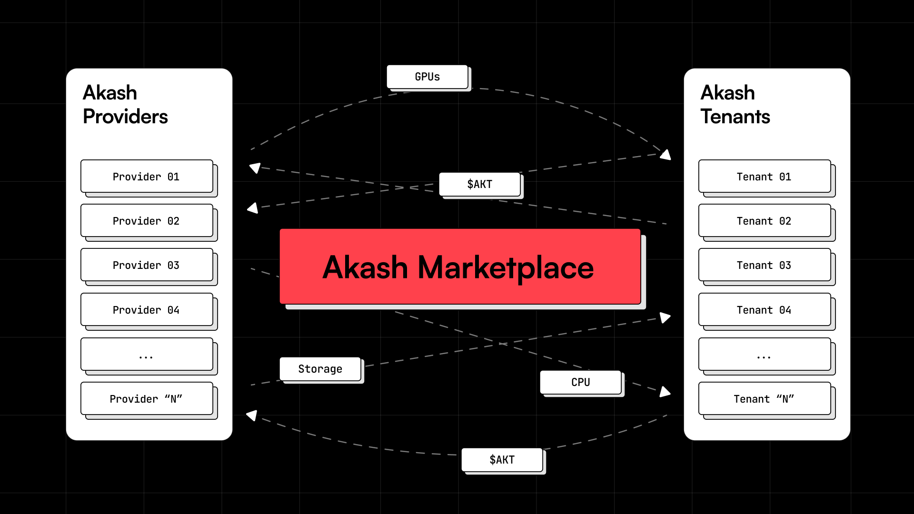

*This is a special guest post from Lachlan Todd, a new community contributor to Akash Network.*

*Lachlan is a freelance technical writer and marketer in the DeFi space. He contributes to projects including Fhenix (FHE), ZeroGravity (parallelized DA), and Babylon (BTC restaking), amongst others. Prior to this, he received his Master's degree in Big Data and began his career as a DeFi Sales Engineer at Stably.*

---

## Introduction

Web2 cloud computing is one of the largest and fastest-growing industries, yet ripe for disruption given a myriad of issues faced. In particular, centralized cloud providers have permissioned servicing, limited resource availability, data lock-ins, and prohibitive costs that can be solved through decentralized computing.

The Akash Network is a decentralized marketplace for cloud computing resources that solves the aforementioned issues plaguing the Web2 computing space. This is already seeing market share captured, but we believe that the transition is in its infancy stages and will only accelerate.

In this article, we will cover:
- The 4 issues of Web2 cloud computing
- The advantages of the Akash Network
- Key barriers to growth

By the end, it will become clear that decentralized computing is poised to gain significant market share from Web2 cloud computing and is an area of blockchain technology worth carefully monitoring.

## Web2 Cloud Computing

Public cloud end-user spending is estimated to reach $679B in 2024, making it one of the largest industries in existence. Amazon Web Services (AWS) alone generated $91B in 2023, and both the increasingly digitized world and the rise of A.I. mean that this space is only likely to continue growing.

Nearly every company uses cloud services in one way or another, including for:
- Data computing
- Data storage
- Databases
- A.I. and Machine Learning
- Internet of Things (IoT)
- Developer tooling

And much more.

That being said there are 4 critical issues at present:

1. **Permissioned Servicing**: Any change to a cloud provider’s Terms & Conditions can lead to an exclusion of users or validators. For example, Hetzner, Ethereum’s 2nd biggest host, laid down rules against crypto operations.
2. **Resource Availability**: Cloud providers may restrict access for more niche or rare computing resources. For example, Nvidia’s H100s, cutting-edge GPUs for A.I. training, often require reserve instances, whereby one must commit to paying upfront and for a minimum period of time. Customers below a monthly spending threshold, or without a longstanding relationship with their provider, may be unable to access these specialized resources at all.
3. **Data Lock-Ins**: Service providers prefer to lock customers into their ecosystems, making it either challenging, costly, or outright impossible to integrate with external cloud providers. Furthermore, the cost to actually export/import large amounts of data between providers, known as ingress/egress costs, is substantial.
4. **Prohibitive Costs**: SaaS companies expend ~50% of their revenue on cloud computing services, significantly hindering their profitability. These costs also extend to blockchain, restricting the number of potential validators and in turn limiting decentralization.

Despite Web2 computing being good “enough”, its Web3 counterpart is gaining fast traction and chipping away at market share. Below we’ll cover how the Akash Network’s decentralized computing alternative has several key advantages that strongly position it for increased adoption, and make it a must-know for those both inside and outside of the space.

## The Advantages of Akash Network

The Akash Network is a decentralized marketplace for cloud computing resources, that can be thought of as an Airbnb-of-sorts.

By connecting parties with excess resources (“Providers”) with those seeking these resources (“Tenants”), these Providers can earn a new source of revenue while Consumers also benefit. Bids are automatically matched with offers, and the network’s AKT token is used for purposes such as staking, governance, transactions, and proper incentivization.

This is significant, as global data centers vastly utilize their computing resources, and those in demand of resources may face various challenges when interacting with centralized firms (which we’ll cover below).

With Akash, any cloud-native application can be deployed without the need to write in a new language, nor be subject to restrictions such as vendor lock-ins. Pricing is discovered through reverse auctions, and those that deploy applications onto Akash set the price and terms of their deployment that are accepted when a winning bid is chosen.

There are significant advantages to this model:

- **Permissionless**: The primary advantage is that anyone may access computing resources. At present, ~65% of Ethereum nodes use AWS, OVH, Google, or Hetzner, which can be concerning if any parties arbitrarily change their policies and conditions. For example, in 2022, Hetzner introduced anti-crypto policies.
- **Resource Availability**: Given the open-source nature of Akash, any type of computing resource, in any geography, can be shared. This contrasts with centralized providers who may not have all computing resources, nor support all geographies.
- **Cost**: Prices are up to 85% lower on the Akash network compared to centralized entities.
- **No Data Lock-ins**: Users can mix and match who they lease resources from and take their data with them as they wish.

Considering that large enterprise companies spend up to 50% of their revenue on public cloud hosting, the Akash Network’s cost-factor alone is enough to warrant serious reconsideration over one’s cloud provider. However, combined with its permissionless nature, extensive resource availability, and no data lock-ins, we believe that it’s a seriously improved business model that will continue to gain fast traction.

## Obstacles to Decentralized Computing Adoption

Despite the above, there remain barriers to adoption that are hindering widespread adoption and can be summarized as below:
- **Poor User Experience**: Web3’s user experience still lags behind Web2’s. It is currently hard for the average person to open a Cosmos-supported wallet such as Keplr or Leap, purchase $AKT tokens, and begin using the Akash Network.
- **Integration Challenges**: Web2’s computing industry is quite mature, and many once-challenging integrations are now simple to handle, while that is not the case for Web3 integrations. For example, certain niche workplace CRMs may have trouble integrating with the Akash Network.
- **Lack of Web3 Developers**: The number of active developers remains very low compared to Web2. There are currently an estimated 23.3K Web3 developers, compared to 28M Web2 developers (0.007%).
- **Lack of Awareness**: Many remain skeptical of blockchain technology and unaware of decentralized computing. Despite increases occurring in bull markets, it is an emerging technology that will take time to spread.

All of the above are also challenges that were faced and overcome by the internet. We believe that the same will occur with Web3, albeit at a faster pace. Decentralized computing is undoubtedly a superior technology in the defined set of ways that were covered in this article, but transitions at such a grand scale naturally take time.

That being said, adoption is accelerating. Akash has now reached 71 active providers and 160 active leases. The main priority has been increasing supply through the onboarding of new providers, and this has been increasing steadily.

## Conclusion

In the above article, we explained the advantages of decentralized cloud computing over Web2 cloud computing.

We believe that the advantages are significant and represent a naturally superior solution, but that true change takes time and that barriers exist. As the industry matures and more enter the space, this will help to accelerate adoption, and the Akash Network will be leading the way. 

To learn more and get started with the network, visit [Akash Network](https://akash.network/) and follow Akash on [X (Twitter)](https://twitter.com/akashnet_).

