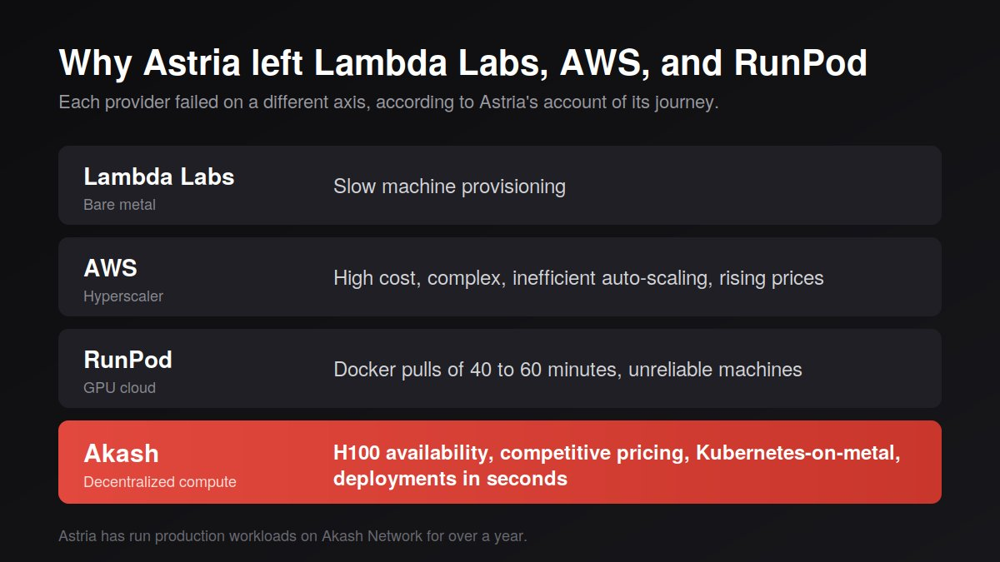

> **TL;DR:** Astria, a generative image platform for fashion e-commerce and AI headshots, runs its full production pipeline — fine-tuning, inference, and a custom upscaling model — on Akash Network after trying Lambda Labs, AWS, and RunPod. Docker pulls that took 40 to 60 minutes on a previous provider now come up in seconds on Akash's pre-cached, Kubernetes-on-metal infrastructure.

<iframe width="100%" height="315" src="https://www.youtube.com/embed/_MKLJcUeuxw" title="Why Astria Moved Its AI Image Workloads to Akash Network" frameborder="0" allow="accelerometer; autoplay; clipboard-write; encrypted-media; gyroscope; picture-in-picture; web-share" referrerpolicy="strict-origin-when-cross-origin" allowfullscreen></iframe>

"Pricing is great, infrastructure is great." That's Astria co-founder Alon Burg on why the company runs its production GPU workloads on Akash Network, after trying Lambda Labs, AWS, and RunPod first.

Astria fine-tunes and runs generative image models at scale for fashion e-commerce and AI headshots. It has been serving production workloads on Akash for over a year: GPU availability, competitive pricing, and the ability to bring Docker images up in seconds instead of an hour all serve to push Akash to be the infrastructure partner to scale alongside [Astria](https://astria.ai).

## Key takeaways

- Astria runs production fine-tuning and inference on Akash for AI headshots, avatars, and e-commerce photoshoots
- H100s and H200s serve Astria's primary workloads, with A100s for cost-efficient processing
- On a previous competitor, Astria reported Docker pulls of 40 to 60 minutes. On Akash, pre-cached images come up in seconds
- Akash pricing let Astria keep high-spend API customers who demand better prices for volume

## What does Astria do?

Founded about four years ago as the first company offering fine-tuning for generative image models, Astria became the go-to provider for training on specific concepts, which powered headshot apps, photoshoot apps, event applications, and photo booths.

In the past six months, Astria pivoted toward AI photoshoots for fashion brands. Reference-image models like Nano Banana reduced the need for fine-tuning, so Astria now aggregates frontier image models behind a collaborative workspace built for photographers and creative directors — the people who traditionally ran shoots in Milan but are now increasingly moving brands into AI production workloads.

Astria also trained its own model to produce super-resolution generations from any given reference; it upscales output while keeping labels, text, and fine details grounded in the real product instead of hallucinating it.

> Generate high-quality, multishot sequences from a single prompt. Complex narrative structures, consistent lighting, and professional camera control are now accessible in one efficient workflow.
>
> Try it now: [astria.ai/prompts](https://astria.ai/prompts)

## What does Astria run on Akash?

Astria runs its full production pipeline on Akash: fine-tuning, inference, and its custom upscaling model. H100s and H200s are used when available to handle the primary workload. A100s were added recently for cost-efficient processing after market price shifts. Astria commits to a reservation baseline capacity for its base workload, then auto-scales with Akash's spot markets as needed for peak traffic.

## How does Akash compare to previous hosts?

Provisioning speed and reliability mattered as much as price. On Akash's Kubernetes-on-metal, Docker images are often pre-cached, so a deployment that took the better part of an hour elsewhere starts in seconds.

## How did Akash pricing affect Astria's business?

Akash pricing let Astria stay competitive in a market where large API customers demand meaningful discounts. When a customer's spend gets big enough, they can credibly threaten to run their own GPU infrastructure and workloads. Competitive compute costs let Astria keep those accounts by offering competitive pricing to long-tail customers.

## What was hard about migrating to decentralized compute?

The hard parts were selecting the right providers, validating network reliability, and configuring quotas so pods weren't evicted. Astria describes the rest as smooth sailing, with responsive support from the Akash team at all hours. Once the kube-config was set up, operations became routine for both research and production.

> Akash has been a tremendous partner and I'm happy to be here with you. The Akash team offers amazing, responsive support at all times of day.
>
> — Alon Burg, Co-Founder, Astria AI

## FAQ

**Why did Astria switch from AWS, Lambda Labs, and RunPod to Akash Network?** Provisioning speed and price. On a previous competitor, Docker pulls took 40 to 60 minutes; on Akash's pre-cached, Kubernetes-on-metal infrastructure, deployments start in seconds, at more competitive pricing than the hyperscalers.

**What GPUs does Astria use for AI image generation on Akash?** H100s and H200s handle Astria's primary fine-tuning and inference workloads, with A100s added for cost-efficient processing after market price shifts.

**Is Akash Network reliable enough for production AI workloads?** Yes. Astria has run its full production pipeline — fine-tuning, inference, and a custom super-resolution model — on Akash for over a year, committing a reservation baseline and auto-scaling on Akash's spot markets for peak traffic.

**Does using Akash Network actually save money on GPU compute?** Yes. Competitive Akash pricing let Astria retain high-spend API customers who could otherwise threaten to run their own GPU infrastructure, while still offering competitive rates to long-tail customers.

**What's difficult about migrating GPU workloads to a decentralized cloud like Akash?** Selecting reliable providers and configuring resource quotas so pods aren't evicted are the main hurdles. Once that setup is done, Astria describes day-to-day operations as routine, backed by responsive Akash support.

