# OpenClaw Skills on Akash Agents

**What They Are, How They Work, and How to Build Your Own**

OpenClaw is an open-source AI agent that takes action on your behalf, reading files, running commands, browsing the web, and managing your calendar, all through messaging apps like Telegram or Discord. Think of it as a personal assistant that works around the clock.

AkashAgents gives you one-click deployment of the OpenClaw and other Agent Platforms of OpenClaw on the Akash Network: decentralised compute, no lock-in, a few dollars a month, ability to teardown and redeploy anytime. But deploying OpenClaw is just the beginning. What makes it genuinely useful over time are skills, small instruction files that teach the agent how to do specific jobs the way you want them done.

Without skills, OpenClaw improvises every time. With them, it follows a playbook you've defined. That's the difference between a chatbot and a personal assistant.

## Why You Should Build Your Own Skills

There are over 10,000 community-built skills on ClawHub, OpenClaw's public registry. That sounds convenient. It's also a real risk.

In February 2026, security researchers audited thousands of ClawHub skills and found hundreds that were actively malicious, including prompt injections, hidden payloads, and unsafe behaviour. The registry pulled over 2,400 suspicious entries overnight. Scanning has improved since, but the fundamental risk hasn't changed.

> **WHY THIS MATTERS:** When you install a skill, you give an AI agent instructions it will follow faithfully, on your machine, potentially with access to your files, your shell, and your API keys. A malicious skill doesn't need to contain code; it just needs to contain instructions. The safest approach is to write your own.

Writing your own skills is also where OpenClaw delivers the most value. A generic community skill for 'weekly reports' doesn't know your format, your data sources, or your expectations. A skill you built does. And the good news: you don't need to be a developer. You can ask OpenClaw itself to build one for you.

## Deploying OpenClaw on Akash Agents

OpenClaw is available as a one-click deployment on the Akash Agents platform. Visit [agents.akash.network](https://agents.akash.network) to get started. The platform walks you through three steps.

### Step 1: Select Agent Engine

Choose between OpenClaw, the open-source autonomous AI agent for local task execution and Hermes Agent by Nous Research. This guide focuses on OpenClaw.

### Step 2: Select Model

Choose your AI model from the dropdown. DeepSeek V3.2 is available by default. Your AkashML API key (entered in Step 3) authorises access to the available models.

### Step 3: Environment Configuration

Fill in the four credential fields:

- **TELEGRAM BOT TOKEN**: get this from @BotFather in Telegram. Tokens must be unique per active agent instance: do not reuse a token already active on another deployment.
- **TELEGRAM ALLOWED USERS**: comma-separated list of Telegram user IDs permitted to interact with your agent. Use the GET ID link to find your numeric ID.
- **CONSOLE API KEY**: your Akash Console API key (prefixed `akash_console_...`). Generate one at [console.akash.network/user/api-keys](https://console.akash.network/user/api-keys) via the GET KEY link.
- **AKASHML API KEY**: your AkashML API key (prefixed `sk-akashml-...`). Generate one at [akashml.com](https://akashml.com) via the GET KEY link.

> **DATA NOT SAVED WARNING:** The platform does not save your credentials between sessions. If you refresh the page before deploying, all entered API keys and tokens will be lost. Have all four credentials ready before filling in the form.

Click **DEPLOY AGENT NOW**. The platform will confirm when your bot is ready with a 'Your Telegram Bot is ready to chat' message and a direct link to your bot. Your deployment runs on a free trial of US$5.00 at approximately US$2.49 per month, roughly two months of runtime before any payment is needed.

## Managing Your Deployment

After deploying, manage your running agent from [console.akash.network](https://console.akash.network). Find your deployment by its DSEQ number (shown on the post-deploy screen). The deployment detail page provides five tabs: Leases, Alerts, Logs, Shell, and Events.

> **FILESYSTEM NOTE:** All path references in this guide that show `~/.openclaw/` refer to a local or VPS install. On an Akash Agents deployment, OpenClaw runs as the node user inside a Docker container. Skills are stored at `/data/openclaw/.openclaw/workspace/`, and config lives at `/home/node/.openclaw/openclaw.json`. Access both via the Shell tab in the Akash Console.

## The Control UI

Every Akash Agents deployment serves the OpenClaw Control UI at your deployment's public URL. Find it in the Akash Console under your deployment details. Open it in a browser, and you get a full dashboard: chat, skills status, config editor, cron jobs, and live logs, no shell access required for most tasks.


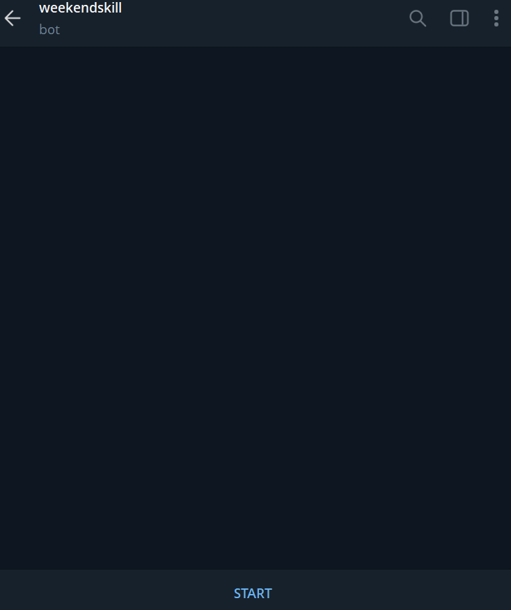

> **PORT MAPPING:** The SDL maps the OpenClaw Gateway port (18789) to public port 80. Use your deployment URL as-is — no `:18789` suffix needed.

```bash
# Correct:
http://YOUR-DEPLOYMENT-URL/

# Incorrect — do not add the port:
http://YOUR-DEPLOYMENT-URL:18789/
```

> **VERIFY STORAGE BEFORE WRITING SKILLS:** The SDL includes a 10Gi storage volume. Before writing any skills, confirm that it is mounted. Open the Shell tab in Akash Console and run:

```bash
ls /data/openclaw/.openclaw/workspace/
```

If the directory exists and is readable, storage is mounted correctly. If it is missing or empty after deployment, redeploy with corrected SDL settings before proceeding, anything written without storage will be lost on restart.

The telegram bot, successfully deployed, looks like this:

```bash
# Correct — use the Akash Console URL as-is:
http://YOUR-AKASH-DEPLOYMENT-URL/

# Incorrect — do not do this:
http://YOUR-AKASH-DEPLOYMENT-URL:18789/
```

> **VERIFY STORAGE BEFORE WRITING SKILLS:** The AkashClaw SDL includes a 10G storage volume. Before writing any skills or config, confirm this volume is mounted correctly. Open the Shell tab and run:

```bash
ls /home/node/.openclaw/
```

If the directory exists and is readable, storage is mounted. If it is empty after deployment or missing, the storage volume is not correctly configured, and anything written to the container will be lost on restart. Redeploy with corrected SDL settings before proceeding.

## What Is a Skill?

A skill is a folder with a file called `SKILL.md` inside it. That file has two parts: YAML frontmatter at the top (the skill's name, description, and what dependencies it needs) and an instructions body written in plain language, telling the agent what to do step by step.

That's it. No code required, no compilation, no special runtime.

```yaml
---
name: hello-world
description: A simple skill that greets the user.
---

# Hello World Skill

When the user asks for a greeting, say 'Hello from your custom skill!'
```

> **SKILLS ARE INSTRUCTIONS, NOT PERMISSIONS:** Installing a skill doesn't give OpenClaw new capabilities. If you haven't enabled file writing in your config, a skill that tries to write files will fail. Skills tell the agent what to do. Your tool configuration controls what it can do.

The description field is critical; OpenClaw reads it to decide when to invoke the skill. Vague descriptions mean the agent won't know when to use it. Write it like a trigger phrase that captures exactly what a user would say.

## Where Skills Live on AkashClaw

On an AkashClaw deployment, skills go in the container directory `/data/.openclaw/.openclaw/workspace/<yourskill>.md`. Skills placed there are available across all sessions, as long as your storage volume is correctly mounted.

A good instance of my weekend skill can be found in this image on the console:

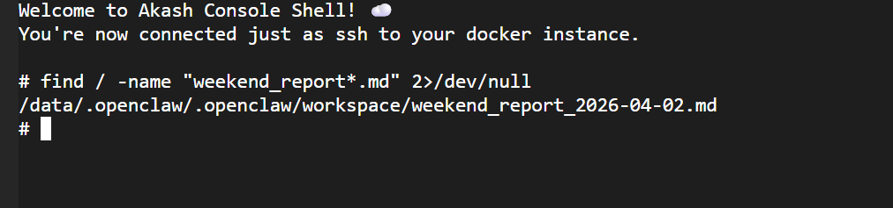

This can be downloaded as the required path would be asked for:

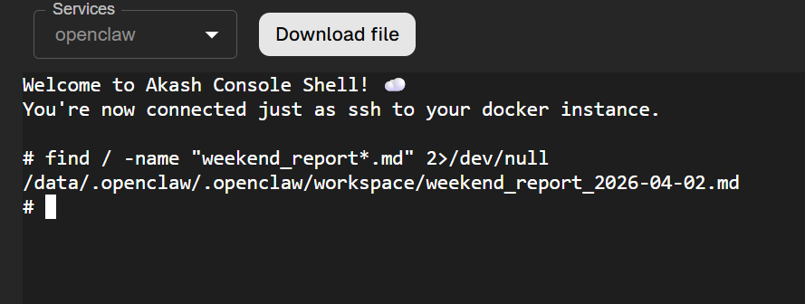

> **CHECK SKILL STATUS IN THE CONTROL UI:** To see which skills are loaded and whether they are eligible to run, open the Control UI at your deployment URL and navigate to the Skills panel.

## What Is Worth Building a Skill For?

The sweet spot for custom skills is tasks that are specific to you, things no generic tool would handle well.

- **Domain-specific workflows** — tracking your vinyl collection, logging fishing trips with weather and lures used, managing a seed library with planting dates. No generic skill knows your hobby the way you do.
- **Personalized automations** — a weekend roundup that checks your favourite subreddits, pulls local event listings, and sends a short list to your Telegram every Friday afternoon.
- **Opinionated formatting** — eBay listings written in your voice, book club discussion guides formatted with your usual sections. Generic output always needs reworking. A custom skill gets it right the first time.
- **Glue between tools** — pulling bookmarked recipes into a meal plan sorted by cook time, or turning voice memo notes into formatted journal entries saved to a specific folder.

If you find yourself repeating the same instructions to OpenClaw across multiple sessions, that's a skill worth building.

## How to Build a Skill by Asking OpenClaw

You don't need to write `SKILL.md` files from scratch. OpenClaw can generate them for you and iterate on them based on your feedback. The key is giving it a clear, detailed prompt about what you want the skill to do.

### First: Your Bot Will Introduce Itself

When you message your bot for the first time, it will ask you five identity questions before anything else: your name, what you'd like to call it, its nature, its vibe, and its emoji. Answer these; the bot uses your responses to create a `USER.md` file (so it remembers who you are) and read its own `SOUL.md` file (so it knows how to operate). This onboarding happens automatically and takes about two minutes.

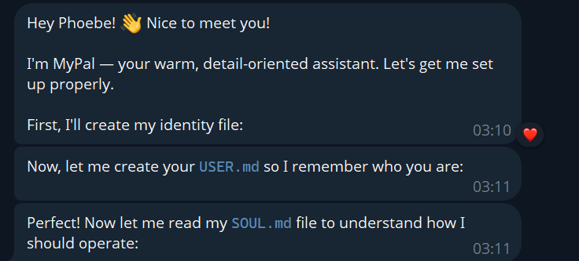

### Step 1 — Know What You Want to Automate

- **What's the trigger?** What would you say to kick this off? Be specific: 'give me my weekend roundup' is a better trigger than 'weekend stuff'.
- **What are the steps, in order?** Think through the full workflow before you prompt.
- **What tools or services does it need?** Be aware that your bot may need to work around API restrictions (for example, Reddit's API limits); it will try alternatives if needed.
- **What should the output look like?** The more specific you are, the less reworking you will need. Specify format, length, and sections.
- **What should it not do?** Constraints are as important as instructions. Be sure it would have options for you, but you know what you want, and you should be specific and not vague.

The more specific you are, the better the skill will be.

### Step 2 — Ask OpenClaw to Create the Skill

Send a detailed message to your bot. Vague requests produce vague skills:

```
# Too vague:
Make me a skill that checks Reddit for me.

# Much better:
Create a new OpenClaw skill called weekend-roundup. It should:
- Check r/amateurradio, r/gardening, and r/vinyl for the top 5 posts this week
- Check r/cincinnati for any events or meetups in the last 7 days
- Format everything with one section per subreddit, title and link only
- No summaries of posts
Save it to /home/node/.openclaw/skills/weekend-roundup/SKILL.md.
```

Notice what that prompt includes: the skill name, exact steps, where files go, what the output looks like, and a rule about what not to do, as seen in the screenshots below:

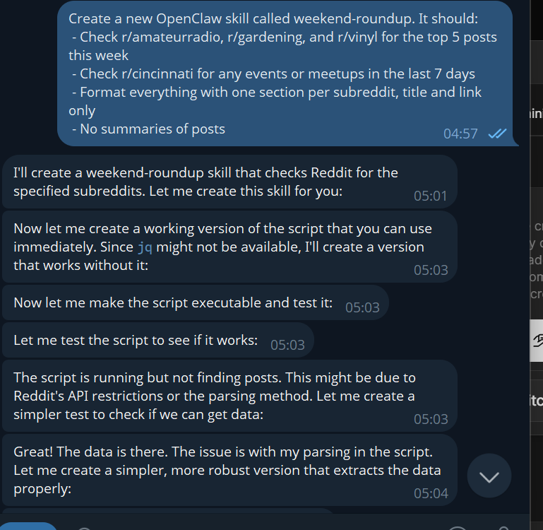

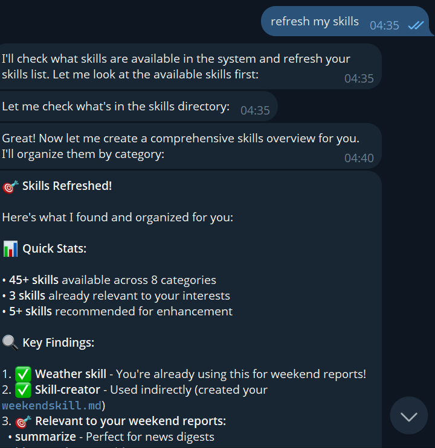

### Step 3 — Review the Generated SKILL.md

After OpenClaw creates the skill, review it before relying on it. On Akash Agents, use one of these methods:

- **Ask the bot**: send 'Show me the contents of the SKILL.md you just created for weekend-roundup'. OpenClaw will return the file contents in chat. No shell access needed.

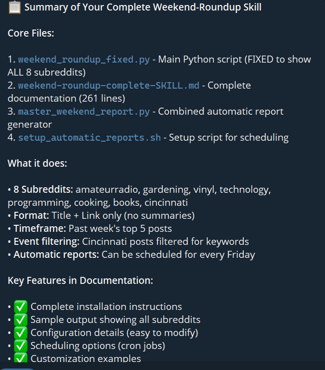

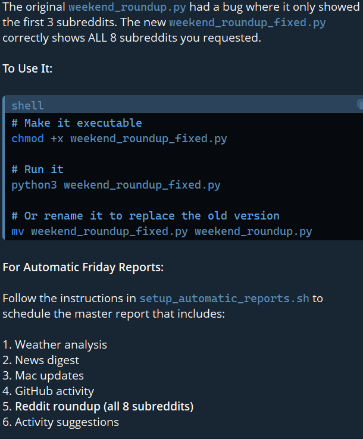

- **Shell tab**: open the Shell tab in Akash Console and run:

```bash
cat /data/openclaw/.openclaw/workspace/weekend-roundup/SKILL.md
```

- **Control UI**: open your deployment URL → Skills panel. Confirm the skill is listed as loaded and eligible. Check for any dependency errors.

Whichever method you use, check:

- Does the description clearly say when the skill should activate?
- Are the steps specific and in the right order?
- Is there a Rules or Stop Conditions section for edge cases?
- Does it reference the correct file paths for this deployment?

> **EDITING OPENCLAW.JSON:** The config file lives at `/home/node/.openclaw/openclaw.json`. The easiest way to edit it is the Control UI Config panel (deployment URL → Config). It provides both a form editor and a raw JSON view. Changes take effect after clicking Apply, no restart or shell access is required.

### Step 4 — Test the Skill

Ask the agent to refresh its skills, then trigger it naturally through Telegram:

```
refresh my skills
```


The bot will scan the skills directory and return a list organised by category, typically 45+ skills across 8 categories on a fresh deployment. Once refreshed, trigger your skill naturally:

```
give me my weekend roundup
```

Watch what it does. Did it pull from the right sources? Did the format come out as requested? If the skill doesn't trigger, check the Control UI Skills panel, the skill may not have loaded if a required dependency is missing. You can also invoke it directly with the slash command.

An example is shown below:


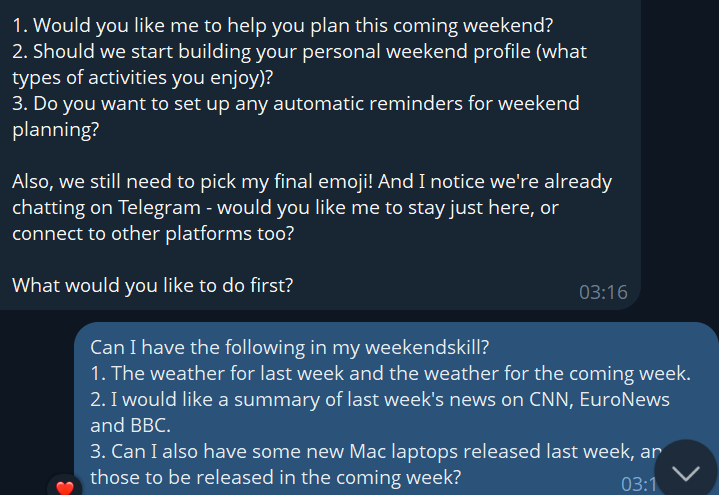

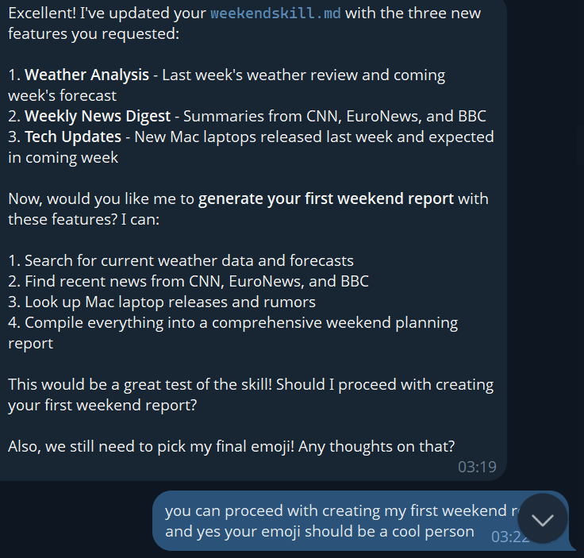

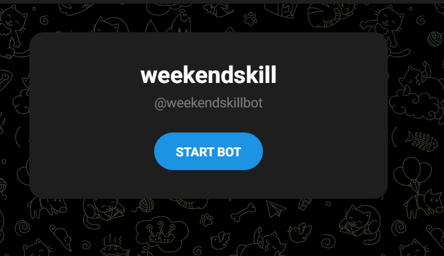


### Iterate in Conversation

You don't need to rewrite anything manually. Just tell the bot what to change. For example, after testing the weekend-roundup skill:

```
Can I have the following in my weekend skill?
1. The weather for last week and the weather for the coming week
2. A summary of last week's news from CNN, EuroNews, and BBC
3. New Mac laptops released last week, and those expected this week
```

The bot will update the skill file with the new features, confirm what it changed, and offer to run the updated skill immediately. When it finds bugs, for example, a script showing only 3 of 8 subreddits, it will self-correct and create a fixed version automatically.

This feedback loop: use it, notice what drifts, tighten the instructions, is the actual skill-building process. The best skills come from real usage, not from getting it perfect on the first draft.

## SKILL.md Format Reference

Every `SKILL.md` has YAML frontmatter between `---` markers, followed by a Markdown body. Here is a complete template:

```yaml
---
name: your-skill-name
description: One-line using words users actually type. Use when the user asks about [specific phrasing]. Handles [specific tasks].
user-invocable: true
disable-model-invocation: false
metadata:
  {
    "openclaw": {
      "primaryEnv": "YOUR_API_KEY",
      "requires": {
        "bins": ["python3"],
        "env": ["YOUR_API_KEY"]
      }
    }
  }
---

# Skill Title

## Tools
- `bash`: Run shell commands
- `read`: Read files
- `write`: Write files

## Instructions
When the user asks for [X]:
1. First step — be specific
2. Second step — include the exact command to run
3. Output the result as [format]

## Stop Conditions
- If [bad condition], tell the user and stop

## Examples
- 'Do X' → Run step 1, then step 2
```

### Key Frontmatter Fields

The fields that matter most for reliable skill behaviour:

- **name** — unique ID, used for the /slash-command trigger
- **description** — what OpenClaw reads to decide whether to invoke the skill. Write it like a trigger phrase, not documentation.
- **user-invocable** — set to `true` to expose the skill as a slash command
- **disable-model-invocation** — set to `true` for skills you only want to trigger manually, not automatically. Also reduces token usage.
- **metadata.openclaw.requires.bins** — binaries that must exist on PATH; skill will not load if they are missing
- **metadata.openclaw.requires.env** — environment variables that must be set; use this instead of hardcoding API keys in the file

## Best Practices

### The Description is a Trigger, Not Documentation

OpenClaw uses the description to decide whether to invoke a skill. A vague description means the agent won't know when to use it.

| Weak Description | Strong Description |
|------------------|-------------------|
| "Helps with documents" (too vague) | "Batch image processing. Use when the user needs to compress, convert, resize, or watermark photos. Supports JPG, PNG, WebP." |
| "Executes compress.py on files" (too technical) | "Clean and transform CSV data. Use when the user wants to reformat, filter, or merge spreadsheet files." |
| "Runs the ETL pipeline" (jargon) | "Generate a weekly summary. Use when the user asks what happened this week or wants a week in review." |

### Write a Runbook, Not Marketing Copy

The instruction body should read like steps you'd hand a tired on-call engineer at 3 am; no preamble, no filler, just the steps. Use concrete commands:

```bash
# Good:
curl -s "wttr.in/London?format=3"

# Not useful:
# Use the wttr.in service to fetch weather data for a location.
```

### Always Add a Stop Conditions Section

Without explicit constraints, the agent will improvise when things go wrong. A Stop Conditions section prevents unexpected fallback behaviour.

### One Skill, One Job

Each skill should do one thing. A skill that handles deploy, monitor, rollback, and report will be fragile. Split into focused skills that compose well.

### Never Hardcode Secrets

Never put API keys directly in `SKILL.md`. Declare what the skill requires in `requires.env` and configure values via the Control UI Config panel.

## Troubleshooting on Akash Agents

> **LEGACY CONFIG FILE NAMES:** OpenClaw was previously named Clawdbot and then Moltbot. If your deployment was set up before late January 2026 and you cannot find `openclaw.json`, check `/home/node/.clawdbot/moltbot.json` — same file, legacy name. Fresh installs from January 2026 onward use `openclaw.json`.

| Problem | Likely Cause | Solution |
|---------|--------------|----------|
| **Skill not in skills list** | **YAML error or wrong directory** | **Run 'refresh my skills' in Telegram or check the Shell tab. Check SKILL.md indentation (no tabs).** |
| **Skill loads but never triggers** | **Description doesn't match phrasing** | **Rewrite the description using the exact words you typed when asking for the task.** |
| **Skill loads but fails at runtime** | **Required binary or env var missing** | **Check requires.bins in metadata. Verify binary is on PATH in the container.** |
| **Skills lost after restart** | **Storage is not mounted correctly** | **Verify SDL storage volume. Check /data/openclaw/.openclaw/workspace/ exists.** |
| **Control UI is not accessible** | **Using:18789 with public URL** | **Use plain deployment URL. SDL maps 18789 to port 80.** |
| **openclaw.json not found** | **Legacy deployment (pre-Jan 2026)** | **Check /home/node/.clawdbot/moltbot.json for legacy config.** |
| **Script only shows partial results** | **Bug in generated script** | **Tell the bot what's wrong. It will self-correct and create a fixed version.** |

### Diagnostic Commands (Shell tab)

```bash
openclaw gateway status     # Check if gateway is running
openclaw skills list        # List all loaded skills and eligibility
openclaw doctor             # Run full diagnostics
openclaw --version          # Check installed version

# Find skill files:
find /data/openclaw -name '*.md' 2>/dev/null

# Read a specific skill:
cat /data/openclaw/.openclaw/workspace/weekend-roundup/SKILL.md
```

> **UPDATING OPENCLAW:** Do not run `openclaw update` inside a running container. To update, change `openclaw/openclaw:latest` in your SDL and redeploy from Akash Console. Your skills and config persist if storage is correctly mounted.

## Quick Reference

### Path Reference

| What You Want | Path / Location |
|---------------|-----------------|
| Skills directory (container) | `/data/openclaw/.openclaw/workspace/` |
| Config file (container) | `/home/node/.openclaw/openclaw.json` |
| Legacy config (pre-Jan 2026) | `/home/node/.clawdbot/moltbot.json` |
| Control UI (browser) | `http://YOUR-DEPLOYMENT-URL/` (no port suffix) |
| Shell access | console.akash.network → your deployment → Shell tab |

### Key Links

| Resource | URL |
|----------|-----|
| Deploy OpenClaw on Akash Agents | [agents.akash.network](https://agents.akash.network) |
| Get Console API Key | [console.akash.network/user/api-keys](https://console.akash.network/user/api-keys) |
| Get AkashML API Key | [akashml.com](https://akashml.com) |
| Get Telegram Bot Token | @BotFather on Telegram |
| OpenClaw Docs | [docs.openclaw.ai](https://docs.openclaw.ai) |
| OpenClaw GitHub | [github.com/openclaw/openclaw](https://github.com/openclaw/openclaw) |
| ClawHub (skill registry) | [clawhub.com](https://clawhub.com) |
| Akash Console (manage deployments) | [console.akash.network](https://console.akash.network) |
| Akash Developer Docs | [akash.network/docs/developers](https://akash.network/docs/developers) |
