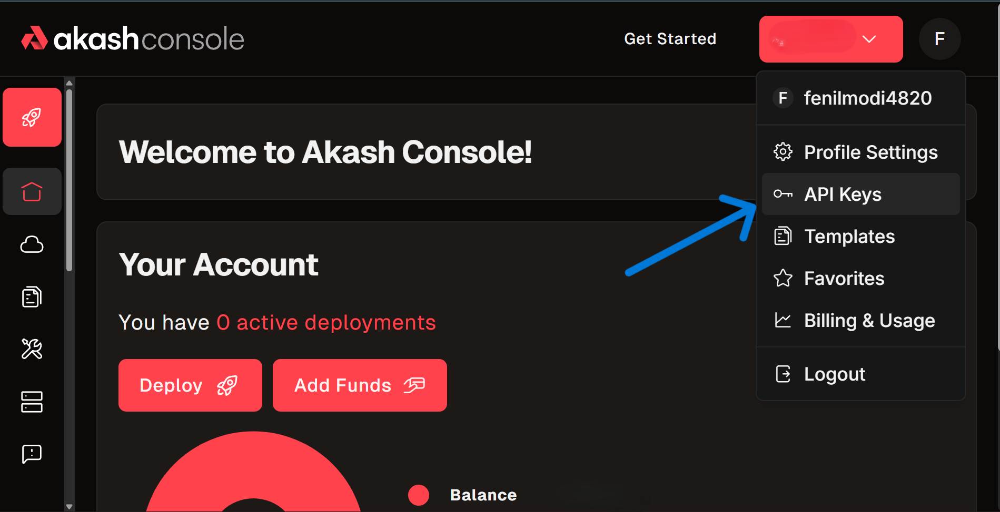
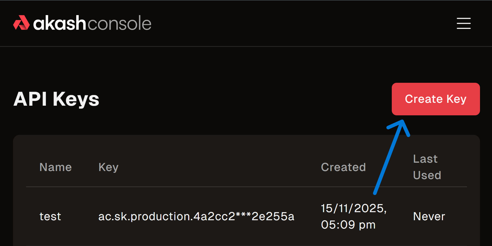

# Console API

> _**PLEASE NOTE**_ - The Console API for Managed Account users is currently in active development. This documentation will be updated frequently as new features are released. Check the [Swagger documentation](https://console-api.akash.network/v1/swagger) for the most up-to-date API specification.


The Console API provides programmatic access to deploy and manage applications on Akash Network. Deploy containerized applications and manage their lifecycle using simple REST API calls—no blockchain knowledge required.

**Use cases**: Automate deployments, integrate CI/CD pipelines, and bypass complex blockchain operations.

## Prerequisites

Before you begin, ensure you have:

1.  **Create an Account**: Sign up at [console.akash.network](https://console.akash.network). If you haven't already, start a **free trial** to explore the platform.
2.  **Fund Your Account**: Ensure you have at least **$5 USD** in your account balance. You can add funds via credit card in the Console. [Learn more](/docs/getting-started/billing-and-credits)
3.  **Prepare Your Tools**:
    *   Have your **SDL** (Stack Definition Language) file ready.
    *   Have an API client ready (e.g., `curl`, Postman, or a script in Python/Node.js).

## API Key Setup

### Creating Your API Key

1. Log in to your account at [console.akash.network](https://console.akash.network/).
2. Hover over your profile icon in the top-right corner and select **API Keys**.
3. Click **Create API Key**, provide a name, and click **Create**.
4. Copy your API key and store it securely — the key is shown only once and is used in the Authorization header as a Bearer token.



5. From the API Keys page you can view, revoke, or delete keys.
6. Click **Create Key**, give it a name, and click `Create`. Store the key securely.

> _**WARNING**_ - Copy and save your API key immediately. It will only be shown once and cannot be retrieved later.



### Use the Key

Include the key in the `x-api-key` header of your requests:

```bash
x-api-key: YOUR_API_KEY
```

## API Reference

For detailed endpoint documentation, request schemas, and response types, please refer to our interactive Swagger documentation:

**[Console API Swagger UI](https://console-api.akash.network/v1/swagger)**

*   **[Examples](/docs/deployments/console-api/examples)**: Deploy your first "Hello World" app and see code examples (TypeScript, Python, cURL).
*   **[Deployment Lifecycle](/docs/deployments/console-api/deployment-lifecycle)**: Step-by-step guides for the complete deployment lifecycle.

## Troubleshooting

#### 401 Unauthorized
**Cause**: Missing or invalid API key.
**Solution**:
*   Ensure `x-api-key` header is present.
*   Verify the key matches exactly what was generated.
*   Check if the key has been revoked in the Console.

#### 403 Forbidden
**Cause**: Valid key, but insufficient permissions or funds.
**Solution**:
*   **Check Balance**: Ensure your account has at least $5 USD.
*   **Payment Method**: Verify "USD Payments" is enabled in Console Settings.
*   **Account Type**: Ensure you are using a Managed Account, not a connected Keplr/Leap wallet.

#### Can’t Find API Keys Option?
**Problem**: API Keys menu option is not visible in the profile dropdown.
**Solutions**:
*   Ensure you’re logged into account at [console.akash.network](https://console.akash.network).
*   API Keys are not available for standard Keplr/Leap connections.
*   Verify you have selected **USD Payments** as your payment method in Settings.
*   If the issue persists, contact support on Discord.

#### Can’t Create API Key?
**Problem**: Create API Key button is disabled or returns an error.
**Solutions**:
*   Ensure your account has a valid payment method configured in Settings.
*   Verify your account balance is at least **$5 USD**.
*   Check that **USD Payments** is enabled in Console Settings.
*   Try refreshing the page or clearing your browser cache.
*   If the problem continues, reach out on Discord.
