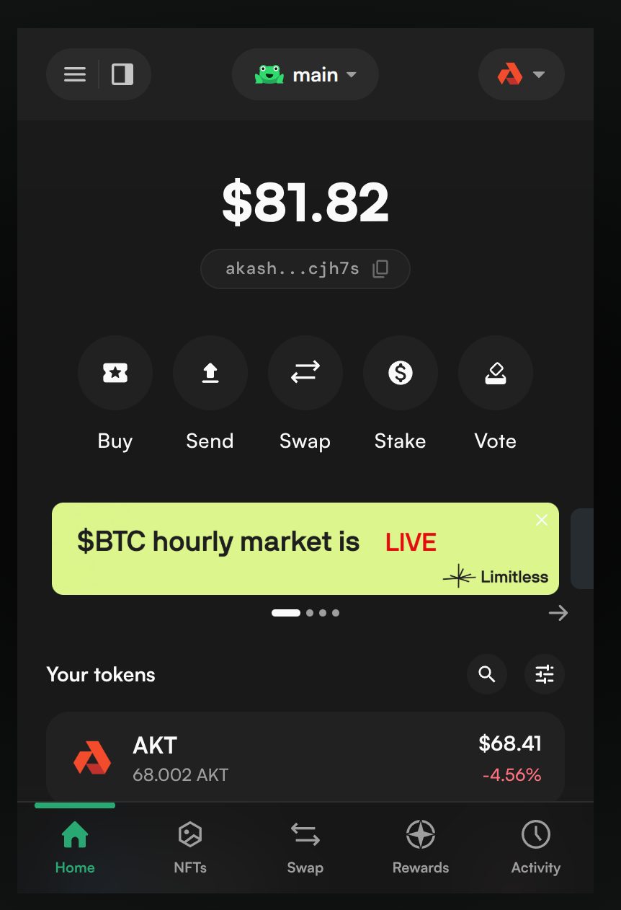
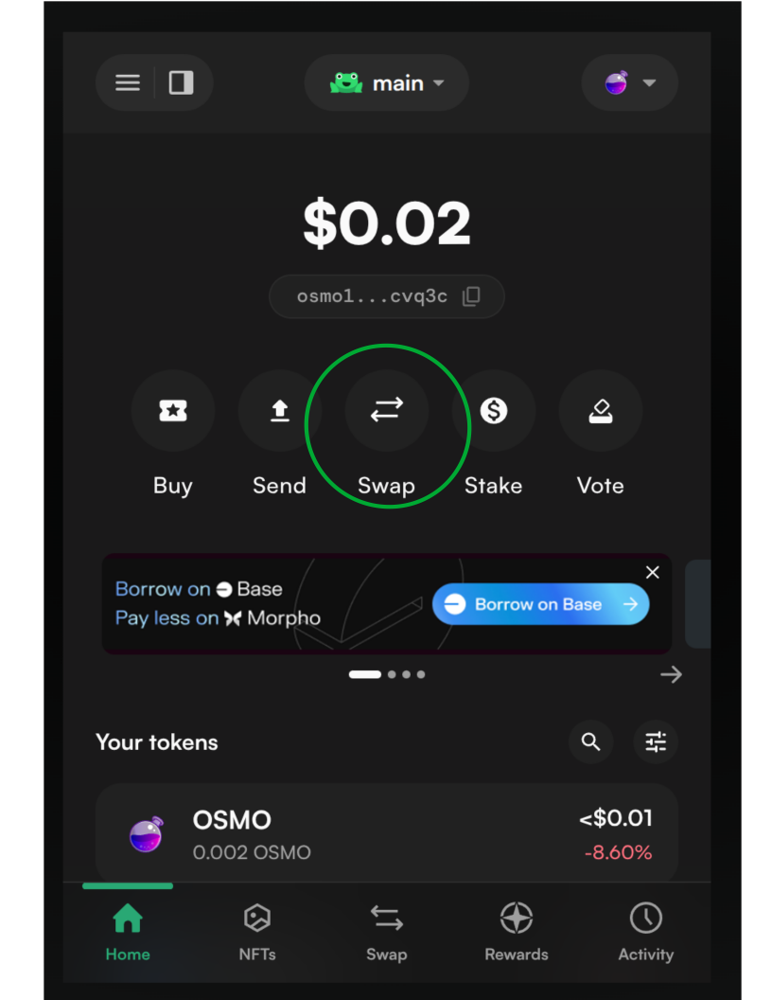
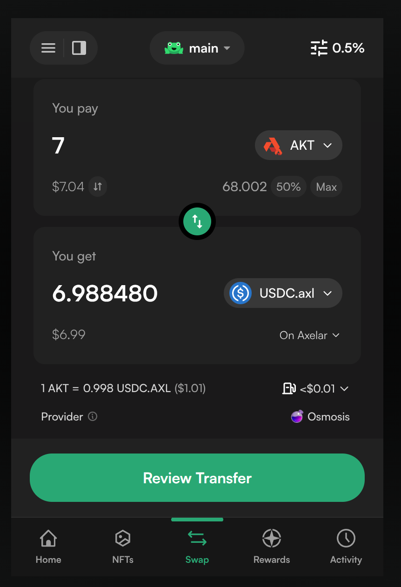
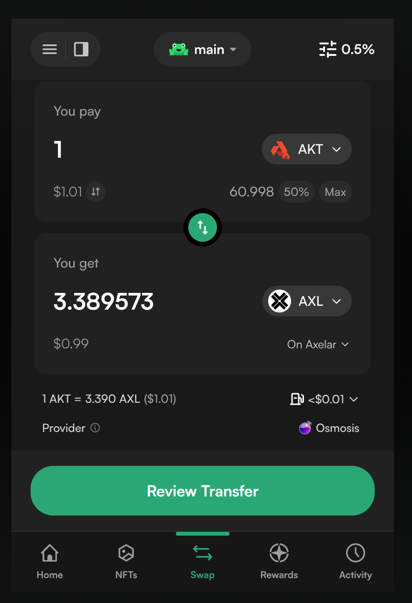
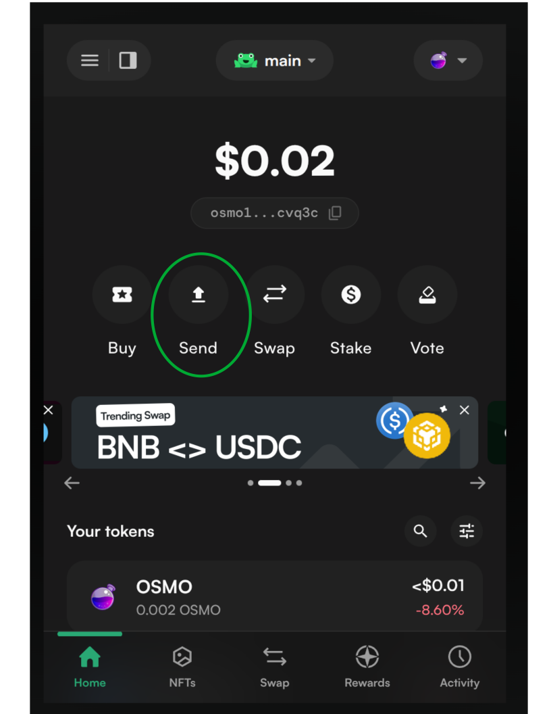
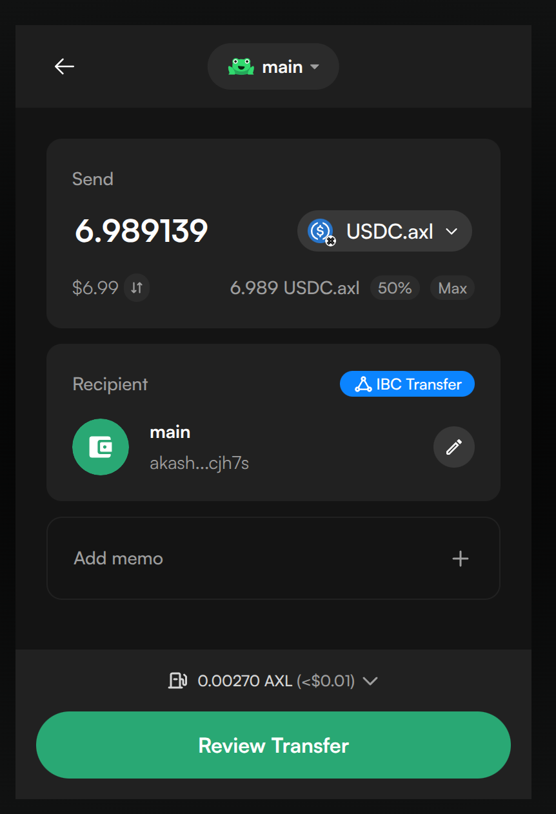
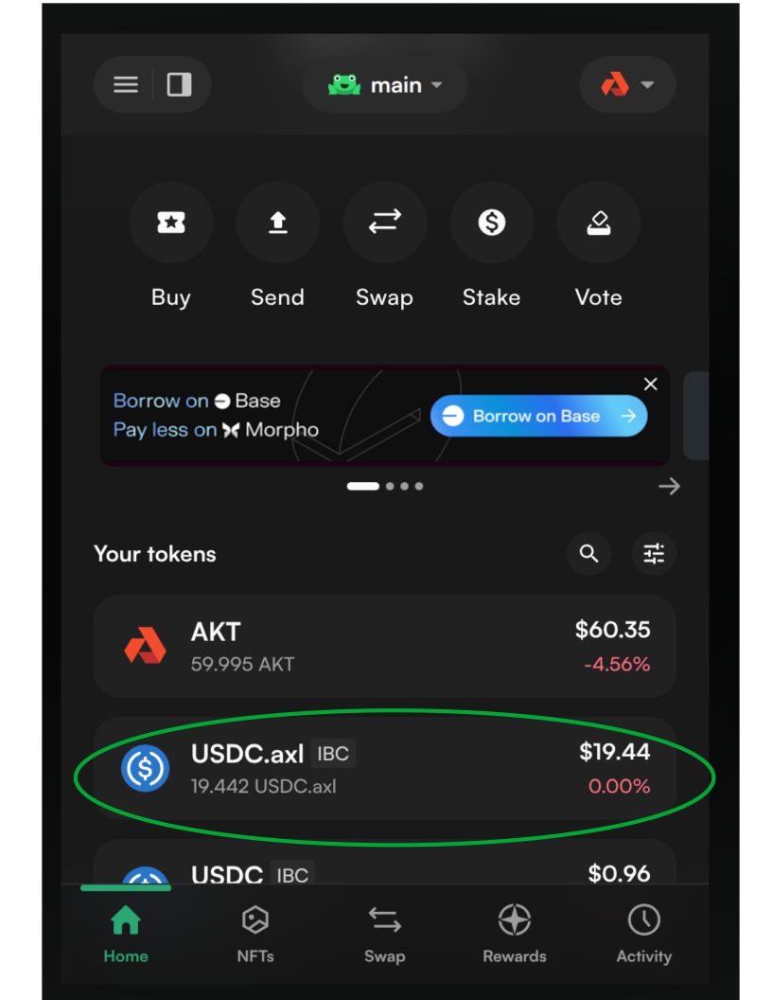

Akash deployments can be funded using our native crypto currency (AKT) or through stable coins.

In this guide we will review:

- [Methods to Transfer USDC onto Akash for Stable Payments](#methods-to-transfer-usdc-onto-akash-for-stable-payments)
- [Akash Deployment Creation using Stable Payments](#akash-deployment-creation-using-stable-payments)

### Currently Supported Stable Coins

- Axelar USDC (USDC.axl)

## Transfer USDC onto Akash using Leap Wallet

### Section Overview

In this section we will detail methods to transfer Axelar USDC into your Akash account for funding of deployments using stable payments.

### Leap Wallet

We find that using Leap Wallet to be the simplest method of transferring Axelar USDC into the Akash network and associated accounts as no manual specification of the IBC is necessary.

In the steps that follow we will swap Akash AKT for Axelar USDC. You can use any tokens that are swappable on the Osmosis DEX to get Axelar USDC but in this guide we assume you have some AKT on Akash.

This involves two steps:

- Swapping AKT for USDC.axl
- Performing an Inter-Blockchain (IBC) transfer of the USDC.axl into Akash

#### Install Leap Wallet Browser Plug In

- Follow the instructions provided by Leap Wallet to install the appropriate web browser plug in [here](https://www.leapwallet.io/download).

### Transfer of USDC.axl onto Akash

#### STEP 1 - Open Leap Wallet Browser Plug In

- Open your Leap Wallet browser extension
- Select Akash from the network selection drop down on the top right as shown.
- Confirm that you have some AKT available.



#### STEP 2 - Swap the AKT for USDC.axl

- Select the Swap option within Leap Wallet as shown below



- The selection of the Swap option in the prior step will open the swap interface within the browser extension.
- Make the selections as indicated, swapping from `AKT` to `USDC.axl` on `Axelar` then complete the swap.



#### STEP 3 - Complete the IBC Transfer of USDC.axl into Akash

- With the Swap now completed in the previous step, we need to transfer the `USDC.axl` from the Axelar network into Akash.
- For this we need some `AXL` on Axelar for gas fees. If you don't have any `AXL`, you can swap some of the `AKT` for `AXL` as shown below.
- Make sure to select `AXL` on the `Axelar` network as the destination.



- Next, select the `Send` option as depicted below to initiate transfer of `USDC.axl` into Akash.



- Select the `USDC.axl` token on Axelar as the token to send.
- For the recipient, paste in your Akash wallet address, or click the contacts icon select Your Wallets > Wallet name > Akash.
- The wallet should automatically detect an IBC transfer as shown below.



- Review and complete the transfer.

### Verify IBC Transfer and Availability of USDC on Akash Network

- Going back to the home section of the leap wallet extension and selecting Akash as the network from the dropdown, you should be able
to see your `USDC.axl` balance as below.



- USDC balances can also be verified with the Akash CLI as follows:

_**CLI Verification/Command Template**_

```
provider-services query bank balances <akash-address>
```

_**Expected/Example Output**_

- Note the appearance and balance of denom `ibc/170C677610AC31DF0904FFE09CD3B5C657492170E7E52372E48756B71E56F2F1`
- This denom represents available Axelar USDC and indicates availability of stable payment funds to utilize for Akash deployments

```
provider-services query bank balances akash1w3k6qpr4uz44py4z68chfrl7ltpxwtkngnc6xk

balances:
- amount: "19442338"
  denom: ibc/170C677610AC31DF0904FFE09CD3B5C657492170E7E52372E48756B71E56F2F1
- amount: "59994563"
  denom: uakt
pagination:
  next_key: null
  total: "0"
```

## Akash Deployment Creation using Stable Payments

In this section we will cover using the following clients to create an Akash deployment using Stable Payments.

> NOTE - when creating an Akash deployment using Stable Payment - ensure that the SDL pricing section reflects the correct denomination as covered [here](/docs/getting-started/stack-definition-language#stable-payment).

- [Akash Console](#akash-console-stable-payment-use)
- [Akash CLI](#akash-cli-stable-payment-use)

### Akash Console Stable Payment Use

- When using Akash Console no change is necessary in the deployment creation when using Stable Payments.
- When the associated SDL uses the USDC denomination, Akash Console will create the deployment with Stable Payment.
- An indication that Stable Payments are being used in the deployment creation is provided in the `Deployment Deposit` dialog box as shown below.


### Akash CLI Stable Payment Use

- When creating a deployment via the Akash CLI, all steps in the typical deployment creation steps (as covered [here](/docs/deployments/akash-cli/installation/)) remain applicable and valid with the only edit in such steps being this syntax in the `deployment create` step.
- As shown in this Stable Payment relevant `deployment create` command we must specify the `deposit` switch as the USDC denomination.

#### Create Deployment Command for USDC Stable Payment Use

```
provider-services tx deployment create deploy.yml --from $AKASH_KEY_NAME --deposit=5000000ibc/170C677610AC31DF0904FFE09CD3B5C657492170E7E52372E48756B71E56F2F1
```
