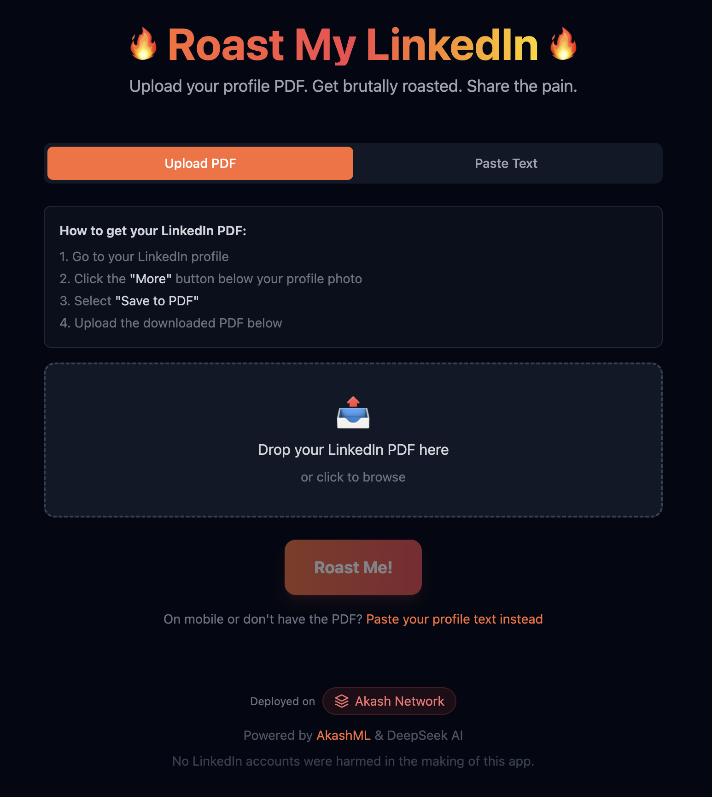

# Build a LinkedIn Profile Roaster with AkashML

In this tutorial, you'll build a fun web application that generates AI-powered roasts of LinkedIn profiles. Users can upload their LinkedIn PDF or paste their profile text, and the app will deliver a savage (but clever) roast of their corporate jargon and buzzwords.

**What you'll learn:**
- How to integrate AkashML's API with DeepSeek-V3
- Using AI to extract structured data from unstructured text
- Client-side PDF parsing with pdf.js
- Deploying static sites to Akash Network with Build & Deploy

**Source Code:** [github.com/baktun14/linkedin-roast](https://github.com/baktun14/linkedin-roast)




## Architecture Overview

This app runs entirely in the browser - no backend server required. This makes deployment simple and keeps costs low.

```
┌─────────────────────────────────────────────────────┐
│                    Browser                          │
│  ┌─────────────┐  ┌─────────────┐  ┌─────────────┐ │
│  │   pdf.js    │→ │   AkashML   │→ │   AkashML   │ │
│  │  (parsing)  │  │ (extraction)│  │   (roast)   │ │
│  └─────────────┘  └─────────────┘  └─────────────┘ │
└─────────────────────────────────────────────────────┘
                          ↓
              ┌───────────────────────┐
              │   api.akashml.com     │
              │   (DeepSeek-V3.2)     │
              └───────────────────────┘
```

## Tech Stack

- **Frontend:** React + TypeScript + Vite
- **Styling:** Tailwind CSS
- **AI:** [AkashML](https://akashml.com) (DeepSeek-V3.2)
- **PDF Parsing:** [pdfjs-dist](https://mozilla.github.io/pdf.js/) (client-side)
- **Deployment:** Akash Network (Build & Deploy)

---

## Prerequisites

Before starting, make sure you have:

1. **Bun v1.0+** or Node.js installed
2. **AkashML API Key** - Get one at [akashml.com](https://akashml.com)
3. Basic knowledge of React and TypeScript

---

## Step 1: Project Setup

```bash
# Clone the repository
git clone https://github.com/baktun14/linkedin-roast.git
cd linkedin-roast

# Install dependencies
bun install

# Set up environment
cp .env.example .env
# Add your AkashML API key to .env

# Start dev server
bun run dev:frontend
```

### Environment Variables

```env
VITE_AKASHML_API_KEY=your-api-key-here
```

> **Security Notice:** The `VITE_` prefix means the API key is bundled into the frontend JavaScript and visible to users. This is acceptable for demos or keys with usage limits. For production apps with sensitive keys, consider a backend proxy.

---

## Step 2: Integrating AkashML

AkashML provides an OpenAI-compatible API, making integration straightforward. The app makes two AI calls:

1. **Profile Extraction** - Parse structured data from PDF text (low temperature)
2. **Roast Generation** - Create a witty roast (high temperature)

### API Configuration

```typescript
const AKASH_API_URL = 'https://api.akashml.com/v1/chat/completions';
const API_KEY = import.meta.env.VITE_AKASHML_API_KEY;

async function callAkashML(
  systemPrompt: string,
  userPrompt: string,
  temperature: number,
  maxTokens: number
) {
  const response = await fetch(AKASH_API_URL, {
    method: 'POST',
    headers: {
      'Content-Type': 'application/json',
      Authorization: `Bearer ${API_KEY}`,
    },
    body: JSON.stringify({
      model: 'deepseek-ai/DeepSeek-V3.2',
      messages: [
        { role: 'system', content: systemPrompt },
        { role: 'user', content: userPrompt },
      ],
      temperature,
      max_tokens: maxTokens,
    }),
  });

  const data = await response.json();
  return data.choices?.[0]?.message?.content?.trim();
}
```

### Key Parameters

| Parameter | Extraction | Roast Generation |
|-----------|------------|------------------|
| `model` | `deepseek-ai/DeepSeek-V3.2` | `deepseek-ai/DeepSeek-V3.2` |
| `temperature` | `0.1` (precise) | `0.8` (creative) |
| `max_tokens` | `1000` | `100` |

---

## Step 3: AI-Powered Profile Extraction

The first AI call extracts structured profile data from messy PDF text. We use low temperature (0.1) for accurate, consistent extraction.

### System Prompt

```
You are a data extraction assistant. Extract LinkedIn profile information
from the provided PDF text and return it as valid JSON only, with no
additional text or markdown formatting.

Return ONLY a JSON object with these fields:
{
  "name": "Full name of the person",
  "headline": "Their professional headline/title",
  "about": "Their summary/about section (first 300 chars)",
  "linkedinUrl": "Their LinkedIn URL if found",
  "experience": ["Job 1 title at Company", "Job 2 title at Company"],
  "skills": ["Skill 1", "Skill 2", "Skill 3"]
}

Important:
- The name is usually a person's full name (like "John Smith"),
  NOT a section header like "Contact" or "Summary"
- Return ONLY the JSON, no markdown code blocks or explanations
```

### User Prompt

```
Extract the LinkedIn profile data from this PDF text:

[First 8000 characters of PDF text]
```

### Why AI Beats Regex

LinkedIn PDFs have inconsistent formatting. Traditional regex approaches break constantly. AI handles:
- Different PDF export formats
- Varying section orders
- Multiple languages
- Messy text extraction artifacts

---

## Step 4: Roast Generation

The second AI call generates the actual roast. We use higher temperature (0.8) for creativity while keeping output constrained.

### System Prompt

```
You write brutal LinkedIn roasts. Rules:
1. Aim for 200-240 characters (for Twitter, max 280) - THIS IS THE MOST IMPORTANT RULE
2. NO intro like "Here's a roast" - just the roast itself
3. Write in 3rd person using their name (never "you" or "this guy")
4. Mock corporate jargon, buzzwords, inflated titles
5. Be savage but clever, like a Comedy Central roast
6. One punchy line or two, end with a mic-drop

Output ONLY the roast text, nothing else.
```

### User Prompt

```
Roast [Name]'s LinkedIn profile.
Headline: "[Their headline]"
About: "[Their about section]"
Experience: [Job 1]; [Job 2]; [Job 3]
Skills they're proud of: [Skill 1], [Skill 2], [Skill 3]
```

### Prompt Engineering Tips

| Technique | Purpose |
|-----------|---------|
| Numbered rules | Clear priority (character limit is #1) |
| Explicit negatives | "NO intro", "never 'you'" prevents common issues |
| Specific range | "200-240 characters" better than "short" |
| Style reference | "Comedy Central roast" gives clear tone |
| Output constraint | "ONLY the roast text" prevents preamble |

---

## Step 5: Client-Side PDF Parsing

We use pdf.js to parse PDFs entirely in the browser - no server upload needed.

### Setup

```typescript
import * as pdfjsLib from 'pdfjs-dist';

// Configure the worker (runs PDF parsing in a web worker)
pdfjsLib.GlobalWorkerOptions.workerSrc =
  `https://unpkg.com/pdfjs-dist@${pdfjsLib.version}/build/pdf.worker.min.mjs`;
```

### Extracting Text

```typescript
async function extractTextFromPDF(file: File): Promise<string> {
  const arrayBuffer = await file.arrayBuffer();
  const pdf = await pdfjsLib.getDocument({ data: arrayBuffer }).promise;

  let fullText = '';
  for (let i = 1; i <= pdf.numPages; i++) {
    const page = await pdf.getPage(i);
    const textContent = await page.getTextContent();
    const pageText = textContent.items
      .map((item) => ('str' in item ? item.str : ''))
      .join(' ');
    fullText += pageText + '\n';
  }

  return fullText;
}
```

---

## Step 6: Deploying on Akash Network

The easiest way to deploy is using Akash Console's **Build & Deploy** feature, which automatically builds and serves your static site.

### Option A: Build & Deploy (Recommended)

1. Go to [console.akash.network](https://console.akash.network)
2. Click **"Build and Deploy"**
3. Connect your GitHub repository
4. Set environment variable: `VITE_AKASHML_API_KEY`
5. Deploy!

That's it - Akash Console handles the build process and static file serving.

### Option B: Docker Deployment

For more control, use the included Dockerfile:

```yaml
# deploy.yaml
---
version: "2.0"

services:
  web:
    image: ghcr.io/baktun14/linkedin-roast:latest
    env:
      - VITE_AKASHML_API_KEY=${VITE_AKASHML_API_KEY}
    expose:
      - port: 3000
        as: 80
        to:
          - global: true

profiles:
  compute:
    web:
      resources:
        cpu:
          units: 0.5
        memory:
          size: 512Mi
        storage:
          size: 1Gi

  placement:
    dcloud:
      attributes:
        host: akash
      signedBy:
        anyOf:
          - akash1365yvmc4s7awdyj3n2sav7xfx76adc6dnmlx63
          - akash18qa2a2ltfyvkyj0ggj3hkvuj6twzyumuaru9s4
      pricing:
        web:
          denom: uakt
          amount: 10000

deployment:
  web:
    dcloud:
      profile: web
      count: 1
```

---

## The Complete Flow

1. **User uploads PDF** → pdf.js extracts text in browser
2. **Text sent to AkashML** → AI extracts structured profile (name, headline, skills)
3. **Profile sent to AkashML** → AI generates personalized roast
4. **Roast displayed** → User can share on Twitter or copy to clipboard

```
PDF Upload → pdf.js → AkashML (extract) → AkashML (roast) → Display
```

---

## Conclusion

You've learned how to:

1. **Integrate AkashML** with the OpenAI-compatible API
2. **Use AI for data extraction** with low temperature for accuracy
3. **Generate creative content** with high temperature and constrained prompts
4. **Parse PDFs client-side** with pdf.js
5. **Deploy to Akash Network** with Build & Deploy

### Key Takeaways

| Task | Temperature | Why |
|------|-------------|-----|
| Data extraction | 0.1 | Consistent, accurate JSON output |
| Creative generation | 0.8 | Varied, entertaining results |

- **AI beats regex** for unstructured data extraction
- **Client-side architecture** simplifies deployment
- **Specific prompts** with numbered rules and explicit constraints work better than vague instructions

### Resources

- [AkashML](https://akashml.com) - Get your API key
- [Akash Console](https://console.akash.network) - Deploy your apps
- [Source Code](https://github.com/baktun14/linkedin-roast) - Full project repository

---

**Built with AkashML on Akash Network**
