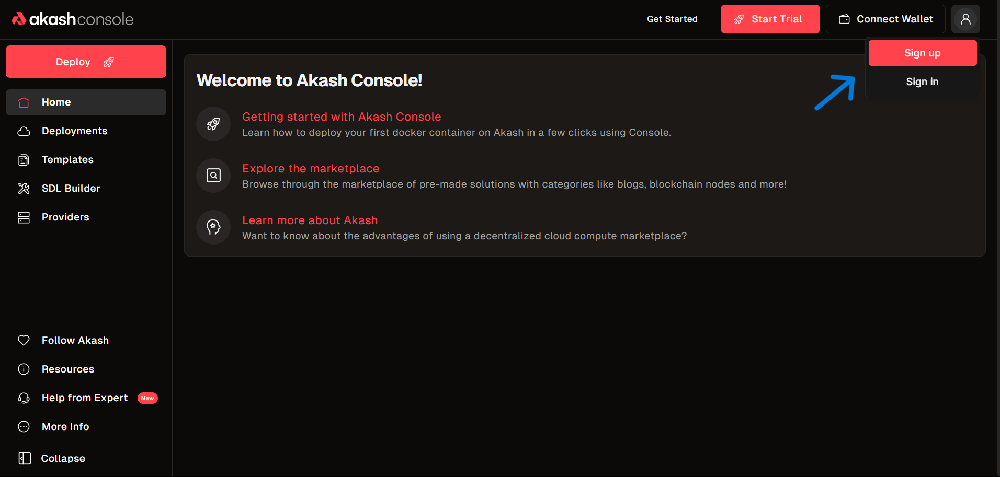
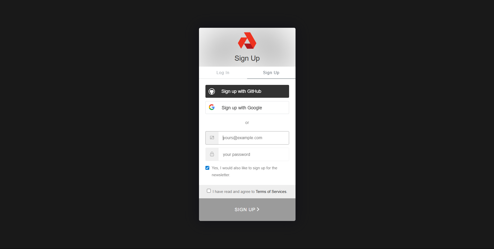
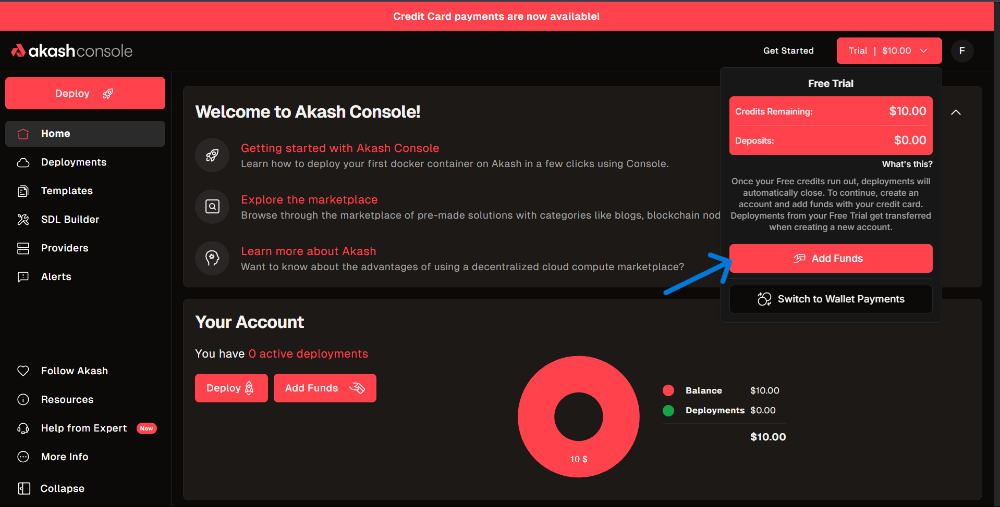
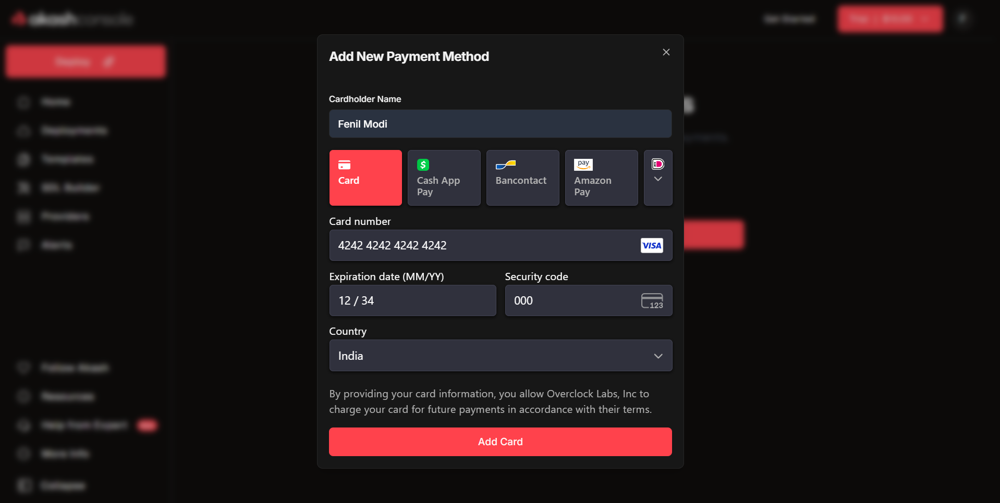
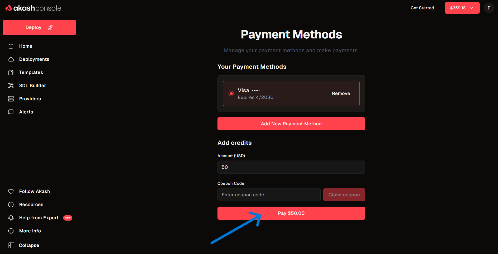
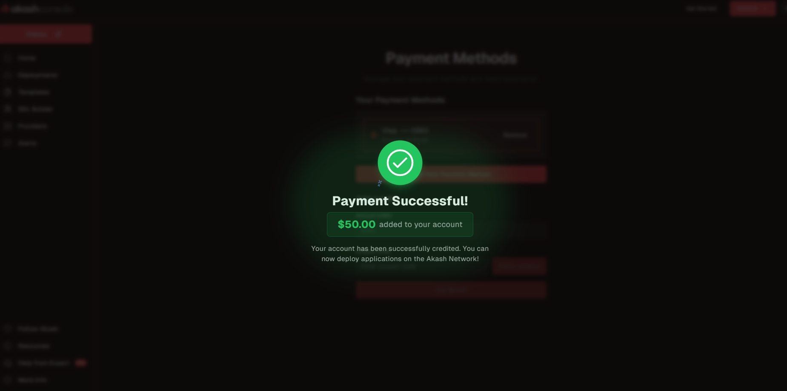
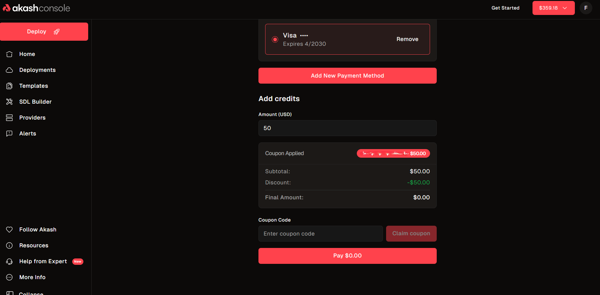

## Payment Options on Akash

### 1. Decentralized Wallet (AKT Token)

- **Ideal for:** Users seeking maximum control, privacy, and the advantages of decentralized finance.
- **Overview:** Connect your preferred crypto wallet (such as Keplr, Cosmostation, or Leap) to the Akash Console to pay for deployments directly with AKT tokens.
- **Getting Started:** If you are new to crypto wallets or AKT, refer to our [Token & Wallets guide](../token-and-wallets/) for comprehensive instructions on creating, funding, and connecting your wallet.
- **Key Benefits:** Maintain full custody of your funds, benefit from instant payments, and transact without intermediaries.

### 2. Credit/Debit Card, Bank Transfer, and Alternative Methods

- **Ideal for:** Users who prefer the convenience of traditional payment methods and do not wish to manage cryptocurrencies.
- **Overview:** Add a payment method (Visa, Mastercard, bank transfer, Amazon Pay, Cash App, etc.) directly in the Console. Your account will be credited in USD, with Akash automatically handling the conversion to AKT.
- **No Wallet Required:** Deploy and pay for services without interacting with cryptocurrencies.
- **Trial Credits:** All new users receive $10 in complimentary trial credits—no card or wallet required to get started.

---

## How to Fund Your Account

### Using a Card, Bank, or Amazon Pay

Below, you’ll find a detailed, step-by-step guide for funding your Akash account with traditional payment methods. For each step, you can add a screenshot to make the process even easier to follow.

1. **Go to the Akash Console Website**  
   Open your browser and navigate to [https://console.akash.network/](https://console.akash.network/).  
   <!--  -->

2. **Open the Profile Menu**  
   Hover your mouse over the profile icon at the top right corner of the page.  
   

3. **Sign Up or Sign In**  
   Click **Sign up** if you are new, or **Sign in** if you already have an account.  
   

4. **Choose a Sign Up/Sign In Method**  
   You can sign up or sign in using:
   - GitHub
   - Google
   - Email and password
   Follow the prompts to complete your registration or login.

5. **After Signing In**  
   Once signed in, you will see your account dashboard with your balance and main navigation.

6. **Access the Add Funds Menu**  
   Hover your mouse over your account balance at the top right, or click the red **Trial | $10.00** button. This opens a menu showing your current credits and options to add funds.  
   

7. **Click "Add Funds"**  
   In the pop-up, click the **Add Funds** button. This will take you to the Payment Methods page.

8. **Go to Payment Methods**  
   On the Payment Methods page, you’ll see any saved payment methods and the option to add a new one.

9. **Add a New Payment Method**  
   Click the **Add New Payment Method** button.  

10. **Choose Your Payment Type**  
    Select your preferred payment method:  
    - Credit/Debit Card (Visa, Mastercard, etc.)  
    - Bank transfer  
    - Amazon Pay  
    - Cash App
   

11. **Enter Your Payment Details**  
    Fill in your card or account details as prompted. Double-check for accuracy, then click **Add Card** (or the equivalent for your method).

12. **Confirm and Save**  
    After saving, your payment method will appear in the list of available methods. You can add more than one and set a default.

13. **Add Credits to Your Account**  
    Enter the amount you want to add in USD.  if you have a coupon or promo code. See [Redeeming Coupons & Promo Codes](#redeeming-coupons--promo-codes)
    

14. **Complete the Payment**  
    Click **Pay** to process your payment. If successful, you’ll see a confirmation and your account balance will update instantly.  
    

15. **Manage Your Payment Methods**  
    You can return to the Payment Methods page at any time to add, remove, or update your payment methods.  
    (https://console.akash.network/payment)

---

## Redeeming Coupons & Promo Codes

If you have a promo, referral, or trial code, after step 13, enter it in the **Coupon Code** box under "Add credits" on the Payment Methods page, then click **Claim coupon**. The coupon amount will be discounted from your total, and you pay the remaining balance if any.  

---

## How Credits Work

- **Trial credits** ($10 free) are for new users and may have some limits (e.g., only for first deployments).
- **Promo/referral codes** may have expiration dates or minimum spend requirements.
- **Credits are for Akash services only**—they can’t be withdrawn as cash.
- You can always see your current balance at the top of the Console.

---

## Troubleshooting & Support

**Email Verification Required:**
- You must verify your email before adding funds. If you missed the email, click **Resend verification email** in the Console.

**Invalid Coupon:**
- Double-check for typos, expiration, or if the code was already used.

**Payment Failed:**
- Make sure your payment method is valid and has enough funds. Try a different method if needed.

**Wallet Issues:**
- If your wallet won’t connect or you have trouble with AKT, see the [Token & Wallets guide](../token-and-wallets/) or reach out for help.

Need more help? Visit [Akash Support](https://akash.network/support) or ask in the [Akash Discord](https://discord.com/invite/akash).

