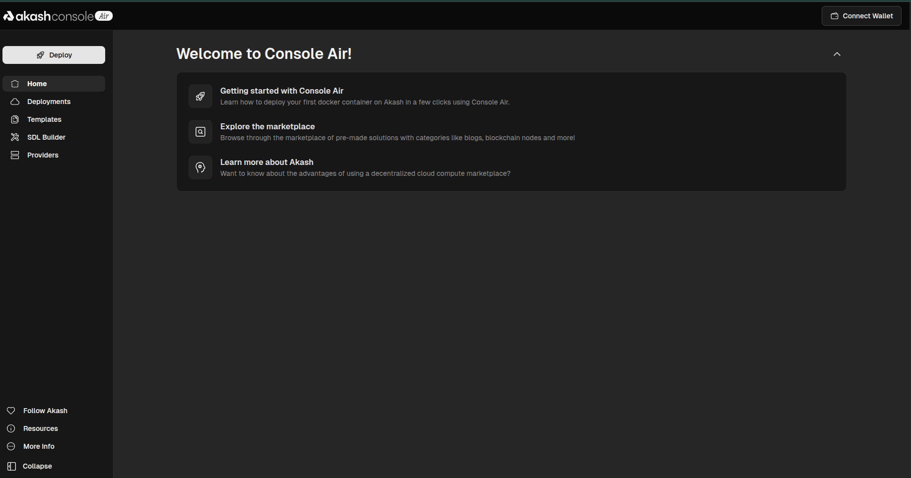
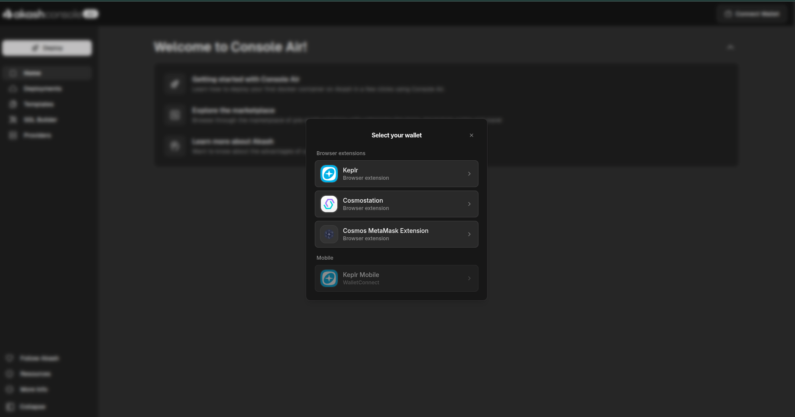

Console Air is the self-custody deployment interface for Akash Network. Unlike the standard Console (which uses email/OAuth and custodial trial credits), Console Air connects directly to your Web3 wallet, giving you full control over your AKT and ACT tokens at every step.

| | [Console (managed)](https://console.akash.network) | [Console Air (self-custody)](https://github.com/akash-network/console-air) |
|---|---|---|
| **Login** | Email / Google / GitHub | Web3 wallet (Keplr, Cosmostation, MetaMask) |
| **Credits** | $1 trial credits, no AKT needed | Requires AKT tokens in wallet |
| **Custody** | Custodial — Akash manages escrow | Self-custody — you sign every transaction |
| **Best for** | New users | Experienced Web3 users |

Not sure which to use? See [Choosing your Console](/docs/getting-started/choosing-your-console/).

## Step 1 — Open Console Air & Connect Your Wallet

Navigate to Console Air. The home screen shows the sidebar navigation and a welcome panel with three quick-start links:

- **Getting started with Console Air** — deploy your first Docker container
- **Explore the marketplace** — pre-made solutions: AI, blogs, blockchain nodes and more
- **Learn more about Akash** — decentralized cloud compute background

The sidebar gives you access to:

- **Deploy** — launch the deployment wizard
- **Deployments** — manage existing deployments
- **Templates** — browse pre-built app templates
- **SDL Builder** — write/edit Akash Stack Definition Language configs
- **Providers** — browse the live compute provider network

> 💡 No wallet connected yet = read-only mode. You can browse templates and providers but cannot deploy until a wallet is connected.

## Step 2 — Select Your Wallet

Click **"Connect Wallet"** in the top-right corner. A modal appears with the following options:

### Browser Extensions
- **Keplr** — the most widely used Cosmos wallet. Recommended for most users.
- **Cosmostation** — alternative Cosmos ecosystem wallet with browser extension.
- **Cosmos MetaMask Extension** — connects your existing MetaMask via the Cosmos snap.

### Mobile
- **Keplr Mobile** — connect via WalletConnect QR code from the Keplr iOS/Android app.

> ⚠️ You need AKT tokens in your wallet before you can deploy. AKT is the native token of Akash Network. You can acquire it on major exchanges including Osmosis, Crypto.com, Kraken, and Coinbase.

## Step 3 — Fund Your Deployment with ACT

Once your wallet is connected, your Akash address and AKT/ACT balances appear in the top-right corner.

Console Air uses **ACT (Akash Credits Token)** as the escrow currency for deployments — not AKT directly. You need to mint ACT from your AKT before deploying:

1. Go to your wallet balance in the top-right
2. Select **"Mint ACT from AKT"**
3. Choose the amount to convert and confirm the transaction in your wallet

> 💡 ACT is burned as your deployment runs. Any unused ACT can be reclaimed when you close a deployment. Think of it as a prepaid compute credit.

## Step 4 — Deploy

Click **"Deploy"** in the sidebar or use a Template. The deployment flow mirrors the standard Console:

1. Choose a template or provide your own Docker image / SDL config
2. Configure compute resources (CPU, RAM, storage, optional GPU)
3. Click **"Request quotes"** to fetch live bids from providers
4. Review provider bids — compare region, uptime, and price
5. Select a provider → your wallet prompts you to sign the lease transaction
6. Deployment starts after the on-chain lease is confirmed

> 💡 The provider bid list and marketplace are identical to the standard Console. See the [Console Onboarding Guide](/docs/getting-started/console-onboarding/) for a full breakdown of the 3-column configurator and provider bid table.

## Background & Further Reading

- [Console Air announcement](https://akash.network/blog/introducing-console-air-self-host-self-custody) — explains the Console vs Console Air split and the rationale for the self-custody flow.
- [AEP-84](https://github.com/akash-network/AEP/tree/main/spec/aep-84) — the design spec behind Console Air.
- [Deploy with Console Air](https://akash.network/docs/developers/deployment/console-air) — detailed deployment walkthrough in the official docs.
- [Choosing your Console](/docs/getting-started/choosing-your-console/) — decision guide: Console vs Console Air.

