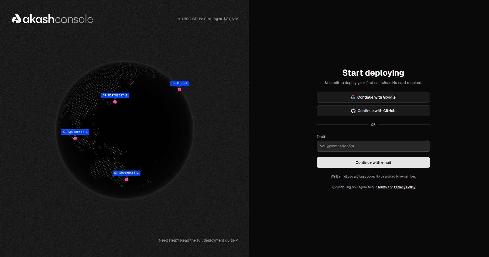
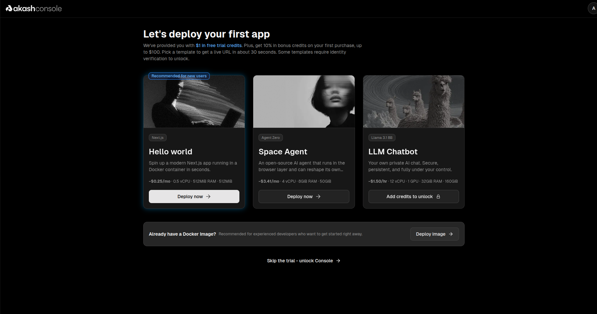
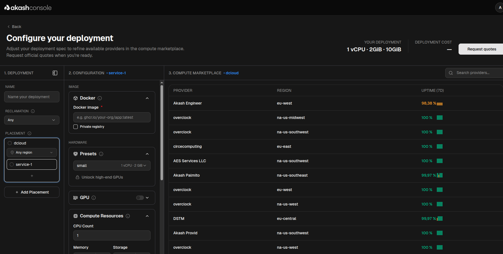

**URL:** [console.akash.network/onboarding](https://console.akash.network/onboarding)

## Step 1 — Sign Up

On the landing page you'll see a globe showing available compute regions (AP-Northeast, AP-Southeast, US-West, etc.) and a sign-up panel on the right.

**Authentication options:**
- Continue with Google
- Continue with GitHub
- Email — passwordless, a 6-digit OTP is sent to your inbox

> No credit card required to start. You get **$1 in free trial credits** on sign-up.

## Step 2 — Choose Your First Deployment

After confirming your email you land on the onboarding screen with three starter templates:

| Template | Stack | Est. Cost | Resources |
|---|---|---|---|
| **Hello World** ⭐ | Next.js in Docker | ~$0.25/mo | 0.5 vCPU · 512MiB RAM |
| **Space Agent** | Agent Zero (AI agent) | ~$3.41/mo | 4 vCPU · 8GiB RAM |
| **LLM Chatbot** | Llama 3.1 8B | ~$1.50/hr | 12 vCPU · 1 GPU · 32GiB RAM |

> ⭐ Hello World is recommended for first-time users — it deploys in ~30 seconds.

**Already have a Docker image?** Click **"Deploy image →"** at the bottom to skip templates and go straight to the deployment configurator.

**Skipping the trial:** Clicking **"Skip the trial – unlock Console →"** opens a side panel to add a credit card and unlock the full console.

## Step 3 — Configure Your Deployment

After selecting a template or clicking "Deploy image", you reach the **Configure your deployment** screen — a 3-column layout:

### Column 1 — Deployment Settings
- **Name** — label for your deployment
- **Reclamation** — how idle resources are reclaimed (default: Any)
- **Placement** — select a placement group (default: `dcloud`) and optionally pin to a region

### Column 2 — Service Configuration
- **Docker Image** — enter your image URI (e.g. `ghcr.io/your-org/app:latest`). Check **Private registry** if auth is required.
- **Presets** — pick a hardware tier: Small (1 vCPU · 2GiB) or unlock high-end GPU tiers
- **GPU** — toggle on to add a GPU (requires credits beyond the free trial)
- **Compute Resources** — manually set CPU count, Memory, and Storage

### Column 3 — Compute Marketplace
This panel lists all available providers in real time with their **region** and **7-day uptime**. No pricing is shown at this stage — this is the provider discovery view. Providers span NA, EU, and AP regions.

## Step 4 — Request Quotes

Once your Docker image and resource spec are set, click **"Request quotes"** (top-right).

The Compute Marketplace updates to show live bids from providers willing to host your exact spec. Compare region, uptime, and price before selecting.

> Bids vary significantly — the same spec can range from ~$1.50/mo to $27/mo depending on provider and region. EU-southeast and Australia/NZ providers tend to offer the lowest prices.

Click **"Select"** next to your preferred provider to confirm the lease.

## Step 5 — Deployment Starts

After selecting a provider:
1. The lease is created on-chain via Akash's decentralized marketplace
2. The provider pulls your Docker image and starts the container
3. A **live URL** is provisioned — usually within ~30 seconds for standard templates

> **Note:** If you see the banner *"Blockchain unavailable — console in read-only mode until service is restored"*, the Akash network is temporarily degraded. New deployments cannot be started until restored. Existing deployments are unaffected.

## Tips

- **Overclock** providers (multiple regions) consistently show 100% uptime and competitive pricing
- Adding more placements in Column 1 broadens the provider pool and gets you more bids
- GPU deployments require adding credits first — trial credits are CPU-only
- For self-custody/wallet-based deployments, see [Console Air](/docs/getting-started/choosing-your-console/)

