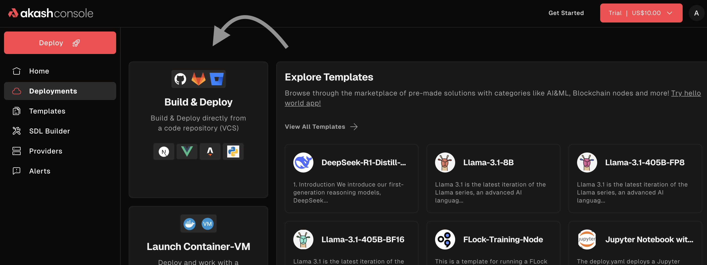
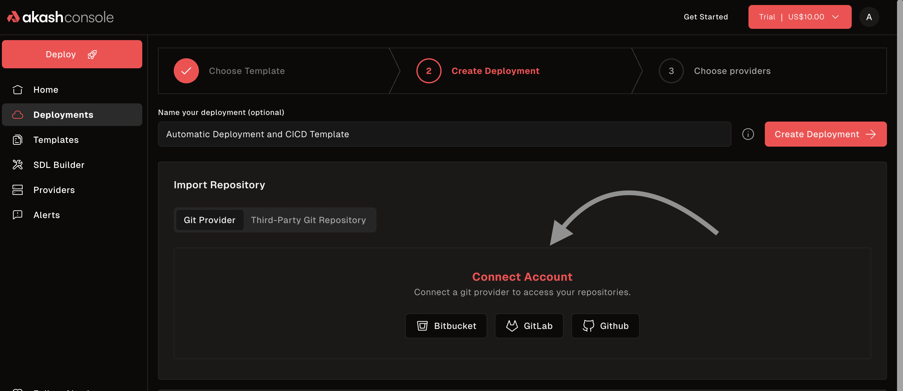
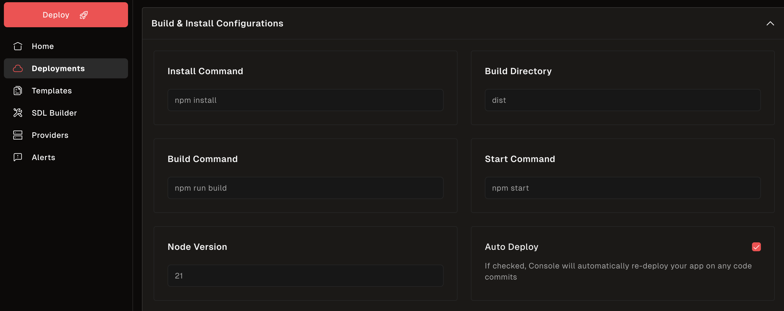
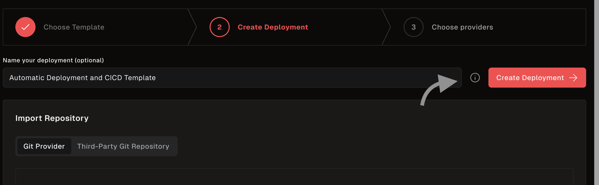
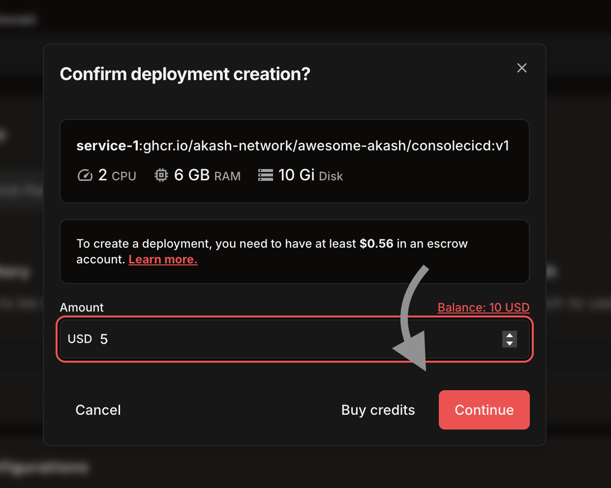
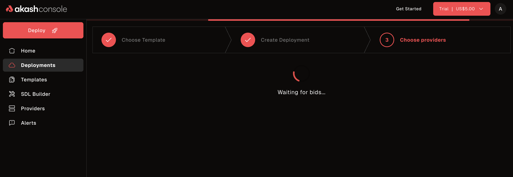
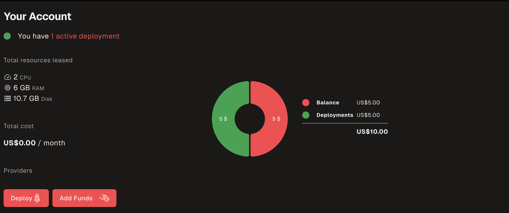

> **Deploy applications directly from GitHub, GitLab, and Bitbucket repositories with minimal setup!**

---

## Overview

The **Akash Console** now supports a powerful feature that allows users to **deploy applications directly from GitHub, GitLab, and Bitbucket repositories**, enabling rapid deployment of modern web apps and static sites with minimal setup.

This feature eliminates the need for manual Docker image building and pushing, making it easier than ever to deploy your applications to the Akash Network.

### Key Benefits

- **One-click deployment:** Connect your repository and deploy instantly
- **Automatic builds:** No need to manually build and push Docker images
- **Framework detection:** Automatically detects and configures popular frameworks
- **Environment variables:** Easy configuration of app settings
- **Cost-effective:** Deploy for a fraction of traditional cloud costs

---

## Supported Repository Providers

The GitHub Deploy Feature supports the following repository providers:

- **GitHub** - Full integration with GitHub repositories
- **GitLab** - Connect your GitLab projects
- **Bitbucket** - Deploy from Bitbucket repositories

---

## Supported Frameworks

The feature automatically detects and configures the following frameworks:

### JavaScript Frameworks
- **React** - Single-page applications built with React
- **Vue.js** - Progressive JavaScript framework
- **Next.js** - React framework for production
- **Angular** - Platform for building mobile and desktop web applications
- **Ember.js** - Framework for ambitious web developers

### Static Site Generators
- **Gatsby.js** - React-based static site generator
- **Nuxt.js** - Vue.js framework for universal applications
- **Astro** - Modern static site builder
- **VitePress** - Static site generator for technical documentation
- **11ty.js** - Simpler static site generator

### Full-stack Frameworks
- **Remix** - Full stack web framework
- **Vite** - Next generation frontend tooling
- **Express.js** - Fast, unopinionated web framework for Node.js

---

## Step-by-Step Guide

### Step 1: Access the GitHub Deploy Feature

1. Navigate to the [Akash Console](https://console.akash.network/)
2. Connect your wallet (Keplr or Leap)
3. Click on the **"Deploy"** button in the main navigation
4. Look for the **"Build & Deploy"** card



### Step 2: Connect Your Repository

1. Click **"Build & Deploy"** or similar option
2. Choose your repository provider (GitHub, GitLab, or Bitbucket)
3. Authenticate with your repository provider
4. Select the repository you want to deploy



### Step 3: Configure Your Deployment

1. **Framework Detection:** The console will automatically detect your project's framework
2. **Build Settings:** Configure build commands if needed
3. **Environment Variables:** Add any required environment variables
4. **Domain Settings:** Configure custom domains (optional)



### Step 4: Deploy Your Application

1. Review your deployment settings.
2. Click the **Create Deployment** button to proceed.

   

3. Confirm deployment creation and set the amount if prompted.

   

4. Monitor the build and deployment progress.

   

### Step 5: Access Your Application

1. Once deployment is complete, go to the Deployments page
2. Copy the provided deployment URL or check the status
3. Your application is now live on the Akash Network!



---

## Repository Requirements

### Supported Repository Structure

Your repository should follow one of these structures:

#### For Static Sites (React, Vue, etc.)
```
your-project/
├── package.json
├── src/
├── public/
└── README.md
```

#### For Next.js Applications
```
your-project/
├── package.json
├── pages/
├── components/
└── next.config.js
```

#### For Express.js Applications
```
your-project/
├── package.json
├── server.js
├── routes/
└── README.md
```

### Required Files

- **package.json** - Must be present for Node.js applications
- **README.md** - Recommended for project documentation
- **Framework-specific files** - Such as `next.config.js` for Next.js

---

## Environment Variables

### Setting Environment Variables

1. In the deployment configuration, navigate to the **"Environment Variables"** section
2. Add your environment variables in the format:
   ```
   KEY=value
   ```
3. Common environment variables include:
   - `NODE_ENV=production`
   - `DATABASE_URL=your_database_url`
   - `API_KEY=your_api_key`

### Secure Environment Variables

- Never commit sensitive environment variables to your repository
- Use the console's environment variable feature for sensitive data
- Consider using Akash's secret management for production deployments

---

## Troubleshooting

### Common Issues and Solutions

#### Build Failures

**Issue:** Deployment fails during build process

**Solutions:**
- Check that your `package.json` has the correct build scripts
- Ensure all dependencies are properly listed in `package.json`
- Verify that your repository is public or properly connected

#### Framework Not Detected

**Issue:** Console doesn't recognize your framework

**Solutions:**
- Ensure your project follows the standard structure for your framework
- Check that framework-specific files are present (e.g., `next.config.js` for Next.js)
- Try manually selecting your framework in the configuration

#### Deployment Timeout

**Issue:** Deployment takes too long or times out

**Solutions:**
- Check your build process for any hanging processes
- Ensure your application starts properly
- Verify that your application listens on the correct port

#### Environment Variables Not Working

**Issue:** Environment variables not being applied

**Solutions:**
- Check the format of your environment variables (KEY=value)
- Ensure your application is reading environment variables correctly
- Restart the deployment after adding environment variables

### Getting Help

If you encounter issues not covered here:

1. **Check the logs:** Use the console's log viewer to debug issues
2. **Community support:** Join the [Akash Discord](https://discord.akash.network) for help
3. **Documentation:** Refer to the [Akash documentation](/docs) for more details

---

## Best Practices

### Repository Setup

1. **Keep repositories public** for easier deployment
2. **Use semantic versioning** for your releases
3. **Include proper documentation** in your README
4. **Test locally** before deploying

### Deployment Configuration

1. **Start with minimal configuration** and add complexity as needed
2. **Use environment variables** for configuration
3. **Monitor your deployments** regularly
4. **Set up proper logging** for debugging

### Cost Optimization

1. **Choose appropriate resource allocation** for your application
2. **Monitor usage** to avoid unexpected costs
3. **Use the trial deployment** to test before committing funds
4. **Consider using the $10 trial** for initial testing

---

## Advanced Configuration

### Custom Build Commands

If your project requires custom build steps:

1. Add a `build` script to your `package.json`:
   ```json
   {
     "scripts": {
       "build": "your-custom-build-command"
     }
   }
   ```

2. The console will automatically use your custom build command

### Custom Domains

To use a custom domain:

1. Configure your domain's DNS to point to your Akash deployment
2. Add the domain in the deployment configuration
3. The console will handle SSL certificate generation

### Persistent Storage

For applications requiring persistent storage:

1. Configure persistent storage in your deployment settings
2. Ensure your application is designed to work with the provided storage paths
3. Consider data backup strategies for important data

---

## Examples

### React Application

**Repository:** `https://github.com/your-username/react-app`

**Structure:**
```
react-app/
├── package.json
├── src/
│   ├── App.js
│   └── index.js
├── public/
└── README.md
```

**Deployment:** Automatic detection and deployment of React application

### Next.js Application

**Repository:** `https://github.com/your-username/nextjs-app`

**Structure:**
```
nextjs-app/
├── package.json
├── pages/
│   ├── index.js
│   └── _app.js
├── components/
├── next.config.js
└── README.md
```

**Deployment:** Automatic Next.js detection with SSR support

### Express.js API

**Repository:** `https://github.com/your-username/express-api`

**Structure:**
```
express-api/
├── package.json
├── server.js
├── routes/
└── README.md
```

**Deployment:** Automatic Express.js detection with API endpoint exposure

---

## Conclusion

The GitHub Deploy Feature makes it incredibly easy to deploy your applications to the Akash Network. With support for popular frameworks and repository providers, you can go from code to deployment in minutes.

### Next Steps

- **Try the feature** with a simple repository
- **Explore advanced configurations** for production deployments
- **Join the community** to share your experiences
- **Contribute** to the Akash ecosystem

For more information about Akash deployments, see the [Deployment Overview](/docs/deployments/overview/) and [Akash Console](/docs/getting-started/quickstart-guides/akash-console/) documentation. 