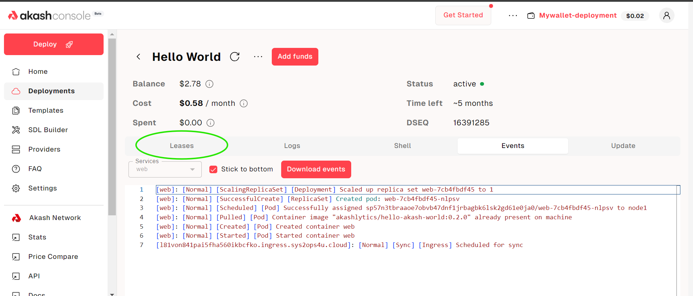

This guide will walk you through deploying a simple "Hello World" Next.JS application onto the Akash Network via Console. This guide is beginner-friendly and requires no previous knowledge of navigating Console or Akash Network in general.

#### Before Getting Started

Console is compatible with two wallets as of now, Keplr and Leap wallet. The Keplr or Leap browser extensions must be installed and with sufficient funds (0.5 AKT minimum for a single deployment plus a small amount for transaction fees).

Follow our [Keplr Wallet](/docs/getting-started/token-and-wallets/#keplr-wallet) or [Leap Cosmos Wallet](/docs/getting-started/token-and-wallets/#leap-cosmos-wallet) guides to create your first wallet if necessary.

#### Cloudmos Deploy Access

The Console web app is available via the following URL:

- https://console.akash.network/

### STEP 1 - Connect your Keplr or Leap wallet

After clicking connect wallet, you will see an option to choose either Keplr or Leap. Choose your desired option:

### STEP 2 - Click the "Getting started with Akash Console" option

Now click the Deploy button:

Now, an SDL file will be loaded for your deployment, which will have the docker image and all the needed resources specified. Click the create deployment option:

### STEP 3 - Proceed to pay the deployment deposit

Click the continue button and approve the transaction. The **amount will be refunded** as soon as you close the deployment.

Now approve the transaction:

### STEP 4 - Select the best bid

Now you will see a list of providers with prices. Select whichever you want, preferably the lowest one, and click the Accept Bid button:

Now approve the transaction fee once again:

#### STEP 5 - Confirm the deployment

Now the only thing left to do is to confirm that the deployment was successful. Click the Leases section:

Now visit the URI link:

You will be able to see the website you just deployed:

Once the example is deployed, you can easily close it and get refunded as well. Just click the Close option and once again approve the transaction:

#### Conclusion

You have successfully deployed a simple hello world application using Console. Other deployments are also the same, only the SDL file along with docker image and resources is to be configured as per the need.
