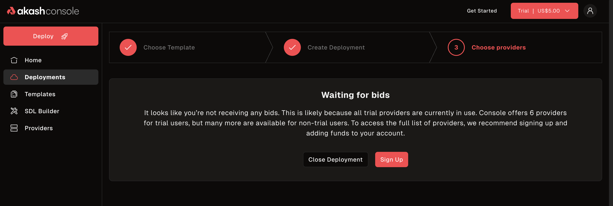

> **Try Akash instantly with $10 in free credits—no wallet, signup, or setup required!**

---

## Overview

The $10 Trial Deployment feature lets you experience Akash deployments with zero friction. Click the **"Start Trial"** button in the navigation to launch a temporary deployment—no wallet, no registration, and no prior setup needed.

- **One-click trial:** Just click "Start Trial" in the nav.
- **Instant access:** A temporary wallet is created for you, preloaded with $10 in credits.
- **No commitment:** No personal info, no crypto required.
- **Limitations:** One trial per browser. No persistence after session/cache is cleared.

---

## How to Use the $10 Trial

1. **Find the "Start Trial" Button**
   - Located in the main navigation bar.
   - 
2. **Activate Your Trial Wallet**
   - After clicking, a temporary wallet is generated and $10 in trial credits are allocated.
   - 
3. **Deploy an App**
   - Use the Akash Console to deploy any supported app. You'll see your trial balance available during deployment.
   - 
4. **See Trial Limitations/Warnings**
   - If all trial providers are in use, or you hit a limitation, you'll see a warning or alert.
   - 

---

## How the Trial Works

- **Session Storage:**
  - Your trial wallet and deployment info are stored in your browser's local cache. If you clear your browser cache or use incognito/private mode, your trial deployment and wallet will be **permanently lost**.
- **$10 Credit Cap:**
  - Each trial wallet is preloaded with $10. Once spent, the trial ends.
- **One Trial Per Browser:**
  - You can only use the trial once per browser profile.
- **No Persistence:**
  - Deployments are not persistent. They may be terminated at any time.
- **No Production Use:**
  - This feature is strictly for trial and educational purposes. **Do not use for production workloads.**
- **Expiration:**
  - Trial wallets may expire after a set period or at the discretion of Akash. Check for any alerts in the UI.

> **Warning:**
> There is no way to recover a lost trial deployment or wallet. Use the trial for learning and experimentation only.

---

## FAQ

**Q: Can I use the trial for production workloads?**  
A: _No. The trial is for educational/demo use only. Deployments may be deleted at any time._

**Q: What happens if I clear my browser cache?**  
A: _Your trial wallet and deployment will be lost and cannot be recovered._

**Q: Can I get another trial after using my $10?**  
A: _No. Only one trial is allowed per browser profile._

**Q: Is my trial deployment secure?**  
A: _Trial deployments are isolated, but not intended for sensitive or production data._

**Q: Will my trial wallet expire?**  
A: _Trial wallets may expire after a set period or at the discretion of Akash. Check for any alerts in the UI._

---

> _For questions or feedback, open an issue or PR on the [Akash website repo](https://github.com/akash-network/website)._ 