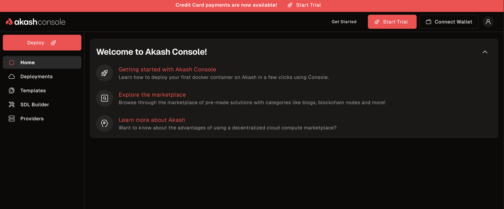
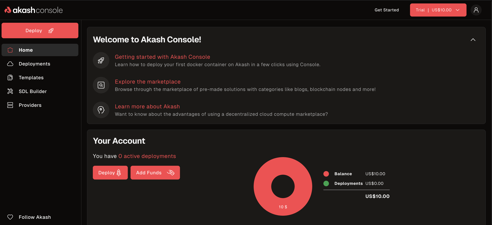
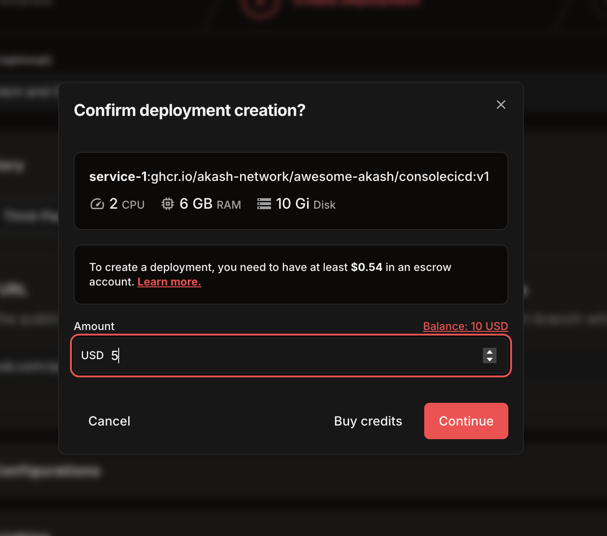
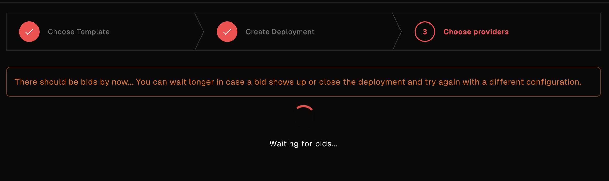
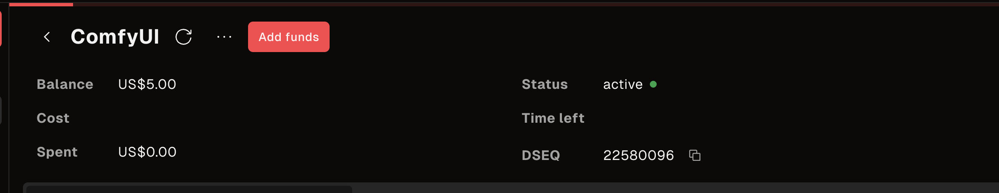
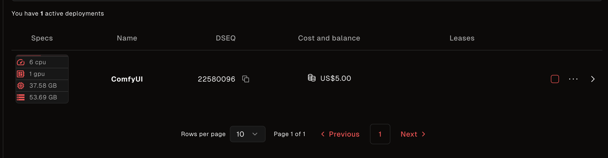
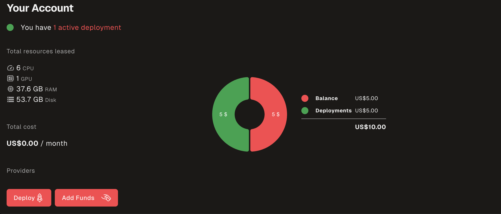

> **Try Akash instantly with free credits—no wallet, signup, or setup required!**

---

## Getting Started

The Trial Deployment feature lets you experience Akash deployments with zero friction. Click the 'Start Trial' button in the navigation to launch a temporary deployment—no wallet, no registration, and no prior setup needed.

- **One-click trial:** Just click 'Start Trial' in the nav.
- **Instant access:** A temporary wallet is created for you, preloaded with free credits.
- **No commitment:** No personal info, no crypto required.
- **Limitations:** One trial per browser. No persistence after session/cache is cleared.

---

## How to Use the Trial

1. **Find the 'Start Trial' Button**
   
   Located in the main navigation bar.

   

2. **Activate Your Trial Wallet**
   
   After clicking 'Start Trial', you'll be taken to the Akash Console dashboard where you can see your trial balance and account status. The trial wallet is automatically created with free credits.

   

3. **Deploy an App**
   
   Use the Akash Console to deploy any supported app. You'll see your trial balance available during deployment.

   

4. **Wait for Bids**
   
   The system will automatically find providers and generate bids for your deployment. This usually takes 30-60 seconds.

   

5. **Choose a Provider**
   
   Once bids are received, you'll see a list of available providers with their pricing and specifications. Select the provider that best meets your needs.

6. **Complete Deployment**
   
   After selecting a provider, your deployment will be processed and your application will be deployed to the chosen provider's infrastructure. You can monitor the deployment status and account balance.

   

7. **Access Your Live Application**
   
   Once deployment is complete, you'll receive a live URL where your application is accessible. The URL will be displayed in the deployment details.

   

8. **Monitor Your Deployment**
   
   You can monitor your deployment status, logs, and resource usage through the Akash Console dashboard.

   

---

## How the Trial Works

- **Session Storage:**
  Your trial wallet and deployment info are stored in your browser's local cache. If you clear your browser cache or use incognito/private mode, your trial deployment and wallet will be **permanently lost**.
- **Credit Cap:**
  Each trial wallet is preloaded with a set amount of credits. Once spent, the trial ends.
- **One Trial Per Browser:**
  You can only use the trial once per browser profile.
- **No Persistence:**
  Deployments are not persistent. They may be terminated at any time.
- **No Production Use:**
  This feature is strictly for trial and educational purposes. **Do not use for production workloads.**
- **Expiration:**
  Trial wallets may expire after a set period or at the discretion of Akash. Check for any alerts in the UI.

> **Warning:**
> There is no way to recover a lost trial deployment or wallet. Use the trial for learning and experimentation only.

---

## Complete Deployment Example

Here's what a complete trial deployment looks like from start to finish:

### Step 1: Start Trial
- Click 'Start Trial' in navigation
- Temporary wallet created with trial credits

### Step 2: Create Deployment
- Choose your application (e.g., Hello World, web app, etc.)
- Configure resources (CPU, memory, storage)
- Submit deployment request

### Step 3: Provider Selection
- Review incoming bids from providers
- Compare pricing and specifications
- Select your preferred provider

### Step 4: Deployment Processing
- Provider prepares your deployment
- Application container is pulled and started
- Network configuration is applied

### Step 5: Live Application
- Receive live URL for your application
- Access your deployed app immediately
- Monitor performance and logs

### Step 6: Management
- View deployment status and health
- Access application logs
- Monitor resource usage
- Close deployment when done

---

## FAQ

**Q: Can I use the trial for production workloads?**  
A: _No. The trial is for educational/demo use only. Deployments may be deleted at any time._

**Q: What happens if I clear my browser cache?**  
A: _Your trial wallet and deployment will be lost and cannot be recovered._

**Q: Can I get another trial after using my credits?**  
A: _No. Only one trial is allowed per browser profile._

**Q: Is my trial deployment secure?**  
A: _Trial deployments are isolated, but not intended for sensitive or production data._

**Q: Will my trial wallet expire?**  
A: _Trial wallets may expire after a set period or at the discretion of Akash. Check for any alerts in the UI._

**Q: How long does deployment take?**  
A: _From start to live URL, deployment typically takes 2-5 minutes, including provider selection and application startup._

**Q: Can I deploy any application?**  
A: _You can deploy any containerized application that's compatible with the Akash network. Popular options include web apps, APIs, and development tools._

---

> _For questions or feedback, open an issue or PR on the [Akash website repo](https://github.com/akash-network/website)._ 