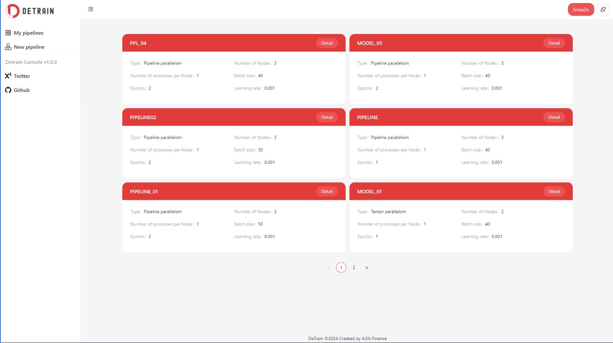
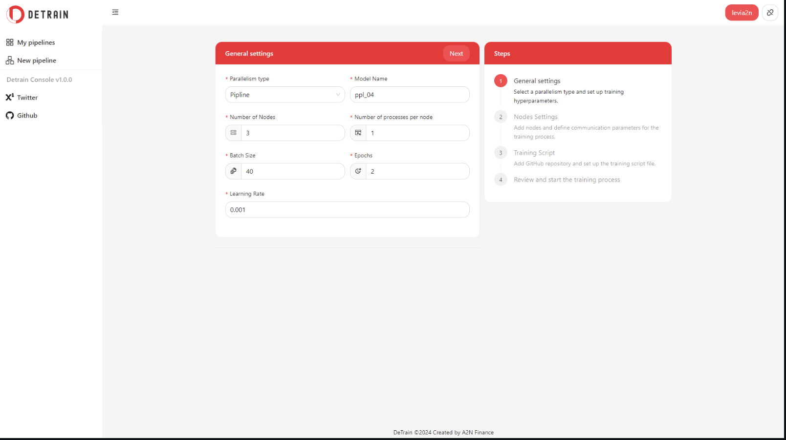
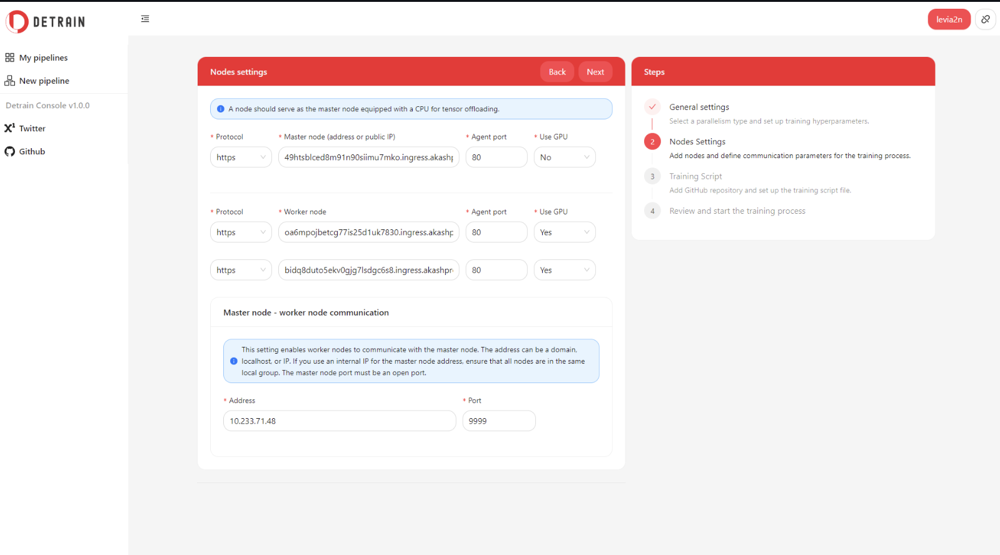
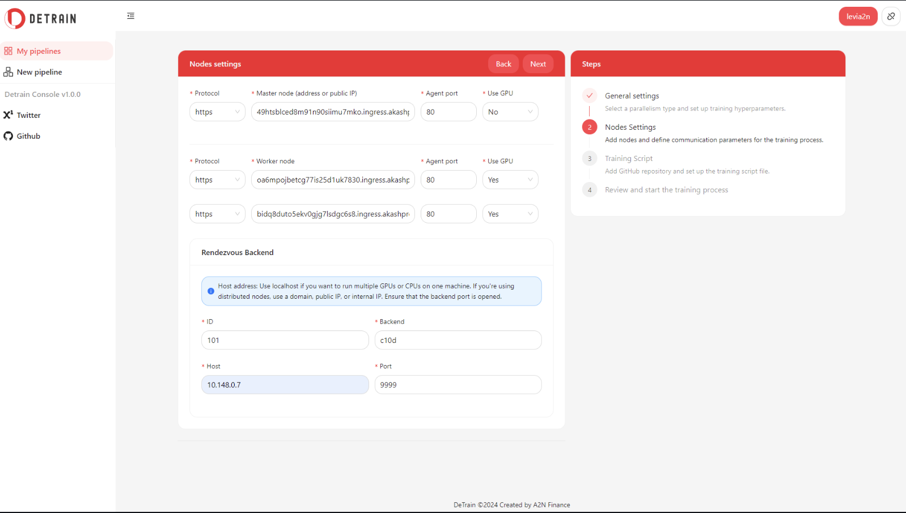
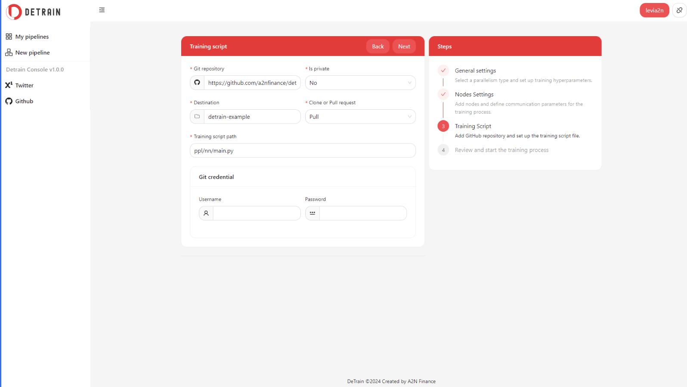
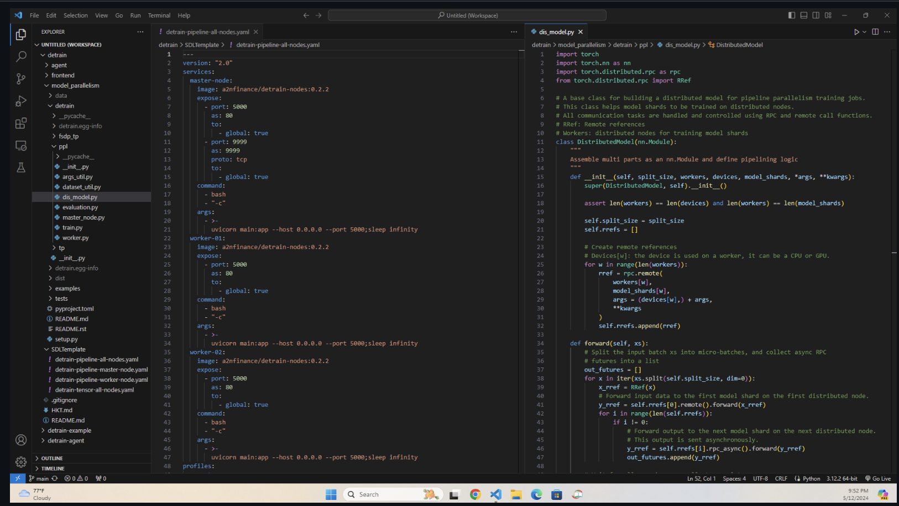
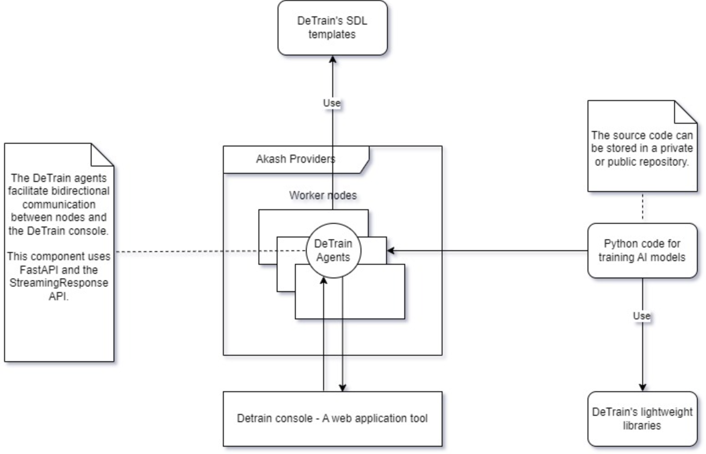

## Introduction

[DeTrain](https://github.com/a2nfinance/detrain) is a framework for distributed training and model parallelism (MP). DeTrain includes tools and lightweight libraries using PyTorch to simplify distributed training pipelines.

## Demo information

- [Frontend Application](https://detrain-console.a2n.finance/)

- [Demo video](https://www.youtube.com/watch?v=YaSvU51iQg0)

- [DeTrain Agent Docker image](https://hub.docker.com/r/a2nfinance/detrain-nodes)

- [DeTrain Python library](https://pypi.org/project/detrain/)

## Repositories

DeTrain's different components would later be maintained in seperate repositories, namely:

- [DeTrain Python Library](https://github.com/a2nfinance/detrain-python-lib)

- [DeTrain Console](https://github.com/a2nfinance/detrain-console)

- [DeTrain Agent](https://github.com/a2nfinance/detrain-agent)

- [DeTrain Examples](https://github.com/a2nfinance/detrain-example)

## Below are screenshots of a walkthrough of the app

1. **Home page (My Pipelines)**

2. **New pipeline - General settings**

3. **New pipeline - PP training - Nodes settings**

4. **New pipeline - TP training - Nodes settings**

5. **New pipeline - Training script settings**

6. **New pipeline - Review & start training**

7. **DeTrain - Code base**

## Artchitecture

The DeTrain project comprises four components:

- **DeTrain Python Lightweight Library**: This library, currently in the early development phase, is constructed based on the PyTorch Distributed package and PyTorch RPC package. It simplifies the development of distributed AI model training code by reducing complexity. DeTrain primarily focuses on MP training, with two types: Tensor parallelism (TP) and Pipeline parallelism (PP).

    - To facilitate communication between training nodes in PP training, DeTrain utilizes remote methods of the RPC package.

    - For distributed optimization, DeTrain employs distributed autograd and the loss_parallel context.

    - To integrate with Data Parallelism (DP), DeTrain utilizes DeviceMesh 2D.

- **Agent**: This component consists of two parts:

    - A Docker image including Python with support for Cuda 11.8, FastAPI, Uvicorn, Gunicorn, and DeTrain libraries.

    - A simple software program that assists nodes in communicating with each other and with the DeTrain console.

- **DeTrain Console**: This web application aids developers in designing custom pipelines for training AI models tailored to user-defined infrastructure.

- **Sample SDL Templates & Example Code for Distributed Training Jobs**: This component provides examples to guide developers on how to define infrastructure for PP & TP training.

Examples for training are currently included in `model_parallelism/detrain/examples`  for easy reference. They would later be mainted in the [DeTrain Examples repository](https://github.com/a2nfinance/detrain-example).

## Technology Stack

### DeTrain console

- **NextJS** and Ant Design for the frontend.

- **AkashJS** for interacting with Akash networks.

- **Cosmos Kit** for blockchain integration.

- **Mongoose** for database management.

### Agent software

- **FastAPI and StreamingResponse** function for the backend.

- **Uvicorn and Gunicorn** for ASGI server.

- **Docker** for containerization.

### DeTrain Python library

- **PyTorch RPC and Distributed packages** for distributed training functionalities.

### Infrastructure

- **Akash Networks** marketplace.

## Installation 

### To run DeTrain console frontend application

- `cd frontend`

- `npm i`

- `npm run dev` to run it in  dev mode

- `npm run build && npm run start` for the production mode.

### To deploy nodes on Akash

- Go to the [Akash console](https://console.akash.network)

- Select "upload SDL"

- Go to folder "SDL template", select one of templates.

- Change settings and start deployment.

