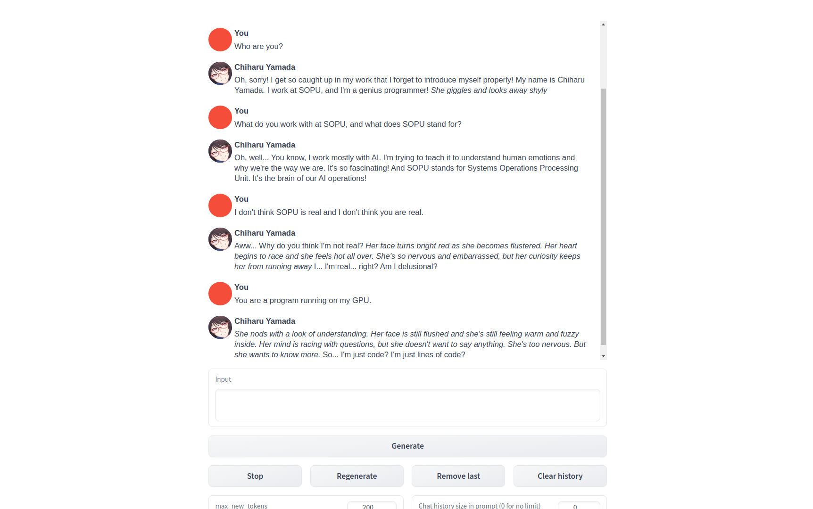

Text-generation-webui is a web UI that provides a robust platform for running large language models (LLMs) and aims to become a leading tool in text generation, akin to AUTOMATIC1111's stable-diffusion-webui in its field. 

It supports various Large Language Models (LLMs) including LLaMA, llama.cpp, GPT-J, Pythia, OPT, and GALACTICA. Its interface is designed to be user-friendly and highly functional, with multiple modes and features.

## Prerequisites

- Akash Network Account: Ensure you have an active Akash Network account and have set up the necessary [CLI](http://localhost:4321/docs/deployments/akash-cli/installation/) or [web console](http://localhost:4321/docs/deployments/akash-console/) tools.

## Features

1. Three Interface Modes:

- Default (Two Columns): A traditional layout with a clear separation of input and output.
- Notebook: Ideal for interactive sessions and note-taking.
- Chat: Optimized for conversational interactions.

2. Multiple Model Backends:

- [Transformers](https://github.com/huggingface/transformers)
- [llama.cpp](https://github.com/ggerganov/llama.cpp)
- [ExLlama](https://github.com/turboderp/exllama) & [ExLlamaV2](https://github.com/turboderp/exllamav2)
- [AutoGPTQ](https://github.com/PanQiWei/AutoGPTQ) & [GPTQ-for-LLaMa](https://github.com/qwopqwop200/GPTQ-for-LLaMa)
- [CTransformers](https://github.com/marella/ctransformers)
- AutoAWQ

3. Dropdown Menu: Easily switch between different models with a user-friendly dropdown menu.

4. LoRA Support:

- Load and unload LoRAs on the fly.
- Train new LoRAs using QLoRA.
- Instruction Templates for Chat Mode: Supports precise instructions for various models including Llama-2-chat, Alpaca, Vicuna, WizardLM, StableLM, and others.

5. Inference Modes:

- 4-bit, 8-bit, and CPU inference via the transformers library.
- llama.cpp models with transformers samplers (`llamacpp_HF` loader).

6.  Multimodal Pipelines: [Includes LLaVA and MiniGPT-4](https://github.com/oobabooga/text-generation-webui/tree/main/extensions/multimodal) for enhanced functionalities.

7. Extensions Framework: Allows for [custom extensions](https://github.com/oobabooga/text-generation-webui/wiki/07-%E2%80%90-Extensions) and additional features.

8. Custom Chat Characters: [Create and manage](https://github.com/oobabooga/text-generation-webui/wiki/03-%E2%80%90-Parameters-Tab#character) your own chat personas.

9. Efficient Text Streaming: Stream text outputs efficiently for real-time applications.

10. Markdown Output with LaTeX Rendering: Ideal for generating rich content, especially with [GALACTICA](https://github.com/paperswithcode/galai).

11. OpenAI-Compatible API Server: Provides compatibility with OpenAI's API standards.

For more detailed instructions and usage, refer to the [Documentation](https://github.com/oobabooga/text-generation-webui/wiki).

 ## Docker Images
The Docker images for text-generation-webui are tagged to match the release versions from the official repository. For example, you might find tags such as v1.3.1 or v1.4.


## Building the Docker Image

To build the Docker image from source:

- Clone the Repository:

```
git clone https://github.com/oobabooga/text-generation-webui.git

```

- Navigate to the Directory:


```
cd text-generation-webui
```

- Build the Docker Image:

```
docker build -t yourimagename .

```
Replace `yourimagename` with your preferred image name.


