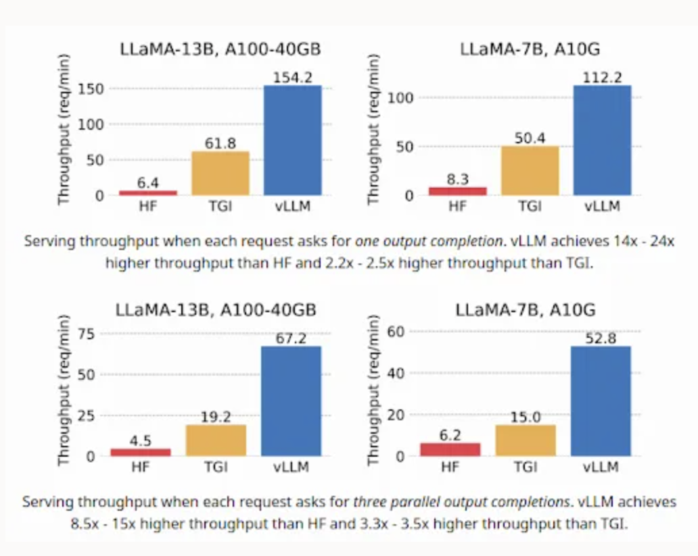

## Introduction

vLLM is an LLM server implementation first introduced in a paper in 2023. Its primary objective was to make LLM inference faster for multiuser services. What vLLM does also achieve is overcoming some of the limitations of Ollama. vLLM enables you to serve more than 1 user at a time, natively, without having to proxy user requests between multiple GPUs. It also allows has somewhere between 2-4X the throughput of Ollama for concurrent requests.

The main change vLLM makes is adding Paged Attention to an LLM model by swapping out all the transformer attention modules for Paged Attention which implements attention more efficiently. The authors of vLLM describe Page Attention as, “Paged Attention’s memory sharing greatly reduces the memory overhead of complex sampling algorithms, such as parallel sampling and beam search, cutting their memory usage by up to 55%. This can translate into up to 2.2x improvement in throughput”. You can read more about the technical details of paged attention in the offical vLLM blog post. The current server implementation has gone beyond just Paged Attention and will soon support speculative encoding approaches. Other open source alternatives to vLLM include [Hugging Face](https://huggingface.co/)’s TGI and the sglang engine with its Radix Attention implementation. The only drawback to using vLLM is that it doesn’t support all of the super low quantization methods and file formats such as GGUF. If you haven’t used GGUF before in llama.cpp-based tools like ollama then you should note that most people actively try to avoid using models with quantization lower than the 4bit (Q4) quantization due to performance issues. The good news is that most models are available in GPTQ or AWQ quantization formats that are supported by vLLM.



At the time of the original paper (June 2023), vLLM dramatically outperformed TGI. Since then other 3rd parties have also found vLLM to be one of the most performant open source LLM server implementations available for concurrent requests. Again, one thing to note is that no one is putting Ollama or llama.cpp based implementations onto these benchmarks because those LLM servers are really intended to only support one user at a time and they are not suitable for being used as a service.


## Preparation

1. Create an Akash account and ensure you have AKT tokens.

2. Login to console.akash.network with your wallet to launch an instance with an SDL (YAML) found in [vLLM](https://github.com/akash-network/awesome-akash/tree/master/vllm) folder of the [Awesome-Akash repository](https://github.com/akash-network/awesome-akash/).

## Containerization

We are going to use the latest official vLLM container image: `vLLM/vLLM-openai:v0.4.0.post1`.

You can also build your own image using the Dockerfile in the root of the vLLM repo.

**Note:**  
*You should never use "latest" as a tag for your containers in Akash SDL and that if you have a new model you should check if it has official vLLM support and note the date to make sure the container has been pushed since support has been added.*

## Deployment

1. **Create a Deployment Configuration**: Create a YAML file for your vLLM deployment, including Docker configurations, resource requirements, and port exposures. See the example below which you should be able to copy and paste into Akash Console.

2. **Deploy**: Use Akash Console to deploy your application, which matches you with a suitable provider based on your deployment specifications.

3. **Use LLM UI**: After deployment, utilize the Akash Console field to find the IP address of the service and you should be good to go.

4. **Use LLM API**: After deployment, utilize the Akash Console field to find the IP address of the vLLM service and add the URI and API key variables to whichever client you are using (e.g. ”http://localhost:8000/v1”).

You can find an example of vLLM using CrewAI in the `vLLM_crew_notebook_deployment.yml`.

Below is a code snippet using the LLM with Langchain in Python. Tool calling should be supported pretty well by any model that is as performant as WizardLM2-7B or better.

```

import os
os.environ["OPENAI_API_KEY"]="MYPASSWORD"
#if inside akash service
os.environ["OPENAI_API_BASE"]="http://vLLM:8000/v1"
#if outside akash service update as needed based on provider, the port will change for every new deployment
os.environ["OPENAI_API_BASE"]="https://provider.hurricane.akash.pub:31816/v1"
#update for your model name
os.environ["OPENAI_MODEL_NAME"] = "MaziyarPanahi/WizardLM-2-7B-AWQ"

from langchain_community.llms import vLLMOpenAI
llm = vLLMOpenAI(
    openai_api_key="MYPASSWORD",
    openai_api_base="http://vLLM:8000/v1",
    model_name="MaziyarPanahi/WizardLM-2-7B-AWQ",
)
or
print(llm.invoke("Rome is"))

```

The vLLM server is designed to be compatible with the OpenAI API, allowing you to use it as a drop-in replacement for applications using the OpenAI API.

This repository contains 4 example vLLM YAMLs, one example without a user interface and 3 with the OpenWebUI tool:

- `vLLM_no_ui_deployment.yml` a basic example without a user interface

- `vLLM_with_openwebui_dolphin2-9-llama3-70b.yml`

- `vLLM_with_openwebui_wizardlm2-7b.yml`

- `vLLM_with_openwebui_wizardlm2-8x22.yml`

- `vLLM_crew_notebook_deployment.yml`


The vLLM server supports the following OpenAI API endpoints:

- List models

- Create chat completion

- Create completion

## Sizing vLLM for a number of different users

Sizing LLM Server resources for a particular application can be challenging because of the impact of model choice, quantization of that model, GPU hardware, and usage pattern ( human being vs agent). Anyscale ( the company behind Ray) has released a great LLM benchmarking tool called llmperf that is worth using for benchmarking your use case with your specific application requirements. Aside from using this tool, it has been reported that a single Nvidia A100 GPU can support between 10-20 concurrent users for 7B parameter Mistral model with AWQ on vLLM with lower throughput for other server options. Larger models will have lower throughput. There are also a lot of performance improvements going from 1 to 2 GPUs in a vLLM server, but this effect diminishes rapidly.

## Troubleshooting

If you don’t see the model in the OpenWebUI dropdown it usually means you chose a model that was too large for GPU, too large for disk space, or has a bad [Hugging Face](https://huggingface.co/) repo entered into the deployment. You can usually verify which issue is from the logs. You will usually have to redeploy the deployment to change these parameters.

**Steps to Troubleshoot**

1. Read the logs for the vLLM container and the UI container.

2. Check that the model weights are downloading correctly and can be loaded into VRAM.

3. Check the model size is smaller than VRAM and container disk space.

4. Check the [Hugging Face](https://huggingface.co/) model repo to make sure the repo and author are correct.

5. Check the [Hugging Face](https://huggingface.co/) repo model type and make sure its not GGUF and is compatible with vLLM (GPTQ, AWQ, GGML, Safetensors etc).

6. Make sure that the model is [officially supported by vLLM](https://docs.vllm.ai/en/latest/models/supported_models.html).

7. Check the environment variables for setting the `vLLM_API_KEY` and `OPENAI_API_KEYS` environment variables match.

8. Check that the `HUGGING_FACE_HUB_TOKEN` is set for downloading models.

9. If you are using the API externally make sure you have updated the url to use the deployer endpoint variable which can be done by setting `OPENAI_API_BASE`.

9. If you have checked all of these and still have problems than open a [issue in the awesome-akash repo](https://github.com/akash-network/awesome-akash/issues) and tag [@rakataprime](https://github.com/rakataprime). In the issue, please provide your logs and deployment used with the [Hugging Face](https://huggingface.co/) token and other secrets set to XXXXXXXXXXXX.

## Choosing The Right GPU for An LLM Model

- vLLM supported files formats include : GPTQ, AWQ, GGML(squeezelm ), and pytorch pth/bin and safetensors files.

- vLLM DOES NOT SUPPORT GGUF files.

- Check to make sure the base foundation model is supported [here](https://docs.vllm.ai/en/latest/models/supported_models.html).

- Make sure that the file size is smaller than the VRAM of the GPU with a little buffer room. Try to make sure the model files fit within 90% of the Total VRAM.

- Make sure the vLLM container has a large of disk space to store the model weights.

- If you are doing something funny with really large context lengths you can use the tools below to help estimate VRAM utilization.

- Remember that really large models like Grok sometimes require multiple gpus. the max number of gpus supported by this vLLM example is 8 gpus or 640Gb VRAM for a100.  

- If you needed more than 8 gpus you can use a larger ray cluster instead, but this is beyond the scope of this example. you can contact logan@thumper.ai for asistance if you need help with this.

### Tools for Checking Model VRAM requirements

- [“Can-it-run” - HuggingFace](https://huggingface.co/spaces/Vokturz/can-it-run-llm)

- [“LLM-Model-VRAM-Calculator” - HuggingFace](https://huggingface.co/spaces/NyxKrage/LLM-Model-VRAM-Calculator)

## Learn more about vLLM

- [vLLM Docs](https://docs.vllm.ai/)

- [vLLM repo](https://github.com/vLLM-project/vLLM)

- [In-depth comparison study](https://pages.run.ai/hubfs/PDFs/Serving-Large-Language-Models-Run-ai-Benchmarking-Study.pdf)