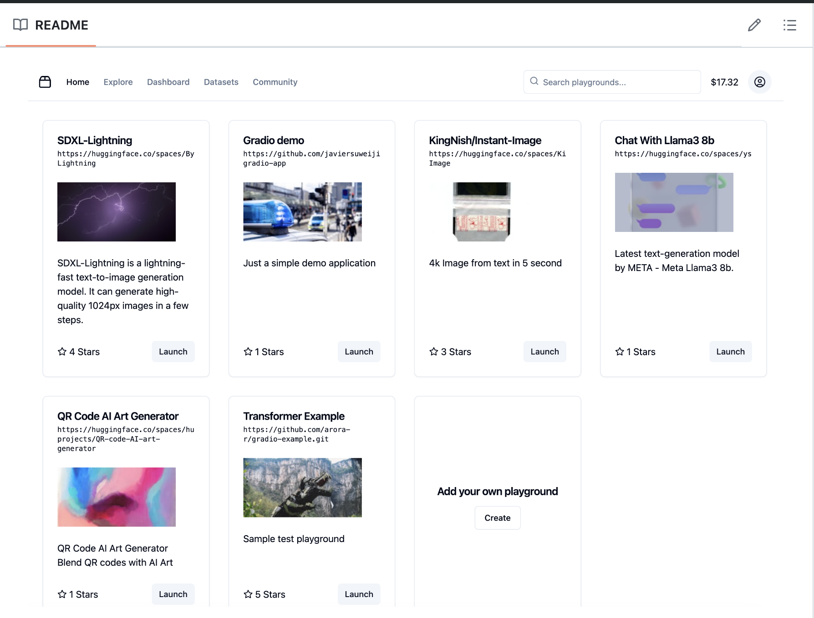

[Akash Playground](https://github.com/javiersuweijie/plygrnd-ui/tree/main) is a community-driven marketplace where users can upload, run, and monetize their AI models without the hassle of managing underlying infrastructure. This platform simplifies infrastructure management, making AI models more accessible and usable for various applications. It is compatible with [Hugging Face Spaces](https://huggingface.co/spaces) repositories, facilitating seamless integration and collaboration.




## Motivation

The rapid development of AI models has spurred numerous innovative applications. However, the lack of discoverability and ease of use limits the growth of users within the AI ecosystem. While Hugging Face Spaces democratizes the sharing and demonstration of AI models, it doesn't directly benefit model builders. Akash Playground bridges this gap by creating a marketplace that rewards model builders for their contributions.

## Key Features

- **Model Upload and Deployment**: Developers can upload their AI models to the platform, which will be deployed on Akash Cloud's infrastructure. This is achieved by sharing a GitHub or Hugging Face repository that runs a Gradio application.

- **Ease of Use**: Users can access models by launching a playground with a single click, selecting from all the public models indexed by the platform.

- **Infrastructure Abstraction**: The platform abstracts the complexities of infrastructure management, allowing users to focus on model development and deployment.

- **Monetization Mechanism**: Model builders receive a share of the infrastructure costs when their models are used by others, incentivizing contributions to the ecosystem.

- **Compatibility with Hugging Face Spaces**: The platform is compatible with Hugging Face Spaces repositories, enabling seamless integration and collaboration.

- **Community Engagement**: The platform includes a community forum for discussions, feedback, and collaboration among users.

## Setup & Deployment

### Clone the Repo & Install the Dependencies

Clone the repo:

```
https://github.com/javiersuweijie/plygrnd-ui.git

```

Once you've successfully clone the repo, run the following command:

```

cd plygrnd-ui

```

Install the dependencies with `npm install` (or `pnpm install` or `yarn install`).

### Setting Up the Environment Variables

Create a .env file and set the following environment variables:

```

AKASH_KEY_NAME=plygrnd
AKASH_KEYRING_BACKEND=os
AKASH_NET="https://raw.githubusercontent.com/akash-network/net/main/mainnet"
AKASH_VERSION=v0.6.1
AKASH_CHAIN_ID=akashnet-2
AKASH_NODE=https://rpc.akashnet.net:443
AKASH_GAS_ADJUSTMENT=1.15
AKASH_GAS_PRICES=0.0025uakt
AKASH_GAS=auto
AKASH_SIGN_MODE=amino-json

AKASH_MNEMONIC=
AKASH_ACCOUNT_ADDRESS=
AKASH_CERT=
AKASH_CERT_PUB_KEY=
AKASH_CERT_KEY=
SUPABASE_KEY=

```

### Starting the Development Server

Start the development server by running the following command: 

```
npm run dev

```

By using Akash Playground, developers can effortlessly deploy and monetize their AI models, while users can easily access a wide range of AI capabilities, driving growth and innovation in the AI ecosystem.


