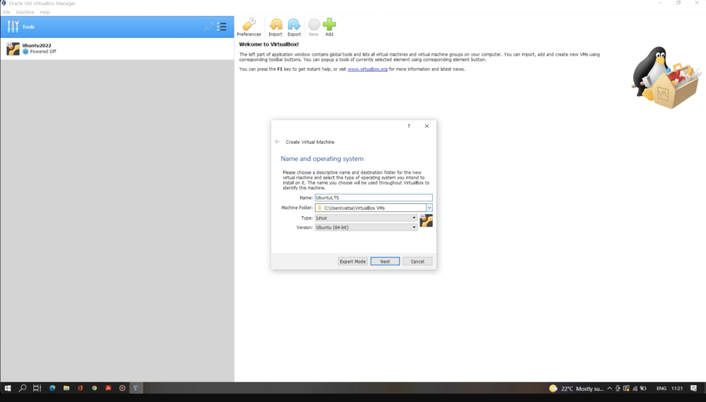
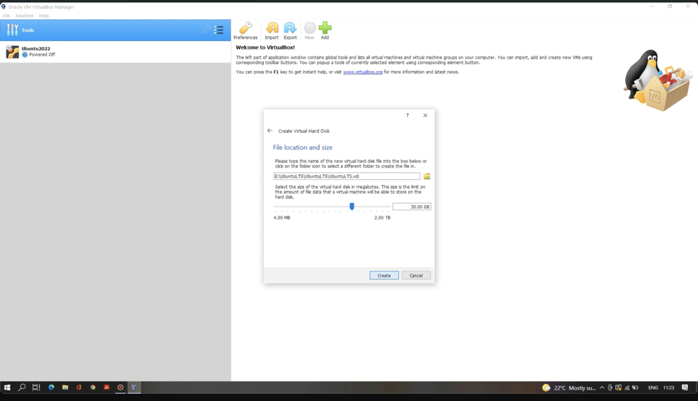
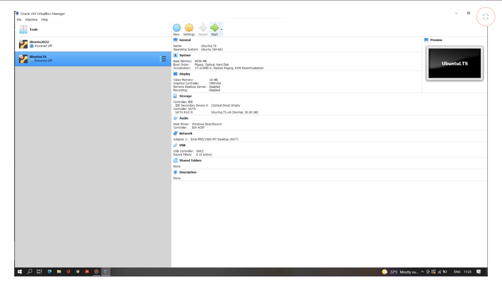
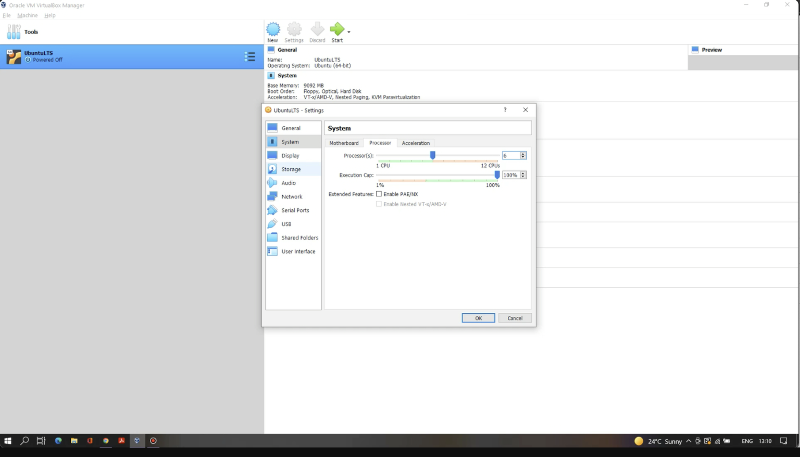
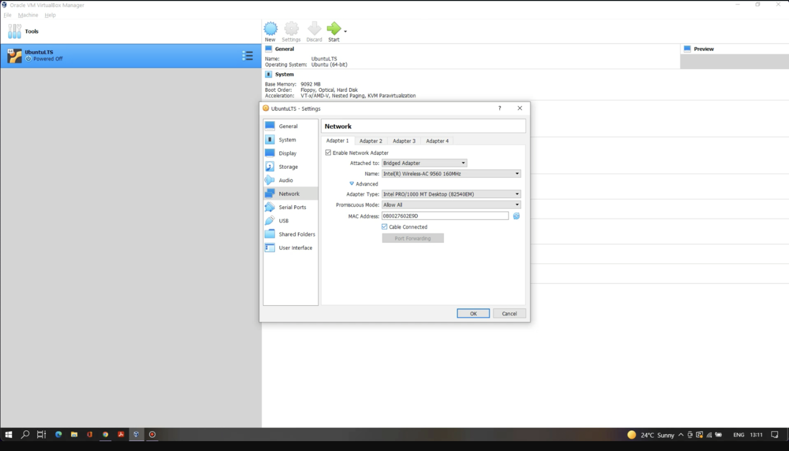
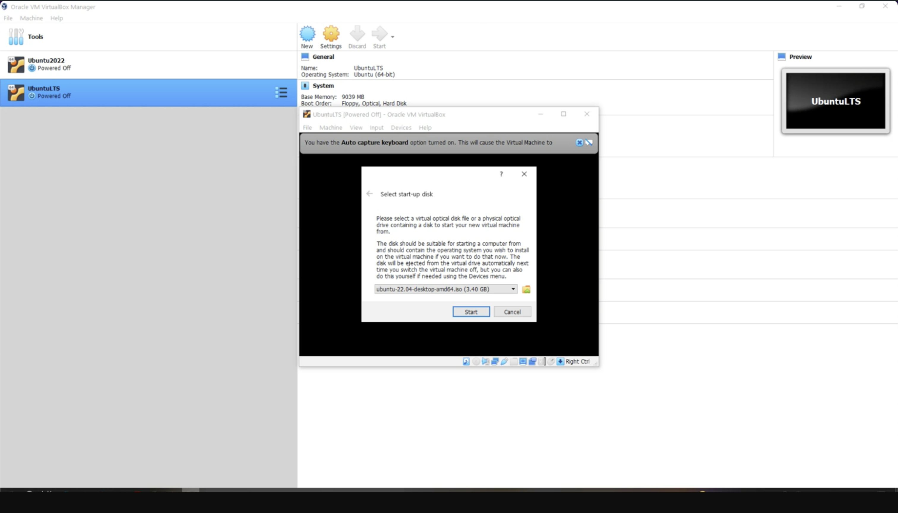
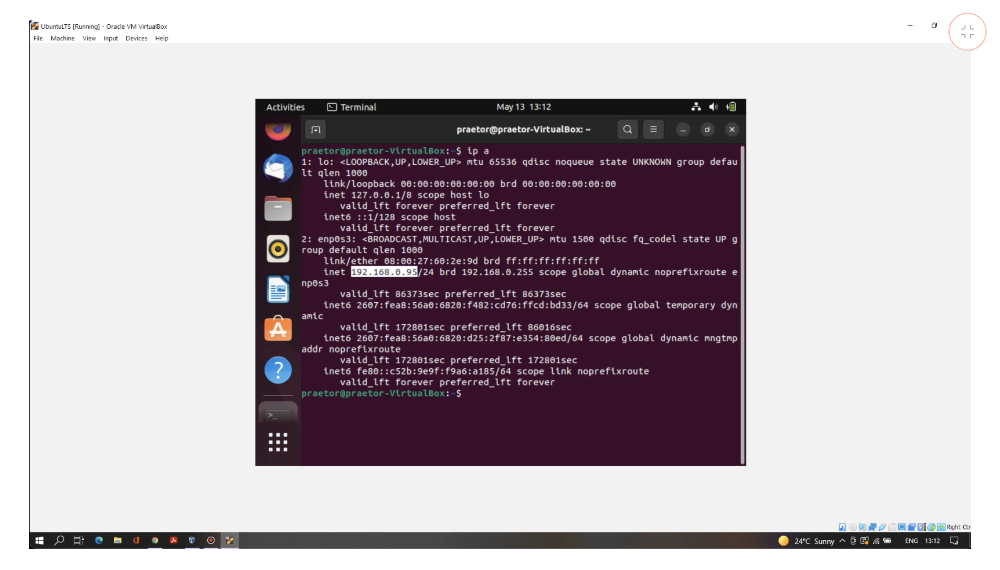
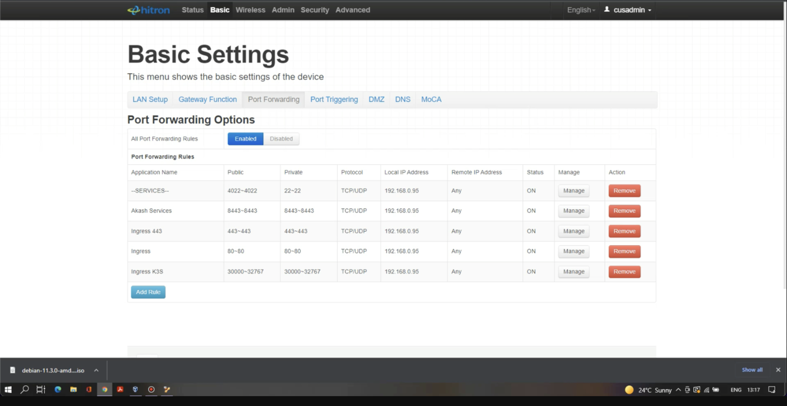

---
categories: ["Praetor App"]
tags: ["Praetor App"]
weight: 6
title: "Build a Cloud Provider (Windows)"
linkTitle: "Build a Cloud Provider (Windows)"
--- 

If you have a Windows machine and want to become a Provider, follow these steps:

## Step 1: Download and Install Oracle VirtualBox

1. Download VirtualBox by [here](https://www.virtualbox.org/wiki/Downloads). Select "Windows host" to download the Windows version.

2. Install VirtualBox by double-clicking the downloaded file.

## Step 2a: Create a New VM and Install an OS

1. Open VirtualBox and click on Machine > New.

2. Provide a name and path for the VM. Select the operating system type "Linux" and the version "Ubuntu" based on your computer's architecture.

3. Click Next and set the memory size (minimum required is 4096 MB).

4. Click Next and select the "Create a virtual hard disk now" radio button.

5. Click Create and choose the "VDI (VirtualBox Disk Image)" radio button.

6. Click Next and select the "Dynamically allocated" radio button.

7. Click Next and set the virtual hard disk size (minimum required is 30 GB).

8. Click Create to finalize the new VM setup.

## Step 2b: Configure the VM

1. Select the newly created VM and click Settings.

2. In the System section, go to the Processor tab and set the Processor(s) to at least 2 CPUs.

3. In the Network section, go to the Adapter 1 tab and select "Bridged Adapter" under the "Attached to" label.

4. Under Advanced settings:
  * Set "Promiscuous Mode" to "Allow All".
  
  *Click the Refresh icon to refresh your MAC Address.

  *Ensure the "Cable Connected" checkbox is checked.

  
5. Click OK to save your settings.

## Step 2c: Start the VM and Install the OS

1. Click Start to launch your VM.

2. Provide an image of the OS you want to install in the VM.

3. Follow the prompts to complete the OS installation (this typically takes 10-15 minutes).

4. After installation, restart the VM.

## Step 2d: Configure the OS

1. If the user is a sudo user, refer to the [sudo user requirements](../sudo-user-reqs/).

2. Open the terminal and type `ip a` to get your private IPv4 address.

## Step 3: Port Forwarding

1. Access your router's configuration page and set up port forwarding to the IPv4 address obtained earlier.
  * Port 8443, 8444: For running Akash Provider service.

  * Port 80, 443: For applications deployed under your provider.

  * Port 22: For SSH connections.

  * Ports 30000-32767: For other TCP/UDP connections.

> Note: The configuration settings in the above screenshot are just for reference, and may vary depending on your ISP.

You are now ready to become an Akash cloud provider. First, you will need to know your public IP address.

## Support

If you have any issues or trouble getting the provider machine up and running, you may reach out to the [Praetor](https://praetorapp.com) team  on [Discord](https://discord.com/invite/uzUCHTF93D) or [Twitter/X](https://x.com/praetor_app).

