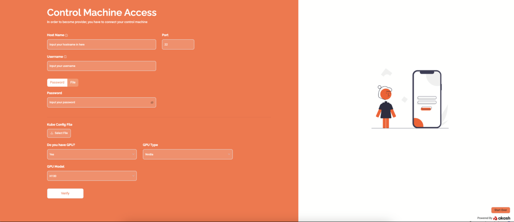
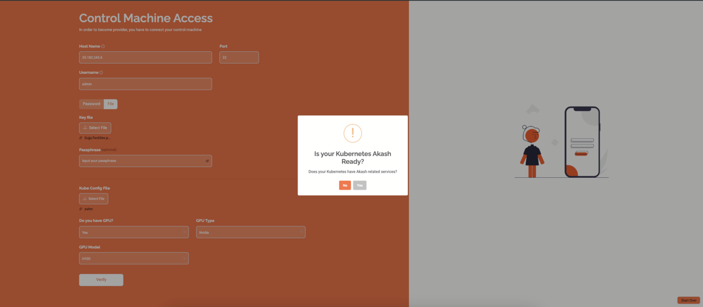

If you answered "yes," follow the guide below to become an Akash Cloud Provider. If "no," please refer to the [Creating an Akash Provider Using the Akash Console](../../../../../providers/build-a-cloud-provider/provider-console/provider-console/) documentation for assistance.

> NOTICE! It is now recommended that you use `chrony` instead of `systemd`. You can see instructions on how to install `chrony` on the [Time Synchronization Documentation page](../../../../../providers/build-a-cloud-provider/akash-cli/time-synchronization/)

## Prerequisites:

1. A complete Kubernetes cluster.
2. Open the SSH port (usually 22) for the IP Address "68.250.12.64" (Praetor App's IP).
3. An existing Akash wallet with a minimum balance of 5 AKT.
4. The Kubernetes config file of the cluster you wish to provide.
5. A valid domain name to perform DNS changes, pointing specific domains to your cluster's machines/IP addresses.

## Step 1: Check the Kubernetes Cluster

Ensure your cluster is ready by executing the following command:

```
debian@node1:~$ kubectl get nodes -o wide

NAME    STATUS   ROLES                  AGE   VERSION   INTERNAL-IP   EXTERNAL-IP   OS-IMAGE                       KERNEL-VERSION    CONTAINER-RUNTIME
node1   Ready    control-plane,master   13d   v1.23.6   10.0.10.114   <none>        Debian GNU/Linux 10 (buster)   4.19.0-20-amd64   containerd://1.6.3

node2   Ready    control-plane,master   13d   v1.23.6   10.0.10.115   <none>        Debian GNU/Linux 10 (buster)   4.19.0-20-amd64   containerd://1.6.3

node3   Ready    <none>                 13d   v1.23.6   10.0.10.116   <none>        Debian GNU/Linux 10 (buster)   4.19.0-20-amd64   containerd://1.6.3
```

Notice the CONTAINER-RUNTIME column's value must be "containerd".

Ensure that the Kubernetes cluster's runtime class is "gVisor." You can verify this by running the following command.

```
debian@node1:~$ kubectl get runtimeclass

NAME     HANDLER   AGE
gvisor   runsc     13d

```

## Step 2: Praetor App Login

Go to the [Akash provider console](https://provider-console.akash.network/) to become an Akash Cloud Provider. [Praetor is now called Akash provider console](https://provider-console.akash.network/)


Click on the "Connect" button. It will ask you to connect your Akash wallet using the Keplr browser extension.

> NOTICE! This address will be used to become a cloud provider on the network.


Keplr will request your permission to connect the wallet with Praetor App. Click "Approve" to continue.


Kelpr wallet would ask you to approve the transaction by approving your signature.
This signature would be used to make secure communication between the services.


You would be redirected to a page where you select the number of servers you want to provide to Akash. As you already have you already have an existing Kubernetes cluster, click on the "Skip this step if you have Kubernetes" button.

## Step 3: Control Machine Access



> NOTE! If you have GPUs, select "Yes" and you will see two options for your GPU selection. Please choose the appropriate answer and click the "Verify" button.

To install the Akash software and connect with your Kubernetes cluster, Praetor requires access to your server. This process needs a user with sudo access or root user privileges.

### Prerequisites:

**Open SSH Port:** Open the SSH port (usually 22) for the IP addresses "185.209.177.59, 185.209.177.46, 185.209.176.35" (Praetor App's IP).

### Inputs Required:

**Hostname:** Your server's hostname (either IP or web address without HTTP or HTTPS). If you use an IP address, it must be your public IPv4 address.

**Username:** The server username to log in (e.g., root, admin, ubuntu, debian, etc.).

### Password or File:

**Password:** Enter the login password for the user.
**File:** Upload the SSH private key file. If your key file is encrypted, you can also provide a passphrase.
**Kube Config File:** Upload a valid Kubernetes configuration file.

Upon clicking "verify," the following pop-up screen will open.



This alert message asks if you have the necessary dependencies for the Akash Network already installed. The required dependencies for Akash Network are Akash Software, hostname operator, network policy, and Ingress NGINX.

- Clicking "No" will install the Akash Network dependencies on the server.
- Clicking "Yes" indicates that all dependencies are already installed on the server and skips the Akash installation process.

## Step 4: Import Akash Wallet

You need to import a wallet to be able to run your provider as well as to receive lease payouts in AKT.


There are two ways to import your Akash wallet, namely:

1. Praetor Mode(Recommended)


Praetor will verify a seed phrase for an existing account and create a Keystore file in your server.

**Input**

- Seed Phrase: Wallet Seed phrase (e.g. apple create carpet grain juice)
- Password: 8 letter password of your choice. The app will use the password to encrypt the Keystore file.

> IMPORTANT! Praetor uses end-to-end encryption on both your password and seed phrase, so you can rest assured that they are safe. That said, if you don’t want to provide your seed phrase here, you can switch to manual mode by clicking on the “Switch to Manual Mode” button.

2. Manual Mode


Run the following steps on your server:

(i) Login to the control machine using the username you used in the **Step 2**

(ii) Create a Keyring file using the command

`~/bin/akash — keyring-backend file keys add wallet_name — recover`

(iii) Enter your mnemonic seed phrase and password

(iv) Run the following command and enter the same passphrase you have used in (ii)

`echo {passphrase} > ~/.praetor/wallet_phrase_password.txt`

## Step 5a: Provider Configuration


You one step are closer to becoming a provider on the Akash Network.

On the `Provider Configuration` page, provide your Domain name and Organization Name, after which you then click "Next."

**Input**

- Domain Name: Please enter your domain name. Please make sure you have access to the domain name as you'll need the DNS details later on.

- Organization Name: Choose a unique name for your machine on the Akash Network (e.g. Praetor App).

## Step 5b: Provider Pricing


On the "Provider Pricing" page, you would be required to enter your system configuration. Praetor will use the information provided to generate a server certificate, aand turn on your provider service on Akash.

Under advanced settings, you can set the pricing you wish to lease out your machine. It would also allow you to see the estimated earnings you would receive from your provider.

**Input**

- CPU Scale Bid Price: CPU scale pricing in USD per thread per month.
- Memory Scale Bid Price: Memory scale pricing in USD per GB per month.
- Storage Scale Bid Price: Storage scale pricing in USD per GB per month.
- Persistent Storage Scale Bid Price: Persistent Storage scale pricing in USD per GB per month.

**Advanced Settings**

- IP Scale Price: IP Scale price in USD per IP per month.
- Endpoint Scale Bid Price: Endpoint pricing in USD per porth per month.
- Bid Deposit: Bid deposit in uakt (e.g. 5000000 uakts = 5 AKTs).

## Step 5c: Provider Attributes


On the "Provider Attributes" page, you can add custom attributes to your provider. To do so, you would need to enter the attributes as a key-value pair, and then click on the "Next" button.

> NOTE! Adding extra attributes may incur additional charges.

Once you have filled in all the necessary information, click on "Next". The process of becoming provider on chain will then begin.


Wait a few minutes as the progress screen keeps you updated as Praetor runs a script to make you an Akash provider.


Once the process is completed you'll be redirected to a page congratulating you on became a provider on Akash Network.

## Step 6: Port & DNS Configuration

All the ports listed in the port table have to open for 0.0.0.0(Anywhere IPv4).

Ensure your provider domain and ingress domain point to the correct IP Address shown in the image below.


## Step 7: Akash Audit

Akash is audited by security professionals trusted by the Akash community. They are responsible for auditing providers' technical proficiency so as to provide ansurance to consumers about the minimum quality of service you can provide.


To begin the auditing process, click on the "Apply for Audit" button as shown in the image above.
You would then be required to provide basic information about your provider.


Complete the form and submit. You may also decide to skip the audit process if you want to, but that means you would not be considered a reliable provider by most potential customers.

## Step 8: Dashboard


Congratulations! You are now a provider, and should be able to receive leases on your machine. The Dashboard will provide information about your machine's server statistics, as well as show hactive, available, and pending resources.


Click on "Provider Settings" if you want to modify various settings for your provider. These include attributes, pricing, domain name, provider url and provider node. You can also restart or upgrade your provider,as well as send a message to your deployers.


Click on "Provider Deployments" to see active and inactive deployments in your provider.

## Support

If you have any issues or trouble getting the provider machine up and running, you may reach out to the [Praetor](https://praetorapp.com) team on [Discord](https://discord.com/invite/uzUCHTF93D) or [Twitter/X](https://x.com/praetor_app).
