If you have a single server and wish to become a cloud provider on the Akash Network, this guide will help you set up Kubernetes and become an Akash provider using the Praetor App.

**Prerequisites**

- Keplr Wallet: Ensure the Keplr wallet extension is enabled in your web browser.

- Akash Wallet: You need at least 5 AKT in your Akash wallet to become a provider.
- Domain Name: A valid domain name is required to make DNS changes and point it to your server's IP address.

**GPU Testnet**

If you're joining the Testnet, select "Testnet" from the dropdown. Note that only the latest Nvidia GPUs are currently supported by the Akash Network.

## Step 1: Praetor App Login

1. Access Praetor App:

- Go to the [Akash provider console](https://provider-console.akash.network/) to begin the setup.

2. Connect Wallet:

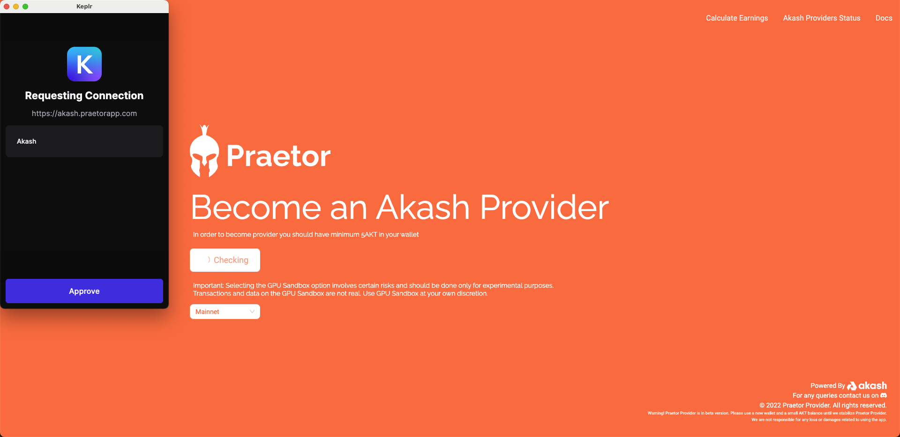

- Click "Connect" and connect your Akash wallet using the Keplr extension.

- Select "Testnet" if applicable.

3. Authorize Connection:

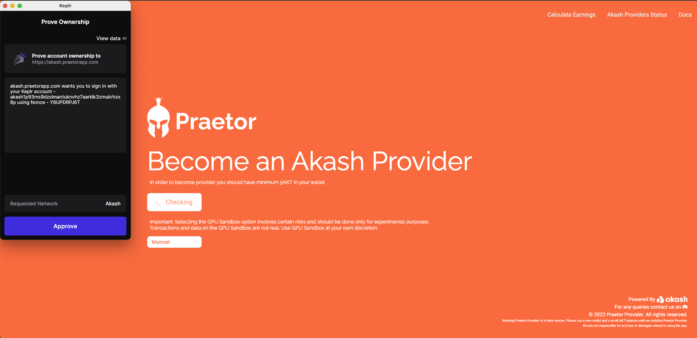

- Approve the connection request from Keplr to connect your wallet to Praetor App.

- Sign the message in Keplr to secure communication with the backend.

4. Server Provisioning:

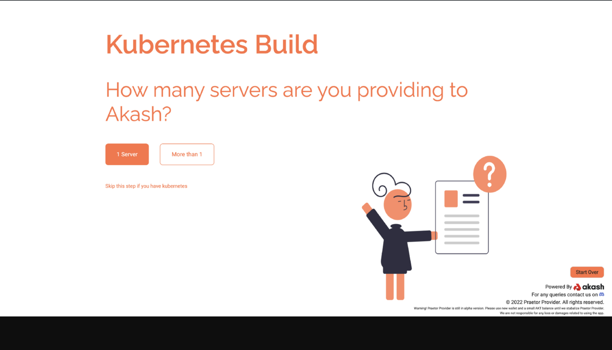

- Select the number of servers to provide to Akash. For a single server, select "1 Server".

## Step 2: Server Access

1. Server Details:

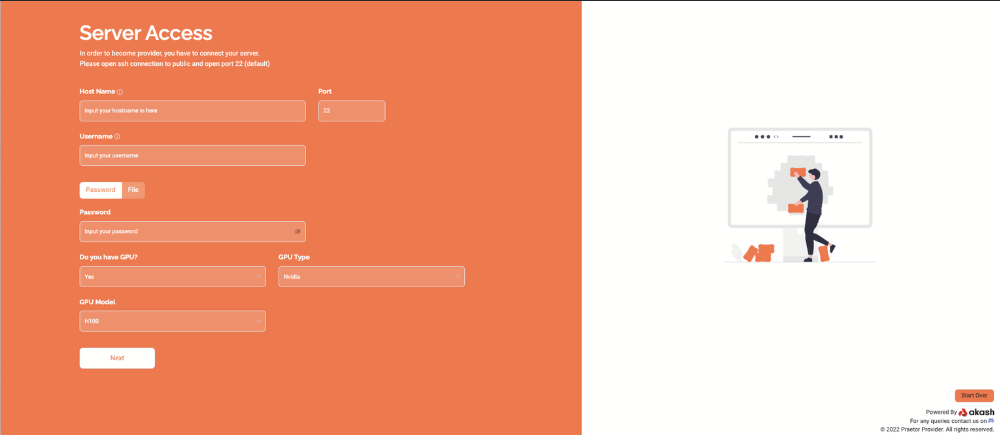

> NOTE!: If you have a GPU then select "Yes" and you will see two new options for your GPU selection. Please choose the appropriate answer and click "Next".

- Provide your server's hostname (IP or web address without HTTP/HTTPS).

- Enter the username (e.g., root, admin) and either the login password or upload the SSH private key file.

2. Install Dependencies:

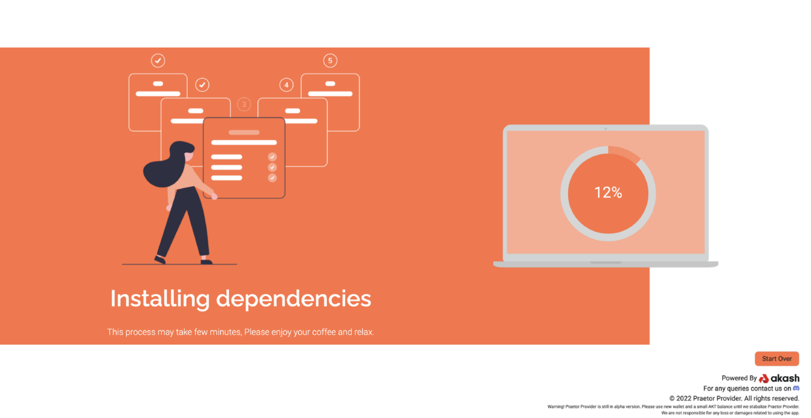

- The application will access your server to install Kubernetes, Akash software, and necessary dependencies. Ensure SSH port 22 is open.

## Step 3: Import Akash Wallet

You need to import a wallet to be able to run your provider as well as to receive lease payouts in AKT.

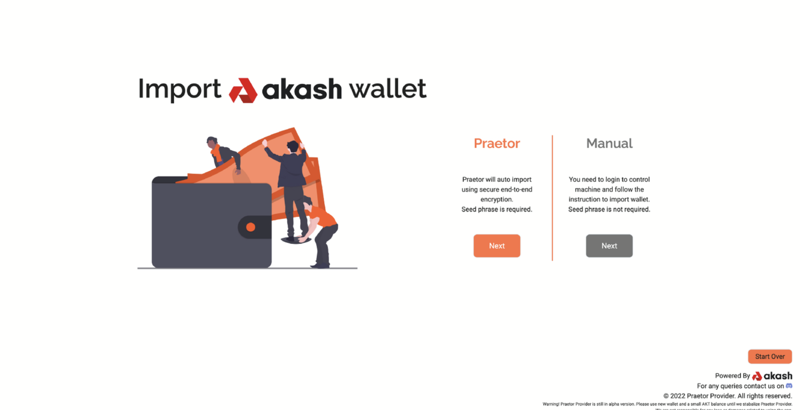

There are two ways to import your Akash wallet, namely:

1. Praetor Mode (Recommended):

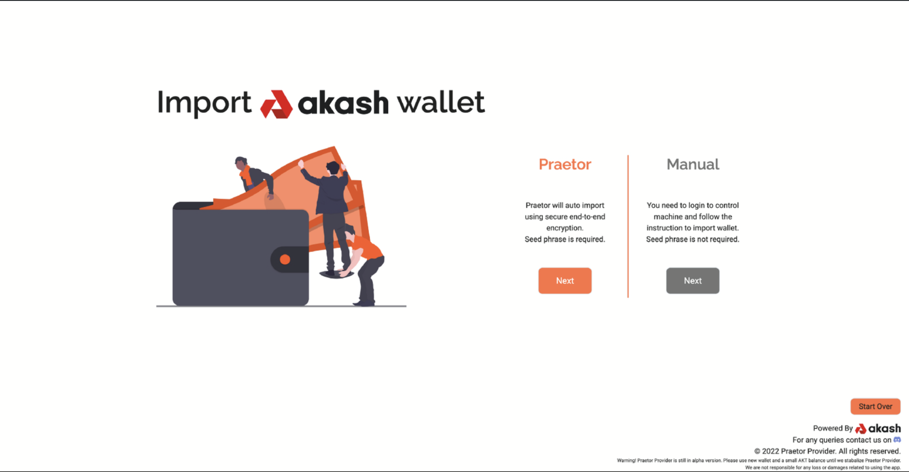

- Input your wallet seed phrase and password. The app will verify the seed phrase and create a keystore file on your server.

> IMPORTANT! Praetor uses end-to-end encryption on both your password and seed phrase, so you can rest assured that they are safe. That said, if you don’t want to provide your seed phrase here, you can switch to manual mode by clicking on the “Switch to Manual Mode” button.

2. Manual Mode:

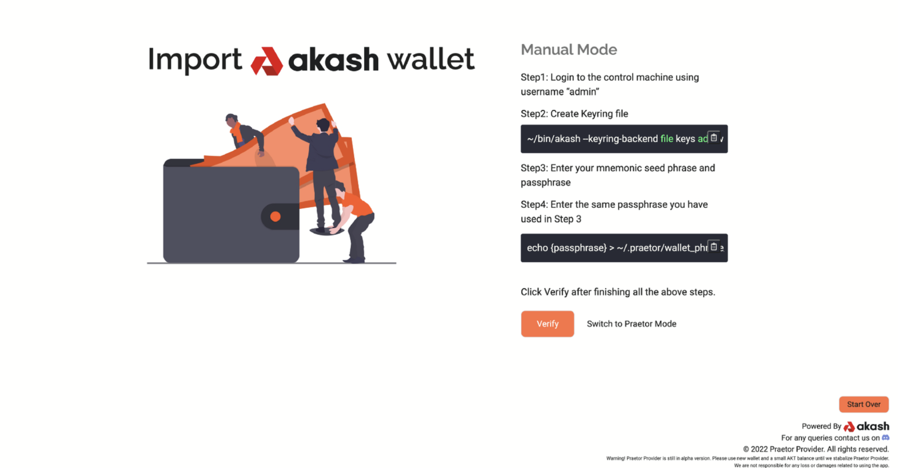

- Log in to your server.

- Use the command `~/bin/akash — keyring-backend file keys add wallet_name — recover` to create a keyring file.

- Enter your seed phrase and password, run `echo {passphrase} >  ~/.praetor/wallet_phrase_password.txt`.

## Step 4a: Provider Configuration

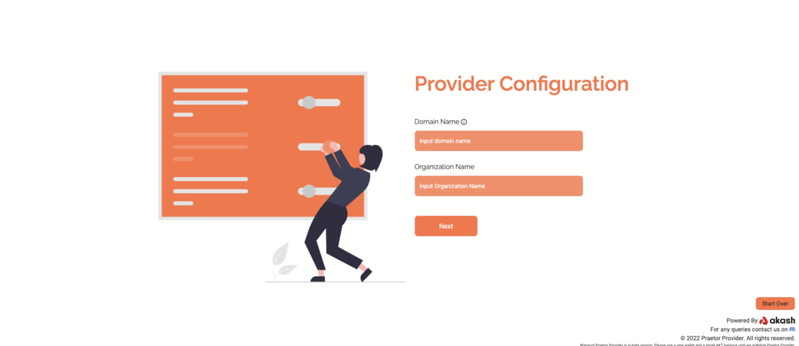

- Domain Name: Enter your domain name.

- Organization Name: Provide a unique name representing your machine on Akash Network.

## Step 4b Provider Pricing

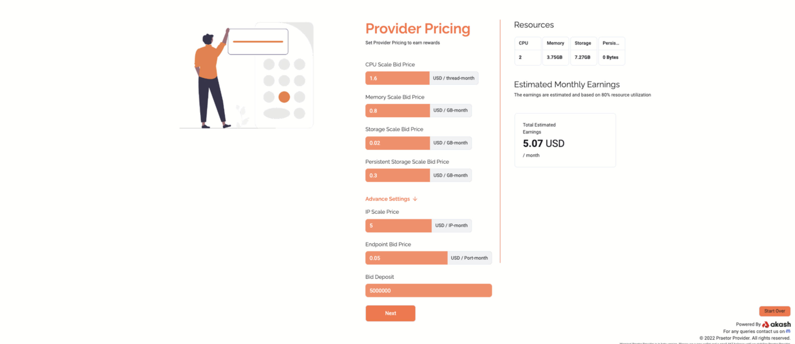

- CPU, Memory, Storage Pricing: Set your pricing in USD per month for each resource.

- Advanced Settings: Configure additional pricing for IPs, endpoints, and bid deposits in uakt (e.g. 5000000 uakts = 5 AKTs).

## Step 4c Provider Attributes

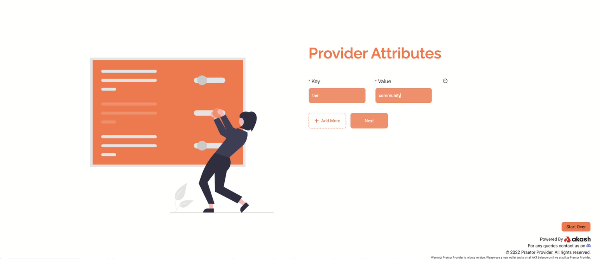

- Custom Attributes: Add any custom attributes in key-value pairs.

> NOTE! Adding extra attributes may incur additional charges.

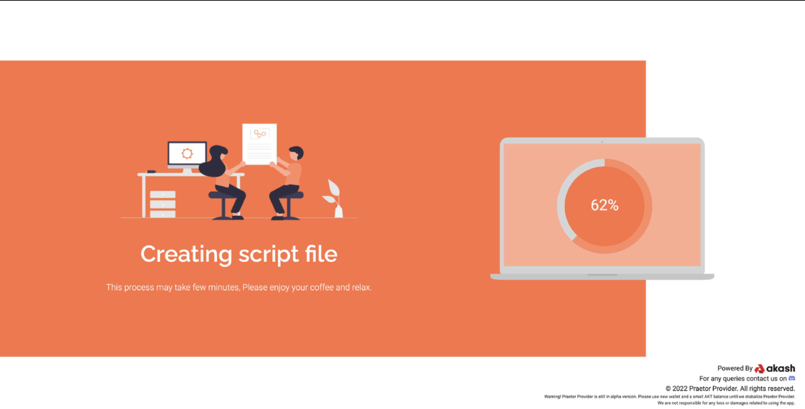

Wait a few minutes as the progress screen keeps you updated as Praetor runs a script to make you an Akash provider.

Once the process is completed you'll be redirected to a page congratulating you on became a provider on Akash Network.

## Step 5: Port & DNS Configuration

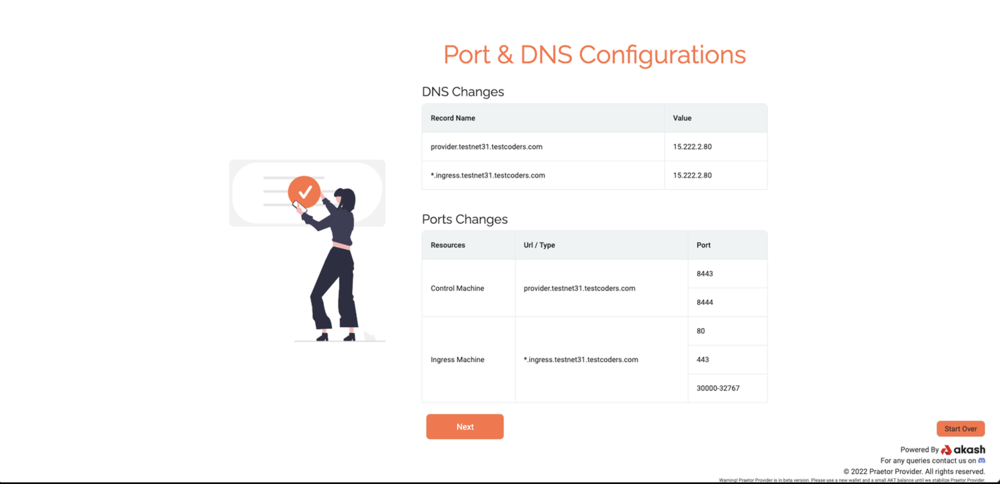

- Ensure all required ports are open for IPv4 (0.0.0.0).

- Update your DNS settings to point your domain to the correct IP address shown in the image above.

## Step 6: Akash Audit

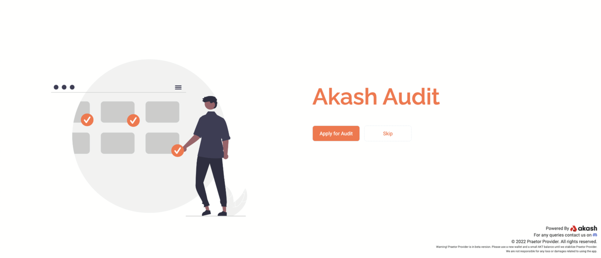

- Apply for Audit: Provide basic information to apply for an Akash audit.

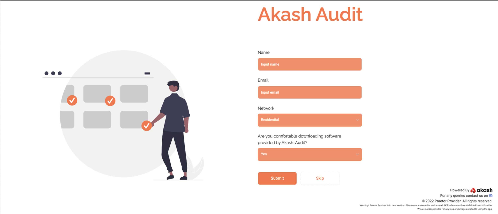

- Skip Audit: You can choose to skip the audit and proceed to the dashboard.

## Step 7: Dashboard

- Dashboard Overview: Monitor your server's statistics, including active, available, and pending resources.

- Provider Settings: Modify settings, restart, or upgrade your provider.

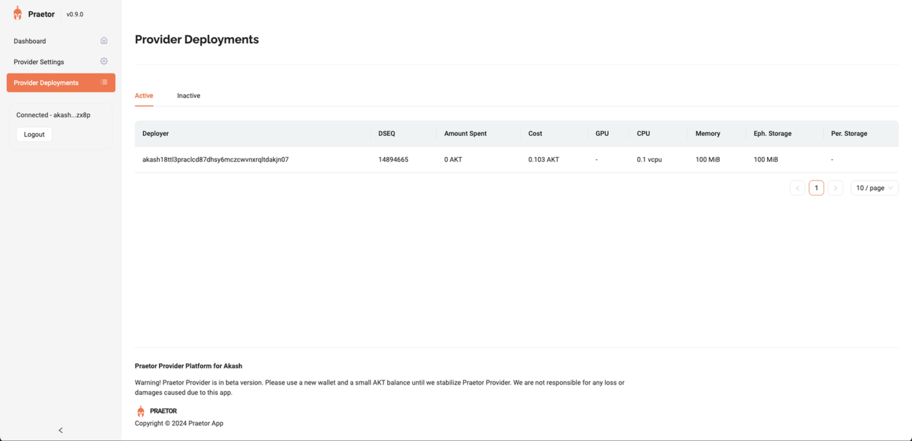

- Provider Deployments: View and manage active and inactive deployments.

## Support

If you have any issues or trouble getting the provider machine up and running, you may reach out to the [Praetor](https://praetorapp.com) team on [Discord](https://discord.com/invite/uzUCHTF93D) or [Twitter/X](https://x.com/praetor_app).
