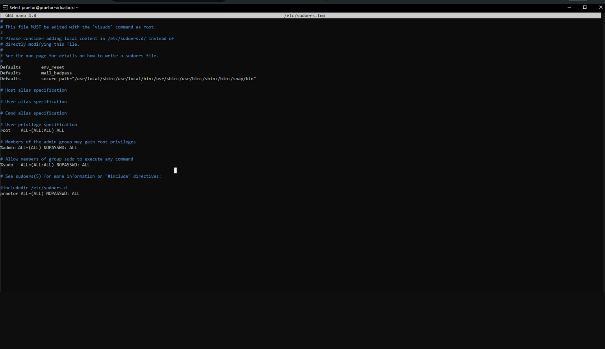

This document explains how to grant sudo rights to a user before using the Praetor App.

## Steps to Grant Sudo Rights

1. Connect to Your Server

First, connect to your server using SSH.

2. Edit the Sudoers File

After logging in to the server, type the following command:

`sudo visudo`

This command opens the sudoers file for editing.

3. Update the Sudoers File

Locate the following lines in the sudoers file and update them as shown to enable sudo access for the current user:

```
%admin ALL=(ALL) NOPASSWD: ALL
%sudo ALL=(ALL:ALL) NOPASSWD: ALL
<user> ALL=(ALL) NOPASSWD: ALL

```

Replace `<user>` with the username you wish to grant sudo rights to, if it is not already an admin or root user. For example, if the user is `praetor`, the line should read:

```
praetor ALL=(ALL) NOPASSWD: ALL

```



