The Akash Provider Console (previously known as Praetor App) is an easy way to become an Akash Provider. Being a provider allows individuals and organizations to rent out their unused computing resources. Click [here](https://provider-console.akash.network/) to get started.

This guide will walk you through the process of setting up an **Akash Provider** using the Akash Provider Console.

## Prerequisites:

1. **Akash Wallet with Sufficient Funds:** Ensure you have an account on Keplr Wallet with at least 30 AKT in it.
2. **Provider Machine:** To be a provider on Akash, you must have a node set up to offer resources. This could be a cloud server, a bare metal machine, or any server capable of hosting containers.ç
3. **Be logged in to your machine as the root user:** You shouold be the root user, and should have configured your machine. If you have not done that yet, please follow the [guide](../root-sign-in/)

## Step 1: Log in to the Akash Console

- Go to the [Akash Provider Console](https://provider-console.akash.network/) in your browser.

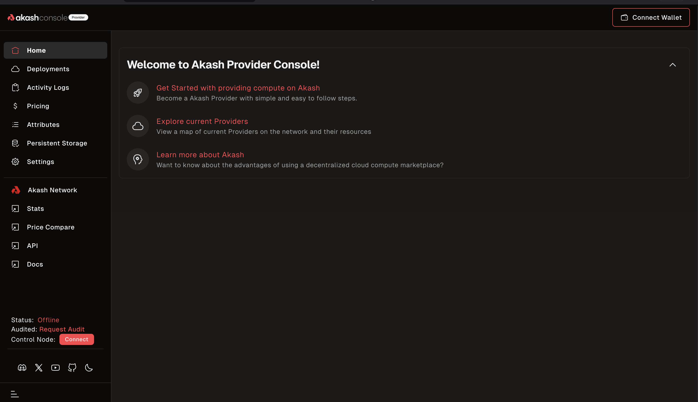

- Click on `connect wallet`.

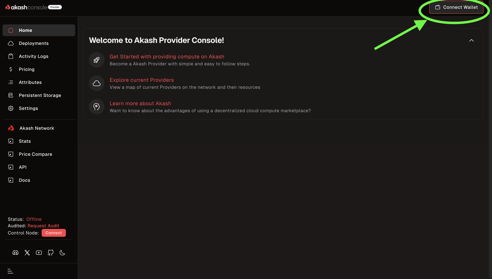

- Select `Keplr`, sign into your wallet, and approve the network collection request.

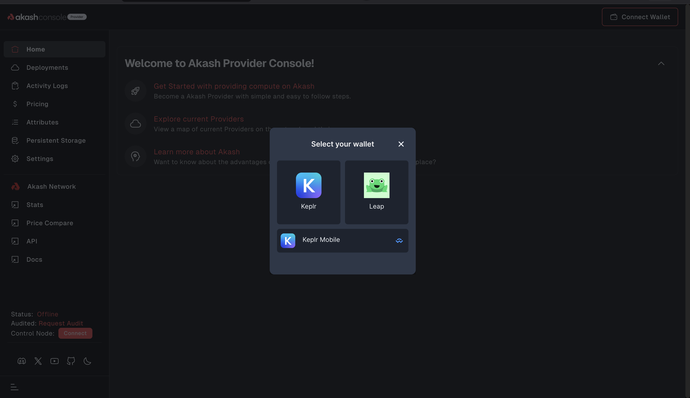

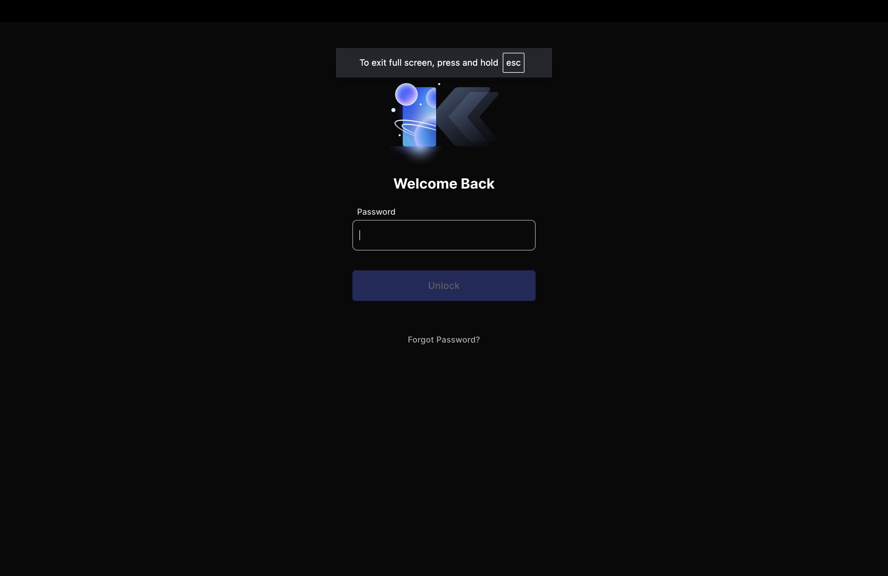

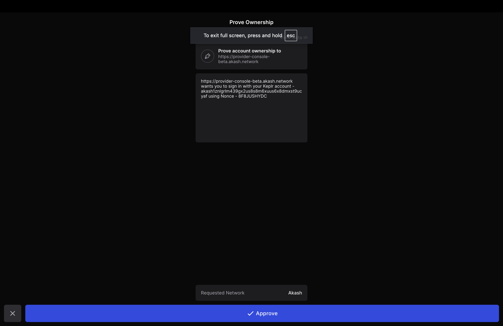

- Once you sign in successfully, you be on the `Create Provider` page.

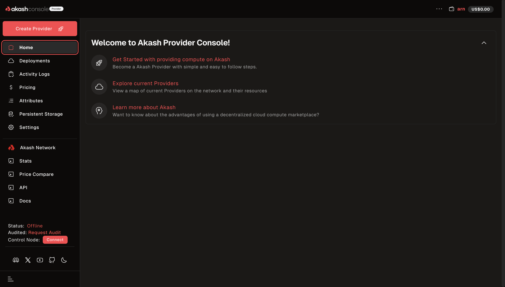

---

## Step 2: Set Up Your Provider Console

You may now go ahead and create a provider to lease out to users.

1.  Click on the `Create Provider` button.

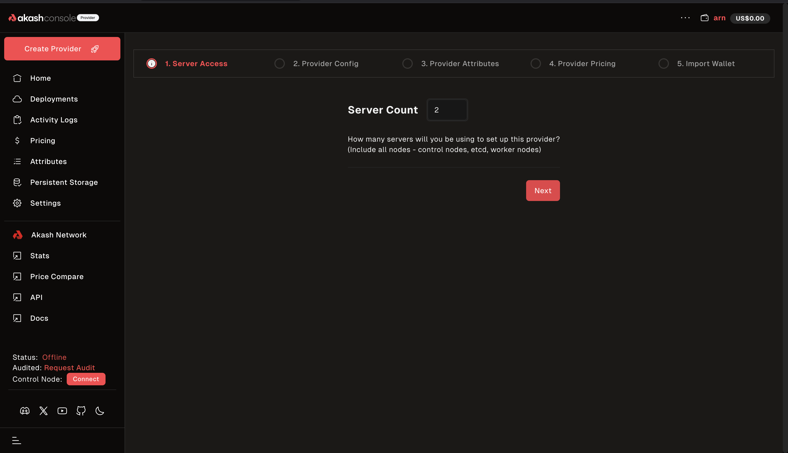

    You will be redirected to the Server Access Page

2.  In `Server Access`, enter the number of servers you want to provide. If you intend to have both `control plane` and `worker` nodes, you should provide at least 2 servers.

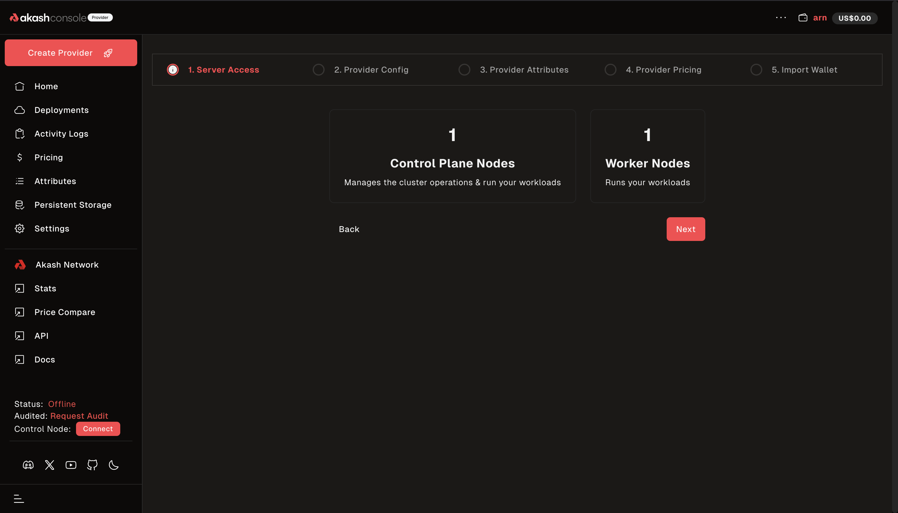

3.  Fill in the requested information for your `Control Plane Node`. Make sure you choose how you would like to provide your credentials: select either one `ssh` or `password`. Repeat the process for all of your nodes.

- **`Port`**: This is set at `22` by default. Do not change it, as this is allows access to your SSH client.

- **`SSH Username`**: This is the SSH Username of your machine. It should be set to root. You may follow this [guide](../root-sign-in/) to set it up if you have not done so yet.

- **`File`**: This is one of two options to provide your login credentials. You would upload your SSH key file here. It is the prefered credential method.

- **`Password`**: This is the second option to provide yopur login credentials. You woulld need to enable logging into your machine with password. It is advised that you use the file method.

- **`Public IP`**: This is the public IP of your machine. You can find it by running

`curl -s ifconfig.me`.

It would return your public IP which should look like:

`127.81.125.35`

This would only work if you are online.

- **`Private IP`**: This is your machine's private IP address.
  To find it use the following command if you are using a Wi-Fi connection

`hostname -I`

You should receive a response similar to:

`172.31.13.12`

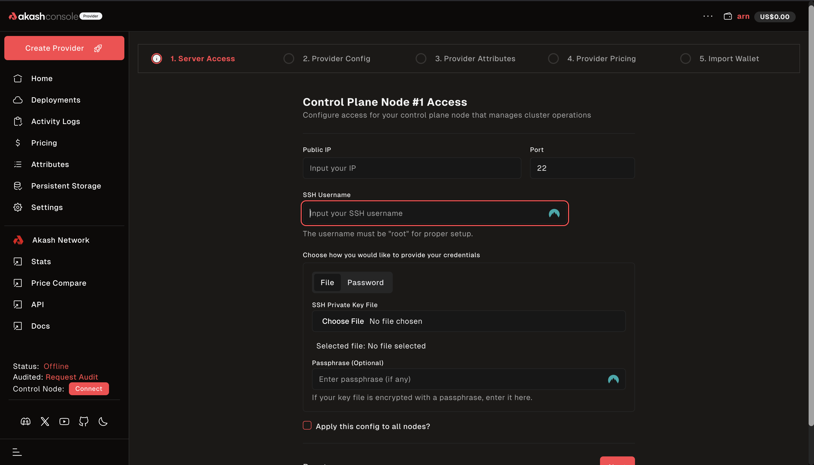

4.  If you selected created 2 or more servers, you would have at least one worker node. For every node Pairing, the `Control Nodes` use the public IP addresses, while the `Worker Nodes` use the private IP addresses.

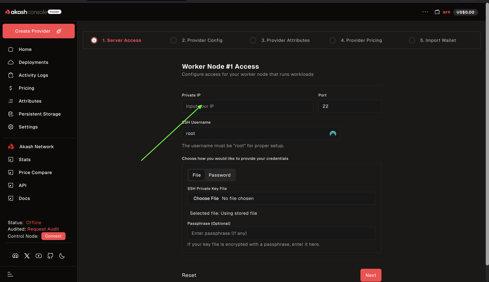

5.  Fill in your provider configurations for you `Control Nodes`.

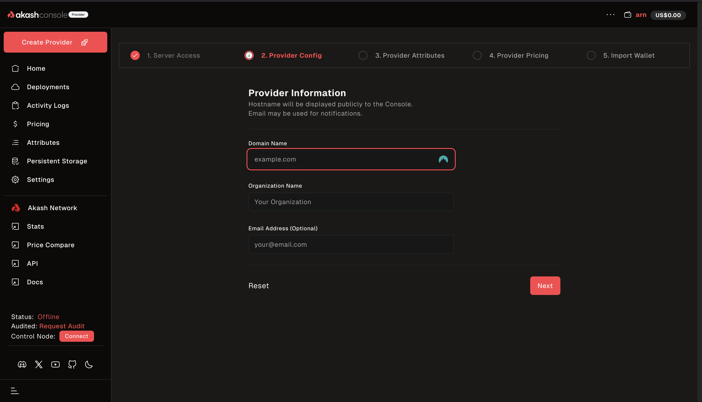

6. Review the attributes you provided:

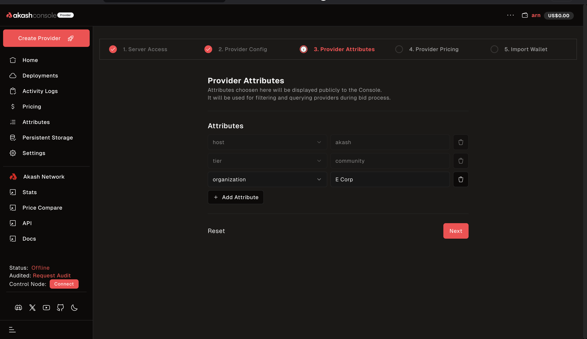

7.  Adjust the pricing of the various services you would be providing. The prices you set here determine the price your provider bids with and total revenue it earns for you.

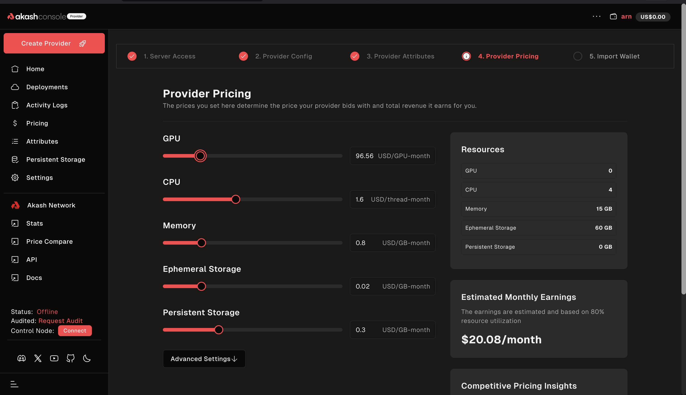

8.  Import your wallet. This would be the wallet you ould be paid by leasées for using your machine. You'll have the option of either importing it automatically or manually doing so.

    **Importing Automatically**

- If you decide to do so automatically, select `Auto Import` and click `Next`.

- You would then be asked to enter your seed phrase. You should use the seed phrase from the same wallet you connected to `Provider Console` with.

9. Once you do that, it should start building your cluster.

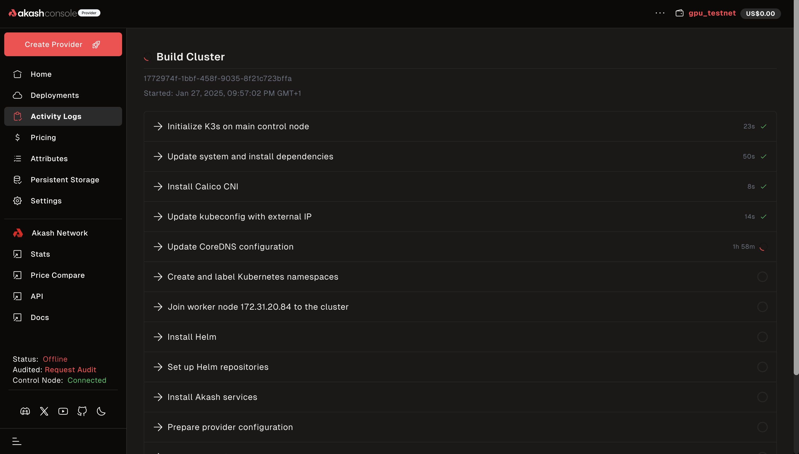

If your settings and configurations are done correctly, you should be done in a couple of minutes.

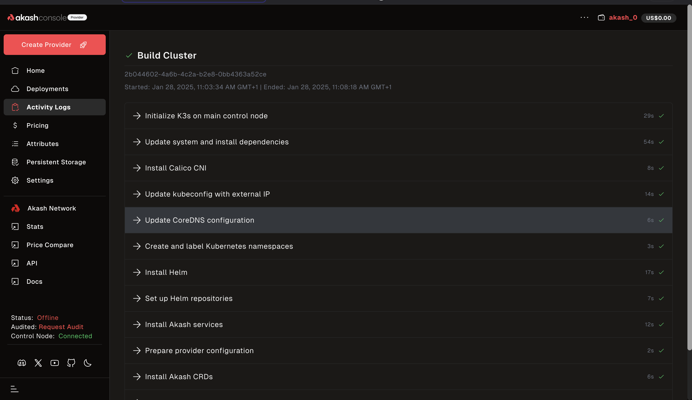

10. Make DNS Changes: For your domain to work, you would need to point your machines' public IPs to the `provider.example.com` domain name and the `*.ingress.example.com` domain name. This would need to be configured from your domain registrar's control panel. As the methods vary widely per domain registrar, please check the specific registrar docs for instructions.

## Conclusion

Your machine is now ready to be leased. However, to increase the odds of earning from your machine, you could request an audit [here](https://github.com/akash-network/community/issues?q=is%3Aissue+is%3Aopen+label%3A%22Provider+Audit%22)
