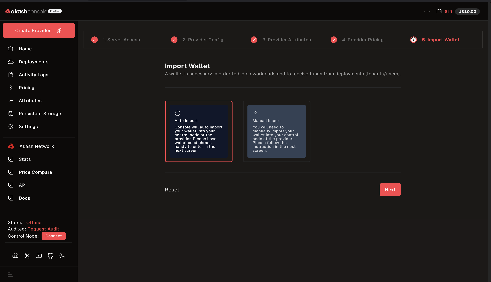

The Akash Provider Console is an easy way to become an Akash provider. Being a provider llows individuals and organizations to rent out their unused computing resources. 

This guide will walk you through the process of setting up an **Akash provider** using the Akash Provider Console.

---

## Prerequisites:
1. **Akash Wallet with Sufficient Funds:** Ensure you have an account on Keplr Wallet with at least 30 AKT in it. 
2. **Provider Node:** To be a provider on Akash, you must have a node set up to offer resources. This could be a cloud server, a bare metal machine, or any server capable of hosting containers.

---

## Step 1: Log in to the Akash Console
- Go to the [Akash Provider Console]() in your browser.

- Click on `connect wallet`.

- Select `Keplr`, sign into your wallet, and approve the network collection request.

- If everything went well, you will now have an option to `Create Provider`

---

## Step 2: Set Up Your Provider Node
   You may now go ahead and create a provider to lease out to users. 

   1. Click on the `Create Provider` button. You will be redirected to the`Import Wallet` page. 
   
   

   2. In `Server Access`, enter the number of servers you want to provide. If you intend to have both `control plane` and `worker` nodes, you should provide at least 2 servers.

   

   

   3. Fill in the requested information for your `Control Plane Node`. Make sure you choose how you would like to provide your credentials: select either one of `ssh` or `password`. Repeat the process for all of your nodes. 

   

   4. Fill in your provider attributes

   

   5. Review the attributes you provided:

   

   6. Adjust the pricing of the various services you would be providing. The prices you set here determine the price your provider bids with and total revenue it earns for you.

   

   7. Import your wallet. You'll have the option of either automatically importing it pr manually doing so. 
   
   i. If you decide to automatically do so, select `Auto Import` and click `Next`.
   
   ii. You would then be asked to enter your seed phrase. 

