Deployments may be launched on the GPU Testnet via the Akash Console, Akash Console, and the Akash CLI. Follow the links provided below based on your preferred deployment tool.

- [Akash Console](#akash-console)
- [Akash CLI](/docs/deployments/akash-cli/installation/)

## Akash Console

### Akash Console for GPU Testnet Overview

Akash Console is a web based application that makes it easy to deploy applications onto the Akash Network. Post deployment, Akash Console provides a dashboard to view the status and details of workloads. The dashboard also has the ability to perform administrative tasks including closing the deployment, updating the deployment, redeploying, and increasing the funding available to the deployment.

This guide will cover the following topics that are relevant for Akash Console use in the GPU Testnet:

- [Akash Console Access](#akash-console-access)
- [GPU Testnet Settings](#gpu-testnet-settings)
- [Keplr Account Selection and Funding](#keplr-account-selection-and-funding)
- [MInesweeper Deployment Example](#minesweeper-deployment-example)

### Akash Console Access

#### Before Getting Started

The Keplr browser extension must be installed and with sufficient funds (5AKT minimum for a single deployment plus a small amount for transaction fees).

&#x20;Follow our [Keplr Wallet](/docs/getting-started/token-and-wallets#keplr-wallet) guide to create your first wallet if necessary.

#### Akash Console Access

The Akash Console web app is available via the following URL:

- [https://console.akash.network/](https://console.akash.network/)

### GPU Testnet Settings

#### Configure GPU Testnet Network Settings

- Prior to launching a deployment, we need need to configure a few settings for GPU Testnet use

##### Access Settings

- Begin by accessing the Settings via selection of the gear icon and as depicted below

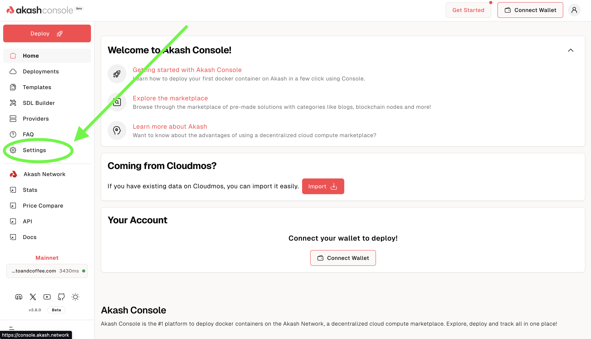

##### Initial Settings

- The Console is most likely current configured to interact with the Akash Mainnet
- In the depiction below we find this to be the case. The Console is connected to `Mainnet`.

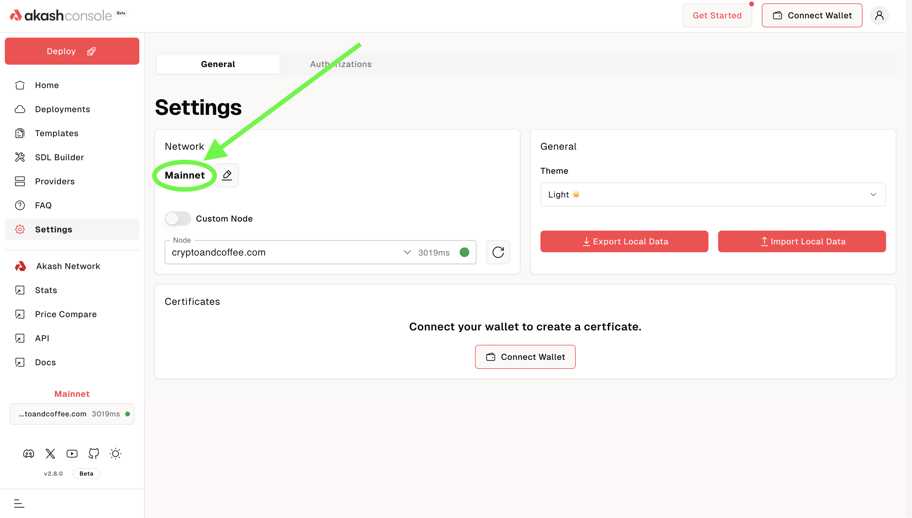

##### Update Settings for GPU Testnet Use

- To interact with the GPU Testnet via the Akash Console, select the `edit` icon (it looks like a pencil, see the diagram below) in the `Network` section.

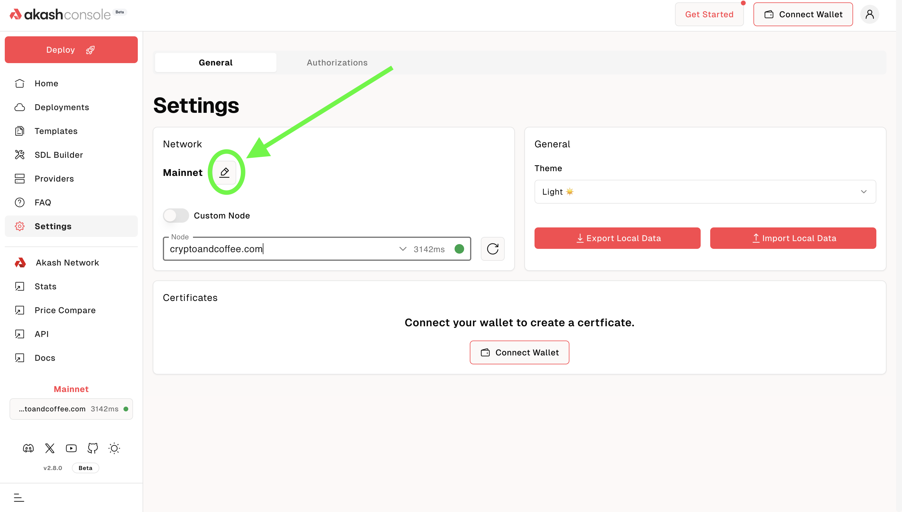

A box would pop-up, asking you to `select network`.

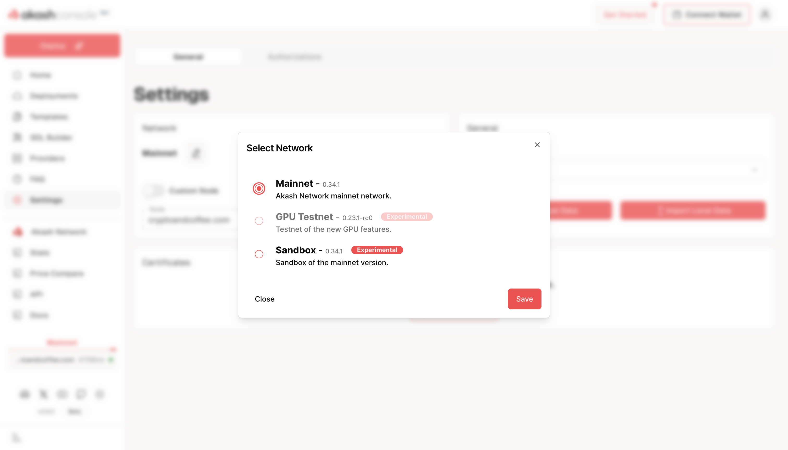

- Select the `Sandbox` network.
- Click the `Save` button.


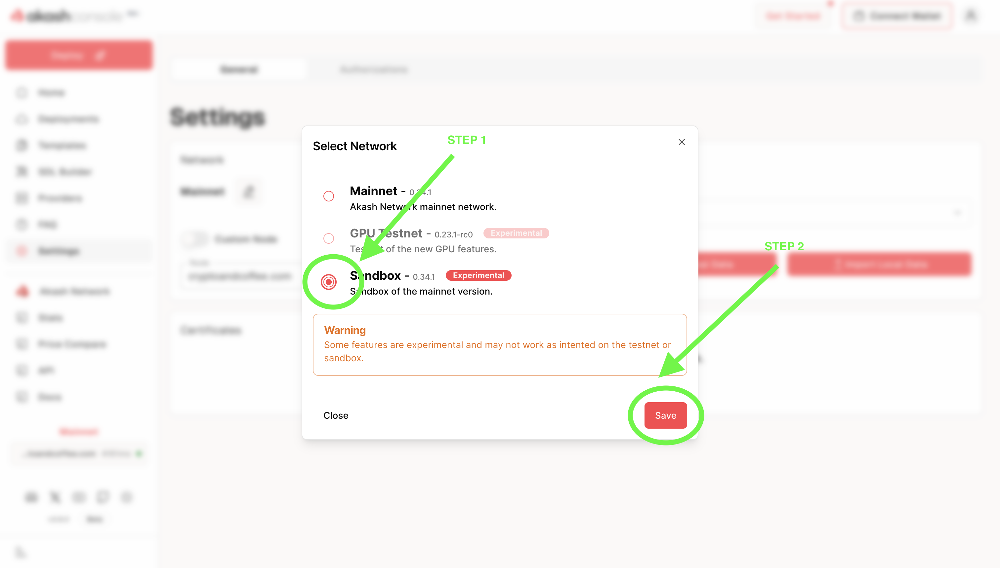

Your selected network would now be listed as `Sandbox`.


### Keplr Account Selection and Funding

#### Keplr Account Selection

Select a pre-existing tAkash account within Keplr. If you do not have a pre-existing Akash account - use the `Add Wallet` feature within Keplr to create a new account.

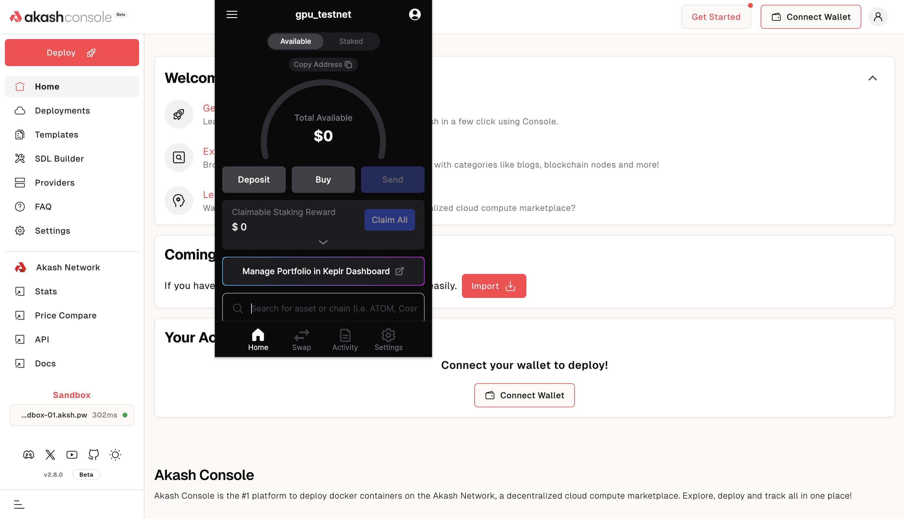

#### Connect Wallet

Use the `Connect Wallet` button to connect the account selected in Keplr in the prior step to the Akash Console. Select `Keplr` from the wallet selector. 

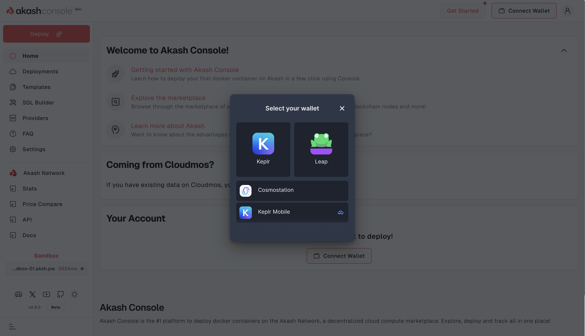

#### Fund Selected Account via Testnet Faucet

Visit the Testnet faucet [here](https://faucet.sandbox-01.aksh.pw/) to fund your provider account. &#x20;

Enter the address of the account selected in previous step. The address of the account can be copied from the Keplr wallet.

###### Example Use of Akash Testnet Faucet


###### Example/Expected Faucet Output

The following screen shot shows an example/expected output following successful submission to the Testnet faucet. Note that the displayed transaction hash will be unique and different than the one displayed in this example. Receipt of this screen confirms successful funding of your account with `25AKT`.


### Minesweeper Deployment Example

In this section we will use the Akash Console to launch an example Minesweeper deployment on the Akash Testnet. You can follow the same process for any other workload so long as it is containerized and you have an appropriate SDL.

#### STEP 1 - Create the Deployment

- Begin the process of creating a new deployment by clicking opn the `Deploy` button on the top left corner of the page. 

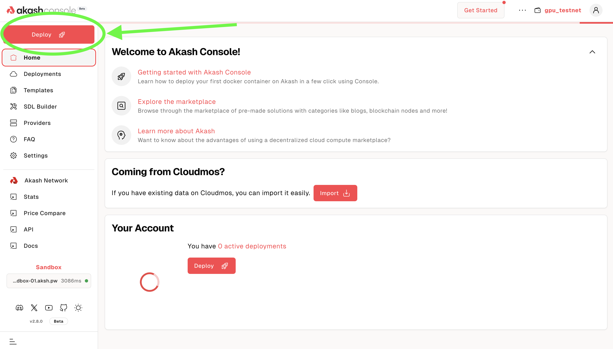

- A number of deployment types are presented in the gallery
- For our purposes we will import a SDL for the Minesweeper deployment example. Select `Build your template` to proceed.

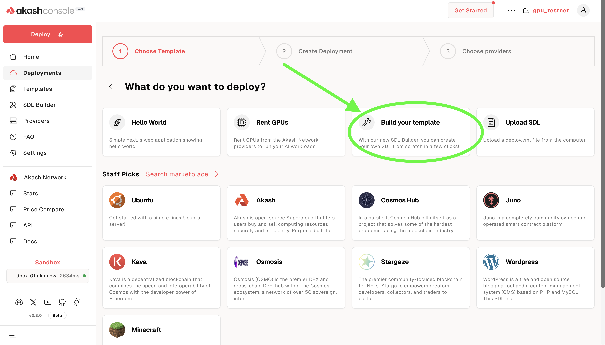

You would be redirected to the page below. Click on the `YAML` button.

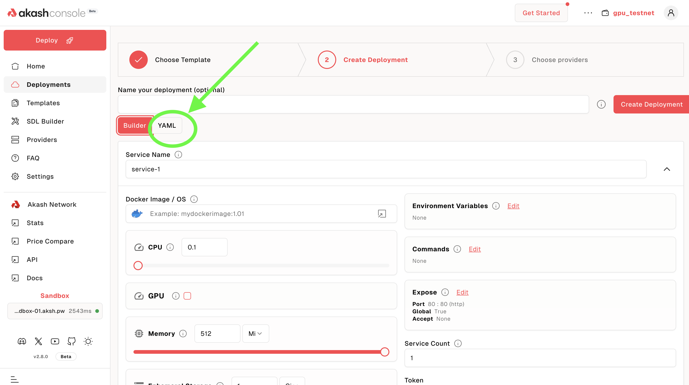

##### Copy Awesome Akash Minesweeper SDL

- The Minesweeper SDL (Stack Definition Language) file - which is the recipe for an Akash Deployment - can be found in the Awesome Akash repository [here](https://github.com/akash-network/awesome-akash/blob/master/minesweeper/deploy.yaml).
- Copy the contents of the SDL into the YAML C editor as demonstrated below.
- Select `Save & Close` when complete

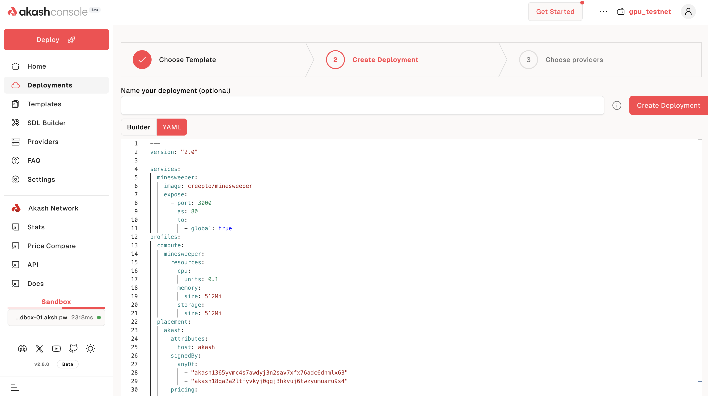

##### Name Deployment and Proceed

- Optionally assign the deployment a useful/descript name
- Select `Create Deployment` when complete to proceed to the next step


- You'll be required to make a minimum deposit of 5 AKT or 5 USDC. Enter at least that amount and click on the `Continue` button. 

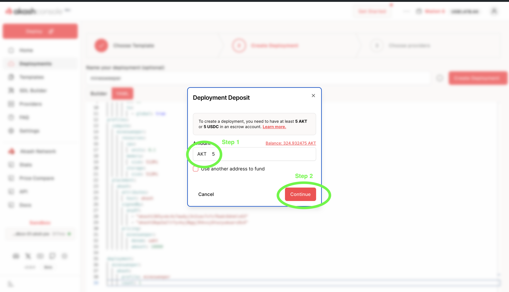

- You then approve the transaction. If you are having trouble with the transaction being completed, try setting the `gas fees` to either `medium` or `high`.

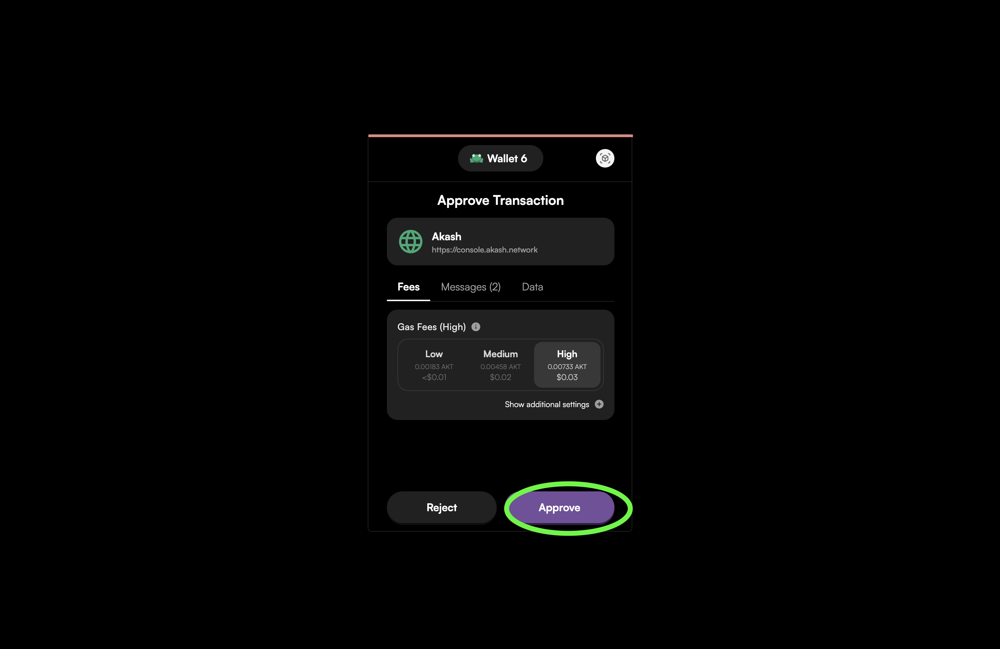

 

#### STEP 2 - Select Provider

- You would be redirected to the Providers page.
- A list of Akash providers who bid on the deployment is presented
- Select the Akash provider of your choice
- Select `Submit Deploy Request` to complete the deployment process
- Accept Keplr gas fee prompt to proceed


> NOTE - ensure to select `ALL` instead of the default `Only Audited` selection near the top right of the pane for Testnet purposes. This will allow bids from all providers to display.

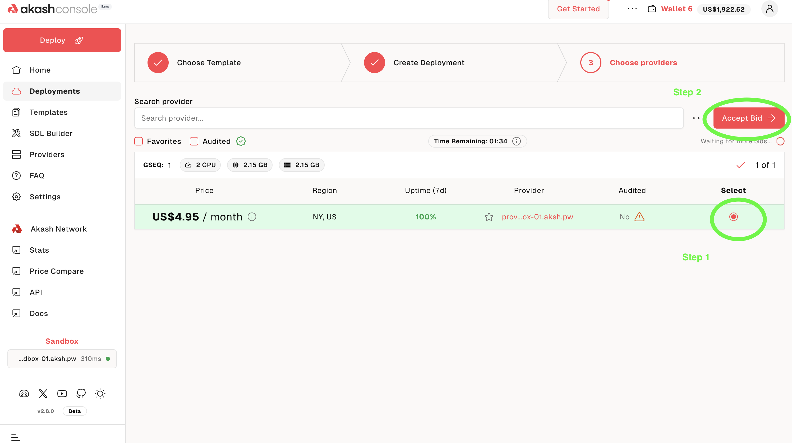


#### STEP 3 - Deployment Confirmation and Testing

- Following successful deployment of the Minesweeper SDL to the selected Akash provider, a status page will be presented as depicted in the example below
- This page can be used to view logs of the deployment and obtain general deployment info
- Allow the deployment a couple of minutes to fully deploy and then test Minesweeper by selecting the generated URL of the deployment


###### Select URL to Test Deployment

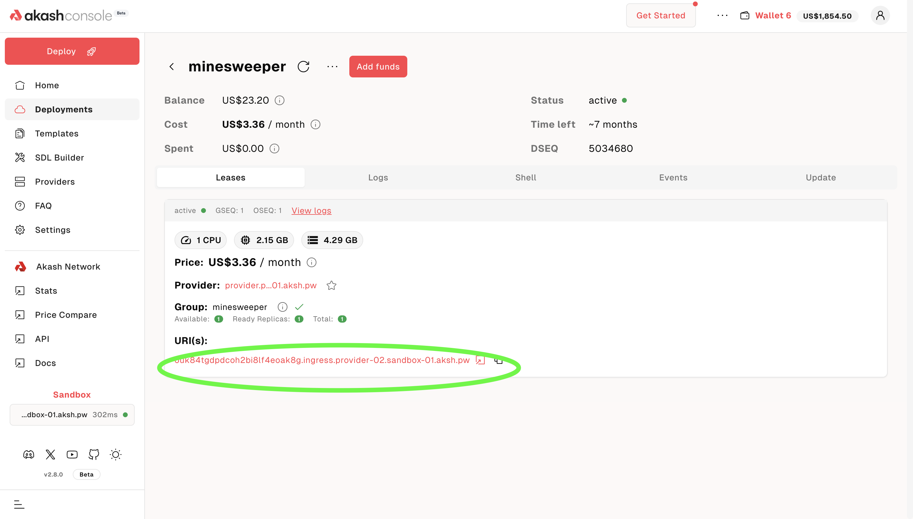

###### Expected Result of Initial Deployment Testing


#### Summary and Next Steps

- This completes our walk through of a example SDL and associated deployment onto the Akash Testnet network
- The steps presented in this guide can be used for any future deployments and associated SDLs


## Akash CLI for GPU Testnet

Explore detailed steps and options of the Akash CLI. In this guide we will define each environment variable and use within each command.

##### Overview of Getting Started with Akash CLI Steps

- [Install Akash](#install-akash-cli)
- [Create an Account](#create-an-account)
- [Fund your Account](#fund-your-account)
- [Configure your Network](#configure-your-network)
- [Create your Configuration](#create-your-configuration)
- [Create your Certificate](#create-your-certificate)
- [Create your Deployment](#create-your-deployment)
- [View your Bids](#view-your-bids)
- [Create a Lease](#create-a-lease)
- [Send the Manifest](#send-the-manifest)
- [Update the Deployment](#update-the-deployment)
- [Close Deployment](#close-deployment)

### Install Akash CLI

Select a tab below to view instructions for MacOS, Linux, or compiling from source.

import TabsWrapper, { TabContent } from "@/components/ui/tabs";

<TabsWrapper client:load >
<TabContent  value="MacOS">

##### MacOS

**Download Akash Binary**

_**NOTE**_ - in the commands below we download the Akash binary for version `0.6.4` and the `darwin_all`. If an alternate binary is needed, visit this [GitHub Release](https://github.com/akash-network/provider/releases/tag/v0.6.4) page and find/replace the link used appropriately

```
cd ~/Downloads

wget https://github.com/akash-network/provider/releases/download/v0.6.4/provider-services_0.6.4_darwin_all.zip

unzip provider-services_0.6.4_darwin_all.zip
```

**Move the Akash Binary**

Move the binary file into a directory included in your path

```
sudo mv provider-services /usr/local/bin
```

**Verify Akash Installation**

Verify the installation by using a simple command to check the Akash version

```
provider-services version
```

**Expect/Example Output**

```
v0.6.4
```

</TabContent>
<TabContent  value="Linux">

**Download Akash Binary**

> _**NOTE**_ - in the commands below we download the Akash binary for version `0.6.4` and a `AMD-64` architecture. If an alternate binary is needed, visit this [GitHub Release](https://github.com/akash-network/provider/releases/tag/v0.6.4) page and find/replace the link used appropriately.

```
cd ~

apt install jq -y

apt install unzip -y

wget https://github.com/akash-network/provider/releases/download/v0.3.1-rc1/provider-services_0.6.4_linux_amd64.zip

unzip provider-services_0.6.4_linux_amd64.zip

mkdir bin; mv provider-services /root/bin/
```

**Add Akash Install Location to User’s Path**

Add the software’s install location to the user’s path for easy use of Akash commands.

**NOTE:** Below we provide the steps to add the Akash install directory to a user’s path on a Linux Ubuntu server. Please take a look at a guide for your operating system and how to add a directory to a user’s path.

Open the user’s path file in an editor:

```
vi /etc/environment
```

View within text editor prior to the update:

```
PATH="/usr/local/sbin:/usr/local/bin:/usr/sbin:/usr/bin:/sbin:/bin:/usr/games:/usr/local/games:/snap/bin"
```

Add the following directory, which is the Akash install location, to `PATH`. In this example the active user is root. If logged in as another username, replace /root with your current/home directory.

```
/root/bin
```

View within the text editor following the update:

```
PATH="/usr/local/sbin:/usr/local/bin:/usr/sbin:/usr/bin:/sbin:/bin:/usr/games:/usr/local/games:/snap/bin:/root/bin"
```

###### Make the Path Active in the Current Session

```
. /etc/environment
```

###### Verify Akash Install

Display the version of Akash software installed. This confirms the software installed and that the new user path addition worked.

```
provider-services version
```

**Expected/Example Result**

```
v0.6.4
```

</TabContent>
</TabsWrapper>

### Create an Account

Configure the name of your key. The command below will set the name of your key to `myWallet`, run the below command and replace `myWallet` with a name of your choice:

```bash
AKASH_KEY_NAME=myWallet
```

Verify you have the shell variables set up . The below command should return the name you've used:

```bash
echo $AKASH_KEY_NAME
```

We now need to point Akash to where the keys are stored for your configuration. To do this we will set the AKASH_KEYRING_BACKEND environmental variable.

```bash
AKASH_KEYRING_BACKEND=os
```

Copy and paste this command into Terminal to create an Akash account:

```bash
provider-services keys add $AKASH_KEY_NAME
```

Read the output and save your mnemonic phrase is a safe place. Let's set a Shell Variable in Terminal `AKASH_ACCOUNT_ADDRESS` to save your account address for later.

```bash
export AKASH_ACCOUNT_ADDRESS="$(provider-services keys show $AKASH_KEY_NAME -a)"

echo $AKASH_ACCOUNT_ADDRESS
```

Note that if you close your Terminal window this variable will not be saved.

### Fund your Account

#### Fund Created Account via Testnet Faucet

Visit the Testnet faucet [here](https://faucet.sandbox-01.aksh.pw/) to fund your provider account. &#x20;

Enter the address of the `myWallet` account created in previous steps as prompted by the faucet.


###### Example/Expected Faucet Output

The following screen shot shows an example/expected output following successful submission to the Testnet faucet. Note that the displayed transaction hash will be unique and different than the one displayed in this example. Receipt of this screen confirms successful funding of your account with `25AKT`.


### Configure your Network

#### Configure the Testnet Chain ID and RPC Node

```bash
export AKASH_CHAIN_ID=sandbox-01
export AKASH_NODE=https://rpc.sandbox-01.aksh.pw:26657
```

#### Confirm your network variables are setup

Your values may differ depending on the network you're connecting to.

```bash
echo $AKASH_NODE $AKASH_CHAIN_ID $AKASH_KEYRING_BACKEND
```

You should see something similar to:

```
https://rpc.sandbox-01.aksh.pw:26657 sandbox-01 os
```

#### Set Additional Environment Variables

Set the below set of environment variables to ensure smooth operations

| Variable             | Description                                                                               | Recommended Value |
| -------------------- | ----------------------------------------------------------------------------------------- | ----------------- |
| AKASH_GAS            | Gas limit to set per-transaction; set to "auto" to calculate sufficient gas automatically | `auto`            |
| AKASH_GAS_ADJUSTMENT | Adjustment factor to be multiplied against the estimate returned by the tx simulation     | `1.15`            |
| AKASH_GAS_PRICES     | Gas prices in decimal format to determine the transaction fee                             | `0.0025uakt`       |
| AKASH_SIGN_MODE      | Signature mode                                                                            | `amino-json`      |

```
export AKASH_GAS=auto
export AKASH_GAS_ADJUSTMENT=1.25
export AKASH_GAS_PRICES=0.0025uakt
export AKASH_SIGN_MODE=amino-json
```

#### Check your Account Balance

Check your account has sufficient balance by running:

```bash
provider-services query bank balances --node $AKASH_NODE $AKASH_ACCOUNT_ADDRESS
```

You should see a response similar to:

```
balances:
- amount: "25000000"
  denom: uakt
pagination:
  next_key: null
  total: "0"
```

{/*  */}
Your account must have a minimum balance of 0.5 AKT to create a deployment. This 0.5 AKT funds the escrow account associated with the deployment and is used to pay the provider for their services. It is recommended you have more than this minimum balance to pay for transaction fees. For more information on escrow accounts, see [here](/docs/getting-started/intro-to-akash/payments/#escrow-accounts)
{/*  */}

### Create your Configuration

Create a deployment configuration `deploy.yml` to deploy an example GPU enabled workload via the steps and SDL provided in this section.

##### Akash GPU Enabled Manifest/SDL

You may use the sample deployment file as-is or modify it for your own needs as described in our [SDL (Stack Definition Language)](https://github.com/akash-network/docs/blob/master/sdl/README.md) documentation.

###### EXAMPLE GPU ENABLED SDL:

```bash
cat > deploy.yml <<EOF
---
version: "2.0"

services:
  gpu-test:
    # Nvidia cuda compatibility https://docs.nvidia.com/deploy/cuda-compatibility/
    # for nvidia 510 drivers
    ## image: nvcr.io/nvidia/k8s/cuda-sample:vectoradd-cuda10.2
    # for nvidia 525 drivers use below image
    image: nvcr.io/nvidia/k8s/cuda-sample:vectoradd-cuda11.6.0
    command:
      - "sh"
      - "-c"
    args:
      - 'sleep infinity'
    expose:
      - port: 3000
        as: 80
        to:
          - global: true
profiles:
  compute:
    gpu-test:
      resources:
        cpu:
          units: 1
        memory:
          size: 1Gi
        gpu:
          units: 1
          attributes:
            vendor:
              nvidia:
                - model: a4000
        storage:
          - size: 512Mi
  placement:
    westcoast:
      pricing:
        gpu-test:
          denom: uakt
          amount: 100000
deployment:
  gpu-test:
    westcoast:
      profile: gpu-test
      count: 1
EOF
```

### Create your Certificate

In this step we will create a local certificate and then store the certification on the block chain

- Ensure that prior steps in this guide have been completed and that you have a funded wallet before attempting certificate creation.
- **Your certificate needs to be created only once per account** and can be used across all deployments.

###### Generate Cert

- Note: If it errors with `Error: certificate error: cannot overwrite certificate`, then add `--overwrite` should you want to overwrite the cert. Normally you can ignore that error and proceed with publishing the cert (next step).

```
provider-services tx cert generate client --from $AKASH_KEY_NAME
```

###### Publish Cert to the Blockchain

```
provider-services tx cert publish client --from $AKASH_KEY_NAME
```

### Create your Deployment

#### Akash Deployment

To deploy on Akash, run:

```
provider-services tx deployment create deploy.yml --from $AKASH_KEY_NAME
```

You should see a response similar to:

```javascript
{
  "height":"140325",
  "txhash":"2AF4A01B9C3DE12CC4094A95E9D0474875DFE24FD088BB443238AC06E36D98EA",
  "codespace":"",
  "code":0,
  "data":"0A130A116372656174652D6465706C6F796D656E74",
  "raw_log":"[{\"events\":[{\"type\":\"akash.v1\",\"attributes\":[{\"key\":\"module\",\"value\":\"deployment\"},{\"key\":\"action\",\"value\":\"deployment-created\"},{\"key\":\"version\",\"value\":\"2b86f778de8cc9df415490efa162c58e7a0c297fbac9cdb8d6c6600eda56f17e\"},{\"key\":\"owner\",\"value\":\"akash1vn06ycjjnvsvl639fet9lajjctuturrtx7fvuj\"},{\"key\":\"dseq\",\"value\":\"140324\"},{\"key\":\"module\",\"value\":\"market\"},{\"key\":\"action\",\"value\":\"order-created\"},{\"key\":\"owner\",\"value\":\"akash1vn06ycjjnvsvl639fet9lajjctuturrtx7fvuj\"},{\"key\":\"dseq\",\"value\":\"140324\"},{\"key\":\"gseq\",\"value\":\"1\"},{\"key\":\"oseq\",\"value\":\"1\"}]},{\"type\":\"message\",\"attributes\":[{\"key\":\"action\",\"value\":\"create-deployment\"},{\"key\":\"sender\",\"value\":\"akash1vn06ycjjnvsvl639fet9lajjctuturrtx7fvuj\"},{\"key\":\"sender\",\"value\":\"akash1vn06ycjjnvsvl639fet9lajjctuturrtx7fvuj\"}]},{\"type\":\"transfer\",\"attributes\":[{\"key\":\"recipient\",\"value\":\"akash17xpfvakm2amg962yls6f84z3kell8c5lazw8j8\"},{\"key\":\"sender\",\"value\":\"akash1vn06ycjjnvsvl639fet9lajjctuturrtx7fvuj\"},{\"key\":\"amount\",\"value\":\"5000uakt\"},{\"key\":\"recipient\",\"value\":\"akash14pphss726thpwws3yc458hggufynm9x77l4l2u\"},{\"key\":\"sender\",\"value\":\"akash1vn06ycjjnvsvl639fet9lajjctuturrtx7fvuj\"},{\"key\":\"amount\",\"value\":\"5000000uakt\"}]}]}]",
  "logs":[
    {
      "msg_index":0,
      "log":"",
      "events":[
        {
          "type":"akash.v1",
          "attributes":[
            {
              "key":"module",
              "value":"deployment"
            },
            {
              "key":"action",
              "value":"deployment-created"
            },
            {
              "key":"version",
              "value":"2b86f778de8cc9df415490efa162c58e7a0c297fbac9cdb8d6c6600eda56f17e"
            },
            {
              "key":"owner",
              "value":"akash1vn06ycjjnvsvl639fet9lajjctuturrtx7fvuj"
            },
            {
              "key":"dseq",
              "value":"140324"
            },
            {
              "key":"module",
              "value":"market"
            },
            {
              "key":"action",
              "value":"order-created"
            },
            {
              "key":"owner",
              "value":"akash1vn06ycjjnvsvl639fet9lajjctuturrtx7fvuj"
            },
            {
              "key":"dseq",
              "value":"140324"
            },
            {
              "key":"gseq",
              "value":"1"
            },
            {
              "key":"oseq",
              "value":"1"
            }
          ]
        },
        {
          "type":"message",
          "attributes":[
            {
              "key":"action",
              "value":"create-deployment"
            },
            {
              "key":"sender",
              "value":"akash1vn06ycjjnvsvl639fet9lajjctuturrtx7fvuj"
            },
            {
              "key":"sender",
              "value":"akash1vn06ycjjnvsvl639fet9lajjctuturrtx7fvuj"
            }
          ]
        },
        {
          "type":"transfer",
          "attributes":[
            {
              "key":"recipient",
              "value":"akash17xpfvakm2amg962yls6f84z3kell8c5lazw8j8"
            },
            {
              "key":"sender",
              "value":"akash1vn06ycjjnvsvl639fet9lajjctuturrtx7fvuj"
            },
            {
              "key":"amount",
              "value":"5000uakt"
            },
            {
              "key":"recipient",
              "value":"akash14pphss726thpwws3yc458hggufynm9x77l4l2u"
            },
            {
              "key":"sender",
              "value":"akash1vn06ycjjnvsvl639fet9lajjctuturrtx7fvuj"
            },
            {
              "key":"amount",
              "value":"5000000uakt"
            }
          ]
        }
      ]
    }
  ],
  "info":"",
  "gas_wanted":"100000",
  "gas_used":"94653",
  "tx":null,
  "timestamp":""
}
```

##### Find your Deployment \#

Find the Deployment Sequence (DSEQ) in the deployment you just created. You will need to replace the AKASH_DSEQ with the number from your deployment to configure a shell variable.

```bash
export AKASH_DSEQ=CHANGETHIS
```

Now set the Order Sequence (OSEQ) and Group Sequence (GSEQ). Note that if this is your first time deploying on Akash, OSEQ and GSEQ will be 1.

```bash
AKASH_OSEQ=1
AKASH_GSEQ=1
```

Verify we have the right values populated by running:

```bash
echo $AKASH_DSEQ $AKASH_OSEQ $AKASH_GSEQ
```

### View your Bids

After a short time, you should see bids from providers for this deployment with the following command:

```bash
provider-services query market bid list --owner=$AKASH_ACCOUNT_ADDRESS --node $AKASH_NODE --dseq $AKASH_DSEQ --state=open
```

##### Choose a Provider

Note that there are bids from multiple different providers. In this case, both providers happen to be willing to accept a price of _1 uAKT_. This means that the lease can be created using _1 uAKT_ or _0.000001 AKT_ per block to execute the container. You should see a response similar to:

```
bids:
- bid:
    bid_id:
      dseq: "140324"
      gseq: 1
      oseq: 1
      owner: akash1vn06ycjjnvsvl639fet9lajjctuturrtx7fvuj
      provider: akash10cl5rm0cqnpj45knzakpa4cnvn5amzwp4lhcal
    created_at: "140326"
    price:
      amount: "1"
      denom: uakt
    state: open
  escrow_account:
    balance:
      amount: "50000000"
      denom: uakt
    id:
      scope: bid
      xid: akash1vn06ycjjnvsvl639fet9lajjctuturrtx7fvuj/140324/1/1/akash10cl5rm0cqnpj45knzakpa4cnvn5amzwp4lhcal
    owner: akash10cl5rm0cqnpj45knzakpa4cnvn5amzwp4lhcal
    settled_at: "140326"
    state: open
    transferred:
      amount: "0"
      denom: uakt
- bid:
    bid_id:
      dseq: "140324"
      gseq: 1
      oseq: 1
      owner: akash1vn06ycjjnvsvl639fet9lajjctuturrtx7fvuj
      provider: akash1f6gmtjpx4r8qda9nxjwq26fp5mcjyqmaq5m6j7
    created_at: "140326"
    price:
      amount: "1"
      denom: uakt
    state: open
  escrow_account:
    balance:
      amount: "50000000"
      denom: uakt
    id:
      scope: bid
      xid: akash1vn06ycjjnvsvl639fet9lajjctuturrtx7fvuj/140324/1/1/akash1f6gmtjpx4r8qda9nxjwq26fp5mcjyqmaq5m6j7
    owner: akash1f6gmtjpx4r8qda9nxjwq26fp5mcjyqmaq5m6j7
    settled_at: "140326"
    state: open
    transferred:
      amount: "0"
      denom: uakt
```

For this example, we will choose `akash10cl5rm0cqnpj45knzakpa4cnvn5amzwp4lhcal` Run this command to set the provider shell variable:

```
AKASH_PROVIDER=akash10cl5rm0cqnpj45knzakpa4cnvn5amzwp4lhcal
```

Verify we have the right value populated by running:

```
echo $AKASH_PROVIDER
```

### Create a Lease

Create a lease for the bid from the chosen provider above by running this command:

```
provider-services tx market lease create --dseq $AKASH_DSEQ --provider $AKASH_PROVIDER --from $AKASH_KEY_NAME
```

##### Confirm the Lease

You can check the status of your lease by running:

```
provider-services query market lease list --owner $AKASH_ACCOUNT_ADDRESS --node $AKASH_NODE --dseq $AKASH_DSEQ
```

Note the bids will close automatically after 5 minutes, and you may get the response:

```
bid not open
```

If this happens, close your deployment and open a new deployment again. To close your deployment run this command:

```
provider-services tx deployment close --dseq $AKASH_DSEQ  --owner $AKASH_ACCOUNT_ADDRESS --from $AKASH_KEY_NAME
```

If your lease was successful you should see a response that ends with:

```
    state: active
```

{/*  */}
Please note that once the lease is created, the provider will begin debiting your deployment's escrow account, even if you have not completed the deployment process by uploading the manifest in the following step.
{/*  */}

### Update the Deployment

##### Update the Manifest

Update the deploy.yml manifest file with the desired change.

_**NOTE:**_\*\* Not all attributes of the manifest file are eligible for deployment update. If the hardware specs of the manifest are updated (I.e. CPU count), a re-deployment of the workload is necessary. Other attributes, such as deployment image and funding, are eligible for updates.

##### Issue Transaction for On Chain Update

```
provider-services tx deployment update deploy.yml --dseq $AKASH_DSEQ --from $AKASH_KEY_NAME
```

##### Send Updated Manifest to Provider

```
provider-services send-manifest deploy.yml --dseq $AKASH_DSEQ --provider $AKASH_PROVIDER --from $AKASH_KEY_NAME
```

### Close Deployment

##### Close the Deployment

Should you need to close the deployment follow this step.

```
provider-services tx deployment close --from $AKASH_KEY_NAME
```
