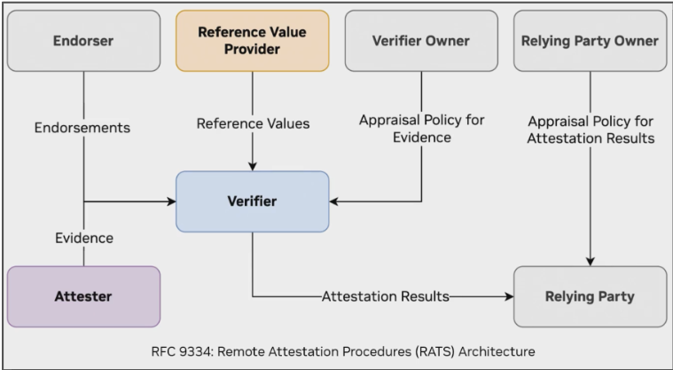
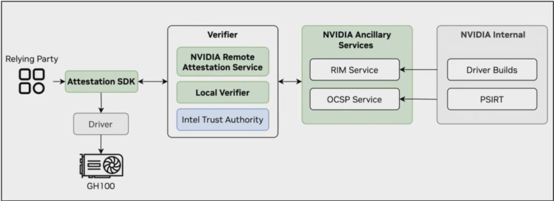
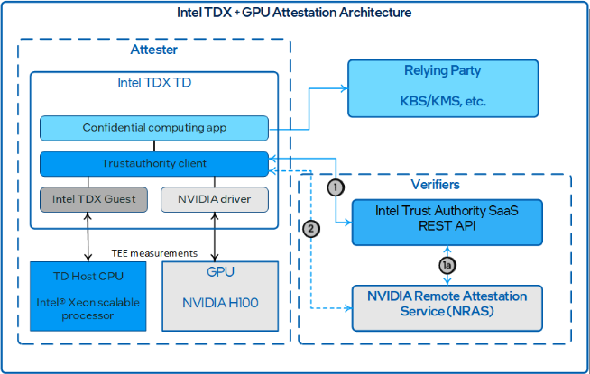

## Motivation

Hardware Verification is an important aspect of improving the credibility of a decentralized platform like Akash and is a key component to achieving support for Confidential Computing as outlined in [AEP-65](https://akash.network/roadmap/aep-65/)

## Summary & Background

Hardware Verification is the process of verifying that the specific CPU or GPU is what the provider claims to be. In the context of [Confidential Computing](https://akash.network/roadmap/aep-65/), this is achieved through an attestation process using a Trusted Authority

### Attestation Process
The attestation process with a trusted Authority is ratified in the  IETF's [Remote Attestation Procedures Architecture (RATS) RFC 9334](https://datatracker.ietf.org/doc/rfc9334/) and can be outlined in the following block diagram. In this diagram, the "Attester" is the software running on the device (typically the CPU/ GPU), the "Relying Party" is the client (typically the application developer) and the "Reference Value Provider" is the vendor (Nvidia, Intel, AMD etc)

At a high level, the attestation process involves three main steps:

##### 1.  Measurement Collection 
   The system gathers cryptographic measurements from the hardware platform — including CPU, GPU, firmware, bootloader, and drivers. These measurements serve as a unique fingerprint of the environment, rooted in hardware (e.g., via Intel TDX, AMD SEV-SNP, or NVIDIA NVTrust). These may include:
     - Platform identity (vendor, model, firmware version)
     - Enclave or VM launch measurements
     - Device-specific attestation evidence (e.g., GPU certificate chain)

##### 2. Verification
   The collected evidence is sent to a remote verifier — either a vendor-provided service (e.g., [Intel Trust Authority](https://www.intel.com/content/www/us/en/security/trust-authority.html), [AMD Attestation Service](https://www.amd.com/content/dam/amd/en/documents/developer/lss-snp-attestation.pdf),[NVIDIA NVTrust CA](https://docs.nvidia.com/attestation/#overview)) or a custom verifier (sometime called a “local verifier”). 
   
   The verifier perfoms the following functions:
     - Authenticates the hardware’s cryptographic identity
     - Compares measurements against a set of trusted baseline values (aka “golden measurements”)
     - Validates integrity and authenticity of the platform state

##### 3. **Policy Enforcement**
   Based on the result of verification, an attestation policy is evaluated to determine if the workload should proceed. The policy might check for the following things:
     - Is the platform from an approved vendor/model?
     - Are all firmware and drivers up-to-date?
     - Was the workload launched in a verified TEE?

  The outcome is a binary verdict (e.g., Attestation OK or Rejected) which can be used to:
  - Gate access to secrets or encrypted data
  - Approve running a sensitive workload
  - Trigger alerts or block execution in untrusted environments

#### NVTrust SDK

Nvidia provides the [NVTRUST SDK](https://github.com/NVIDIA/nvtrust) that abstracts a lot of the complexity involved in attesting Nvidia GPUs (primarily H100s and NVSwitches) for trusted execution. This SDK provides abstractions for gathering evidence (aka measurements) as well as a verifier (NRAS) that plugs into Nvidia’s internal build pipeline (to obtain “golden measurements” through the RIM service)
https://nras.attestation.nvidia.com/
https://docs.nvidia.com/attestation/api-docs-nras/latest/nras_api.html 

This is what attestation with the Nvidia SDK looks like at a high level

### Intel Trusted Authority SDK
Since GPUs do not operte standalone - they typically are part of a server that includes a CPU (and memory, storage and other things) which is where the application is typically executed (with the AI model then getting loaded into GPU memory for inference or training or fine-tuning), the attestation must encompass the CPU, GPU and the interface between them. To make this easy for customers, Intel has an SDK of its own that plugs into the NVTrust SDK and enables performing attestation for the whole system

https://github.com/intel/trustauthority-client-for-python 
https://github.com/intel/trustauthority-client-for-go 

## Scope of Work

The Scope of work of this AEP is to test and document the hardware and BIOS configuration necessary to perform attestation so that this can be used to guide Akash Providers and to support the larger [Confidential Computing](https://akash.network/roadmap/aep-65/) goal. 

To that end, the following will need to be done

1. Obtain or set up a provider with a GPU node or cluster that has the TEE capable hardware as noted in the following section 
2. Apply BIOS configuration to allow access to the device nodes
3. Verify (manually) that attestation can be performed for the whole node

#### TEE Capable CPUs

| Vendor | Feature                              | Required Models                                                                 |
|--------|--------------------------------------|---------------------------------------------------------------------------------|
| Intel  | TDX (Trust Domain Extensions)        | Intel Xeon 5th Gen CPUs like “Sapphire Rapids” (with TDX BIOS support)          |
| Intel  | SGX (Software Guard Extensions)      | Intel Xeon E3, Xeon D, and select 10th–11th Gen Core CPUs (now deprecated by Intel) |
| AMD    | SEV                                  | AMD EPYC “Rome” (7002 series)                                                   |
| AMD    | SEV-ES / SNP                         | AMD EPYC “Milan” (7003) and “Genoa” (9004) series                               |

#### TEE Capable GPUs

| Vendor      | Feature     | Required Models                                                                 |
|-------------|-------------|---------------------------------------------------------------------------------|
| NVIDIA      | NVTrust     | NVIDIA H100 or H200 (Hopper architecture) with CC-on mode                       |
| AMD/Intel   | _None yet_  | No current support for GPU-based TEEs (CPU-side only)                           |

In summary, Providers must use the following hardware:
- Intel CPUs with TDX (e.g., Xeon Sapphire Rapids)
- AMD CPUs with SEV-SNP (e.g., EPYC Milan/Genoa)
- NVIDIA H100 or H200 GPUs (for NVTrust support)

#### TEE Enabled Host Kernel & BIOS configuration

BIOS configuration changes need to be made to enable TDX/ SGX (for intel) and SEV (for AMD). These typically also require a certain minimum version of the Linux Kernel to be used.

##### Intel

Enable memory encryption, TDX and SGX for Intel: https://github.com/canonical/tdx/blob/1.2/README.md 

##### AMD

Enable AMD SEV: https://github.com/AMDESE/AMDSEV/blob/master/README.md 
