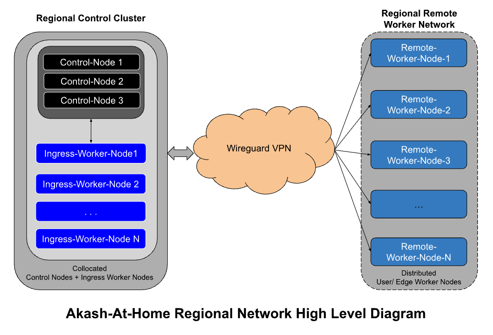
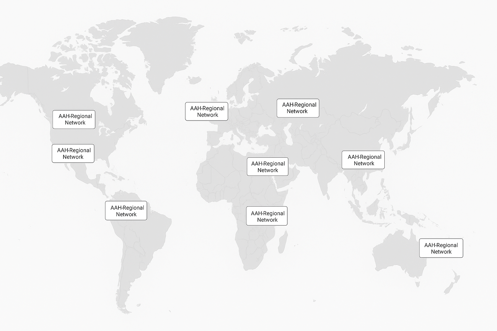

## Motivation

Enabling the average "home" user to participate in Akash as a provider is critical to both - scaling the supply side of the network as well as positioning the network to lead in the shift away from large data center compute in response to the oncoming energy crisis

## Summary

The goal of this project is to enable lighter weight edge compute devices including those running in average consumer homes to be able to participate in Akash’s provider infrastructure. The motivation for this stems from the following:

1. Many people want to participate in Akash by purchasing a GPU or two today but they aren’t technically proficient enough to run their own kubernetes cluster

2. Even for people that are proficient, the infrastructure requirements to run a full multi-node cluster make it cost prohibitive to do so

3. Nvidia (and presumably other vendors like Apple and AMD) have indicated plans to launch consumer desktop devices that are powerful enough to allow for “inference offload”. The imminent [Nvidia DGX Spark](https://www.nvidia.com/en-us/products/workstations/dgx-spark/) is the best example of that - it is being marketed as “A Supercomputer on your Desktop” 

This specific aep will be scoped to building an MVP of the service with a subsequent aep working in scaling it to a more production ready state

## High Level User Experience

The user experience of this product should be one where an average user who has a computation device (laptop, desktop or small server with a platform architecture we support) should be able to install a client (software) that then configures all the things necessary to allow that device to become part of the provider network. The user should then be able to visit a web application (and potentially a mobile application) where they can view all the devices they have on the network as well as rewards (earnings) they have accrued over time, add/ remove/ upgrade devices etc

High Level Architecture
The Akash Core team at Overclock Labs has performed several initial tests and is converging towards an architecture this can be achieved by essentially splitting the provider into a “centralized control nodes” and “decentralized worker nodes” type architecture. For the MVP of this, the control nodes for a provider will be managed by the Akash Core Team while individual users (who can be anyone in the world) can join their worker nodes to the kubernetes cluster.

The networking challenge posed by worker nodes sitting behind a NAT gateway is solved by:

1. Setting up one worker node (let’s call that the INGRESS WORKER NODE) to be part of the centralized controller cluster and this worker node serves as the ingress point for all the worker nodes that are part of the cluster.

2. Use of Wire Guard allows for bidirectional communication with the worker nodes 

Tailscale offers a production ready easy-to-use implementation of wireguard and is likely the product that will be used for this.

This is what a single such cluster would look like conceptually:

And now imagine there being one such network per region. We would initially start with 2-3 per major continent and scale up from there.

## Proof-of-Concept (POC) Testing
To confirm that this is a viable solution and can be scaled to a reasonable size we need to perform the following minimum testing:

- SINGLE REMOTE WORKER NODE TEST: Set up the control infrastructure with 3 control nodes + one ingress node + 1 worker node and test deploying a large number of pods on to the remote worker node. Confirm no networking issues, being able to SSH into the pods, being able to deploy a service that exposes an API endpoint and confirm that the API can be accessed from a public IP.

- MULTIPLE REMOTE WORKER NODE TEST: Set up the control infrastructure with 3 control nodes + one ingress worker node + large number (say 100) remote worker nodes and confirm no networking issues, test deployments, being able to deploy a service that exposes an API endpoint and confirm that the API can be accessed from a public IP, and stability of the cluster including etcd state over time.

- MULTIPLE INGRESS AND REMOTE WORKERS TEST: Set up the control infrastructure with 3 control nodes + 3 ingress worker nodes + large number (say 100) remote worker nodes and confirm no networking issues, test deployments and stability of the cluster including etcd state over time. Also confirm that load gets balanced across the three ingress worker nodes and that kubernetes continues to schedule pods evenly across all remote worker nodes.

## Productization

To productize this solution, there are a number of decisions that need to be made. Here is a non-exhaustive list of areas we need to flesh out further

- REGIONAL CLUSTERING: Since there is a limit to how many worker nodes we can reasonably have per cluster and more importantly all the network traffic to/ from the pods must go through the control infrastructure, we want to ensure that network congestion at the control infrastructure network and latency to the remote worker nodes is in check. To achieve this we will likely need to pursue a regional strategy, where there is one control node cluster per region and any new workers wanting to join the network are directed to the regional cluster that is in the same region as the worker nodes. There are several open questions that need to be addressed:
  - How is the geolocation boundary defined (geo-IP? City? State?) and enforced?
  - Does there need to be an API server that new nodes “check into” that then redirects them to join a specific regional control cluster?
  - Does the core team maintain all the regional control clusters initially until we can verify viability?
  - Is there a minimum number of remote worker nodes that is needed in a region before we commit to hosting and managing a regional cluster for that specific region?
  - Will nodes be able to join permissionlessly? If yes, we need to model our security framework. If not, how can we provide the highest decentralization without sacrificing security?

- HOMOGENOUS vs HETEROGENOUS CLUSTERS: Do all worker nodes of the same cluster have to be identical in terms of resources? Should we allow mixing? Should there be mixing of CPU and GPU nodes?

- APPLICATION TYPES: Should some applications be prevented (or at least avoided) from being deployed on these clients? For example, applications that require an IP lease or large persistent storage may not be best suited for these devices.

- USER CLIENTS: One of the goals of this project is to enable the average home user to be able to participate in Akash as a “tiny provider”. To this end the setup and configuration needs to be as seamless as possible. To achieve this, we need to build an easy to install UI based client that is supported for the main OS platforms with chips architectures that we support. For linux users this could be a command line interface (CLI) based installer.

- END USER DEVICE MANAGER & DASHBOARD: There needs to be a way for end users to be able to view/ add/ remove devices, potentially view a map of all devices on the network (similar to Helium miners) and be able to view earnings and transfer out funds through a wallet. We will initially offer a web portal for this and potentially consider building a mobile app.

- ADMIN PORTAL: The administrators of the regional clusters need to be able to view and manage devices. This will likely be achieved with the Akash Provider Console but may require additional features.

- DEPLOY CONSOLE CHANGES: The deploy console client will need to be modified to make users aware of whether a specific compute provider is part of the edge network as the performance may be lower and there is a chance of them going offline that is higher than that of the regular (datacenter) providers.

- REWARDS & EARNINGS DISTRIBUTION: Since all deployment earnings will end up in the wallet owned by the provider admin (initially OCL core team but potentially others over time) - we need to figure out what is a reasonable and fair reward distribution that:
  - Covers the cost of hosting and managing the control infrastructure
  - Incentivizes people to join the network
  - Ensures that nodes that don’t get workloads (either because k8s scheduler didn’t pick their node or because of some other reasons) don’t get penalized. Aka fair allocation for participation.

- BOOTSTRAPPING AND SCALING: We will likely initially start with a small set of regional nodes and scale from there. There are several open questions on this:
  - What regions should we start with? Most providers on the network are in North America and EU so one school of thought is to double down on those regions (since that is where customer demand has been). Another school of thought is to go for more dots on the map and therefore prioritize regions of the world where there are no providers. The final state will likely be a combination of of the two
  - What happens if a user wants to join the network but there isn’t a regional control cluster available in their region? There are two potential ways we can handle this: One is to collect all such users into wait lists and have a pre-set threshold (minimum number of users) that will trigger us setting up a regional control node for that specific region. Another way (more flexible but also more complex) is to allow users to potentially become the control cluster admin if they happen to be the first user in a region (thereby bootstrapping that region for the network).