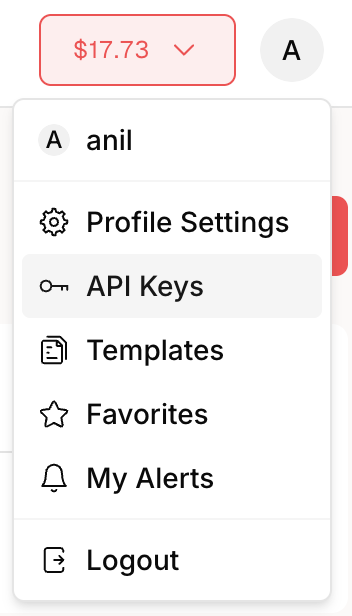
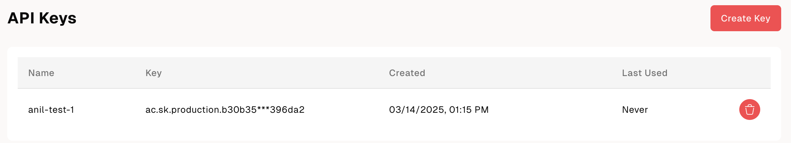

## Motivation

The number of Managed Wallet (Credit Card) users in Akash Console has grown significantly since launch. As these users and customers look to scale their applications they need a programmatic way to deploy and manage the lifecycle of their workloads on Akash so that they can scale up/ down in response to demand for their applications.

## Summary

Akash provides a programmatic way for users to deploy workloads via the [AkashJS SDK](https://github.com/akash-network/akashjs) but AkashJS is requires that the user of the API be familiar with not just crypto (API requires specifying wallets, mnemonics) but even the Cosmos SDK (requires importing cosmos specific libraries). This makes it hard if not impossible for non-crypto users to consume this API. Based on conversations with such non-crypto users it has become clear that they need a clean API with simple endpoints to call, for deployment and lease lifecycle management. 

The goal of this roadmap milestone is to implement clean API endpoints for all parts of managing the lifecycle of applications and workloads programmatically for users who pay with a credit card.

## High Level Specification

The specification is split into the following functional areas:
- API Endpoints
- UI for managing API keys
- Documentation of the APIs

Progress is tracked in the [Managed Wallets API Milestone](https://github.com/akash-network/console/milestone/10)

### API Endpoints
The following API endpoints have been identified at the time of writing this spec. As we work on onboaring customers to use the API we will either update this spec or create new roadmap items to add additional API endpoints. 

Note that while there are a lot of API endpoints listed here - the managed wallets user will only need to exercise a subset of them. The rest are listed here in the interest of full specification.

#### API Authentication & Management

While these endpoints will be made available to the user, we anticipate that most users will use the UI to manage their keys

`POST /v1/users/api-keys` (create)
`GET /v1/users/api-keys` (read/ list all keys)
`GET /v1/users/api-keys/{id}` (read/ list specific API key details)
`PATCH /v1/users/api-keys/{id}` (update)
`DELETE /v1/users/api-keys/{id}` (delete)

In addition there needs to be validation of the API keys at the middleware level so that it applies to any user specific endpoint

Implementation/ status tracked in [Console issue #768](https://github.com/akash-network/console/issues/768)

#### Certificate Management

While there will be a documented API for this - it will likely be handled automagically under the hood for the managed wallet user. If it is handled for the user we may not implement the list and revoke endpoints

`POST /v1/certificates` (create cert)
`GET /v1/certificates` (list all certs)
`DELETE /v1/certificates/{id}` (revoke cert)

#### Deployment Creation

`POST /v1/deployments` (create deployment based on `SDL/ YAML` and escrow `deposit`)

Implementation tracked in [issue #767](https://github.com/akash-network/console/issues/767)

#### Bid Selection

`GET v1/bids/{dseq}` (get bids for a `dseq`)

Implementation tracked in [issue #767](https://github.com/akash-network/console/issues/767)

#### Lease Creation

`POST /v1/leases` (create lease based on a payload that is an array of sdl, dseq, gseq, provider combinations)

Note that Akash supports creating multiple leases from a single SDL - where each lease can be for a different service (with a different container image) and deployed to a different provider

Implementation tracked in [issue #767](https://github.com/akash-network/console/issues/767)

#### Listing Deployments

`GET /v1/deployments` (list all deployments)
`GET /v1/deployments/{dseq}` (list deployment detail for a specific deployment)

Implementation tracked in [issue 1042](https://github.com/akash-network/console/issues/1042)
and [issue #767](https://github.com/akash-network/console/issues/767)

#### Deployment Closure

`DELETE /v1/deployments/{dseq}` (close a specific deployment)

Implementation tracked in [issue #767](https://github.com/akash-network/console/issues/767)

#### Funding Deployments

For viewing or adding funds to the escrow of a specific deployment

`GET /v1/deployments/{dseq}` (retrieve escrow balance details)
`POST /v1/deployments/deposit/{dseq}` (accepts `deposit` amount in the body)

implementation tracked in [issue #989](https://github.com/akash-network/console/issues/989) and [issue #990](https://github.com/akash-network/console/issues/990)

#### Funding Account

This is for the customer to purchase more credits and fund their account - we will decide if we offer this or not based on customer requests but it will likely directly go to the Stripe Checkout API https://docs.stripe.com/api/checkout/sessions/object

#### Retrieving Logs

`GET/v1/logs/{dseq}`

#### Retrieving Events

`GET/v1/events/{dseq}`

### UI for Managing API Keys

The user will be able to get to an API key management page from their user profile drop down

The API key management page will let the user view all keys, create a new one or delete and existing one

### Documentation

Documentation will be added in three places

- In the [Swagger docs](https://console-api.akash.network/v1/swagger) for Console API (which is linked from the Console side nav bar)
- In [docs.akash.network](https://akash.network/docs/)
- In the Github [Wiki page for Console](https://github.com/akash-network/console/wiki) (and linked from the Github [Readme for Console](https://github.com/akash-network/console/blob/main/README.md))