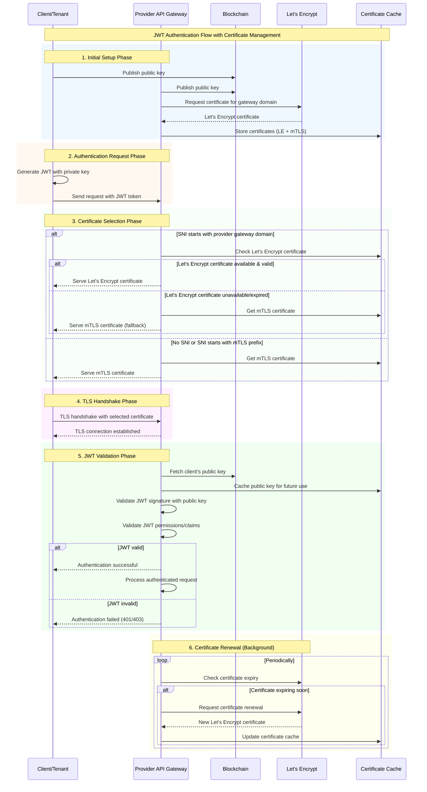

## Abstract

This AEP proposes implementing [JWT (JSON Web Token)](https://datatracker.ietf.org/doc/html/rfc7519) authentication for the Akash Provider API. This enhancement aims to improve the reliability of client API communication with leases during blockchain maintenance periods and provide more granular access control capabilities.

## Motivation

The current mTLS authentication mechanism, while secure, presents several limitations:

1. **Blockchain Dependency**: When the blockchain acts as the root of trust, API clients cannot maintain communication with leases during blockchain maintenance windows.
2. **Limited Access Control**: The current certificate-based system grants access to all leases and features, making it challenging to implement granular access controls.
3. **Certificate Management Complexity**: Implementing and maintaining granular access via certificates is complex for clients.

JWT authentication offers several advantages:
- Widely adopted and well-understood authentication mechanism
- Enables granular access control
- Allows for more flexible token management
- Reduces dependency on blockchain availability

## Technical Details

### Key Concepts

1. **Asymmetric Key Usage**:
   - Akash uses ECDSA with secp256k1 curve for wallet operations
   - This AEP focuses on the signing capabilities for JWT generation

2. **Client-Issued JWT**:
   - Unlike conventional JWT implementations where servers issue tokens, clients will issue JWTs
   - This approach is necessary because:
     - A single wallet may have multiple simultaneous leases across different providers
     - Only the lease owner can create granular access JWTs
     - The wallet's public key is available on the blockchain for provider validation

3. **Certificate Management**:
   - Supports standalone CA certificates
   - Compatible with Let's Encrypt certificates
   - Eliminates the need for custom TLS handshake handlers on the client side

### Implementation Guidelines

1. **Token Lifetime**:
   - JWTs should be short-lived due to revocation challenges
   - Recommended maximum lifetime: 15 minutes
   - Implementation-specific lifetime configurations are allowed

2. **Provider Implementation**:
   - Providers must query and cache lease owner public keys from the blockchain
   - Cache must be persistent across service restarts and updates
   - Cache invalidation strategies should be implemented

## JWT Specification

### Signing methods

Only ES256K with secp256k1 curve is supported

### Schema Definition

```json
{
    "$schema": "http://json-schema.org/draft-07/schema#",
    "$id": "https://raw.githubusercontent.com/akash-network/akash-api/refs/heads/main/specs/jwt-schema.json",
    "title": "Akash JWT Schema",
    "description": "JSON Schema for JWT used in the Akash Provider API.",
    "type": "object",
    "additionalProperties": false,
    "required": [
        "iss",
        "iat",
        "exp",
        "nbf",
        "version",
        "leases"
    ],
    "properties": {
        "iss": {
            "type": "string",
            "pattern": "^akash1[a-z0-9]{38}$",
            "description": "Akash address of the lease(s) owner, e.g., akash1abcd... (44 characters)"
        },
        "iat": {
            "type": "integer",
            "minimum": 0,
            "description": "Token issuance timestamp as Unix time (seconds since 1970-01-01T00:00:00Z). Should be <= exp and >= nbf."
        },
        "nbf": {
            "type": "integer",
            "minimum": 0,
            "description": "Not valid before timestamp as Unix time (seconds since 1970-01-01T00:00:00Z). Should be <= iat."
        },
        "exp": {
            "type": "integer",
            "minimum": 0,
            "description": "Expiration timestamp as Unix time (seconds since 1970-01-01T00:00:00Z). Should be >= iat."
        },
        "jti": {
            "type": "string",
            "minLength": 1,
            "description": "Unique identifier for the JWT, used to prevent token reuse."
        },
        "version": {
            "type": "string",
            "enum": [
                "v1"
            ],
            "description": "Version of the JWT specification (currently fixed at v1)."
        },
        "leases": {
            "type": "object",
            "additionalProperties": false,
            "required": [
                "access"
            ],
            "properties": {
                "access": {
                    "type": "string",
                    "enum": [
                        "full",
                        "granular"
                    ],
                    "description": "Access level for the lease: 'full' for unrestricted access to all actions, 'granular' for provider-specific permissions."
                },
                "scope": {
                    "type": "array",
                    "minItems": 1,
                    "uniqueItems": true,
                    "items": {
                        "type": "string",
                        "enum": [
                            "send-manifest",
                            "get-manifest",
                            "logs",
                            "shell",
                            "events",
                            "status",
                            "restart",
                            "hostname-migrate",
                            "ip-migrate"
                        ]
                    },
                    "description": "Global list of permitted actions across all owned leases (no duplicates). Applies when access is 'full'."
                },
                "permissions": {
                    "type": "array",
                    "description": "Required if leases.access is 'granular'; defines provider-specific permissions.",
                    "minItems": 1,
                    "items": {
                        "type": "object",
                        "additionalProperties": false,
                        "required": [
                            "provider",
                            "access"
                        ],
                        "properties": {
                            "provider": {
                                "type": "string",
                                "pattern": "^akash1[a-z0-9]{38}$",
                                "description": "Provider address, e.g., akash1xyz... (44 characters)."
                            },
                            "access": {
                                "type": "string",
                                "enum": [
                                    "full",
                                    "scoped",
                                    "granular"
                                ],
                                "description": "Provider-level access: 'full' for all actions, 'scoped' for specific actions across all provider leases, 'granular' for deployment-specific actions."
                            },
                            "scope": {
                                "type": "array",
                                "minItems": 1,
                                "uniqueItems": true,
                                "items": {
                                    "type": "string",
                                    "enum": [
                                        "send-manifest",
                                        "get-manifest",
                                        "logs",
                                        "shell",
                                        "events",
                                        "status",
                                        "restart",
                                        "hostname-migrate",
                                        "ip-migrate"
                                    ]
                                },
                                "description": "Provider-level list of permitted actions for 'scoped' access (no duplicates)."
                            },
                            "deployments": {
                                "type": "array",
                                "minItems": 1,
                                "items": {
                                    "type": "object",
                                    "additionalProperties": false,
                                    "required": [
                                        "dseq",
                                        "scope"
                                    ],
                                    "properties": {
                                        "dseq": {
                                            "type": "integer",
                                            "minimum": 1,
                                            "description": "Deployment sequence number."
                                        },
                                        "scope": {
                                            "type": "array",
                                            "minItems": 1,
                                            "uniqueItems": true,
                                            "items": {
                                                "type": "string",
                                                "enum": [
                                                    "send-manifest",
                                                    "get-manifest",
                                                    "logs",
                                                    "shell",
                                                    "events",
                                                    "status",
                                                    "restart",
                                                    "hostname-migrate",
                                                    "ip-migrate"
                                                ]
                                            },
                                            "description": "Deployment-level list of permitted actions (no duplicates)."
                                        },
                                        "gseq": {
                                            "type": "integer",
                                            "minimum": 0,
                                            "description": "Group sequence number (requires dseq)."
                                        },
                                        "oseq": {
                                            "type": "integer",
                                            "minimum": 0,
                                            "description": "Order sequence number (requires dseq and gseq)."
                                        },
                                        "services": {
                                            "type": "array",
                                            "minItems": 1,
                                            "items": {
                                                "type": "string",
                                                "minLength": 1
                                            },
                                            "description": "List of service names (requires dseq)."
                                        }
                                    },
                                    "dependencies": {
                                        "gseq": [
                                            "dseq"
                                        ],
                                        "oseq": [
                                            "dseq",
                                            "gseq"
                                        ],
                                        "services": [
                                            "dseq"
                                        ]
                                    }
                                }
                            }
                        },
                        "allOf": [
                            {
                                "if": {
                                    "properties": {
                                        "access": {
                                            "const": "scoped"
                                        }
                                    }
                                },
                                "then": {
                                    "required": [
                                        "scope"
                                    ],
                                    "properties": {
                                        "scope": {
                                            "minItems": 1
                                        },
                                        "deployments": false
                                    }
                                }
                            },
                            {
                                "if": {
                                    "properties": {
                                        "access": {
                                            "const": "granular"
                                        }
                                    }
                                },
                                "then": {
                                    "required": [
                                        "deployments"
                                    ],
                                    "properties": {
                                        "scope": false
                                    }
                                }
                            },
                            {
                                "if": {
                                    "properties": {
                                        "access": {
                                            "const": "full"
                                        }
                                    }
                                },
                                "then": {
                                    "properties": {
                                        "scope": false,
                                        "deployments": false
                                    }
                                }
                            }
                        ]
                    }
                }
            },
            "allOf": [
                {
                    "if": {
                        "properties": {
                            "access": {
                                "const": "full"
                            }
                        }
                    },
                    "then": {
                        "required": [
                            "scope"
                        ],
                        "properties": {
                            "permissions": false
                        }
                    }
                },
                {
                    "if": {
                        "properties": {
                            "access": {
                                "const": "granular"
                            }
                        },
                        "required": [
                            "access"
                        ]
                    },
                    "then": {
                        "required": [
                            "permissions"
                        ],
                        "properties": {
                            "scope": false
                        }
                    }
                }
            ]
        }
    },
    "allOf": [
        {
            "if": {
                "properties": {
                    "leases": {
                        "properties": {
                            "access": {
                                "const": "granular"
                            }
                        },
                        "required": [
                            "access"
                        ]
                    }
                },
                "required": [
                    "leases"
                ]
            },
            "then": {
                "properties": {
                    "leases": {
                        "required": [
                            "permissions"
                        ],
                        "properties": {
                            "scope": false
                        }
                    }
                }
            }
        },
        {
            "if": {
                "properties": {
                    "leases": {
                        "properties": {
                            "permissions": {
                                "type": "array",
                                "minItems": 1
                            }
                        },
                        "required": [
                            "permissions"
                        ]
                    }
                },
                "required": [
                    "leases"
                ]
            },
            "then": {
                "properties": {
                    "leases": {
                        "properties": {
                            "access": {
                                "const": "granular"
                            }
                        },
                        "required": [
                            "access"
                        ]
                    }
                }
            }
        }
    ]
}
```

### Field Descriptions

1. **Required Fields**:
    - `iss`: Akash address of the lease owner
    - `iat`: Token creation timestamp (NumericDate)
    - `exp`: Token expiration timestamp (NumericDate)
    - `version`: JWT specification version (must be "v1")
    - `leases` :
      - `access`: Access level ("full" or "granular")

2. **Optional Fields for leases**:
   - `permissions`: Array of granular access permissions
     - `provider`: Provider address (required)
     - `access`: Access level ("full", "scoped" or "granular")
     - `scope`: List of permitted actions (required)
     - `deployments`
      - `scope`: List of permitted actions (required)
      - `dseq`: Deployment sequence number (optional)
      - `gseq`: Group sequence number (requires dseq)
      - `oseq`: Order sequence number (requires dseq)
      - `services`: List of service names (requires dseq)

### Examples

#### Scoped access for specific deployment
```json
{
    "iss": "akash1...",
    "version": "v1",
    "iat": "1744029137",
    "exp": "1744029139",
    "nbf": "1744029138",
    "jti": "<unique id>",
    "leases" : {
      "access": "granular",
      "permissions": [
          {
              "provider": "akash1...",
              "access": "granular",
              "deployments": [
                {
                  "scope": ["logs", "shell"],
                  "dseq": 123456,
                  "gseq": 1,
                  "oseq": 1,
                  "services": ["web", "api"]
                }
              ]
          }
      ]
    }
}
```

#### Full access to all tenant's workloads within specific provider
```json
{
    "iss": "akash1...",
    "version": "v1",
    "iat": "1744029137",
    "exp": "1744029139",
    "nbf": "1744029138",
    "jti": "<unique id>",
    "leases" : {
      "access": "granular",
      "permissions": [
          {
              "provider": "akash1...",
              "access": "full"
          }
      ]
    }
}
```

#### Scoped access to only logs for all tenant's workloads within specific provider
```json
{
    "iss": "akash1...",
    "version": "v1",
    "iat": "1744029137",
    "exp": "1744029139",
    "nbf": "1744029138",
    "jti": "<unique id>",
    "leases" : {
      "access": "granular",
      "permissions": [
          {
              "provider": "akash1...",
              "access": "scoped",
              "scope": [
                "logs"
              ]
          }
      ]
    }
}
```

## Implementation Resources

### JWT Authentication with Let's Encrypt and mTLS Fallback

#### Sequence Diagram



##### Key Components

###### 1. Certificate Management
- **Let's Encrypt Certificate**: Primary certificate for production use
- **mTLS Certificate**: Fallback certificate for testing and when LE is unavailable
- **Certificate Cache**: Stores both certificates with availability status

###### 2. SNI-Based Certificate Selection
- **Gateway Domain SNI**: Routes to Let's Encrypt certificate
- **mTLS Prefix SNI**: Routes to mTLS certificate
- **No SNI**: Defaults to mTLS certificate

###### 3. Fallback Strategy
- **Primary**: Let's Encrypt certificate (when available and valid)
- **Fallback**: mTLS certificate (always available)
- **Automatic**: Seamless fallback without client intervention

###### 4. JWT Validation Process
1. Client generates JWT with private key
2. Provider fetches client's public key from blockchain
3. Provider validates JWT signature using public key
4. Provider validates JWT permissions/claims
5. Authentication succeeds or fails based on validation

##### Benefits

- **Backward Compatibility**: Supports both JWT and mTLS clients
- **Production Ready**: Let's Encrypt certificates for production use
- **Testing Friendly**: mTLS certificates for development/testing
- **High Availability**: Automatic fallback ensures service continuity
- **Simplified Implementation**: Clients only need to implement JWT, not custom TLS handshake


### Recommended Libraries

Any JWT implemenation with ability to implement custom signer/verifiers.

### Security Considerations

1. **Token Lifetime**:
   - Keep tokens short-lived (max 15 minutes)
   - Implement proper token validation
   - Consider implementing token blacklisting for critical operations

2. **Key Management**:
   - Secure storage of private keys
   - Regular key rotation
   - Proper key backup procedures

3. **Provider Implementation**:
   - Implement proper public key caching
   - Regular cache invalidation
   - Secure storage of cached keys

## Migration Guide

1. **For Providers**:
   - Implement JWT validation
   - Set up public key caching
   - Update API endpoints to support JWT authentication
   - Maintain backward compatibility with mTLS

2. **For Clients**:
   - Implement JWT generation
   - Update authentication logic
   - Implement proper key management
   - Update API client libraries

## Future Considerations

1. **Token Revocation**:
   - Implement a token revocation mechanism
   - Consider using a distributed revocation list
   - Explore blockchain-based revocation

2. **Enhanced Security**:
   - Add support for additional signing algorithms
   - Implement token encryption
   - Add support for refresh tokens

3. **Performance Optimization**:
   - Optimize public key caching
   - Implement efficient token validation
   - Add support for token batching

## Copyright

All content herein is licensed under [Apache 2.0](https://www.apache.org/licenses/LICENSE-2.0).
