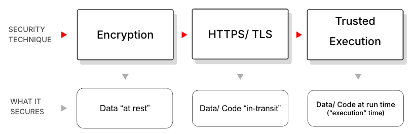

## Motivation
Public clouds (like AWS, Azure and GCP) support Confindential Computing because some customers request this before they agree to migrate workloads from their own DCs to public cloud infrastructure. While a vast majority of users don't ask the public clouds for this (and just blindly "trust" them) this is likely to become a challenge for Akash's growth particularly because infractstructure on Akash is owned by 10s if not 100s of independent providers.

## Background
Confidential Computing (CC) protects sensitive data while it's being used, by running computations inside a secure, isolated hardware environment—often a Trusted Execution Environment (TEE) or TEE “Enclave”—so that even cloud providers or system administrators can't access it. It is effectively the equivalent of what Encryption and TLS do for code/ data at rest and in transit, respectively.

The need for trusted execution came about as the mainstream tech industry transitioned from running their own datacenters to running in public clouds that are essentially datacenters owned by some other company (like AWS, Azure and GCP) and was led by verticals that were extra sensitive to data privacy (like healthcare, financial and federal use cases).

Two market dynamics drive the need for Akash to accelerate its confidential computing roadmap:
  1. The transition from centralized public clouds to decentralized public clouds increases the need to secure data and code at run-time since the infrastructure is now owned by 10s if not 100s of different providers.
   
  2. The growth in AI workloads for not just custom AI model hosting (while preserving IP) but also for privacy sensitive use cases like healthcare.

At a high level trusted execution is achieved by doing two things

- **Attestation** - which is essentially verifying that the environment (aka “Trusted Enclave”) where the code will be run can be trusted - this is typically achieved using “hardware verification”

- **Sealing/ Unsealing** - which is essentially the act of storing data in and retrieving data out of the TEE Enclave

## Prerequisites
The following are prerequisites to allow Akash providers to support trusted execution:

### TEE Capable Hardware (CPU & GPU)
Not all hardware is TEE capable. Here is the list of TEE capable CPUs and GPUs at the time of writing this spec:

#### TEE Capable CPUs

| Vendor | Feature                              | Required Models                                                                 |
|--------|--------------------------------------|---------------------------------------------------------------------------------|
| Intel  | TDX (Trust Domain Extensions)        | Intel Xeon 5th Gen CPUs like “Sapphire Rapids” (with TDX BIOS support)          |
| Intel  | SGX (Software Guard Extensions)      | Intel Xeon E3, Xeon D, and select 10th–11th Gen Core CPUs (now deprecated by Intel) |
| AMD    | SEV                                  | AMD EPYC “Rome” (7002 series)                                                   |
| AMD    | SEV-ES / SNP                         | AMD EPYC “Milan” (7003) and “Genoa” (9004) series                               |

#### TEE Capable GPUs

| Vendor      | Feature     | Required Models                                                                 |
|-------------|-------------|---------------------------------------------------------------------------------|
| NVIDIA      | NVTrust     | NVIDIA H100 or H200 (Hopper architecture) with CC-on mode                       |
| AMD/Intel   | _None yet_  | No current support for GPU-based TEEs (CPU-side only)                           |

In summary, Providers must use the following hardware:
- Intel CPUs with TDX (e.g., Xeon Sapphire Rapids)
- AMD CPUs with SEV-SNP (e.g., EPYC Milan/Genoa)
- NVIDIA H100 or H200 GPUs (for NVTrust support)

#### TEE Enabled Host Kernel & BIOS configuration

BIOS configuration changes need to be made to enable TDX/ SGX (for intel) and SEV (for AMD). These typically also require a certain minimum version of the Linux Kernel to be used.

##### Intel

To Enable memory encryption, TDX and SGX for Intel, consult [this document](https://github.com/canonical/tdx/blob/1.2/README.md ). 

##### AMD

To Enable AMD SEV, consult [this document](https://github.com/AMDESE/AMDSEV/blob/master/README.md).

#### Access to Device Nodes for Attestation
In order to perform attestation (i.e., fetch measurements and generate quotes), the container must access specific device nodes like:
- /dev/tdx-attest ([Intel TDX](https://docs.kernel.org/virt/coco/tdx-guest.html))
- /dev/sev-guest ([AMD SEV-SNP](https://docs.kernel.org/virt/coco/sev-guest.html))
- /dev/nv_attestation (NVIDIA H100 CC-on mode)

There are three main ways to allow containers access to these device nodes:

##### Privileged Containers

This involves allowing the container to run with --privileged flag or securityContext.privileged: true, which gives full access to all host devices.

This would be the simplest from an implementation standpoint as it would provide access to /dev/* nodes without requiring major orchestration changes

The Cons with doing this is that it poses a major security risk. Giving a tenant full host access including access to other containers’ processes, sockets or secrets which would violate tenant isolation requirements for Akash. FOR THIS REASON THIS IS A NOT EVEN AN OPTION.

##### Virtual Machines (Full Fledged VMs)

Full VMs would offer the strongest tenant isolation and flexibility in terms of OS, runtime and workload control and potentially unlock new use cases for Akash

The downsides of this approach are:
Requires figuring out how to orchestrate VMs with Kubernetes (possibly using KubeVirt) or figuring out an entirely different orchestratorKubeVirt
Has a performance overhead 
WIll also require implementing tenant-side VM image management which is harder than container packaging/ management

For this reason THIS IS ALSO LIKELY NOT THE BEST OPTION (at least not if we’re looking to get CC/ TEE support to market sooner than later)

##### MicroVMs

In this case, each container runs inside its own lightweight VM and the TEE (TDX/ SGX or SEV) protects the VM’s memory and execution state. This can likely be implemented using Kata Containers (container runtime) that uses QEMU (emulator) and KVM (hypervisor) underneath.

The benefits are:

  1. No need for a separate orchestrator. Kata Containers support the OCI container format and the Kubernetes CRI - so they should in theory work alongside regular docker containers
  2. Tenants can continue to use the containerized workflow
  3. Maintains performance of the existing (container based) deployment for the most part
  4. Provides better isolation than the current container implementation since each container runs in a dedicated kernel with network, memory and IO isolation

This would (at least in theory) achieve all the objectives for the near term while keeping the implementation complexity lower than full blown VMs. For this reason - THIS IS THE RECOMMENDED SOLUTION.

##  Ideal User Experience
The ideal user experience should be one where Akash users (aka “tenants”) should barely notice any difference in the deployment experience, relative to what it is for regular (non confidential) deployments. When requesting bids, they should be able to select an option (in the UI, the CLI or API) and be able to get bids only from providers that are capable of executing the tenant container within a secure enclave.
And once the deployment is done (container is running), the tenants should be able to make a set of simple, high level API calls from within the container to perform attestation, apply a policy and then seal an unseal subsequent requests for the duration of the container’s life.

In order to achieve that, the following need to be done (this assumed that the prerequisites from the previous section are satisfied)

1. Changes to provider attributes to allow providers to advertise that they are TEE/ CCE capable. 

2. Changes to the SDL to allow tenants to specify that they need a TEE/ CCE capable provider

3. An API or SDK that wraps the vendor specific SDKs and provides an easy to use interface for attestation

4. An API or SDK that wraps vendor specific SDKs and provides an easy way to perform sealing and unsealing.

## High Level Roadmap

Based on the above, the roadmap for achieving Confidential Computing on Akash Network can be broken down into:

- [AEP-29](https://akash.network/roadmap/aep-29/): Hardware Verification (Support for Attestation)
- [AEP-12](https://akash.network/roadmap/aep-12/): TEE Support (Support for sealing/ Unsealing)
- AEP-xx: Confidential Computing for Users (API/ SDK + SDL changes + provider attributes) - this could potentially be pulled into this document itself
