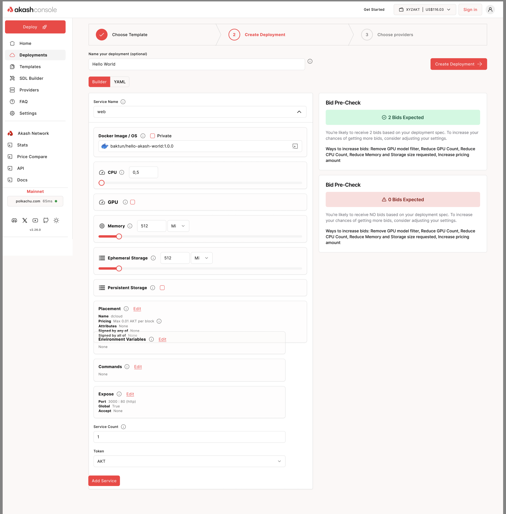

## Motivation

Users often see plenty of available GPUs on the pricing page but fail to receive any bids for their deployment. This causes users to think that the service is broken and likely give up on investigating further. Providing users guidance on why this is may be happening will go a long way in improving adoption.

## Background
There are situations where Console users hit the GPU pricing page (on the website) or the providers page (in console), see that there are enough "available" GPUs of the desired model, proceed to deploy via console, only to NOT get ANY bids for their deployment. This can happen due to the following primary reasons:

- While there may be enough "available" GPUs in aggregate (across multiple providers), there may not be enough GPUs on a single provider
- While there may be enough GPUs on a single provider, there aren't enough (to fulfill the gpu count in the user SDL) on a single node of the provider. This can happen if past small requests (1-2 GPUs per deployment) happened to get scheduled across different nodes of the provider, leaving the provider "fragmented" in terms of available GPUs.
- While there may be enough GPUs on a single node to satisfy the gpu count, the specific node may not have enough other (non-GPU) resources available to satisfy all the resource requirements outlined in the compute profile. We have sometimes seen this happen when a provider's CPU count gets maxed out (90%) with work loads while they have little usage of GPUs.

Users need some guidance on whether their SDL needs to be "adjusted" before they proceed with "create deployment" and if so, provide specific guidance on what needs to be changed in order to increase likelihood of bid being received

## Proposed Solution

One possible way to address this is to implement what we call a "Bid PreCheck" feature. The Pre-check feature should ideally check if the resources and pricing being requested by the user in the SDL will result in any bids or not, without them actually creating an on-chain transaction.

### Implementation

Ideally if should be a service on the providers that can be queried with resources as input and returns whether the provider will bid or not -- but this doesn't exist today. In the absence of that we will need to make use of inventory APIs

The way this would work is, when the user clicks on deploy and lands on either the SDL builder or the YAML editor page we would:

1. Parse the SDL to extract out the GPU Count, GPU filter (present or not), CPU count, memory size, storage size and pricing limit (uakt)
2.  Query the providers on the network to determine
     - Are there providers with those specific GPUs. If there are none then return 0 for "expected bids" and recommend to the user that they "remove the GPU filter"
     - If there are providers with those GPUs then check if they have the requested count on a single node. If there are none, then return 0 and recommend to the user that they "reduce the number of GPUs requested"
     - If there are enough GPUs on a node but not enough CPUs (to meet the requested CPU count) then return 0 and recommend to the user that they "reduce the CPU count")
     - If there are enough GPUs and CPUs on a single node but not enough memory or storage, then return 0 and recommend reducing those.
     - If there is a non zero value of providers/ nodes with requested resources then indicate that non-zero number and recommend the full list of things the user can do to increase that number

Also we should limit this function only to deployments created by users who are not trial users because trial users in general have limited providers that are likely to be fully used

1. For the YAML editor page, we split the frame into 2 halves. Display the YAML editor in the left half and in the right half, display the results of the pre-check

2. For the SDL builder page, we do essentially the same as 1 above except we would first 
     - Need to move the form fields that exist today on the right half of the page to be in a single column
     - Left justify that whole column

This is a rough/ initial/ tentative design that will likely be changed/ improved when we implement the feature

