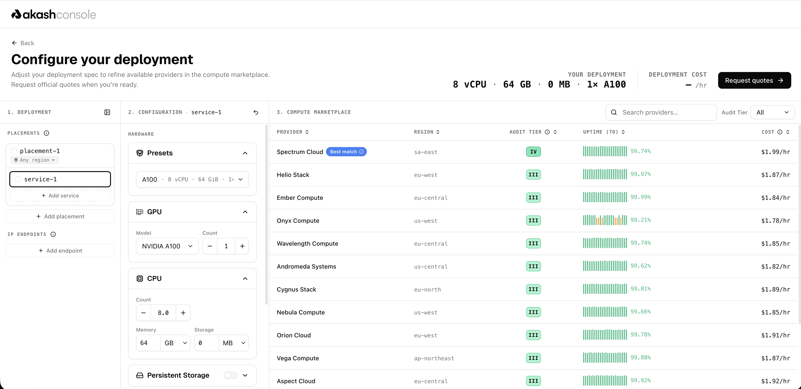
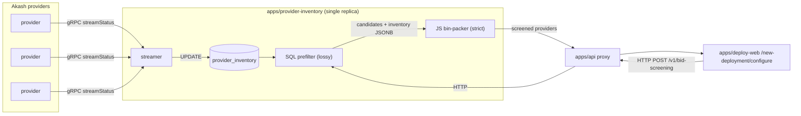

> This revision supersedes the original abandoned design (live per-provider inventory queries with a
> split-screen YAML editor + precheck panel) and documents the as-built **Bid
> Screening** feature. The feature was originally named "Bid PreCheck"; it is now "Bid Screening"
> everywhere (route, feature flag, service, glossary). The `aep-67` URL is unchanged.

## Motivation

Users often see plenty of available GPUs on the pricing page but fail to receive any bids for their deployment. This causes users to think that the service is broken and likely give up on investigating further. Providing users guidance on why this is happening will go a long way in improving adoption.

## Background

There are situations where Console users hit the GPU pricing page (on the website) or the providers page (in Console), see that there are enough "available" GPUs of the desired model, proceed to deploy via Console, only to NOT get ANY bids for their deployment. This can happen due to the following primary reasons:

- While there may be enough "available" GPUs in aggregate (across multiple providers), there may not be enough GPUs on a single provider.
- While there may be enough GPUs on a single provider, there aren't enough (to fulfill the GPU count in the user SDL) on a single node of the provider. This can happen if past small requests (1-2 GPUs per deployment) happened to get scheduled across different nodes of the provider, leaving the provider "fragmented" in terms of available GPUs.
- While there may be enough GPUs on a single node to satisfy the GPU count, the specific node may not have enough other (non-GPU) resources available to satisfy all the resource requirements outlined in the compute profile. We have sometimes seen this happen when a provider's CPU count gets maxed out (90%) with workloads while they have little usage of GPUs.

Users need to know — *before* they commit an on-chain transaction — whether their deployment is likely to receive any bids, and if not, *why*.

## Proposed Solution

**Bid Screening** screens the provider set against a deployment's requirements *before* the user creates the on-chain order, so the user only ever sees providers that would actually bid. Where the original proposal queried each provider's inventory live and presented "adjust your SDL" suggestions in a split-screen editor, the shipped design screens against a continuously-maintained, indexed snapshot of provider inventory and surfaces the result inline in the new deployment flow.

### User experience (new deployment flow)

The screened provider set is surfaced inside the redesigned, flag-gated deployment flow at `/new-deployment/configure`. As the user defines placements and services and edits their SDL, a marketplace pane shows the **screened** set of providers — those that would satisfy the deployment's requirements right now. This replaces the original split-screen YAML-editor / precheck-panel idea.

When zero providers match, the flow surfaces *why* — which dimension excluded them (aggregate capacity, per-node GPU count, GPU model, CPU/memory headroom, storage class, attributes, or price) — so the user can adjust the SDL with intent rather than guessing.

<!-- TODO: replace bid-precheck-screen.png with a real screenshot of the new deployment flow before marking this PR ready -->

### How it works (backend)

Bid screening is backed by **`apps/provider-inventory`**, a single-replica service that maintains one denormalised `provider_inventory` row per active provider. A **streamer** inside that service holds long-lived `streamStatus` gRPC connections to every active provider and writes each provider's current cluster state (rollup capacity columns, a JSONB inventory payload for the matcher, and self/signed attributes) into its row; a discovery loop polls the chain (~10 min) for new providers and audit attributes, and a 3-strike rule flips unreachable providers offline. This keeps a low-latency snapshot of "what could be leased right now" without fanning out to every provider on each request.

A screening request flows entirely over HTTP:

1. `apps/deploy-web` calls `apps/api`'s public `POST /v1/bid-screening` route.
2. `apps/api` is a thin, feature-flagged **proxy**: it validates auth and forwards the request to `apps/provider-inventory`. No bid-screening domain logic remains in `apps/api`.
3. `apps/provider-inventory` runs **two-stage matching**:
   - A **lossy SQL prefilter** narrows candidates on cluster-aggregate and per-node-max-free dimensions (capacity, GPU model, attributes, `signedBy`, storage class). It is intentionally lossy — it must never exclude a provider that would actually pass; false positives are fine.
   - A **strict JS bin-packer** is the final gate. It is a JavaScript port of the provider's Go resource-matching algorithm — greedy per-node packing that honours GPU fragmentation, storage classes, and per-node resource limits — and decides whether each candidate cluster can actually host every replica.

**Why indexed instead of live queries:** querying every provider's inventory live, per keystroke, does not scale on a decentralised network — fan-out latency and provider availability are unbounded. An indexed snapshot keeps screening bounded and fast (tens of milliseconds) and degrades gracefully when individual providers are unreachable.

Because the JS bin-packer must agree with what the provider's Go implementation would decide via `shouldBid`, the two implementations have to stay aligned — see *Future work*.

> For implementation depth, see the public ADR in the Console repo:
> [`apps/provider-inventory/docs/adr/0001-streamer-fed-provider-inventory.md`](https://github.com/akash-network/console/blob/main/apps/provider-inventory/docs/adr/0001-streamer-fed-provider-inventory.md).

### Architecture

```mermaid
flowchart LR
    subgraph providers["Akash providers"]
        P1[provider]
        P2[provider]
        P3[provider]
    end

    subgraph pi["apps/provider-inventory (single replica)"]
        ST[streamer]
        DB[(provider_inventory)]
        PF["SQL prefilter (lossy)"]
        BP["JS bin-packer (strict)"]
    end

    P1 -- gRPC streamStatus --> ST
    P2 -- gRPC streamStatus --> ST
    P3 -- gRPC streamStatus --> ST
    ST -- UPDATE --> DB

    DW["apps/deploy-web /new-deployment/configure"] -- "HTTP POST /v1/bid-screening" --> API["apps/api proxy"]
    API -- HTTP --> PF
    DB --> PF
    PF -- candidates + inventory JSONB --> BP
    BP -- screened providers --> API
    API --> DW
```

The streamer's `streamStatus` connections are the only gRPC in the path, and they are the *ingest* of provider state — not a per-request provider call. The screening request path itself is all HTTP. There is no provider-side gRPC precheck, no reservation-on-deploy, and no provider-proxy on this path.

## Future work

To keep the Console JS bin-packer provably aligned with the provider's Go `shouldBid` implementation, both should consume a set of **shared, versioned matching fixtures** — canonical (GroupSpec, inventory) → expected-decision cases checked in CI on both sides. This catches divergence between the two implementations before it reaches users and is the main outstanding hardening item.

## Rollout

Bid screening is gated behind the `BID_SCREENING` feature flag in `apps/api`. The backend (`apps/provider-inventory` and the `apps/api` proxy) is built and running; the redesigned 3-pane deployment-flow UX that surfaces the screened set is being rolled out as part of the broader Console redesign effort. Rollout is staged: enable behind the flag, cut over `/v1/bid-screening` from the legacy in-process path to the proxy, then sweep the now-dead legacy bid-screening code out of `apps/api`.
