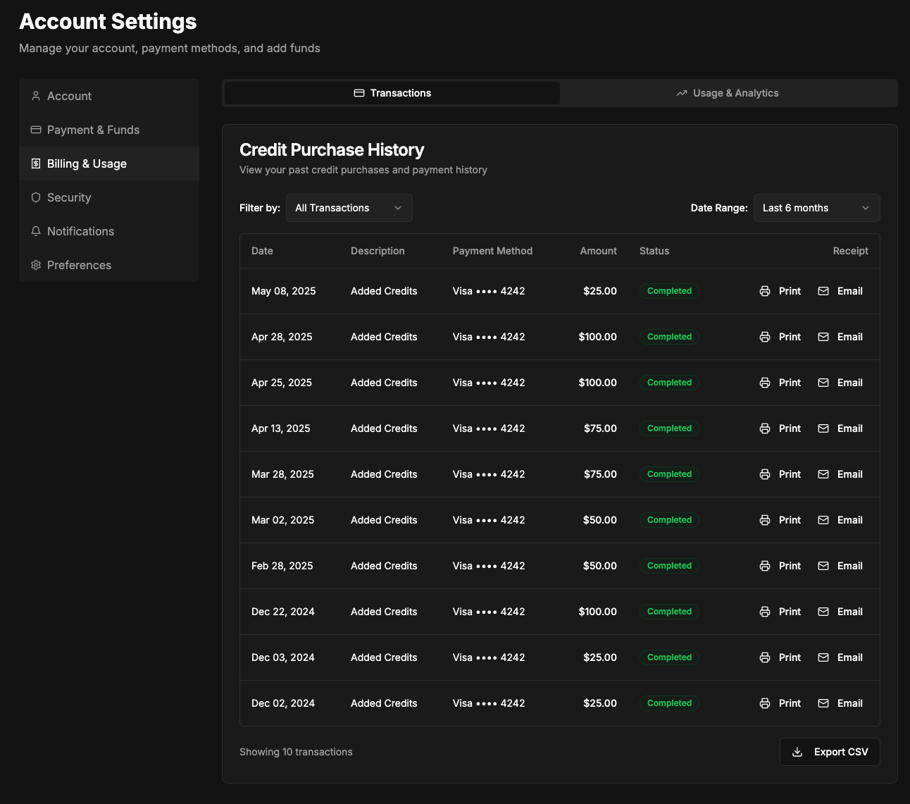
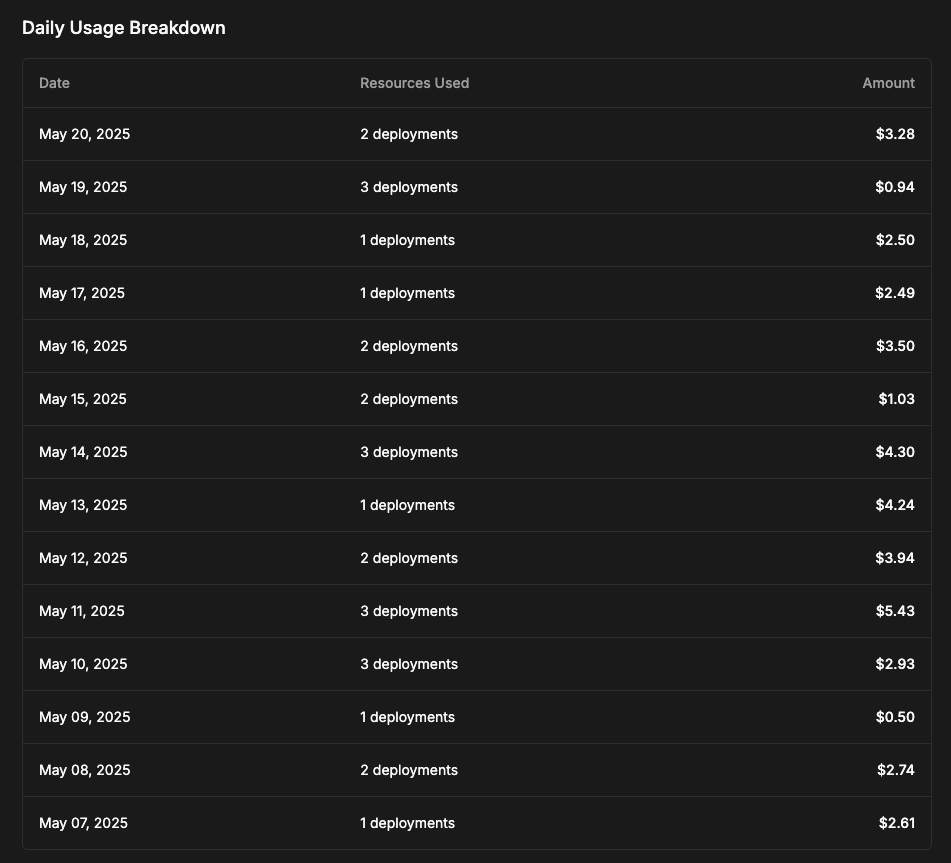
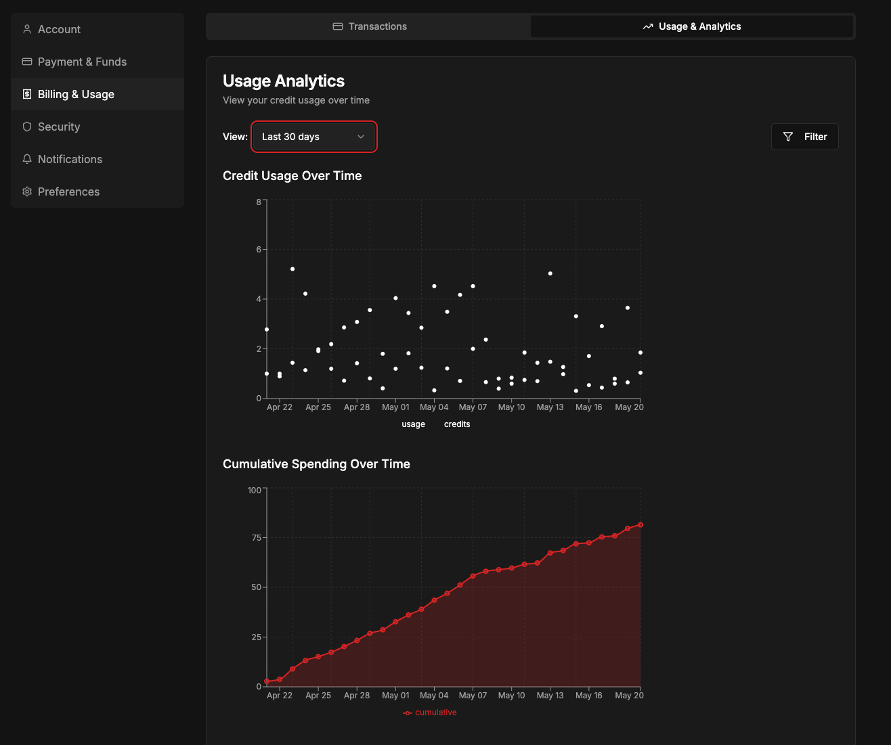
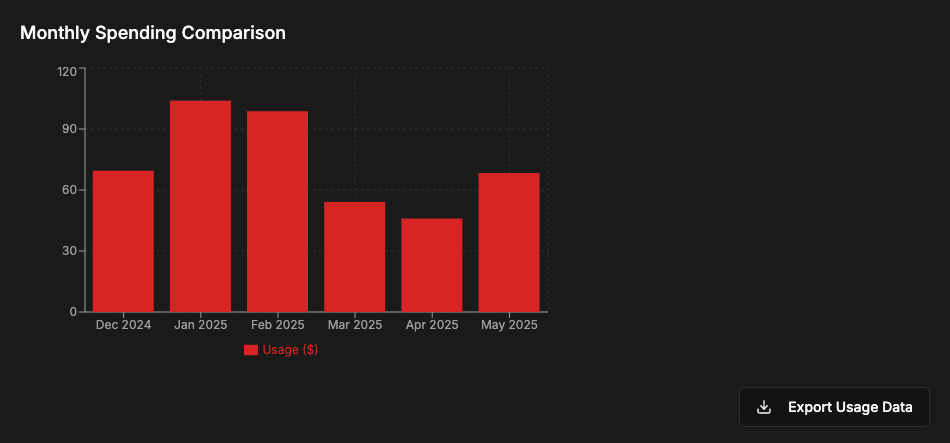

## Motivation

As number of credit card users in Akash Console grows, a common request we here is being able to view usage and billing info

## Background

Akash Console support two payment options - Crypto Wallet based and Credit Card based. For Crypto Wallets it is easy enough for the users to see when they used tokens for deployments with a blockchain scan tool like mintscan. For credit card users there is no such tracking avaialble. We do get the invoice data from Stripe that we should be able to pass back to the user.

Separately, users sometimes also may want to know how much of their funds are being used and for what - similar to the AWS (or othre cloud) billing pages where there is separation by services. In our case since we do not have managed services, showing some information about spend by provider or GPU models might be nice to have.

## Proposed Solution

A new page and submenu in the user Account Settings page called "Billing & Usage" that shows users information about billing and usage related things. The below elements are placeholder to be refined in eng and design conversations.

- Tabular Data for
  - Stripe Transactions 
    - Date 
    - Transaction Type (purchase/ refund) 
    - Payment Method 
    - Amount 
    - Status (suceeded or failed)
    - Link to download receipt
  - Daily Usage 
    - Date
    - Resources Leased
    - Amount Spent

- Charts that show:
  -  Cumulative Credit purchase over timne
  -  Account balance over time 
  -  Spend (in terms of compute costs for deployment) over time

#### Tenative Design Mocks

These are just placeholders for now to provide general direction and the final version will be different

