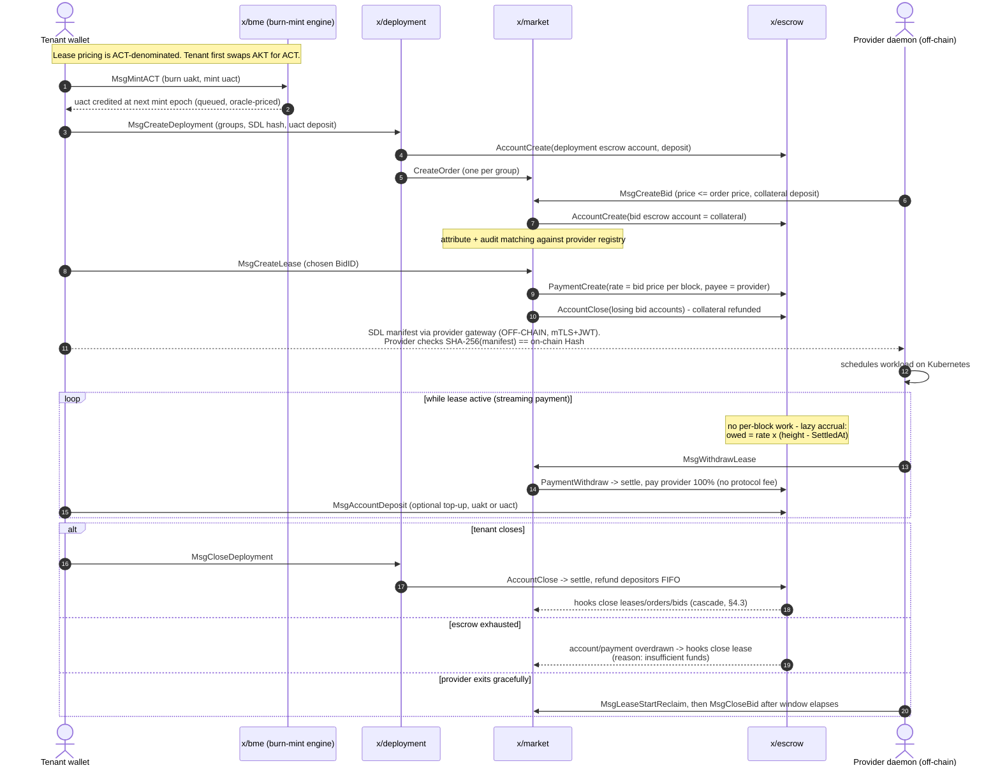
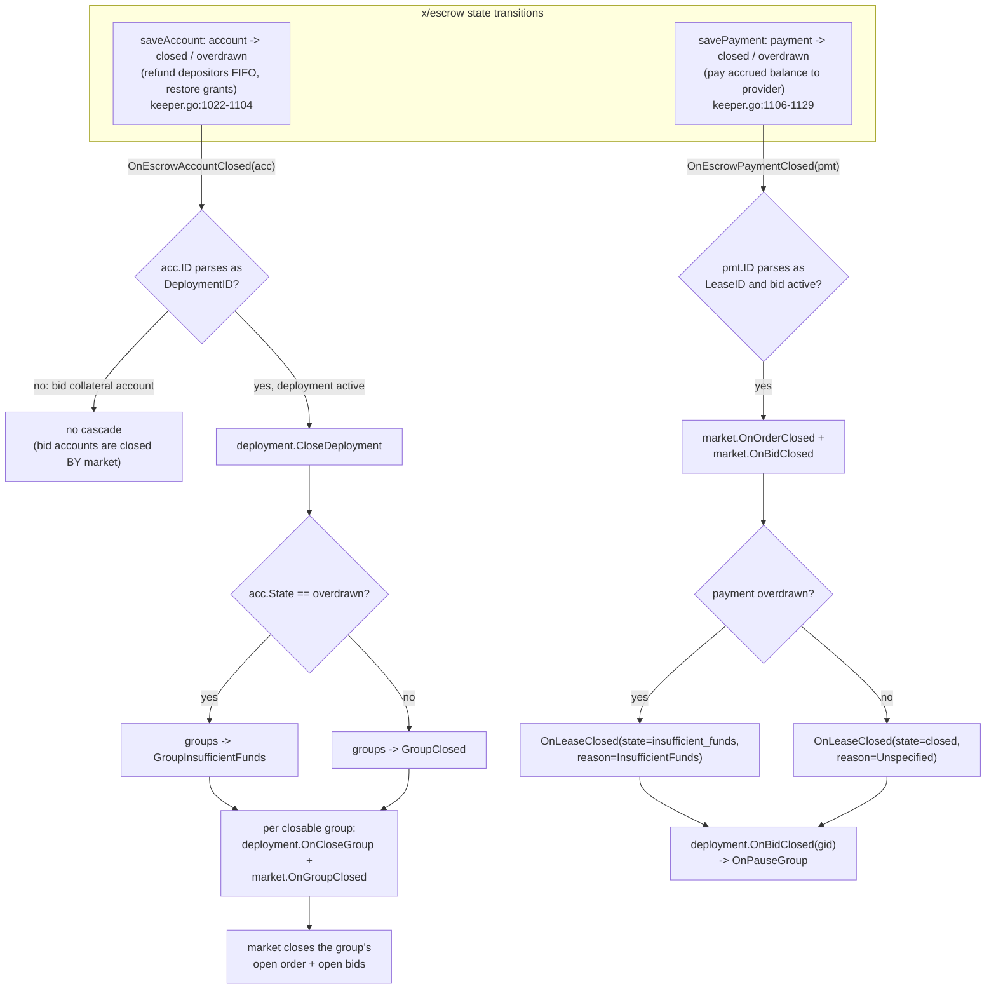

# 01. Current Architecture: Akash on Cosmos SDK

| | |
|---|---|
| **Document** | 01. Current architecture (Akash on Cosmos SDK) |
| **Doc ID** | AKASH-MIG-01 |
| **Version** | 0.9 (draft for review) |
| **Date** | 2026-08-10 |
| **Owner** | Overclock Labs |
| **Audience** | Vendor engineering |
| **Status** | INFORMATIVE: no `REQ-*` requirements; the factual baseline the normative documents build on |

## Purpose

- Describe, at engineering depth, what the Akash protocol **is today** on its sovereign Cosmos SDK chain: every
  module, its state layout, messages, parameters, events, block-lifecycle behavior, and inter-module wiring.
- Give Vendor engineers with **zero Cosmos background** enough context to read the rest of the set: every
  Cosmos-specific concept is defined on first use (§1.2).
- Isolate behaviors the target chain must reproduce faithfully (escrow settlement, the BME engine, the close
  cascade; §4) from incidental Cosmos plumbing that will not carry over.
- Enumerate off-chain systems coupled to the chain (§6), known defects that must **not** be ported (§7), and data
  that exists only as mainnet state and must be pulled at kickoff (§8).

## In scope

- The v2 protocol line as at commit `096bff57` (2026-08-10) of
  [`akash-network/node`](https://github.com/akash-network/node), Go module `pkg.akt.dev/node/v2`.
- Custom Akash modules, the in-repo CosmWasm contracts, chain-level configuration, genesis shape, upgrade history,
  and off-chain integration seams.
- Behavior descriptions grounded in code, cited as `path/file.go:line`.

## Out of scope

- Anything about the target chains; see [03](./03-solana-architecture.md) and [04](./04-ethereum-architecture.md).
- Migration mechanics; see [05](./05-token-migration.md) and [06](./06-state-and-data-migration.md).
- Message/state/event mapping to target designs; see [14](./14-appendix-protocol-mapping.md).
- Rationale for what is kept vs dropped; recorded as `D-xx` in [13](./13-open-questions-and-assumptions.md).

## 1. Orientation

### 1.1 What Akash is

Akash Network is a decentralized marketplace for compute. **Tenants** (customers) describe workloads in **SDL**
(Stack Definition Language, a YAML manifest: containers, resources, placement constraints, pricing). **Providers**
(datacenter/GPU operators running the separate `provider-services` daemon on Kubernetes) bid for that business.
The chain's job is narrow: run the **order book** (deployments → orders → bids → leases), hold **escrow** so
tenants can pay for leases as they run, meter payment out to providers block by block, and anchor the
identity/attribute/audit records that make bids trustworthy. Workloads never touch the chain: the SDL manifest
travels tenant→provider over an authenticated HTTPS channel, and only its hash lives on-chain.

Today this runs as a **sovereign Cosmos SDK Layer-1** ("Akash mainnet", chain-id `akashnet-2`) with its own
validator set, staking token (AKT), inflation, and governance. This document is the "as-is" baseline the
migration program starts from.

### 1.2 Cosmos SDK primer: concepts used throughout

The Cosmos SDK is a Go framework for building application-specific blockchains on the CometBFT (formerly
Tendermint) BFT consensus engine. Definitions the rest of this document assumes:

| Concept | Definition |
|---|---|
| **Module (`x/name`)** | A vertical slice of on-chain functionality: state + message handlers + queries + genesis logic. Stock SDK modules (`x/bank`, `x/staking`, `x/gov`, …) ship with the framework; Akash adds ten custom ones. |
| **Keeper** | A module's state-access object; holds its KV store and references to other modules' keepers (the dependency graph). "Keeper X calls keeper Y" = synchronous in-process call inside one state transition. |
| **KV store / IAVL / collections** | Each module owns a namespaced key-value store inside one Merkleized tree (IAVL); keys are hand-rolled byte prefixes. `collections` are newer typed wrappers; an `IndexedMap` maintains secondary indexes (e.g. "orders by state") automatically. A **transient store** is per-block scratch, wiped after each block. |
| **Msg / Query** | A `Msg` is a typed, signed state-transition request (protobuf), e.g. `MsgCreateDeployment`; a transaction carries one or more, executed atomically (any error rolls back the tx). A `Query` is a read-only gRPC service per module, also exposed as REST via **grpc-gateway**. |
| **Params** | A module's governance-adjustable configuration, changed via `MsgUpdateParams` that only the governance module account may sign ("gov-gated"). |
| **denom / Coin / DecCoin** | A `denom` is a token denomination string (`uakt` = micro-AKT, 10⁻⁶ AKT). `Coin` = integer amount + denom; `DecCoin` = high-precision decimal amount + denom (prices/rates). |
| **Module account** | A chain-owned account (no private key) holding funds a module controls, e.g. the escrow pool. Permissions (`Minter`, `Burner`, `Staking`) gate supply operations. |
| **bech32 address** | Cosmos address encoding: human-readable prefix + base32 payload. Akash prefixes: `akash` (accounts), `akashvaloper` (validators), `akashvalcons` (consensus keys) (`pkg.akt.dev/go/sdkutil/init.go:26-33`, `app/types/app.go:94`). |
| **ante handler** | An ordered decorator chain pre-validating every transaction before execution: signature checks, fee deduction, sequence increment. |
| **BeginBlocker / EndBlocker / hooks** | Per-module callbacks run automatically at the start/end of every block ("cron inside consensus"); cross-module ordering is significant (§5.5). Hooks are callback interfaces one module registers on another, e.g. escrow notifies market when an account closes (§4.3). |
| **Events** | Key-value attributes (legacy) or typed protobuf events emitted during execution; indexed by nodes, consumed by off-chain indexers; not consensus state. |
| **x/gov** | On-chain proposal/voting. Governance actions execute as Msgs whose `authority` is the gov module account. |
| **x/authz / x/feegrant** | `authz`: generic grants, where account A grants B the right to execute a specific Msg type within limits (used for delegated escrow deposits, §4.1.3). `feegrant`: A pays transaction fees for B (fees only, on Akash). |
| **IBC** | Inter-Blockchain Communication, Cosmos's trust-minimized cross-chain protocol. ICS-20 = the fungible-token-transfer standard over IBC. |
| **CosmWasm / wasmd / `Any`** | A smart-contract VM module (Rust→Wasm) embeddable in an SDK chain; on Akash it exists solely to host the Pyth oracle plumbing (§3.10–3.11). Protobuf `Any` = type-erased container (`type_url` + bytes), how contracts emit native Msgs. |
| **Genesis / zero-height export** | The JSON document a chain starts from; each module defines an export/import shape. A zero-height export re-creates genesis from live state (basis for migration snapshots). |
| **ConsensusVersion** | Per-module state-schema version, incremented with an in-place store migration at chain upgrades. |
| **Upgrade / Cosmovisor** | Coordinated halt-and-restart chain upgrades scheduled by governance at a named height; Cosmovisor swaps binaries. |

### 1.3 Marketplace lifecycle, end to end

Identifiers: a deployment is `(owner, dseq)`; groups add `gseq` (1..N), orders `oseq`, bids the provider address
and `bseq`. `dseq` is **client-chosen**, by convention the current block height at creation (CLI default), a UX
detail preserved per D-09 (Q-12 tracks whether tooling depends on the height correlation).



Withdraw/close paths in words: providers pull earned funds any time (`MsgWithdrawLease`); tenants close whole
deployments or individual groups; either close triggers final settlement and FIFO refund of unspent deposits; if
funds run out first, the escrow marks itself **overdrawn** and the hook cascade closes the lease with reason
`insufficient funds` (§4.3). Providers can also *reclaim*: a graceful provider-initiated wind-down with an
on-chain notice window (min 1 h, max 720 h) before the bid may close (D-24).

## 2. Protocol baseline: READ THIS FIRST

> **IMPORTANT: the protocol being migrated is the v2 line, not the classic Akash app.**
> The baseline is commit `096bff57` (2026-08-10, module `pkg.akt.dev/node/v2`). It differs materially from
> pre-2025 descriptions of Akash found elsewhere:
>
> 1. **Dual token.** AKT (`uakt`) remains the staking/governance/gas token. **ACT** (`uact`, "Akash Compute
>    Token") is a second denom in which **all lease pricing is denominated**; it is **bank-transfer-disabled**
>    (`SendEnabled: uact=false`, `cmd/akash/cmd/genesis.go:121-130`) and moves only through module logic.
> 2. **BME (burn-mint engine, `x/bme`).** ACT is created/redeemed against AKT through a queued, epoch-batched
>    burn-mint engine with an oracle-priced collateral-ratio circuit breaker (§3.4, §4.2).
> 3. **On-chain oracle.** AKT/USD enters consensus via `x/oracle`, fed exclusively by a CosmWasm-hosted Pyth
>    contract pipeline (§3.10–3.11), the only reason CosmWasm exists on the chain (D-22).
> 4. **Epochs scheduler** (`x/epochs`) drives periodic maintenance (oracle pruning).
> 5. **`x/take` is DELETED.** The historic protocol-fee module is out of the app since v2.0.0 (store removed).
>    **Providers currently keep 100% of lease payments; there is no protocol take** (§3.12, §4.1.5).
>
> Any protocol change shipped on mainnet before Gate 1 must be folded back into this document (A-12).

## 3. Module-by-module reference

Store-key bytes below are prefixes inside each module's namespaced KV store. All protobuf/state definitions live
**outside this repo** in the shared API module `pkg.akt.dev/go` (pinned `v0.2.14`, `go.mod:51`), import pattern
`pkg.akt.dev/go/node/<module>/<version>`; there are no `.proto` files in `akash-network/node` itself.

App wiring at a glance: Akash keepers are Audit, Bme, Cert, Deployment, Epochs, Escrow, Market, Oracle, Provider,
Wasm (`app/types/app.go:120-131`); **Take is not wired**. Keeper construction order encodes the dependency graph
(`app/types/app.go:421-491`): Oracle → Bme(account, bank, oracle) → Escrow(bank, authz, oracle, bme) →
Market(escrow) → Deployment(escrow, oracle, market, authz, bank) → Provider, Audit, Cert, Epochs, Wasm(awasm),
wasmd.

### 3.1 `x/deployment`: store `deployment`, ConsensusVersion 8

**Purpose.** Marketplace entry point. One SDL deployment = a `Deployment` record plus N `Group`s (a group is a
co-placed resource bundle with a price). Creating a deployment opens a deployment-scoped escrow account and one
market `Order` per group. Groups pause/start/close independently; closing the deployment closes the escrow
account, and everything else follows from the hook cascade (§4.3).

**State** (collections; `x/deployment/keeper/keeper.go:63-66`; protos `pkg.akt.dev/go/node/deployment/v1` (IDs,
Deployment, events) and `.../v1beta4` (Group, GroupSpec, Params, Msgs)):

| Object | Key layout | Fields |
|---|---|---|
| `Deployment` | IndexedMap @ `0x11 0x00`; state index @ `0x11 0x02` | `ID{Owner string, DSeq uint64}`, `State` (active \| closed), `Hash []byte` (SDL manifest hash), `CreatedAt int64`, `Reclamation *{MinWindow time.Duration}` |
| `Group` | IndexedMap @ `0x12 0x00`; indexes `groups_by_state`, `groups_by_deployment` @ `0x12 0x03` | `ID{Owner, DSeq, GSeq uint32}`, `State` (open \| paused \| insufficient_funds \| closed), `GroupSpec{Name, Requirements, Resources}`, `CreatedAt`. `ResourceUnit{Resources (cpu/mem/storage/gpu/endpoints), Count uint32, Price DecCoin}` |
| `pendingDenomMigrations` | Map @ `0x13 0x01` | `DeploymentID → math.Int`: AKT→ACT migration scratch, drained by v2.1.0 |
| `Params` | Item | below |

**Messages** (`x/deployment/handler/server.go`):

| Msg | Key fields | Handler behavior (funds movements in bold) |
|---|---|---|
| `MsgCreateDeployment` | `ID`, `Groups []GroupSpec`, `Hash`, `Deposit{Amount, Sources}`, `Reclamation` | `:41-130`: rejects existing ID; validates deposit vs `MinDeposits`; **rejects `uakt` deposits outright** (`:60-62`: AKT enters escrow only via later `MsgAccountDeposit`); reclamation window bounds vs market params; **group `Price` denom MUST be `uact`** (`:93`); `escrow.AuthorizeDeposits` (§4.1.3); stores Deployment + Groups (gseq 1..N); `market.CreateOrder` per group; **`escrow.AccountCreate` pulls the deposit into the escrow module account** |
| `MsgUpdateDeployment` | `ID`, `Hash` | `:132-157`: active-only; hash must differ; updates the SDL manifest hash pointer |
| `MsgCloseDeployment` | `ID` | `:159-177`: active-only; `escrow.AccountClose`; **all further state changes (refunds, lease/order/bid closure) flow through the escrow→market hook cascade** |
| `MsgCloseGroup` | `GroupID` | `:179-201`: group→`GroupClosed`; `market.OnGroupClosed` closes the group's order/bids |
| `MsgPauseGroup` | `GroupID` | `:203-214`: group→`GroupPaused`; `market.OnGroupClosed` |
| `MsgStartGroup` | `GroupID` | `:226-253`: reopens a paused group; `market.CreateOrder` with the deployment's reclamation settings |
| `MsgUpdateParams` | `Authority`, `Params` | `:255-268`: gov-gated |

**Params:** `MinDeposits sdk.Coins`, default `500000uakt, 500000uact`
(`pkg.akt.dev/go/node/deployment/v1beta4/params.go:32-38`); per-denom validation: a deposit in a denom missing
from `MinDeposits` errors. (The `uakt` entry gates top-ups; creation itself is uact-only, above.)
**Queries:** `Deployments`, `Deployment`, `Group`, `Params` (gRPC `akash.deployment.v1beta4.Query`).
**Events:** `EventDeploymentCreated/Updated/Closed`, `EventGroupClosed/Paused/Started`
(`x/deployment/keeper/keeper.go:228-379`).
**Block hooks:** module `EndBlock` delegates to `keeper.EndBlocker`, a **no-op** (`x/deployment/keeper/abci.go:7-9`);
the comment at `x/deployment/module.go:157` still references a deferred AKT→ACT denom migration, which actually
ran as store-migration v7 (`x/deployment/migrate/v7/act.go`: migrates group prices, escrow accounts/payments,
and authz grants between denoms at an oracle rate).
**Deps:** Escrow, Market, Oracle, Authz, Bank, BME (`x/deployment/imports/keepers.go`); inbound hook
`OnBidClosed(gid)` → `OnPauseGroup` (`keeper.go:421-427`).
**Genesis:** `{Params, Deployments: [{Deployment, Groups[]}]}`.

### 3.2 `x/market`: store `market`, ConsensusVersion 9

**Purpose.** The order book. Every open group has an `Order`; providers respond with `Bid`s, each collateralized
by its own escrow account; the tenant matches one bid into a `Lease`, which creates a streaming escrow `Payment`
at the bid price. Market also owns the provider-initiated **reclamation** flow.

**State** (collections; key layout `x/market/keeper/keys/key.go:29-56`; protos `pkg.akt.dev/go/node/market/v1`
(IDs, Lease, events) and `.../v1beta5` (Order, Bid, Params, Msgs)):

| Object | Key layout | Fields |
|---|---|---|
| `Order` | IndexedMap @ `0x11 0x01`; indexes by state `0x11 0x02`, by group+state `0x11 0x03` | `ID{Owner, DSeq, GSeq, OSeq uint32}`, `State` (open \| active \| closed), `Spec GroupSpec` (copied from group), `CreatedAt`, `Reclamation *DeploymentReclamation` |
| `Bid` | IndexedMap @ `0x12 0x02`; indexes by state `0x12 0x03`, by provider `0x12 0x04`, by order+state `0x12 0x05` | `ID{Owner, DSeq, GSeq, OSeq, Provider, BSeq uint32}`, `State` (open \| active \| lost \| closed), `Price DecCoin`, `CreatedAt`, `ResourcesOffer`, `ReclamationWindow *time.Duration` |
| `Lease` | IndexedMap @ `0x13 0x02`; indexes by state `0x13 0x03`, by provider `0x13 0x04` | `ID LeaseID`, `State` (active \| insufficient_funds \| closed \| reclaiming), `Price DecCoin`, `CreatedAt`, `ClosedOn int64`, `Reason LeaseClosedReason`, `Reclamation *{Window, StartedAt int64, Deadline int64, Reason}` |
| `Params` | Item @ `0x14 0x00` | below |

**Messages** (`x/market/handler/server.go`):

| Msg | Key fields | Handler behavior |
|---|---|---|
| `MsgCreateBid` | `ID BidID`, `Price DecCoin`, `Deposit`, `ResourcesOffer`, `ReclamationWindow` | `:29-136`: per-denom `BidMinDeposits`; rejects if order already has > `OrderMaxBids` bids; `BSeq` must be 0; order must accept bids; `order.Price() >= msg.Price`; offer must match group spec; provider must exist; **attribute matching against provider attrs + `audit.GetProviderAttributes`** (self-declared attrs prepended); `escrow.AuthorizeDeposits`; reclamation bounds; stores Bid; **`escrow.AccountCreate(bid escrow)` pulls the collateral**; telemetry `akash.bids` |
| `MsgCloseBid` | `ID`, `Reason` | `:138-192`. Open bid: just close. Active bid: reclamation gate. Lease active with `Reclamation != nil` ⇒ `ErrReclamationNotStarted`; lease reclaiming and `now < Deadline` ⇒ `ErrReclamationWindowNotElapsed`. Then `deployment.OnBidClosed` (pauses group), closes lease/bid/order, **`escrow.PaymentClose` (final settle + payout)** |
| `MsgCreateLease` | `BidID` | `:209-283`: bid, order, group all open; **`escrow.PaymentCreate(lease payment, payee = provider, rate = bid.Price)`**; stores Lease (copies `bid.ReclamationWindow` into `lease.Reclamation.Window`); marks order/bid matched; **closes all other open bids (`lost`) and `escrow.AccountClose` refunds their collateral** |
| `MsgCloseLease` | `ID`, `Reason` | `:285-336`: tenant-initiated; closes lease/bid/order; **`escrow.PaymentClose`**; `deployment.OnLeaseClosed`; **if the group is still open, re-creates a fresh Order (automatic relist)** |
| `MsgWithdrawLease` | `ID` | `:194-207`. **`escrow.PaymentWithdraw`: settle then pay accrued balance to provider** |
| `MsgLeaseStartReclaim` | `ID`, `Reason` | `:338-379`: lease active, `Reclamation != nil`, not already started; sets `StartedAt = height`, `Deadline = blockTime + Window`, state → `reclaiming`; emits `EventLeaseReclaimStarted` |
| `MsgUpdateParams` | | `:381-392`: gov-gated |

**Params** (`pkg.akt.dev/go/node/market/v1beta5/params.go:16-58`): `BidMinDeposit` (legacy single-denom)
`500000uakt`; `BidMinDeposits` `500000uakt, 500000uact`; `OrderMaxBids` 20 (validation cap 500);
`MinReclamationWindow` 1 h; `MaxReclamationWindow` 720 h.
**Queries:** `Orders/Order/Bids/Bid/Leases/Lease/Params`.
**Events:** `EventOrderCreated/Closed`, `EventBidCreated/Closed`, `EventLeaseCreated/Closed`,
`EventLeaseReclaimStarted`. `LeaseClosedReason` enum: `Invalid=0`, `Owner=1`, `Unstable=10000`,
`Decommissioned=10001`, `Unspecified=10002`, `ManifestTimeout=10003`, `InsufficientFunds=20000`.
**Block hooks:** none. **Hooks provided (inbound from escrow):** `OnEscrowAccountClosed`,
`OnEscrowPaymentClosed` (`x/market/hooks/hooks.go`, wired `app/types/app.go:568-574`); see §4.3.
**Deps:** Escrow, Deployment, Provider, Audit, Account, Authz, Bank (`x/market/handler/keepers.go`).
**Genesis:** `{Params, Orders, Bids, Leases}`.

### 3.3 `x/escrow`: store `escrow`, ConsensusVersion 3

**Purpose.** Generic streaming-payment escrow used by deployments (funding accounts) and bids (collateral
accounts). An `Account` holds multi-denom funds plus an ordered depositor list; `Payment`s attached to an account
drain it at a per-block `Rate`. Settlement is **fully lazy**: no per-block sweep (EndBlocker returns nil,
`x/escrow/keeper/abci.go:8-10`). Deep-dive in §4.1.

**State** (raw KVStore, NOT collections; `x/escrow/keeper/key.go:19-26`); note the unusual **state-in-key**
encoding (§4.1.4):

| Object | Key layout |
|---|---|
| `Account` | `0x11 0x00` ‖ state byte (`open=0x01`, `closed=0x02`, `overdrawn=0x03`) ‖ `'/'` ‖ `id.Key()` |
| `Payment` | `0x12 0x00` ‖ same shape |
| `BmeAccountsPrefix` | `0x14 0x01`: declared, unused (dead) |

Legacy `v1beta3` prefixes are retained alongside. Types (protos `pkg.akt.dev/go/node/escrow/{id/v1, types/v1,
v1}` + `types/deposit/v1`):

```
escrowid.Account{Scope (invalid|deployment|bid), XID string}   // deployment/bid ID rendered to string
escrowid.Payment{AID Account, XID string}                      // lease ID rendered to string
AccountState{Owner, State (open|closed|overdrawn), Transferred DecCoins, SettledAt int64 /*height*/,
             Funds []Balance{Denom, Amount LegacyDec}, Deposits []Depositor}
Depositor{Owner, Height int64, Source (balance|grant), Balance DecCoin}
PaymentState{Owner, State, Rate DecCoin /*per block*/, Balance DecCoin /*accrued, unwithdrawn*/,
             Unsettled DecCoin /*debt when overdrawn*/, Withdrawn Coin}
```

**Messages:** exactly one, `MsgAccountDeposit{Signer, ID, Deposit{Amount, Sources}}`
(`x/escrow/handler/server.go:31-44`), the top-up path and **the only way AKT (`uakt`) ever enters a deployment
escrow** (creation rejects it, §3.1). Everything else is keeper-to-keeper API called by deployment/market.
**Queries:** `Accounts`, `Payments` (`x/escrow/keeper/grpc_query.go`; prefix search over scope/state/xid).
**Params:** none. **Events:** none of its own; state changes surface via deployment/market events triggered by
hooks. **Block hooks:** EndBlocker nil (the settlement sweep was removed). **Deps:** Bank, Authz, Oracle, BME.
**Genesis:** `{Accounts, Payments}`. Recent fix the Vendor should know: `d7d0205d`. Closed payments are
persisted **before** account hooks fire (ordering matters for the cascade).

### 3.4 `x/bme`: stores `bme` + transient `bme`, ConsensusVersion 1

**Purpose.** The burn-mint engine between `uakt` and `uact`. Swap requests are queued as ledger records and
executed in batches on epoch boundaries inside the EndBlocker; a collateral-ratio (CR) circuit breaker halts ACT
minting when the vault's AKT value degrades. The `bme` module account is the vault and the only Akash module
account with `Burner+Minter`. Deep-dive in §4.2. Protos: `pkg.akt.dev/go/node/bme/v1`.

**State** (collections; `x/bme/keeper/key.go:12-26`):

| Object | Key | Content |
|---|---|---|
| `Params` | Item @ `0x09 0x00` | below |
| `status` | Item @ `0x04 0x00` | `{Status MintStatus, PreviousStatus, EpochHeightDiff int64}` |
| `epochs` | Map @ `0x04 0x01` | `"mint"` / `"burn"` → next execution height |
| `remintCredits` | Map @ `0x01 0x00` | denom → Int (§4.2.3) |
| `totalBurned` / `totalMinted` | `0x02 0x01` / `0x02 0x02` | lifetime counters |
| `ledgerPending` | Map @ `0x03 0x01` | queued swaps: `LedgerRecordID{Denom, ToDenom, Source, Height, Sequence}` → `{Owner, To, CoinsToBurn Coin, DenomToMint, Attempts uint32}` |
| `ledger` | Map @ `0x03 0x02` | executed: `{BurnedFrom, MintedTo, Burner, Minter, Burned/Minted *CoinPrice{Coin, Price LegacyDec}, Spread Coin, RemintCreditIssued/Accrued *CoinPrice}` |
| `ledgerPendingBalances` | Map @ `0x03 0x03` | denom → in-flight amount (excluded from CR) |
| `ledgerCanceled` | Map @ `0x03 0x04` | `{Owner, CancelReason, To, CoinsToBurn, DenomToMint}` |
| `ledgerSequence` | transient Item @ `0x03 0x05` | per-block sequence, reset each BeginBlocker |

`MintStatus` enum: `unspecified=0, healthy=1, warning=2, halt_cr=3, halt_oracle=4`.

**Messages** (`x/bme/handler/server.go`):

| Msg | Behavior |
|---|---|
| `MsgBurnMint{Owner, To, CoinsToBurn, DenomToMint}` | `:52-75`: general form → `RequestBurnMint` |
| `MsgMintACT` | `:77-98`. Sugar: burn `uakt` → mint `uact` |
| `MsgBurnACT` | `:100-121`. Sugar: burn `uact` → mint `uakt` (redemption) |
| `MsgFundVault{Authority, Amount, Source}` | `:123-167`: **gov-only**; source must be a non-module account; **bank-sends source → bme vault**; emits `EventVaultFunded` |
| `MsgUpdateParams` | `:34-50`: gov-gated |

`RequestBurnMint` (`x/bme/keeper/keeper.go:786-865`): only `uakt`↔`uact`; requires a healthy oracle price for
both denoms; rejects when status ≥ `halt_cr` **except ACT→AKT redemptions remain allowed under a CR-driven halt**
(blocked under `halt_oracle`); allocates `(height, sequence)`; adds to `ledgerPendingBalances`; **escrows the
burn-side coin into the module account immediately**; writes the pending record. Execution is in the EndBlocker
(§4.2.1).

**Params** (`pkg.akt.dev/go/node/bme/v1/params.go:13-44`): `CircuitBreakerWarnThreshold` 9500 bps;
`HaltThreshold` 9000 bps; `MintSpreadBps` 25; `SettleSpreadBps` 0; `MinEpochBlocks` 10;
`EpochBlocksBackoffPercent` 10; `MaxEndblockerRecords` 50; `MinMint` 10,000,000 uact; `MaxPendingAttempts` 3.
Validation: warn > halt, both ≤ 10000, spreads ≤ 1000. The same file also defines the settlement epoch identifier
`"bme"` and a 1 h oracle TWAP window.
**Queries:** `Params`, `VaultState`, `Status`, `LedgerRecords`.
**Events:** `EventMintStatusChange{Previous, New, CollateralRatio}`, `EventVaultFunded`,
`EventLedgerRecordExecuted`, `EventLedgerRecordCanceled`.
**Block hooks:** BeginBlocker resets the transient sequence; EndBlocker executes epochs
(`x/bme/keeper/abci.go:35-213`, §4.2.1).
**Deps:** Account, Bank (mint/burn/send/`GetSupply`/`GetBalance`), `Oracle.GetAggregatedPrice`.
**Genesis:** `{Params, State{TotalBurned, TotalMinted, RemintCredits}, Ledger{Records, PendingRecords}}`.

### 3.5 `x/oracle`: stores `oracle` + transient `oracle`, ConsensusVersion 2

**Purpose.** The AKT/USD price oracle. Authorized sources (in practice: exactly one CosmWasm Pyth contract
address) push timestamped price entries; the EndBlocker computes a TWAP+median aggregate and a health status.
Consumers: `bme.calculateCR`, `escrow.settleFromAktFallback`, the deployment keeper. Recently moved to time-based
prices (`319be8e8`). Protos `oracle/v2` (`v1` retained for migration).

**State** (collections; `x/oracle/keeper/key.go:12-24`): `Params` Item @ `0x09`; `latestPriceID`
Map[`PriceDataID{Source uint32, Denom, BaseDenom}`] @ `0x11 0x01`; `aggregatedPrices`
Map[`DataID{Denom, BaseDenom}` → `AggregatedPrice`] @ `0x11 0x02`; `pricesHealth` @ `0x11 0x03`; `prices`
Map[`PriceDataRecordID{Source, Denom, BaseDenom, Timestamp, Sequence}` (custom key codec)] @ `0x11 0x05`; source
registry `sourceSequence` @ `0x12 0x00` / `sourceID` Map[string→uint32] @ `0x12 0x02`; transient `pricesSequence`
@ `0x12 0x01`.

**Messages:** `MsgAddPriceEntry{Signer, ID DataID, Price LegacyDec, Timestamp}`; signer must be listed in
`params.Sources`; **only `Denom=="akt"`, `BaseDenom=="usd"` accepted**; price positive; timestamp monotonically
non-decreasing per source. `MsgUpdateParams` gov-gated.
**Params** (`x/oracle` `params.go:31-46`): `MinPriceSources` 1; `MaxPriceStalenessPeriod` 30 s;
`MaxPriceDeviationBps` 150; `TwapWindow` 5 s; `PriceRetention` 24 h; `PruneEpoch` `"hour"`; `MaxPrunePerEpoch`
1000; `MaxFutureTimeDrift` 10 s; `Sources` (mainnet: the Pyth contract address, set by v2.1.0; see §5.8);
`FeedContractsParams []*Any`.
**Queries:** `Prices`, `Params`, `AggregatedPrice`.
**Events:** `EventPriceData`, `EventPriceStaleWarning`, `EventPriceStaled`, `EventPriceRecovered`,
`EventAggregatedPrice`.
**Block hooks:** EndBlocker (`x/oracle/keeper/abci.go:28-176`): builds the active-source set from params (entries
from removed sources ignored); drops entries older than `now − staleness`; computes TWAP over `[now − window,
now]` with boundary clamping; aggregates + writes health; emits `EventAggregatedPrice` only when healthy. Pruning
of records older than `PriceRetention` runs via the epochs hook (`x/oracle/keeper/prune.go`), ≤
`MaxPrunePerEpoch` per `"hour"` epoch.

### 3.6 `x/epochs`: store `epochs`

**Purpose.** Osmosis-style named-epoch scheduler exposing `BeforeEpochStart`/`AfterEpochEnd` hooks. Its only
consumer today is oracle price pruning; BME keeps its own height-based epoch counters (§3.4), though the named
epoch `"bme"` (`DefaultSettlementEpochName`) is defined. Protos `epochs/v1beta1`.

**State:** `EpochInfo{ID, StartTime, Duration, CurrentEpoch, CurrentEpochStartTime, CurrentEpochStartHeight,
EpochCountingStarted}` per named epoch (`"hour"`, `"bme"`). **Messages/Params:** none. **Queries:** `EpochInfos`,
`CurrentEpoch`. **Block hooks:** BeginBlocker (`x/epochs/keeper/abci.go:12-91`); on rollover it emits
`EventEpochEnd`, runs `AfterEpochEnd` hooks in a cache context (**hook errors are swallowed, non-halting**),
increments, emits `EventEpochStart`, runs `BeforeEpochStart` the same way. **Genesis:** `{Epochs}`.

### 3.7 `x/provider`: store `provider`, ConsensusVersion 3

**Purpose.** The provider registry: owner address, public host URI (the gateway tenants talk to), self-declared
attributes (region, tier, GPU models, …), contact info. Bids are validated against these attributes plus audits
(§3.8). Protos `pkg.akt.dev/go/node/provider/v1beta4`.

**State:** raw KV, single map; `ProviderKey = ProviderPrefix ‖ LengthPrefix(ownerAddr)`;
`Provider{Owner, HostURI, Attributes, Info{EMail, Website}}`.
**Messages** (`x/provider/handler/server.go`): `MsgCreateProvider` `:33-51`; `MsgUpdateProvider` `:53-72` (the
historical "no active leases" guard was removed in v0.32.0 for gas cost and never reintroduced);
`MsgDeleteProvider` `:74-88`, which **returns `ErrInternal "NOTIMPLEMENTED"`** (in-code TODO: cancel leases first; §7).
**Queries:** `Providers`, `Provider`. **Params:** none. **Events:** `EventProviderCreated/Updated`
(`EventProviderDeleted` exists in proto, never emitted). **Genesis:** `{Providers}`.

### 3.8 `x/audit`: store `audit`, ConsensusVersion 3

**Purpose.** Third-party attestation over provider attributes. An auditor signs a subset of a provider's
attributes; bid matching treats audited attributes first-class via `audit.GetProviderAttributes` (§3.2). Protos
`pkg.akt.dev/go/node/audit/v1`.

**State:** raw KV; `ProviderKey = PrefixProviderID ‖ LengthPrefix(owner) ‖ LengthPrefix(auditor)`; value
`AuditedAttributesStore{Attributes}`; read model `AuditedProvider{Owner, Auditor, Attributes}`. Recent fix
`151b989a` (serialize audited attributes in queries).
**Messages:** `MsgSignProviderAttributes{Owner, Auditor, Attributes}`;
`MsgDeleteProviderAttributes{Owner, Auditor, Keys []string}`.
**Queries:** `AllProvidersAttributes`, `ProviderAttributes`, `ProviderAuditorAttributes`, `AuditorAttributes`.
**Params:** none. **Events:** `EventTrustedAuditorCreated/Deleted`. **Genesis:** `{Providers}`.

### 3.9 `x/cert`: store `cert`, ConsensusVersion 4

**Purpose.** On-chain x509 certificate registry backing mutual-TLS between tenant clients and provider gateways;
the chain is the CA-less trust root (a certificate is trusted because its owner published it on-chain). Per D-10
this module is **not ported** (replaced by JWT auth over on-chain registered signing keys), but its semantics
matter for the transition window ([07](./07-offchain-and-clients.md)). Protos `pkg.akt.dev/go/node/cert/v1`.

**State:** raw KV; key `0x11` ‖ state (`valid=0x01`, `revoked=0x02`) ‖ `len(owner)` ‖ owner ‖ `len(serial)` ‖
serial (max serial length 40). `Certificate{State, Cert []byte PEM, Pubkey []byte}`; `CertID{Owner, Serial
big.Int}`.
**Messages:** `MsgCreateCertificate{Owner, Cert, Pubkey}`, which parses/validates the x509, stores keyed by serial
(duplicates rejected); `MsgRevokeCertificate{ID}`, which moves the record to the revoked prefix.
**Queries:** `Certificates` (filter Owner/Serial/State). **Params/Events:** none.
**Genesis:** export re-parses every stored x509 and **panics** if the parsed serial mismatches the store key;
relevant to export tooling in [06](./06-state-and-data-migration.md).

Off-chain companions in-repo: `x/cert/utils/key_pair_manager.go` (local cert generation/load) and
`x/cert/utils/utils.go` (`LoadAndQueryCertificateForAccount`: local validity + on-chain presence check). **JWT
auth is off-chain only today:** `akash auth jwt` (`cmd/akash/cmd/auth.go`) signs keyring-backed JWTs via
`pkg.akt.dev/go/util/jwt` (`--exp/--nbf/--access/--scope`); no on-chain JWT state; verification is provider-side.

### 3.10 `x/wasm` ("awasm") + wasmd: stores `awasm` and `wasm`

**Purpose.** `wasmd` is the standard CosmWasm smart-contract module. Akash wires it **only** to host the Pyth
oracle contract pipeline (§3.11) and wraps it with a thin guardrail module `awasm` (store `awasm`,
ConsensusVersion 1, protos `wasm/v1`) that filters what contracts may do.

**awasm state:** `Params{BlockedAddresses []string}`. **Messages:** `MsgUpdateParams` only. **Queries:** `Params`.
**Events:** `EventMsgBlocked{ContractAddress, MsgType, Reason}`.

**The message filter** (`x/wasm/keeper/msg_filter.go:64-180`, installed via `WithMessageHandlerDecorator`,
`app/types/app.go:495-497`) constrains every native message a contract emits: Bank `Send` ALLOW unless the
recipient is blocked; Bank `Burn` DENY; Staking/Distribution/Gov/IBC/IBC2/Custom DENY; Wasm (contract→contract)
ALLOW; protobuf `Any`: **ALLOW exactly one type-url, `/akash.oracle.v2.MsgAddPriceEntry`** (`:171`), the single
pinhole through which Pyth prices reach `x/oracle`; everything else DENY.

**Query side:** the stargate query whitelist is **empty** (`x/wasm/bindings/query_whitelist.go`: all stargate
queries from contracts rejected) and the custom-querier handlers are commented out
(`x/wasm/bindings/custom_querier.go` returns UnsupportedRequest), though the plugin wiring exposes
`AkashQuery::OracleParams` (`app/types/app.go:499-503`). See §7.

**wasmd configuration is hard-coded** (`app/app.go:158-163`): `MemoryCacheSize=100MB`,
`SmartQueryGasLimit=3,000,000`, `ContractDebugMode=true` (in-code comment: "MUST be false in production";
outstanding defect, §7). Capabilities: builtin + `"akash"`.

### 3.11 `contracts/`: in-repo CosmWasm (Rust) crates

**Purpose.** The oracle feed path: an off-chain pusher submits signed Pyth price updates to a CosmWasm contract,
which verifies them and emits the one whitelisted native message (`MsgAddPriceEntry`) into `x/oracle`. Per D-22
this layer collapses into direct Pyth pull-oracle reads on the targets; it is documented because its
**verification semantics** define what "a valid price" means today.

Cargo workspace (Rust 1.86, edition 2021, `panic=abort`, overflow checks; `cosmwasm-std 3.0.2`, `cw-storage-plus
3.0.1`). Contract bytecode is embedded in Go upgrade handlers (`upgrades/software/v2.1.0/contracts.go`,
`.../v2.0.0/contracts.go`; `script/wasm2go.sh`) and uploaded via `MsgStoreAndMigrateContract` during upgrades.

| Crate | Version | Role |
|---|---|---|
| `contracts/pyth_pro` | 1.0.1 | Newest consumer (`0dbfd230`): delegates VAA signature verification to `pyth_vaa` instead of embedding a Wormhole guardian set |
| `contracts/pyth` | 1.0.1 | Original consumer; verifies against the wormhole contract |
| `contracts/pyth_vaa` | 1.0.1 | "Pyth router-signed VAA verifier"; near-stateless verifier queried by `pyth_pro` |
| `contracts/wormhole` | 1.0.0 | Full Wormhole core: guardian sets, VAA archive, governance packets |

`pyth_pro`: `Config{admin, pyth_vaa_contract, update_fee Uint256, price_feed_id, default_data_id{denom:"akt",
base_denom:"usd"}}`; stores `PriceFeed{symbol "AKT/USD", price, conf, expo=-8, publish_time, prev_publish_time}`.
`execute_update_price_feed` (`contracts/pyth_pro/src/contract.rs:90-231`): requires attached `uakt` funds ≥
`update_fee`; parses the Pyth accumulator update (PNAU, from the Hermes service); smart-queries `pyth_vaa`
`VerifyVAA{vaa, block_time}`; verifies the Merkle proof; parses the price-feed message; asserts feed id, non-zero
price, `expo == -8`, `publish_time >=` stored; saves the feed; emits
`CosmosMsg::Any{"/akash.oracle.v2.MsgAddPriceEntry"}` with manual protobuf encoding
(`contracts/pyth_pro/src/oracle.rs:89`). `pyth_vaa` holds a router-verifier config (router set index, router
keys, expected emitter chain/address). `wormhole` maintains guardian sets, sequences, a VAA archive, and
governance packets (ContractUpgrade/GuardianSetUpgrade/SetFee/TransferFee).

### 3.12 `x/take`: dead code, not wired

Historic protocol-fee module: skimmed a percentage of every escrow payout to the community pool. Its store was
deleted at the v2.0.0 upgrade; it is absent from keepers, stores, module lists, and module-account permissions
(`app/types/app.go:120-131`, `app/mac.go:15-27`). Residual code: `SubtractFees(amt)` at
`findRate(denom) = DenomTakeRates[denom] ?? DefaultTakeRate` (%); legacy params `DefaultTakeRate=20`, `uakt=2`
(`pkg.akt.dev/go/node/take/v1/params.go:29-38`). **Net effect today: providers keep 100% of lease payments; the
current chain has no protocol take.** Whether the target chain re-introduces a take is a target-design question
([03](./03-solana-architecture.md)/[04](./04-ethereum-architecture.md)); it is *not* current behavior, and parity
tests ([09](./09-testing-and-verification.md)) must model zero take.

## 4. Deep-dives: behavior the target chain must reproduce faithfully

These three subsections are the heart of the protocol. [14](./14-appendix-protocol-mapping.md) maps each element
to target-chain constructs; D-19/D-20/D-21 fix the porting decisions.

### 4.1 Escrow mechanics (`x/escrow/keeper/keeper.go`)

#### 4.1.1 Lazy settlement math

There is **no per-block escrow work**. Each account records `SettledAt` (the height of its last settlement).
Whenever anything touches the account, `accountSettle` (`:535-604`) runs:

```
heightDelta = currentHeight − account.SettledAt
for each open payment:      owed = payment.Rate × heightDelta     (per-denom, LegacyDec)
for each overdrawn payment: owed = payment.Unsettled              (carried debt, cleared on success)
```

`accountSettleFullBlocks` (`:1282-1333`) transfers `owed` from account funds into each `Payment.Balance`
(accrued-but-unwithdrawn earnings), truncating to integer micro-units at withdrawal. Rates are `DecCoin` per
block; with the 6.5 s target block time (`util/network/network.go:8`) a price of X uact/block ≈ X/6.5 uact/s,
the basis for the per-second conversion fixed in D-21. If funds cannot cover a payment in full, the shortfall
becomes that payment's `Unsettled` debt and the payment goes overdrawn. `SettledAt` advances to the current
height, except when the account is already overdrawn, in which case it is frozen (no further accrual against a
dead account).

#### 4.1.2 Settlement trigger points

Settlement runs **only** at these interaction points (no timer, no sweep):

| Trigger | Notes |
|---|---|
| `AccountClose` | deployment close, losing-bid refund |
| `AccountDeposit` | **only when the account is overdrawn** (top-up rescue path) |
| `PaymentCreate` | lease creation |
| `PaymentWithdraw` | provider withdrawal (`MsgWithdrawLease`) |
| `PaymentClose` | lease/bid close |
| `AccountSettle` (public keeper API) | **no in-repo caller**; exists for external use |

Consequence the Vendor must internalize: **overdrawn detection is event-driven.** A lease whose escrow ran dry at
height h is not observed as overdrawn until someone interacts (typically the provider's periodic withdraw).
Nothing in consensus forces timely detection; D-21 adds a permissionless settle entrypoint on the target chain
precisely because of this.

#### 4.1.3 Deposits: multi-depositor FIFO + authz grants

Deposits carry `Deposit{Amount, Sources}`, `Sources ∈ {SourceBalance, SourceGrant}`. `AuthorizeDeposits`
(`:176-345`) walks sources in order for the single signer:

- `SourceBalance`: spend from the signer's own spendable bank balance, capped at the remainder ⇒
  `Depositor{signer, source=balance}`.
- `SourceGrant`: resolve `x/authz` grants of type `/akash.escrow.v1.DepositAuthorization` where the tx signer is
  grantee (`authzKeeper.GetGranteeGrantsByMsgType`); rebuild a synthetic msg for just the requested amount
  (`:252-282`); `TryAccept(partial=true)` decrements the grant's `SpendLimits` and persists it ⇒
  `Depositor{granter, source=grant}`. `DepositAuthorization{SpendLimit Coin (legacy), Scopes []Scope, SpendLimits
  Coins}`. Grants are **authz**, not feegrant (feegrant covers tx fees only). Supported grantee msg types:
  `MsgAccountDeposit`, `MsgCreateDeployment`, `MsgCreateBid`. Since v0.34.0, only **one** authz depositor per
  deployment is supported.

Any unfunded remainder ⇒ `ErrInvalidDeposit` (whole tx reverts). `fetchDepositsToAccount` (`:471-533`) then
bank-sends each depositor's coins into the `escrow` module account, resets negative funds to zero first,
increments `Funds`, and **appends** to the ordered `Deposits` list; deposit order is preserved.

**Spend is FIFO; refunds restore grants.** `deductFromBalance` (`:1211-1280`) consumes depositors oldest-first
per denom, pruning exhausted entries and accumulating per-denom `Transferred` totals. On account close/overdraw,
`saveAccount` (`:1022-1104`) refunds each surviving depositor's remaining balance from the module account, and
**if the depositor was a grant, the refund is credited back to the granter's
`DepositAuthorization.SpendLimits`** (`:1050-1075`). Console's fee-sponsorship product depends on this
restore-on-refund behavior (D-21 preserves it as an explicit delegated-deposit allowance).

#### 4.1.4 Overdrawn encoding

"Overdrawn" is encoded twice, and both encodings are load-bearing:

1. **Negative `Funds`.** When FIFO deduction cannot cover the owed amount, the remainder is subtracted anyway,
   driving `Funds[denom]` negative; the negative balance *is* the overdraft marker (`deductFromBalance`,
   `:1211-1280`). Later deposits reset negatives to zero before crediting (`:471-533`).
2. **State-in-key.** The record is deleted from its `open`-prefixed key and rewritten under the `overdrawn` state
   byte (§3.3). Every read probes all three state keys (`:1335-1375`).

On overdraw: account → `StateOverdrawn`; every attached payment → `StateOverdrawn` with residual debt in
`Unsettled`; accrued balances are paid out (`paymentWithdraw`); remaining depositor balances refunded; hooks fire
(§4.3). Raw writers `SaveAccountRaw/SavePaymentRaw` (`:947-962`) bypass hooks/refunds, used only by the denom
migration.

#### 4.1.5 AKT-fallback settlement, and the no-fee payout

`settleFromAktFallback` (`:609-687`): if an account is overdrawn on `uact` but still holds `uakt`, **and**
`bme.GetMintStatus() >= halt_cr` (the engine is halted, so AKT cannot become ACT), **and** the oracle has a
positive AKT price, then the keeper converts the unsettled ACT debt at the oracle price
(`unsettled_uact / akt_price ⇒ uakt`), deducts from the account's AKT funds, bank-sends escrow → provider
directly in `uakt`, clears the `uact` `Unsettled`, and reopens the payment. Debt is not carried past exhausted
funds. This is the safety valve keeping providers whole in AKT when ACT liquidity is frozen; D-21 ports it.

Payout itself, `paymentWithdraw` (`:1187-1209`): truncate `Payment.Balance` to integer micro-units, bank-send
escrow module account → payment owner (the provider), `Withdrawn += earnings`, `Balance −= earnings`. **No
take/fee deduction anywhere in the path: the provider receives 100%** (§3.12).

### 4.2 The BME engine (`x/bme/keeper/`)

#### 4.2.1 Swap queue and epoch execution

A swap is two-phase. Phase 1 (msg handling, §3.4): validate, escrow the burn-side coins into the vault, record a
pending ledger entry keyed `(denom, toDenom, source, height, sequence)`. In-flight amounts sit in
`ledgerPendingBalances` and are **excluded from the collateral ratio** so queued swaps do not distort the
breaker. Phase 2 is the EndBlocker (`x/bme/keeper/abci.go:35-213`), per block in order:

1. **Burn epoch** (`uact → uakt` redemptions): if `epochs["burn"] ≤ height`, iterate pending burn records,
   executing at most `MaxEndblockerRecords`; next epoch at `height + MinEpochBlocks`.
2. **Status update** (`mintStatusUpdate`, `keeper.go:882-946`): recompute CR, transition `MintStatus`, emit
   `EventMintStatusChange` on change.
3. **Mint epoch** (`uakt → uact`): if the breaker just reset (previous ≥ `halt_cr`, now ≤ `warning`), recompute
   the next epoch first; else if due **and** status healthy/warning, iterate pending mint records; a
   post-condition check aborts the walk if CR trips mid-loop.

Each record executes in a `CacheContext` (isolated child state merged only on success): success ⇒ write-through +
move to the executed `ledger`; fatal error ⇒ cancel with reason (refund path); retriable error ⇒ `Attempts++`,
canceled at `MaxPendingAttempts` (`BMCancelReasonMaxAttempts`). Execution mints the target denom at the oracle
price, applies `MintSpreadBps` (25 bps withheld on mint; `SettleSpreadBps` 0), and records
`{Burned, Minted, Spread, RemintCredit*}` as `CoinPrice` pairs (amount + execution price).

#### 4.2.2 Collateral ratio and circuit breaker

`calculateCR` (`keeper.go:742-784`):

```
CR = (vault_uakt − pending_uakt) × (price_AKT / price_ACT) / TotalSupply(uact)
```

A zero/absent oracle price ⇒ `halt_oracle` (everything blocked). Otherwise (bps of fully collateralized):
CR < 9000 ⇒ `halt_cr`; CR < 9500 ⇒ `warning`; else `healthy`. Under `halt_cr`, **ACT→AKT redemptions still
execute** (they raise CR); new mints do not. Under `warning`, epochs stretch:
`EpochHeightDiff = MinEpochBlocks × (1 + backoff%)^steps`, `steps = (warn − cr_bps)/10`, capped at 14,400 blocks
(~26 h at 6.5 s), throttling mint throughput as collateral degrades.

#### 4.2.3 Remint credits and vault funding

Remint credits are supply-accounting bookkeeping (the implementation does true burn+mint; comment at
`x/bme/keeper/keeper.go:64-65`): when AKT is burned on the mint side, the burned amount accrues to
`remintCredits["uakt"]` (`keeper.go:601-617`; accrual tracked for non-ACT denoms only). When an ACT→AKT
redemption later mints AKT, it draws that credit down first; the payout splits into a "remint-issued"
(credit-backed) portion and a freshly-minted portion (`keeper.go:516-541`), so net new AKT supply from the
engine trends to zero. The vault is funded only by governance: `MsgFundVault` (§3.4) and, historically, the
v2.1.0 community-pool transfer (§5.9). Vault seeding on the target chain: D-20 / [05](./05-token-migration.md).

### 4.3 The escrow → market → deployment close cascade

Closing anything in Akash converges on escrow state transitions, which fan back out through hooks
(`x/market/hooks/hooks.go`, wired `app/types/app.go:568-574`). This is the most intricate control flow in the
protocol; target designs must reproduce it exactly (cascade tests in [09](./09-testing-and-verification.md)).



Directional summary:

- **Deployment-initiated close** (`MsgCloseDeployment`): deployment calls `escrow.AccountClose` and *nothing
  else*; settlement, provider payout, depositor refunds, group closure, order/bid/lease closure all happen
  inside the escrow save + hook chain.
- **Funds exhaustion**: any settlement trigger (§4.1.2) can flip the account/payment to overdrawn; hooks close
  the lease with `InsufficientFunds` (20000) and mark groups `insufficient_funds` (distinct from `closed`; a
  top-up + restart path exists).
- **Market-initiated closes** (`MsgCloseBid`/`MsgCloseLease`) call `escrow.PaymentClose`/`AccountClose`
  themselves, then do their own order/bid bookkeeping; the hook still fires but finds the bid already inactive
  (idempotence matters). `MsgCloseLease` on a still-open group **relists** a fresh order (§3.2).
- Ordering subtlety: closed payments are persisted before account hooks run (`d7d0205d`); hook handlers observe
  consistent payment state.

## 5. Chain-level configuration

### 5.1 Tokens and denominations

Denom constants: `pkg.akt.dev/go/sdkutil/init.go:8-34`.

| Family | base | mid | display | exponent | Notes |
|---|---|---|---|---|---|
| AKT | `uakt` | `makt` | `akt` | 6 | staking bond denom (`sdkutil/init.go:21`), gas fees, gov deposits |
| ACT | `uact` | `mact` | `act` | 6 | lease pricing denom; **`SendEnabled=false`** (`cmd/akash/cmd/genesis.go:121-130`); moves only via module logic (escrow, BME) |
| USD | `uusd` | `musd` | `usd` | 6 | oracle quote unit only, not a bankable asset |

Genesis bank metadata (`cmd/akash/cmd/genesis.go:224-265`) defines AKT correctly; ACT's `Display` is `uact`
instead of `act` (defect, §7). D-19 ports ACT with equivalent non-transferability; D-03/D-04 fix 6 decimals for
AKT on the targets to match `uakt` micro-units 1:1.

### 5.2 Consensus, block time, tx processing

- CometBFT consensus, ~**6.5 s average block time**, the constant used in lease/deployment time math
  (`util/network/network.go:8` `AverageBlockTime = 6500ms`); first-init node default `TimeoutCommit = 5s`
  (`util/cli/configs.go:324`). Per-block escrow rates convert to per-second at this basis under D-21.
- **Ante chain is entirely stock SDK** (`app/ante.go:46-58`): SetUpContext, ValidateBasic, TxTimeoutHeight,
  ValidateMemo, ConsumeGasForTxSize, DeductFee (+feegrant), SetPubKey, ValidateSigCount, SigGasConsume,
  SigVerification, IncrementSequence. No custom fee or deposit decorators; the constructor's
  GovKeeper/FeegrantKeeper non-nil checks (`app/ante.go:38-44`) are vestigial.
- **Unordered transactions are ENABLED** (`authkeeper.WithUnorderedTransactions(true)`, `app/types/app.go:279`):
  txs may commit without strict per-account sequence ordering; client and indexer tooling must not assume
  monotonic sequences.
- `PrepareProposal`/`ProcessProposal` are deliberate no-ops (`app/app.go:265-270`); no custom mempool, no vote
  extensions.
- **Fees:** flat min-gas-price, no fee market (no EIP-1559 analogue); set via `baseapp.SetMinGasPrices`
  (`cmd/akash/cmd/app_creator.go:98`). Defaults disagree in-tree: `0.0025uakt` (`cmd/akash/cmd/config.go:26`) vs
  `0.025uakt` (`util/cli/configs.go:361`); the community-accepted mainnet floor is `0.025uakt` (§7).

### 5.3 Staking / slashing / gov / distribution parameters

From `MainnetGenesisParams()` (`cmd/akash/cmd/genesis.go:219-299`), the only in-repo statement of intended
values; live values must be read from mainnet state (§8):

| Module | Params |
|---|---|
| staking | UnbondingTime 14 days; MaxValidators 100; BondDenom `uakt`; MinCommissionRate 0.05 |
| distribution | CommunityTax 0; WithdrawAddrEnabled true |
| gov | MinDeposit 2,500,000,000 uakt (2,500 AKT); MaxDepositPeriod 14 days; VotingPeriod 3 days; Quorum 0.2; Threshold/Veto = SDK defaults |
| crisis | ConstantFee 500,000,000,000 uakt |
| slashing | SignedBlocksWindow 30,000 blocks; MinSignedPerWindow 0.05; DowntimeJailDuration 1 min; SlashFractionDoubleSign 0.05; SlashFractionDowntime 0 (no liveness slashing) |

Extras: `ExpeditedMinDeposit` only in the testnetify path (`150000000uakt`, `app/testnet.go:290`); testnet
overrides at `cmd/akash/cmd/genesis.go:301-316`. **gov `MaxMetadataLen` is raised to 10,200** (vs SDK default
256; `app/types/app.go:377-379`); off-chain proposal tooling depends on embedding large metadata. The legacy gov
router with the paramproposal route is still registered (`app/types/app.go:366-375`).
**Mint/inflation:** stock `x/mint` (`app/types/app.go:355-363`; module `app/modules.go:85-91`, inflation-fn
override explicitly nil at `:89`). **Inflation parameters are NOT in this repo**: `GenesisParams.MintParams` is
declared but never assigned (`cmd/akash/cmd/genesis.go:210`); live values are mainnet state only (§8, Q-19).
**Vesting:** stock `x/auth/vesting` (Base/Delayed/Continuous) via `akash genesis add-account`
(`cmd/akash/cmd/genaccounts.go:24-110`); no custom types; the live inventory is mainnet state (§8).

### 5.4 Module accounts, permissions, blocked receivers, stores

`app/mac.go:15-27`:

| Module account | Permissions |
|---|---|
| `fee_collector`, **`escrow`** (the escrow pool), `distribution` | none |
| **`bme`** (the BME vault) | **Burner, Minter** |
| `mint` | Minter |
| `bonded_tokens_pool` / `not_bonded_tokens_pool` | Burner, Staking |
| `gov` | Burner |
| `transfer` (IBC) | Minter, Burner |

`allowedReceivingModAcc` is **empty** ⇒ every module account is blocked from receiving external bank sends
(`app/app.go:85,496-504`); funds enter module accounts only through module logic. The balances these accounts
hold at snapshot are exactly the funds routed to the Wind-down Reserve under D-05
([05](./05-token-migration.md)).

**KV stores** (`app/types/app.go:605-637`); cosmos: consensus, auth, feegrant, authz, bank, staking, mint,
distribution, slashing, gov, params, ibc, upgrade, evidence, ibctransfer, wasm; akash: epochs, escrow,
deployment, market, provider, audit, cert, awasm, oracle, bme. Transient: params, bme, oracle. Legacy `x/params`
subspaces are retained for the stock modules plus deployment/market key tables (`app/types/app.go:582-603`);
other Akash modules store params under key `0x01` in their own stores.

**Cross-module hooks** (`app/types/app.go:554-579`): staking → distribution + slashing (stock); gov → empty
multihook; **escrow → market** (§4.3); **epochs → oracle** (price pruning, §3.5). Hazard: gov routes are
registered before `SetupHooks()` runs (§7 item 6).

### 5.5 Module ordering constraints, and why

Block-lifecycle ordering is computed from declared constraints via `util/partialord` (`app/app.go:325-395`), not
hand-listed. The declared partial order:

- **BeginBlockers:** `epochs` FIRST (epoch rollovers precede everything consuming epoch hooks);
  `distribution → slashing → evidence → staking` (stock reward/penalty pipeline); `staking → ibc`; **`oracle`
  before `bme` before `escrow`**; `awasm` before `wasm`; `transfer` before `wasm`.
- **EndBlockers:** `gov`, `staking` first (stock); the same oracle→bme→escrow chain governs the modules'
  end-of-block work.
- **InitGenesis** is an explicit list ending `… epochs, bme, escrow, awasm, wasm` (`app/app_configure.go`).

The `oracle → bme → escrow` chain is the protocol's economic dataflow, and it is why ordering is semantics, not
style: the oracle EndBlocker publishes the aggregated AKT/USD price; BME's EndBlocker consumes that price to
execute queued swaps and recompute the circuit breaker; escrow's AKT-fallback settlement (§4.1.5) consumes both
the price and BME's halt status. Reordering changes which price a given block's mints and settlements see. On
target chains with no block-lifecycle hooks, the same constraint re-materializes as "read the freshest oracle
price inside the swap/settle instruction/function"; see
[03](./03-solana-architecture.md)/[04](./04-ethereum-architecture.md).

### 5.6 Discovery service: the client/server version contract

The node exposes an Akash-specific discovery endpoint: gRPC `akash.discovery.v1.Discovery/GetInfo`, REST
`GET /akash/discovery/v1/info`, and CometBFT JSON-RPC method `"akash"` (`app/app.go:538-541,570-578`). Payload:
`chain_id`, `node_version`, **`min_client_version`**, and per-API module version maps (deployment `v1beta4`,
market `v1beta5`, oracle `v2`, …). This is a hard client/server contract: `chain-sdk` and the `akt` CLI negotiate
API versions from it (`pkg.akt.dev/go/node/client/README.md`; `testutil/network/rpc.go:12,26` exists solely to
satisfy `aclient.DiscoverClient` in tests). Any target-chain RPC/indexer stack must provide an equivalent
capability/version negotiation surface ([07](./07-offchain-and-clients.md)).

### 5.7 IBC surface

Wired at `app/types/app.go:336-551`:

- IBC core with the 07-tendermint light client only.
- **Token transfer (ICS-20) only.** v1 router with `transfer` and `wasm` ports, **plus the v2 router (IBC
  "Eureka")**: `transferv2.NewIBCModule` + a wasm prefix route (`app/types/app.go:546-551`).
- **Absent:** ICA host/controller (added v0.18.0, removed v0.20.0), packet-forward-middleware, ICS-29 fee
  middleware, callbacks, async-icq, capability module.
- `ibctransfer` module account holds Minter+Burner (voucher mint/burn; `app/mac.go:25`).

Implication: cross-chain AKT exists as ICS-20 vouchers on other Cosmos chains (Osmosis, Cosmos Hub, …), backed by
`uakt` locked in per-channel IBC escrow addresses on Akash. Those balances are snapshot inputs (D-07, §8,
Q-03/Q-19). Naming trap: "Hermes" in `_run/node` scripts is the **Pyth Hermes price service**, not the IBC
relayer of the same name (`_docs/pyth-integration.md:304-305`).

### 5.8 Hard-coded addresses and trust roots

- `akash1nc5tatafv6eyq7llkr2gv50ff9e22mnf70qgjlv737ktmt4eswrqyagled`: the Pyth price contract; baked into the
  v2.1.0 upgrade (`upgrades/software/v2.1.0/upgrade.go:66`) and set as the **sole** authorized oracle source
  (`oracle.Params.Sources`, `MinPriceSources=1`). **Mainnet price truth is a single-source trust root today.**
- `akash10d07y265gmmuvt4z0w9aw880jnsr700jhe7z0f`: the gov module account; admin of the Pyth/Wormhole contracts
  and the `authority` on every `MsgUpdateParams`/`MsgFundVault`.
- Wormhole guardian-set updates bypass Akash governance: any account may submit a valid guardian VAA
  (`guardian_set_expirity = 86400`; `_docs/governance-updates.md:44-57`).

### 5.9 Upgrade history

Upgrades self-register via a plugin registry (`upgrades/types/types.go`; installed `app/upgrades.go:34-56`;
height patches run in BeginBlocker `app/app.go:446-454`, currently none). Convention:
`_docs/adr/adr-001-network-upgrades.md`. Only v2.1.0 remains in-tree; history per CHANGELOG + git:

| Upgrade | One-line summary |
|---|---|
| akash_v0.15.0 | Baseline of the named-upgrade era (Cosmos SDK v0.44.x) |
| v0.18.0 | Added Interchain Accounts (ICA) |
| v0.20.0 | Removed ICA |
| v0.24.0 | v1beta3 stores; GPU resource units; multi-denom `MinDeposits`; "Take Pay" introduced (added `take`, `agov`, `astaking`, feegrant) |
| v0.26.0 | Incremental release (see `upgrades/CHANGELOG.md`) |
| v0.28.0 | Added `ResourcesOffer` to bids |
| v0.30.0 | Incremental release (see `upgrades/CHANGELOG.md`) |
| v0.32.0 | Dropped provider active-lease check on update (gas cost) |
| v0.34.0 | Authz deposit-grant reuse (refund restores spend limit) |
| v0.36.0 | Feegrant ante fix |
| v0.38.0 | AEP-61 key-layout performance work |
| v1.0.0 | Cosmos SDK 0.47; deleted custom `astaking`/`agov` |
| v1.1.0 | Repaired overdrawn escrow accounts |
| v1.2.0 | deployment+market state → collections IndexedMap |
| v2.0.0 | Added epochs/oracle/awasm/wasm/bme stores (dual-token protocol); **deleted `x/take` store**; release later retracted in go.mod (superseded by v2.1.0) |
| v2.1.0 | Current (`upgrades/software/v2.1.0/upgrade.go:54-138`): store migrations (oracle v1→v2 **wipes the oracle store**; deployment v7 drains `pendingDenomMigrations`; market v8 no-op); stores+migrates the Pyth contract (admin `AllowNobody`); sets oracle `Sources`; akashnet-2-gated move of 427,414,453 uakt distribution→escrow module account (manual `FeePool.CommunityPool` decrement); backfills `bme.MaxPendingAttempts=3` and market reclamation windows |

The testnetify/upgrade-test tooling (`akash in-place-testnet`, `tests/upgrade`, Cosmovisor v1.7.1) is the current
chain's operational muscle for coordinated upgrades, context for the sunset upgrade in
[10](./10-rollout-and-cutover.md) (D-18).

### 5.10 Genesis export shape (per custom module)

Zero-height export (`app/export.go`; folds validator dust into the community pool at `:151-157`) is the basis
for migration snapshots ([06](./06-state-and-data-migration.md)):

| Module | Export shape |
|---|---|
| deployment | `{Params{MinDeposits}, Deployments: [{Deployment, Groups[]}]}` |
| market | `{Params, Orders, Bids, Leases}` |
| escrow | `{Accounts, Payments}` (no params) |
| provider | `{Providers}` |
| audit | `{Providers: []AuditedProvider}` |
| cert | `{Certificates: [{Owner, Certificate}]}`; export re-parses x509s, panics on serial mismatch |
| oracle | `{Params, GenesisSourceID, GenesisLatestPricesIDs}` |
| bme | `{Params, State{TotalBurned, TotalMinted, RemintCredits}, Ledger{Records, PendingRecords}}` |
| epochs | `{Epochs}` |
| awasm | `{Params{BlockedAddresses}}` |
| take | `{Params}`; not wired, not exported |

### 5.11 Forked core dependencies: a standing maintenance burden

All three foundational dependencies are **Akash forks** (go.mod replaces):

| Upstream | Fork |
|---|---|
| cosmos-sdk v0.53.6 | `github.com/akash-network/cosmos-sdk v0.53.7-akash.2` |
| cometbft v0.38.21 | `github.com/akash-network/cometbft v0.38.21-akash.1` |
| gogoproto v1.7.2 | `github.com/akash-network/gogoproto v1.7.0-akash.2` |

Plus: ibc-go/v10 v10.5.0 (IBC v2/Eureka-capable), wasmd v0.61.7 + wasmvm/v3 v3.0.2, store v1.1.2, iavl v1.2.6,
rosetta v0.50.12 (wired `cmd/akash/cmd/root.go:79`), Go 1.26.2. Maintaining a sovereign chain currently means
rebasing three forks against upstream security releases indefinitely, one of the operational-burden drivers
quantified in [00](./00-executive-summary.md) and [02](./02-target-selection.md).

## 6. Off-chain seams

Everything here keeps working only if the target chain (or its indexer/API layer) preserves the corresponding
contract. Adaptation is specified in [07](./07-offchain-and-clients.md).

| Consumer | Seam into the chain |
|---|---|
| **`pkg.akt.dev/go`** (successor to `akash-api`; pinned v0.2.14, `go.mod:51`) | The shared contract: ALL proto/state types, denom constants, params, `sdkutil` encoding, event helpers, discovery registry. Every Go client of Akash imports it. Replacing the chain starts with replacing/forking this module. |
| **`pkg.akt.dev/go/cli`** (v0.2.4, `go.mod:52`) | The entire `query`/`tx`/`keys`/`events`/`genesis` CLI tree and flag definitions: the node repo has **no** `x/*/client/cli` packages; the `akash` binary (`cmd/akash/cmd/root.go:69-87`) mounts this external module. |
| **`pkg.akt.dev/go/sdl`** (v0.2.2, `go.mod:53`) | SDL parsing/validation used by node tests and provider tooling. |
| **provider-services** (`akash-network/provider`) | The provider daemon: consumes market events (bid engine), x/cert certificates, JWTs, and the discovery endpoint; dev seams at `_run/common-commands.mk:49-84` (auth-server, send-manifest, `--auth-type` JWT) and `_docs/development-environment.md:28-57`. |
| **chain-sdk** (`@akashnetwork/chain-sdk`, TypeScript) | Requires an RPC client exposing the `Akash(ctx)` discovery method (§5.6; `testutil/network/rpc.go`). |
| **Indexers / Console** | grpc-gateway REST + typed events + the `cosmossdk.io/schema` state-streaming seam: newer modules implement `ModuleCodec()` (`x/bme/module.go:190-193`, `x/oracle/module.go:201`, `x/epochs/module.go:166`). **Partial coverage**: only collections-based modules; escrow/provider/audit/cert (raw KV) do not stream, so indexers combine event-tailing with query polling. |
| **`akash-network/net`** repo | Chain metadata contract: `https://raw.githubusercontent.com/akash-network/net/master/mainnet/meta.json` (and `sandbox-2/meta.json`); RPC endpoints, binary URLs, upgrade matrix consumed by installers and tooling. |
| **snapshots.akash.network** | Node bootstrap: `https://snapshots.akash.network/<network>/latest`. |
| **Pyth Hermes price-feeder** | Off-chain pusher (`_run/node/price-feeder.sh`, `_docs/pyth-integration.md`): polls Pyth's Hermes service for signed AKT/USD updates and submits `execute_update_price_feed` txs to the CosmWasm contract (§3.11), the component that keeps the oracle alive. Its liveness is a protocol dependency (no price ⇒ `halt_oracle` ⇒ BME and ACT-mint paths freeze). |

### 6.1 SDL and manifest hashing (ADR-002): byte-identical requirement

The SDL YAML never touches the chain. The tenant's client compiles it into a **manifest**; the chain stores only
`Deployment.Hash`; the manifest goes tenant → provider over the provider's gateway, and the provider recomputes
the hash and rejects mismatches. Per ADR-002 (`_docs/adr/adr-002-manifest-v2beta2.md`): **manifest version =
SHA-256 of the sorted JSON serialization** (reference implementation in `akash-api`
`go/manifest/v2beta2/manifest.go`), with strict validation rules (sorted services, name regexes, …).
Consequence: any client producing manifests must serialize **byte-identically** to the Go reference, or providers
reject valid deployments. This constraint survives the migration untouched (A-10, D-09); only the location of
the on-chain hash changes.

### 6.2 Events and the in-process bus

Off-chain consumers key on two event styles: legacy `akash.v1` message events (`sdkutil.EventTypeMessage` with
`BaseModuleEvent{Module, Action}`; `pkg.akt.dev/go/sdkutil/event.go`) and typed protobuf events (e.g.
`bme.EventVaultFunded`). In-process, `pubsub/bus.go` is the async fan-out bus that historically backs the
provider bid engine; on the target chain this maps to websocket/log subscriptions
([07](./07-offchain-and-clients.md)).

## 7. Known defects: do NOT port

Faithful reproduction (§4) does not extend to bugs. Treat the following as explicitly outside the parity
envelope; each is tracked to a fix or design change in the target docs:

1. **`GenesisParams.MintParams` / `.ConsensusParams` declared but never populated**
   (`cmd/akash/cmd/genesis.go:210`): `prepare-genesis` emits zero-valued mint params and nil consensus params.
   (Moot on targets: no sovereign genesis; live values pulled per §8.)
2. **`wasmConfig.ContractDebugMode = true` hard-coded** (`app/app.go:158-163`) despite the in-code "MUST be false
   in production" comment.
3. **Min-gas-price default disagreement**: `0.0025uakt` (`cmd/akash/cmd/config.go:26`) vs `0.025uakt`
   (`util/cli/configs.go:361`).
4. **ACT bank metadata `Display: uact`** (should be `act`; `cmd/akash/cmd/genesis.go:224-265`); fix in target
   token metadata (D-19).
5. **`upgrades/CHANGELOG.md` consensus-version table is stale** (wrong versions for deployment and oracle; still
   lists the removed take module): not authoritative; this document and the code are.
6. **Gov-route/hook ordering hazard**: gov routes are registered before `SetupHooks()` (`app/app.go:188-193`),
   so a gov proposal that triggers a hook can nil-deref.
7. **`MsgDeleteProvider` returns `NOTIMPLEMENTED`** (`x/provider/handler/server.go:74-88`): the target provider
   registry needs a real deregistration path (with lease safety), not a stub.
8. **No invariants registered**: the crisis module's keeper/store are wired (ConstantFee 500,000 AKT) but its
   AppModule is not in `appModules()`, so invariant checks never run; supply/escrow conservation is unverified
   on-chain today. Target designs add explicit conservation checks ([09](./09-testing-and-verification.md)).
9. **CosmWasm query surface dead.** Empty stargate whitelist and commented-out custom querier
   (`x/wasm/bindings/query_whitelist.go`, `custom_querier.go`): contracts cannot query chain state at all.
   Harmless today (the Pyth contracts don't need it); has no successor (D-22).

## 8. Data that exists only on mainnet: pull at Vendor kickoff

The repo does not contain these; they are live `akashnet-2` state, captured in the kickoff data pull
(owner/timing per Q-19; feeds [05](./05-token-migration.md) supply accounting and Q-01 emissions modeling):

1. **Inflation/mint parameters and current annual provisions**: stock `x/mint` state; not in source (§5.3).
2. **Vesting account inventory**: stock Base/Delayed/Continuous vesting accounts
   (`cmd/akash/cmd/genaccounts.go:24-110`); enumerate owners, schedules, remaining locked amounts from a state
   export (D-06 re-creates them on the target chain).
3. **Supply split by category**: liquid / bonded / unbonding / community pool / module-account balances (escrow,
   bme vault, gov deposits, fee collector) / IBC-out; the S1 conservation check in
   [05](./05-token-migration.md) reconciles against this.
4. **State sizes per module**: record counts and byte sizes for every store in §5.4 (sizes the export/transform
   pipeline and archive plan in [06](./06-state-and-data-migration.md)).
5. **Transaction-rate and operation-mix statistics**: msgs/day by type (deployments, bids, leases, withdrawals,
   BME swaps), peak rates; drives target-chain fee/compute budgeting in
   [03](./03-solana-architecture.md)/[04](./04-ethereum-architecture.md) and load targets in
   [09](./09-testing-and-verification.md).
6. **Community pool balance** (post the v2.1.0 427,414,453 uakt withdrawal, §5.9): Wind-down Reserve input
   (D-05).
7. **IBC escrow balances per channel**: `uakt` locked behind each ICS-20 channel, with counterparty chain
   identification (Osmosis, Cosmos Hub, …); input to the voucher-return campaign (D-07, Q-03, Q-19).
8. **Current on-chain param values for every module in §3/§5.3**: governance has changed params since genesis;
   the tables above are code defaults and intended values, not necessarily live values. The kickoff pull
   re-baselines [14](./14-appendix-protocol-mapping.md).

## Cross-references

- [00. Executive summary](./00-executive-summary.md): migration drivers this baseline motivates.
- [02. Target selection](./02-target-selection.md): option analysis built on §2 and §5.11.
- [03. Solana architecture](./03-solana-architecture.md) / [04. Ethereum architecture](./04-ethereum-architecture.md): target re-designs of §3–§4.
- [05. Token migration](./05-token-migration.md): consumes §5.1, §5.4, §8.
- [06. State & data migration](./06-state-and-data-migration.md): consumes §5.10, §8.
- [07. Off-chain services & clients](./07-offchain-and-clients.md): consumes §6.
- [09. Testing & verification](./09-testing-and-verification.md): parity envelope = §4 minus §7.
- [13. Open questions & assumptions](./13-open-questions-and-assumptions.md): D/A/Q items cited throughout.
- [14. Appendix: protocol mapping](./14-appendix-protocol-mapping.md), element-by-element mapping of §3.

## Feeds into

Every design document treats this file as the factual baseline: 03/04 (target architectures re-implement §3–§4
under D-19..D-24), 05/06 (migration of §5.1/§5.4/§5.10 state), 07 (adaptation of §6), 08 (threat-model delta
from §5.8), 09 (behavior-parity test envelope from §4, excluding §7), and 14 (mapping tables enumerate §3
exhaustively). Update this document first (per A-12) whenever mainnet ships a protocol change before Gate 1.
