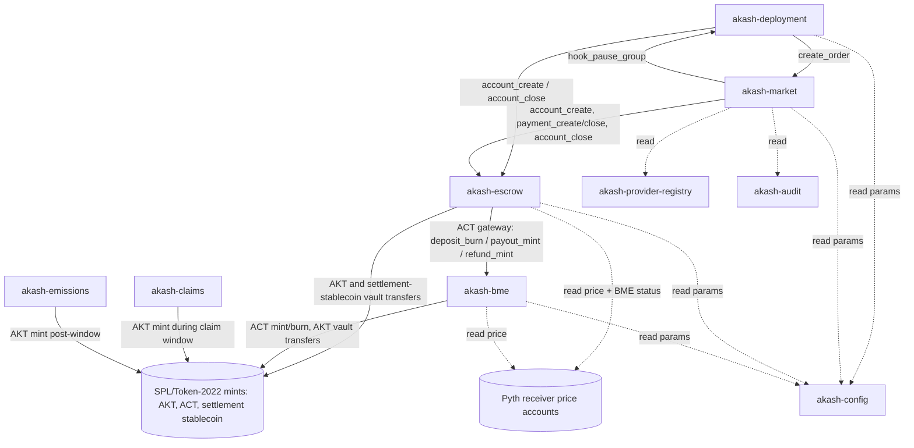

# 03. Solana Target Architecture

| | |
|---|---|
| **Document** | 03. Solana Target Architecture |
| **Doc ID** | AKASH-MIG-03 |
| **Version** | 0.9 (draft for review) |
| **Date** | 2026-08-10 |
| **Owner** | Overclock Labs |
| **Audience** | Vendor engineering |
| **Status** | Normative where marked (MUST/SHALL); informative otherwise |

## Purpose

- Specify the complete on-chain design of the Akash protocol on Solana mainnet (Path A per D-01): program suite, accounts/PDAs, instructions, events, errors, cranks, fees, tokens, oracles, and governance wiring.
- Preserve the marketplace semantics of the current Cosmos chain (D-09) at a depth sufficient for a senior Anchor team to begin implementation without a discovery phase.
- Define the intentional behavior deltas versus the current chain, each justified and cross-referenced.

## In scope

- The nine protocol programs (`akash-deployment`, `akash-market`, `akash-escrow`, `akash-bme`, `akash-provider-registry`, `akash-audit`, `akash-config`, `akash-claims`, `akash-emissions`) and their CPI topology.
- AKT and ACT token design on Solana (Token-2022), settlement-stablecoin integration (D-14).
- Transaction composition, compute budgets, priority fees, rent economics, congestion behavior, idempotency, and crank/relayer interfaces.

## Out of scope

- Token-migration mechanics, snapshots, claims logic, and emissions curve: [05. Token migration](./05-token-migration.md) (interfaces only here).
- State/data migration and old-chain sunset: [06. State & data migration](./06-state-and-data-migration.md).
- Off-chain services beyond their on-chain interfaces: provider daemon, Console, indexer, relayer operations, JWT verification ([07. Off-chain services & clients](./07-offchain-and-clients.md)).
- Key management, audit plan, detailed multisig/timelock composition: [08. Security & audits](./08-security-and-audits.md).

Cosmos-side facts cited here (module behavior, parameters, file paths) are established in [01. Current architecture](./01-current-architecture.md); the exhaustive per-message mapping is in [14. Protocol mapping](./14-appendix-protocol-mapping.md).

---

## 1. Design principles and toolchain

Each principle is anchored to a fixed decision in [13](./13-open-questions-and-assumptions.md); do not re-litigate them.

| # | Principle | Source |
|---|---|---|
| P1 | **Semantic parity.** Order→bid→lease flow, escrow streaming, dseq/gseq/oseq UX, SDL untouched. Where Solana forces a mechanical difference, observable economics stay equal and the difference is listed in §15. | D-09 |
| P2 | **Working state only.** One account per live entity; accounts close and refund rent at terminal state; events are the indexer's system of record for history. No global order book. | D-23 |
| P3 | **Time, not blocks.** All protocol time uses the Clock sysvar `unix_timestamp`. Escrow rates are per-second; BME epochs are timestamps. No slot-count arithmetic anywhere (Alpenglow-safe, A-13). | D-21, D-20 |
| P4 | **Lazy + permissionless progress.** Settlement is computed on interaction; every liveness-critical step (settle, BME epochs, cascade reaps, losing-bid refunds) has a permissionless instruction so cranks can force progress. | D-21, D-20 |
| P5 | **Two-token economics preserved.** ACT stays non-transferable and lease pricing stays ACT-denominated; BME queue + CR breaker + spread port intact. | D-19, D-20 |
| P6 | **Oracle = Pyth pull.** Programs read Pyth price-update accounts directly with staleness/confidence bounds; no push oracle, no CosmWasm successor. | D-13, D-22 |
| P7 | **Governance-mutable parameters, nothing else.** All tunables live in `akash-config` PDAs mutable only by the DAO path; everything else changes only via program upgrade behind multisig+timelock. | D-11, D-15 |
| P8 | **No custom infrastructure.** Solana mainnet only: no appchain, no sequencer, no bespoke oracle network, no indexer consensus. | D-02 |

### 1.1 Toolchain (normative)

**REQ-SOL-001** Programs MUST be implemented with the Anchor framework, v1.x line (v1.1.2 current as of 2026-08; re-verify at kickoff per [13 §4](./13-open-questions-and-assumptions.md)).

**REQ-SOL-002** The Vendor MAY implement individual CU-critical instructions or whole programs in Pinocchio (zero-dependency native Rust) where Anchor cannot meet the CU targets in this document, PROVIDED account layouts, 8-byte discriminators, instruction encodings, and the published IDL remain byte-compatible with the Anchor definition (clients MUST NOT be able to distinguish the implementations).

**REQ-SOL-003** Programs MUST be deployed via loader-v4 (the current deploy path as of 2026-08; loader-v3 is disabled for new programs).

**REQ-SOL-004** Every mainnet program deployment MUST be a verifiable build (deterministic container build, `solana-verify`-compatible), with the verified build hash published in the `akash-config` program registry (§5.2) and in release notes.

**REQ-SOL-005** Each program MUST publish its Anchor IDL on-chain (IDL account) and the Vendor MUST generate typed TS and Rust clients from it (Codama or Anchor-native codegen) as deliverables consumed by [07](./07-offchain-and-clients.md).

**REQ-SOL-006** No program instruction may exceed a declared CU budget target in this document by more than 20% at the p99 input bound; CU regression tests (Mollusk/LiteSVM) MUST gate CI per [09. Testing](./09-testing-and-verification.md).

**REQ-SOL-007** Programs MUST NOT read or depend on slot numbers, slot cadence, or epoch schedule for any economic computation; only `Clock.unix_timestamp` is permitted (see §14.7 Alpenglow).

---

## 2. Program suite overview

Nine programs (names fixed by BRIEF/13 terminology). Rust crate names mirror the kebab names.

| Program | Purpose | Replaces (Cosmos) |
|---|---|---|
| `akash-deployment` | Deployments, groups, per-tenant dseq counters, deployment lifecycle | `x/deployment` |
| `akash-market` | Orders, bids, leases, reclamation windows, bid matching | `x/market` |
| `akash-escrow` | Streaming escrow accounts/payments, delegated-deposit allowances | `x/escrow` + authz `DepositAuthorization` seam |
| `akash-bme` | AKT↔ACT burn-mint engine: vault, swap queues, CR circuit breaker, ACT gateway | `x/bme` (+ `x/oracle` consumption) |
| `akash-provider-registry` | Provider records, attributes, JWT signing keys, collateral | `x/provider` (+ part of `x/cert` per D-10) |
| `akash-audit` | Auditor attestations per (provider, auditor) | `x/audit` |
| `akash-config` | Protocol parameters, program/version registry, governance authority glue | module params + discovery service |
| `akash-claims` | Token migration: S1/S2 Merkle claims, Wind-down Reserve, residual distributions | (new; spec in [05](./05-token-migration.md)) |
| `akash-emissions` | Post-migration AKT emissions to provider-incentive pool + community treasury | `x/mint` replacement (D-12) |

Not ported: `x/cert` (D-10 → [07](./07-offchain-and-clients.md)), `x/take` (dead code on current chain), `x/oracle`+`x/epochs`+CosmWasm/`awasm` (collapse into direct Pyth pull reads + time-based cranks, D-22), staking/slashing/gov/IBC (sovereign-chain machinery, ends per D-05/D-18).

### 2.1 CPI topology



Solid arrows are CPIs; dashed arrows are account reads (no CPI). This mirrors the Cosmos keeper-dependency graph (`app/types/app.go:421-491`): Deployment(escrow, market, oracle, authz, bank) → deployment CPIs escrow/market plus Pyth reads and allowance PDAs; Market(escrow) → market CPIs escrow; Escrow(bank, authz, oracle, bme) → escrow CPIs Token-2022/BME-gateway plus Pyth and BME-status reads; Bme(bank, oracle) → BME CPIs Token-2022 plus Pyth reads.

**REQ-SOL-008** The CPI edges above are exhaustive: no program may CPI another protocol program except as drawn, and no protocol CPI chain may exceed invoke stack height 5 (top-level → market → escrow → bme → Token-2022 is the deepest permitted chain; the BME gateway MUST therefore call token programs directly with no further protocol hop).

**REQ-SOL-009** The Cosmos escrow→market→deployment *hook* cascade (`x/market/hooks/hooks.go`) MUST NOT be reproduced as upward CPIs from `akash-escrow` (it would be indirect reentrancy, which Solana prohibits). It is replaced by the guarded-reap pattern of §3.4: escrow marks its own state and emits events; permissionless reap instructions on `akash-market`/`akash-deployment` verify escrow state and apply the cascade. The single permitted upward CPI is `market → deployment::hook_pause_group` (call chains through it never re-enter `akash-market`).

### 2.2 Cross-program authorization

**REQ-SOL-010** Cross-program calls that must be caller-restricted use signer PDAs: `akash-escrow` signs BME-gateway CPIs with its `["escrow_gateway"]` PDA; `akash-market` signs `hook_pause_group` with its `["hook_auth"]` PDA. Callee programs MUST validate these signer addresses against the pinned values in `akash-config` (§5), not against hardcoded constants.

---

## 3. Shared on-chain conventions

### 3.1 Identifiers and encoding

**REQ-SOL-011** Entity identity preserves the Cosmos ID tuples (D-09): `dseq: u64`, `gseq: u32`, `oseq: u32`, `bseq: u32` (always 0 at creation, as on the current chain), owner/provider as 32-byte pubkeys. All integers little-endian; all account data Borsh-encoded with Anchor 8-byte discriminators; amounts are `u64` in micro-units (6 decimals, parity with `uakt`/`uact`); internal fractional accrual and rates use `u128` fixed-point scaled by `RATE_SCALE = 10^18` (replaces cosmos `LegacyDec`; D-21.a: plain u64 loses precision on typical fractional rates); timestamps are `i64` unix seconds from the Clock sysvar.

**REQ-SOL-012** dseq is assigned from a per-tenant counter account (§8.1), not derived from block height (Q-12). Clients MUST treat dseq as an opaque monotonic sequence.

### 3.2 PDA seed registry (canonical)

All PDAs derive from these exact seed tuples. `*_le` denotes little-endian byte encoding of the stated width.

| Program | Account | Seeds |
|---|---|---|
| deployment | TenantCounter | `["tenant", owner]` |
| deployment | Deployment | `["deployment", owner, dseq_le(8)]` |
| deployment | Group | `["group", owner, dseq_le(8), gseq_le(4)]` |
| market | Order | `["order", owner, dseq_le(8), gseq_le(4), oseq_le(4)]` |
| market | Bid | `["bid", owner, dseq_le(8), gseq_le(4), oseq_le(4), provider, bseq_le(4)]` |
| market | Lease | `["lease", owner, dseq_le(8), gseq_le(4), oseq_le(4), provider]` |
| escrow | EscrowAccount | `["escrow", entity_pda]` (entity = Deployment or Bid PDA) |
| escrow | EscrowVault (token acct) | `["vault", escrow_account_pda, mint]` |
| escrow | Payment | `["payment", lease_pda]` |
| escrow | Allowance | `["allowance", granter, grantee]` |
| escrow | AllowanceVault (token acct) | `["allowance_vault", allowance_pda, mint]` |
| escrow | gateway signer | `["escrow_gateway"]` |
| bme | BmeState | `["bme_state"]` |
| bme | Vault authority / AKT vault | `["bme_vault"]` |
| bme | ACT mint authority | `["act_auth"]` |
| bme | SwapRequest | `["swap", dir(1), seq_le(8)]` (dir: 0=mint ACT, 1=burn ACT) |
| bme | TipTreasury | `["tip_treasury"]` |
| provider-registry | Provider | `["provider", owner]` |
| audit | Attestation | `["audit", provider_owner, auditor]` |
| config | Params | `["params", module_tag]` (`module_tag` ∈ ascii: `deployment`, `market`, `escrow`, `bme`, `oracle`, `fees`) |
| config | ProgramRegistry | `["registry"]` |
| market | hook signer | `["hook_auth"]` |

**REQ-SOL-013** PDA seed schemas are frozen at mainnet launch: any change is a breaking protocol upgrade requiring the full governance path of §13 and a client migration plan in [07](./07-offchain-and-clients.md).

### 3.3 Events

**REQ-SOL-014** Every state transition MUST emit exactly one Anchor event via the event-CPI pattern (`emit_cpi!`, self-CPI with the event-authority PDA), not `emit!`/log-only, because RPC log truncation would corrupt the indexer's record. Events are the system of record for history (D-23): they MUST carry full entity ID tuples (owner, dseq, gseq, oseq, provider) and all economically relevant amounts, since the underlying accounts close at terminal state and cannot be re-read.

**REQ-SOL-015** Event schemas are append-only after mainnet launch (new fields at the tail, new events allowed; no removals or type changes), so the indexer ([07](./07-offchain-and-clients.md)) can replay history across program upgrades.

### 3.4 Cascade closure (guarded reaps)

The current chain closes deployment/group/order/bid/lease state atomically through keeper hooks when escrow accounts/payments close or overdraw (`x/market/hooks/hooks.go`). Solana transaction limits and the reentrancy rule make the atomic cascade impossible in the escrow-initiated direction. The port:

| Trigger (event + state) | Follow-up instruction (permissionless) | Effect |
|---|---|---|
| `PaymentOverdrawn` / `PaymentClosed` on payment P | `akash-market::reap_lease` | lease → `insufficient_funds` (if overdrawn) or `closed`; order closed; winning bid closed |
| `AccountOverdrawn` / `AccountClosed` on escrow account of deployment D | `akash-deployment::reap_deployment` (+ per-group `reap_group`) | deployment closed; groups → `closed`, or `insufficient_funds` when account overdrawn |
| Lease created (order matched) | `akash-market::close_losing_bid` per losing bid | losing bid → `lost`; bid escrow closed; collateral + rent refunded |

**REQ-SOL-016** Reap instructions MUST be permissionless, verify the triggering state on the referenced escrow/market account (ownership + discriminator + state field) before mutating, be idempotent, and emit the same closure events the atomic Cosmos cascade would have emitted.

**REQ-SOL-017** The protocol crank service (operated per Q-07, but permissionless by construction) MUST complete any pending cascade within 60 s p95 of the triggering event; [09](./09-testing-and-verification.md) tests this under load. Until reaped, guard checks make stale state harmless: every value-moving instruction re-derives solvency from escrow state, never from market/deployment state alone.

### 3.5 Rent lifecycle

**REQ-SOL-018** Every protocol account stores `rent_payer: Pubkey`. On reaching terminal state the account MUST be closed in the same instruction where transaction limits permit, otherwise by a permissionless `close_*`/reap instruction; lamports return to `rent_payer`. An account MUST NOT close while a live child references it (deployment ← groups ← orders ← bids/leases ← payments; escrow account ← payments): close ordering is child-first and enforced by open-child counters on each parent.

**REQ-SOL-019** Bounded vectors (normative caps, validated on write): escrow depositors ≤ 16 per account (§10.1); groups ≤ 8 per deployment; resource units ≤ 4 per group; attributes ≤ 24 per provider/group/attestation; `signed_by` auditors ≤ 4 per group; JWT signing keys ≤ 3 per provider; allowance mints ≤ 3. Caps exist because Solana accounts are fixed-size and instructions must enumerate accounts; the current chain bounds these only by gas. Validate caps against the mainnet SDL corpus before freeze (A: §15 note, recorded in 13).

### 3.6 Oracle reads (Pyth pull)

**REQ-SOL-020** Programs consume prices exclusively from Pyth pull-oracle price-update accounts (posted via the Pyth receiver program in the same transaction, D-13). Every read MUST validate: (a) account owner = Pyth receiver program and verification level = full; (b) feed id equals the AKT/USD feed id pinned in `["params","oracle"]`; (c) `publish_time ≥ now − max_price_staleness` (default 30 s, carrying `x/oracle` `MaxPriceStalenessPeriod`); (d) `conf/price ≤ max_conf_bps` (default 150 bps, carrying `MaxPriceDeviationBps`). Stale or wide prices MUST fail closed (BME → `halt_oracle` path; escrow fallback → error).

**REQ-SOL-021** BME collateral-ratio computation MUST use the Pyth EMA price (≈1h exponential average, replacing the current 1h TWAP the BME reads); spot price (with the same staleness/conf bounds) is used for swap execution pricing and the escrow AKT fallback. Delta DELTA-02, §15.

---

## 4. Tokens

### 4.1 AKT: Token-2022 (D-03)

**REQ-SOL-022** AKT is a Token-2022 mint, 6 decimals, with the metadata extension (metadata pointer self-referencing the mint; name "Akash Network", symbol "AKT") and NO other extensions: no transfer hooks, no permanent delegate, no transfer fees, no confidential transfers. Freeze authority MUST be `None` at creation (irrevocably).

**REQ-SOL-023** AKT mint authority lifecycle: at token genesis the authority is the `akash-claims` migration PDA (claim-window minting per [05](./05-token-migration.md)); at claim-window close it is transferred to the `akash-emissions` schedule PDA whose minting is DAO+timelock-governed (D-12, §12). No other party ever holds AKT mint authority; each transfer emits an event and is a governance action per §13.

**REQ-SOL-024** Q-05 fallback: if the kickoff exchange/custody verification (Q-05) fails the Token-2022 support threshold defined in [05](./05-token-migration.md), AKT falls back to a legacy SPL mint with Metaplex metadata. The fallback MUST change nothing else in this document (escrow/BME hold no AKT-side Token-2022 extension dependencies by design); ACT is unaffected (ACT never touches exchanges).

### 4.2 ACT: Token-2022 NonTransferable (D-19)

**REQ-SOL-025** ACT is a Token-2022 mint, 6 decimals, with the NonTransferable extension and metadata (name "Akash Compute Token", symbol "ACT", fixing the current chain's `Display: uact` metadata defect, which MUST NOT be ported). Mint authority is the `akash-bme` `["act_auth"]` PDA; freeze authority `None`. Wallet presentation questions are Q-16.

NonTransferable means no transfers ever, including to program vaults. ACT therefore cannot be escrowed as tokens; every protocol movement is a burn or mint at the protocol boundary, exactly as D-19 prescribes and mirroring the current chain's `SendEnabled(uact)=false` (`cmd/akash/cmd/genesis.go:121-130`):

| Protocol movement | Token operation | Ledger effect |
|---|---|---|
| Escrow deposit (tenant/bid collateral in ACT) | burn from depositor's ACT account (depositor signs) | escrow account `funds_act` += amount; BME `act_escrowed` += amount |
| Settlement payout to provider | mint to provider's ACT account | payment `balance_act` −= amount; `act_escrowed` −= amount |
| Depositor refund on close | mint to depositor's ACT account (or credit allowance, §10.4) | escrow `funds_act` −= amount; `act_escrowed` −= amount |
| BME swap AKT→ACT executed | mint to swapper | BME totals updated |
| BME swap ACT→AKT requested | burn from swapper (swapper signs) | `pending_act` += amount (remint credit on cancel) |

**REQ-SOL-026** All ACT mints and burns MUST flow through the three `akash-bme` gateway instructions (`gateway_deposit_burn`, `gateway_payout_mint`, `gateway_refund_mint`) or BME's own swap execution, so that BME maintains `act_escrowed`, the ledger of ACT burned into escrow but still owed. Rationale: burning on deposit shrinks `mint.supply`, which would otherwise inflate the collateral ratio; on the Cosmos chain escrowed `uact` sits in module accounts and still counts in `TotalSupply` (`x/bme/keeper/keeper.go:742-784`). The CR denominator on Solana is therefore `act_outstanding = act_mint.supply + act_escrowed` (§11.4).

**REQ-SOL-027** Gateway instructions MUST require the `akash-escrow` `["escrow_gateway"]` PDA as signer (validated against `akash-config`), reject all other callers, and CPI Token-2022 directly (stack-height ceiling, REQ-SOL-008).

CPI pattern (informative, Anchor v1.x pseudocode) for escrow deposit and refund of ACT:

```rust
// akash-escrow::account_deposit (source = wallet balance), ACT leg
// depth: top-level(1) -> escrow(1 if top-level, else 2) -> bme(+1) -> token-2022(+1)
bme::cpi::gateway_deposit_burn(
    CpiContext::new_with_signer(
        bme_program,
        bme::cpi::accounts::GatewayDepositBurn {
            gateway: escrow_gateway_pda,      // signer PDA ["escrow_gateway"]
            bme_state,                        // writable: act_escrowed += amount
            act_mint,                         // writable
            from_act_account: depositor_act_ata, // writable; owner co-signed the outer ix
            depositor,                        // signer (burn authority)
            token_program: token_2022,
        },
        &[&[b"escrow_gateway", &[bump]]],
    ),
    amount,
)?;

// akash-escrow::account_close, ACT refund leg (mint back to depositor)
bme::cpi::gateway_refund_mint(
    CpiContext::new_with_signer(
        bme_program,
        bme::cpi::accounts::GatewayMint {
            gateway: escrow_gateway_pda,
            bme_state,                        // writable: act_escrowed -= amount
            act_mint,                         // writable
            to_act_account: depositor_act_ata, // writable; created idempotently by closer
            act_mint_authority: act_auth_pda, // PDA ["act_auth"], signs inside akash-bme
            token_program: token_2022,
        },
        &[&[b"escrow_gateway", &[bump]]],
    ),
    amount,
)?;
```

### 4.3 The settlement stablecoin (D-14)

**REQ-SOL-028** The settlement stablecoin (**STABLE** in tables below): a natively-issued, deeply-liquid USD stablecoin, selected per Q-43 (candidates e.g. USDC, PYUSD, USDT where natively issued) and held as the governed parameter `config.settlement_stable_mint` (pinned in `["params","escrow"]`), is a first-class escrow deposit and settlement asset; the asset is a configurable protocol parameter and the protocol MUST NOT hard-depend on a single issuer. Lease pricing stays ACT-denominated (D-19); STABLE satisfies ACT-denominated obligations at par (1 STABLE micro-unit = 1 uact; decimals normalized if the selected asset is not 6-decimal) under the `stable_act_parity_bps` parameter (default 10000; D-14.a, ratification Q-22). Justification: ACT is the protocol's USD-denominated compute credit (BME mints it against AKT at the oracle USD price), so par settlement introduces no new price risk beyond the peg parameter, which governance can adjust. Delta DELTA-08, §15. `[TO-VERIFY: current-chain source of the uact/USD price used in BME CR (assumed constant 1 USD peg); confirm in x/bme keeper during 14-appendix mapping]`

---

## 5. `akash-config`

Purpose: single home for every governed parameter (successor to module params) and for the program/version registry (successor to the `akash.discovery.v1` service, `app/app.go:538-578`).

### 5.1 Parameter accounts

One PDA per module tag, each ≤ 512 bytes, mutable only by the governance authority (§13). Every parameter carried over from the current chain, with defaults:

| PDA `["params", tag]` | Parameter | Default (carry-over source) |
|---|---|---|
| `deployment` | `min_deposits: Vec<(mint, u64)>` | ACT 500_000 (0.5 ACT); AKT 500_000 (top-up only); STABLE 500_000 (§4.3); carries `MinDeposits = 500000uakt,500000uact` |
| `market` | `bid_min_deposits: Vec<(mint, u64)>` | AKT 500_000; ACT 500_000; STABLE 500_000; carries `BidMinDeposits` |
| `market` | `order_max_bids: u32` | 20 (hard max 500); carries `OrderMaxBids` |
| `market` | `min_reclamation_window_secs: i64` | 3_600 (1 h); carries `MinReclamationWindow` (D-24) |
| `market` | `max_reclamation_window_secs: i64` | 2_592_000 (720 h); carries `MaxReclamationWindow` (D-24) |
| `escrow` | `max_depositors: u8` | 16 (§10.1) |
| `escrow` | `allowed_mints: Vec<Pubkey>` | [ACT, AKT, STABLE] |
| `escrow` | `settlement_stable_mint: Pubkey` | the settlement-stablecoin mint, selected per Q-43 (new; D-14, §4.3) |
| `escrow` | `stable_act_parity_bps: u16` | 10_000 (§4.3) |
| `bme` | `cr_warn_bps: u16` / `cr_halt_bps: u16` | 9_500 / 9_000; carries `CircuitBreakerWarnThreshold`/`HaltThreshold` |
| `bme` | `mint_spread_bps: u16` / `settle_spread_bps: u16` | 25 / 0 |
| `bme` | `min_epoch_secs: i64` | 65 (carries `MinEpochBlocks=10` × 6.5 s = 65 s exactly; DELTA-03) |
| `bme` | `epoch_backoff_pct: u16` / `epoch_backoff_cap_secs: i64` | 10 / 93_600 (carries 14_400-block cap × 6.5 s) |
| `bme` | `max_records_per_epoch: u16` | 50; carries `MaxEndblockerRecords` |
| `bme` | `min_mint: u64` | 10_000_000 uact (10 ACT); carries `MinMint` |
| `bme` | `max_pending_attempts: u8` | 3; carries `MaxPendingAttempts` |
| `oracle` | `akt_usd_feed_id: [u8;32]` | Pyth AKT/USD feed id `[TO-VERIFY: Pyth AKT/USD feed id on Solana mainnet at kickoff; 13 §4 volatile list]` |
| `oracle` | `max_price_staleness_secs: i64` | 30; carries `MaxPriceStalenessPeriod` |
| `oracle` | `max_conf_bps: u16` | 150; carries `MaxPriceDeviationBps` (as Pyth confidence bound) |
| `fees` | `tip_per_record_lamports: u64`, `reap_tip_lamports: u64` | crank tips (Q: funding + rate, recorded in 13) |

Not carried (obsolete on Solana): `x/oracle` `Sources`/`MinPriceSources`/`TwapWindow`/`PriceRetention`/prune params (push oracle removed, D-22); `awasm` `BlockedAddresses` (D-22); `x/take` params (dead code); gov/staking/slashing params (chain machinery, D-05).

**REQ-SOL-029** Parameter PDAs MUST be updatable only by an instruction whose authority signer equals `governance_authority` stored in the registry (§5.2), with range validation matching the current chain (warn > halt, both ≤ 10 000 bps; spreads ≤ 1 000 bps; `order_max_bids ≤ 500`; reclamation min < max) plus new-cap validation per REQ-SOL-019. Every update emits `ParamsUpdated{tag, old_hash, new_hash}`.

**REQ-SOL-030** All programs MUST read parameters from these PDAs at execution time (passed read-only); no protocol constant that exists as a parameter here may be compiled in.

### 5.2 Program registry (discovery successor)

PDA `["registry"]` (~512 bytes): `governance_authority: Pubkey` (Realms-executed timelock, §13), `upgrade_authority: Pubkey` (Squads vault), `min_client_version: [u8;16]` (semver string), and per program: `{name: [u8;16], program_id: Pubkey, api_version: u16, verified_build_hash: [u8;32], idl_account: Pubkey}`; plus pinned cross-program addresses (`escrow_gateway`, `hook_auth`, ACT/AKT/STABLE mints, Pyth receiver program id).

**REQ-SOL-031** SDKs and the provider daemon MUST perform version negotiation against this account at session start (replacing `GET /akash/discovery/v1/info` and its `min_client_version` contract): a client whose version is below `min_client_version` MUST refuse to submit transactions. `api_version` bumps accompany any instruction/event schema addition. Client behavior detail in [07](./07-offchain-and-clients.md).

**REQ-SOL-032** Registry mutations (program registered/retired, `min_client_version` raise, authority rotation) are governance actions (§13) and emit events; `min_client_version` raises MUST be announced ≥ 14 days before enforcement (indexer/Console coordination, [07](./07-offchain-and-clients.md)).

Events: `ParamsUpdated`, `ProgramRegistered`, `MinClientVersionRaised`, `AuthorityRotated`. Errors (6000-6019): `UnauthorizedAuthority`, `ParamOutOfRange`, `UnknownModuleTag`, `RegistryFull`.

---

## 6. `akash-provider-registry`

Purpose: provider identity, attributes for bid matching, JWT signing keys (D-10), and registration collateral (Q-08). Carries `x/provider` semantics (`x/provider/handler/server.go`).

### 6.1 Accounts

| Account | Seeds | Size / rent (SOL ≈ $150) | Close |
|---|---|---|---|
| Provider | `["provider", owner]` | ≤ 3,072 B → 0.0223 SOL ≈ $3.34 | closeable after `deactivate` + no live leases/bids + collateral withdrawn |

Provider fields: `owner` (the cold owner authority, per D-10.a / 07), `state: u8` (active / deactivated), `host_uri: String ≤ 128 B`, `attributes: Vec<(key ≤ 32 B, value ≤ 64 B)> ≤ 24`, `info: {email ≤ 64 B, website ≤ 64 B}`, `signing_keys: Vec<{alg: u8 (0=Ed25519), pubkey: [u8;32], added_at: i64, revoked_at: i64}> ≤ 3` (rotating operator hot keys for JWT signing, per D-10.a / 07), `tls_spki_hashes: Vec<[u8;32]> ≤ 3` (provider TLS SPKI hash anchors, per D-10.a / 07), `collateral: {mint, amount: u64, withdraw_after: i64}`, `created_at`, `bump`.

### 6.2 Instructions

| Ix | Signer | Args | Validation / effects | CU |
|---|---|---|---|---|
| `create_provider` | owner | host_uri, attributes, info, first signing key | PDA init; attribute caps; transfers collateral (AKT, amount from Q-08 outcome; mechanism normative, size open) into program-owned vault; emits `ProviderCreated` | 60k |
| `update_provider` | owner | host_uri?, attributes?, info? | active providers only; no active-lease check (parity: check removed on current chain in v0.32.0 and not reintroduced); `ProviderUpdated` | 40k |
| `add_signing_key` / `revoke_signing_key` | owner | key / key index | ≤ 3 live keys; revocation sets `revoked_at` (kept for JWT grace, prunable after 30 d); `SigningKeyAdded/Revoked` | 20k |
| `deactivate_provider` | owner | none | blocks new bids (checked by `market::create_bid`); starts collateral timer `withdraw_after = now + max_reclamation_window`; `ProviderDeactivated` | 20k |
| `withdraw_collateral` | owner | none | requires deactivated + `now ≥ withdraw_after`; returns collateral; account closeable | 30k |

**REQ-SOL-033** `create_provider` MUST lock registration collateral (denom AKT; amount and slashing conditions are Q-08, Vendor proposes at G1) and `withdraw_collateral` MUST enforce deactivation plus a delay ≥ `max_reclamation_window_secs`, so a provider cannot exit collateral while any lease could still be in a reclamation window.

**REQ-SOL-034** JWT signing keys registered here are the on-chain trust root for provider-gateway auth (D-10), replacing the `x/cert` x509 registry: provider daemons sign JWTs with a registered Ed25519 key; verifiers resolve keys by reading this account. Token format, scopes, and mTLS transport anchoring are specified in [07](./07-offchain-and-clients.md); this program only stores/rotates keys.

**REQ-SOL-035** There is no `delete_provider` while any lease or bid references the provider (the current chain's `MsgDeleteProvider` is unimplemented; `x/provider/handler/server.go:74-88` returns NOTIMPLEMENTED); `deactivate_provider` + close-after-quiescence is the supported exit.

Events: `ProviderCreated`, `ProviderUpdated`, `ProviderDeactivated`, `SigningKeyAdded`, `SigningKeyRevoked`, `CollateralWithdrawn`. Errors (6000-6029): `AttributeCapExceeded`, `KeyCapExceeded`, `ProviderDeactivated`, `CollateralLocked`, `HostUriTooLong`, `InvalidKeyAlg`.

---

## 7. `akash-audit`

Purpose: auditor-signed attribute attestations per (provider, auditor), consumed by bid matching. Carries `x/audit` (`x/audit/handler/`).

| Account | Seeds | Size / rent | Close |
|---|---|---|---|
| Attestation | `["audit", provider_owner, auditor]` | ≤ 2,688 B, typical 600 B → ~0.0051 SOL ≈ $0.76 | closed when last attribute deleted; rent → auditor |

Fields: `provider_owner`, `auditor`, `attributes ≤ 24` (same encoding as provider), `created_at`, `updated_at`, `bump`.

| Ix | Signer | Args | Effects | CU |
|---|---|---|---|---|
| `sign_provider_attributes` | auditor | provider, attributes | init-or-update (upsert semantics of `MsgSignProviderAttributes`); `AttestationSigned` | 35k |
| `delete_provider_attributes` | auditor | provider, keys: Vec<String> | removes listed keys (empty list = all, mirroring `MsgDeleteProviderAttributes`); closes account when empty; `AttestationDeleted` | 25k |

**REQ-SOL-036** Attestations MUST be independently writable per (provider, auditor) pair with auditor as sole write authority; providers cannot modify or delete attestations about themselves.

Events: `AttestationSigned{provider, auditor, attributes}`, `AttestationDeleted{provider, auditor, keys}`. Errors (6000-6009): `AttributeCapExceeded`, `EmptyAttestation`, `KeyNotFound`.

---

## 8. `akash-deployment`

Purpose: deployment + group lifecycle and dseq issuance. Carries `x/deployment` v1beta4 semantics (`x/deployment/handler/server.go:41-268`).

### 8.1 Accounts

| Account | Seeds | Fields (beyond §3 conventions) | Size / rent | Close |
|---|---|---|---|---|
| TenantCounter | `["tenant", owner]` | `next_dseq: u64` | 64 B → 0.00134 SOL ≈ $0.20 | never (per-tenant singleton; negligible rent) |
| Deployment | `["deployment", owner, dseq_le]` | `state: u8` (pending / active / closing / closed), `version_hash: [u8;32]` (SDL manifest hash, `Deployment.Hash`), `created_at`, `reclamation_min_window_secs: i64` (0 = none), `group_count: u32`, `open_group_count: u32` | 128 B → 0.00178 SOL ≈ $0.27 | on `closed` with all groups closed; rent → tenant |
| Group | `["group", owner, dseq_le, gseq_le]` | `state: u8` (open / paused / insufficient_funds / closed), `spec: GroupSpec`, `created_at` | ≤ 3,072 B, typical 1,200 B → ~0.0092 SOL ≈ $1.39 | on `closed`; rent → tenant |

`GroupSpec` (Borsh; caps per REQ-SOL-019): `name ≤ 32 B`; `requirements: {signed_by_all_of ≤ 2, signed_by_any_of ≤ 4 (auditor pubkeys), attributes ≤ 24}`; `resources: Vec<ResourceUnit> ≤ 4` where ResourceUnit = `{cpu_milli: u64, memory_bytes: u64, gpu_units: u64, gpu_attributes ≤ 8, storage: Vec<{name ≤ 32 B, size_bytes: u64, attributes ≤ 4}> ≤ 3, endpoints: Vec<{kind: u8, seq: u32}> ≤ 8, count: u32, price_rate: u128}` (`price_rate` = uact per second × `RATE_SCALE`, converted from the current per-block DecCoin; see DELTA-01).

**REQ-SOL-037** dseq assignment: `init_deployment` reads-and-increments `TenantCounter.next_dseq` (creating the counter at first use, starting at 1). Deployment PDAs are therefore dense per tenant and never collide; block height is not involved (Q-12, DELTA-09).

### 8.2 Instructions

| Ix | Signer / writable accounts | Args | Validation | Effects / CPIs | CU |
|---|---|---|---|---|---|
| `init_deployment` | tenant (s,w payer); TenantCounter(w), Deployment(init), EscrowAccount(init via CPI), deposit accounts | `version_hash`, `reclamation_min_window?`, `deposit {amount, mint, sources}` | deposit ≥ `min_deposits[mint]`; **mint MUST NOT be AKT** (parity: create rejects `uakt` deposits, `server.go:60-62`); mint ∈ {ACT, STABLE} (§4.3); reclamation window within market params (D-24) | Deployment(state=pending); CPI `escrow::account_create` with deposit (§10.2); `DeploymentInitialized` | 120k |
| `add_group` | tenant; Deployment(w), Group(init) | `gseq` (must equal `group_count+1`), `spec` | deployment pending; spec caps; **every `price_rate` denominated in ACT** (parity: group price denom MUST be `uact`, `server.go:93`); gseq dense 1..N ≤ 8 | Group(state=open); `group_count++` | 60k |
| `activate_deployment` | tenant; Deployment(w), Groups(r), Orders(init via CPI ×N) | none | pending, `group_count ≥ 1` | per open group: CPI `market::create_order{oseq=1, reclamation}`; state=active; `DeploymentCreated` (carries full group specs for the indexer) | 30k + 25k/group |
| `update_deployment` | tenant; Deployment(w) | `version_hash` | active only; hash ≠ current (parity `server.go:132-157`) | updates hash; `DeploymentUpdated` | 15k |
| `close_deployment` | tenant; Deployment(w), Groups(w), EscrowAccount(w via CPI) + refund accounts | none | active or closing | if any lease payments open → state=closing (barrier: blocks new orders/bids; leases closed via `market::close_lease` ixs composed in the same tx or cranked, §3.4); when no open payments: CPI `escrow::account_close` (settle + refund depositors, §10.3); groups+deployment → closed; `DeploymentClosed` | 80k + refunds |
| `close_group` / `pause_group` | tenant; Group(w) (+ lease-close guards) | gseq | group open/paused; associated order/lease closure guarded as in §3.4 (market ixs composed first) | state → closed / paused; `GroupClosed`/`GroupPaused` | 30k |
| `start_group` | tenant; Group(w), Deployment(r), Order(init via CPI) | gseq | group paused or insufficient_funds; deployment active | CPI `market::create_order{oseq+1}` with deployment reclamation (parity `server.go:226-253`); state=open; `GroupStarted` | 60k |
| `hook_pause_group` | market `["hook_auth"]` PDA (s); Group(w) | none | caller PDA = pinned market hook (REQ-SOL-010); group open | state=paused (Cosmos `deployment.OnBidClosed → OnPauseGroup`, `keeper.go:421-427`); `GroupPaused` | 10k |
| `reap_deployment` / `reap_group` | anyone; Deployment/Group(w), EscrowAccount(r) | none | escrow account state ∈ {closed, overdrawn} (REQ-SOL-016) | deployment closed; group → closed, or insufficient_funds when overdrawn (parity with `OnEscrowAccountClosed`); events as above | 25k |

**REQ-SOL-038** `init_deployment`/`add_group`/`activate_deployment` MUST be composable into a single transaction (the atomic-create fast path used by SDKs when the SDL fits in one transaction) and equally valid across transactions with `state=pending` in between; orders MUST NOT exist and bids MUST NOT be accepted before activation.

**REQ-SOL-039** `close_deployment` MUST be terminal and irreversible once state=closing (no new orders, no `start_group`), mirroring the one-way `MsgCloseDeployment` (`server.go:159-177`); full cascade completion (all leases/payments closed, all refunds out) MUST satisfy the 60 s p95 bound of REQ-SOL-017 via composed instructions or cranks.

Events (all carry `{owner, dseq}` + listed fields): `DeploymentInitialized{deposit}`, `DeploymentCreated{groups: full specs}`, `DeploymentUpdated{version_hash}`, `DeploymentClosed{}`, `GroupStarted/GroupPaused/GroupClosed{gseq, reason}`, a superset of the Cosmos typed events (`x/deployment/keeper/keeper.go:228-379`). Errors (6000-6049): `DeploymentExists`, `InvalidDeposit`, `AktDepositForbidden`, `InvalidGroupPriceDenom`, `GroupCapExceeded`, `SpecBoundExceeded`, `InvalidState`, `HashUnchanged`, `ReclamationWindowOutOfBounds`, `OpenChildrenRemain`.

---

## 9. `akash-market`

Purpose: order/bid/lease lifecycle, bid matching against provider + audit attributes, bid collateral, reclamation windows. Carries `x/market` v1beta5 (`x/market/handler/server.go:29-392`).

### 9.1 Accounts

| Account | Seeds | Fields | Size / rent | Close |
|---|---|---|---|---|
| Order | `["order", owner, dseq_le, gseq_le, oseq_le]` | `state: u8` (open / matched / closed), `group: Pubkey`, `spec_hash: [u8;32]`, `created_at`, `reclamation_window_secs: i64` (copied from deployment), `bid_count: u32`, `winner: Pubkey` (default) | 192 B → 0.00223 SOL ≈ $0.33 | on closed AND lease closed AND all bids resolved; rent → tenant |
| Bid | `["bid", owner, dseq, gseq, oseq, provider, bseq_le]` | `state: u8` (open / active / lost / closed), `price_rate: u128` (uact/s × RATE_SCALE), `created_at`, `resources_offer` (≤ 4 units, same encoding as GroupSpec resources), `reclamation_window_secs: Option<i64>` | ≤ 1,024 B → 0.0080 SOL ≈ $1.20 | on lost/closed after bid-escrow close; rent → provider |
| Lease | `["lease", owner, dseq, gseq, oseq, provider]` | `state: u8` (active / insufficient_funds / closed / reclaiming), `price_rate: u128`, `created_at`, `closed_on: i64`, `reason: u32` (LeaseClosedReason enum values preserved: 1, 10000-10003, 20000), `reclamation: Option<{window_secs, started_at, deadline}>` | 224 B → 0.00245 SOL ≈ $0.37 | on closed after payment closed; rent → tenant |

Orders reference their Group PDA and store only `spec_hash` rather than copying the full `GroupSpec` (the Cosmos `Order.Spec` copy); group specs are immutable while any order is open, so bid validation reads the Group account directly. Normalization delta DELTA-11.

### 9.2 Instructions

| Ix | Signer / key accounts | Args | Validation (parity source) | Effects / CPIs | CU |
|---|---|---|---|---|---|
| `create_order` | deployment program CPI only (payer = tenant); Order(init), Group(r) | oseq, reclamation | caller = `akash-deployment` (CPI-only ix); oseq = previous+1 | Order(open); `OrderCreated` | 25k |
| `create_bid` | provider (s, payer); Order(w: bid_count), Group(r), Provider(r), Attestations(r, remaining ≤ 4), Bid(init), EscrowAccount(init via CPI), deposit accounts, params(r) | `price_rate`, `resources_offer`, `reclamation_window?`, `deposit {amount, mint, sources}` | order open; `bid_count < order_max_bids` (=20) `[TO-VERIFY: whether BidCountForOrder on the current chain counts closed bids (x/market keeper); if open-only, decrement on bid close]`; bseq == 0 (`server.go:29-136`); `price_rate ≤` group unit price sum (bid not above order); `resources_offer` matches group spec (`MatchGSpec`); provider active in registry; attribute match: group requirements vs provider attributes with audit attestations satisfying `signed_by` (self-attributes prepended, parity with `audit.GetProviderAttributes` use); deposit ≥ `bid_min_deposits[mint]`; reclamation within bounds | Bid(open); `bid_count++`; CPI `escrow::account_create` (bid collateral); `BidCreated` | 100k |
| `close_bid` | provider; Bid(w), Order(w), Lease(w?), Payment(w via CPI), Group(w via hook) | reason | open bid: close + escrow account close (refund collateral). Active bid (lease exists): reclamation gate. Lease active with `reclamation ≠ None` → `ErrReclamationNotStarted`; lease reclaiming with `now < deadline` → `ErrReclamationWindowNotElapsed` (`server.go:138-192`) | CPI `deployment::hook_pause_group`; lease closed (reason preserved); order closed; CPI `escrow::payment_close`; CPI `escrow::account_close` (bid); `BidClosed`, `LeaseClosed` | 140k |
| `create_lease` | tenant (s, payer); Bid(w), Order(w), Group(r), Lease(init), deployment EscrowAccount(w), Payment(init via CPI), sibling payments(w, remaining) | none | bid open, order open, group open (`server.go:209-283`) | CPI `escrow::payment_create{rate = bid.price_rate}` (settles account first, §10.3); Lease(active) with `reclamation.window = bid.reclamation_window`; order → matched, `winner = provider`; bid → active; `LeaseCreated`, `OrderMatched` | 150k |
| `close_losing_bid` | anyone; Bid(w), Order(r), losing-bid EscrowAccount(w via CPI) + refund accounts | none | order matched AND `bid.provider ≠ order.winner` AND bid open (REQ-SOL-016) | bid → lost; CPI `escrow::account_close` (collateral + rent refund to provider); `BidClosed{state=lost}` | 80k |
| `close_lease` | tenant; Lease(w), Order(w), Bid(w), Group(r), Payment(w via CPI), new Order(init, optional) | reason=owner | lease active/reclaiming (`server.go:285-336`) | lease/bid/order closed; CPI `escrow::payment_close` (final settle + payout); **if group still open: create new Order with oseq+1 in the same instruction (re-list, tenant pays rent)**; `LeaseClosed`, `OrderCreated?` | 150k |
| `withdraw_lease` | anyone; Payment(w via CPI) + settle set | none | permissionless (payout only to payment owner; supersedes provider-signed `MsgWithdrawLease`, DELTA-05) | CPI `escrow::payment_withdraw` | 20k + escrow |
| `lease_start_reclaim` | provider; Lease(w) | reason | lease active; `reclamation ≠ None`; `started_at == 0` (`server.go:338-379`) | `started_at = now`, `deadline = now + window`, state=reclaiming; `LeaseReclaimStarted` | 25k |
| `reap_lease` | anyone; Lease(w), Order(w), Bid(w), Payment(r) | none | payment state ∈ {overdrawn, closed} while lease not closed (§3.4) | lease → insufficient_funds (reason 20000) if overdrawn else closed; order/bid closed; events as `OnEscrowPaymentClosed` cascade | 40k |

**REQ-SOL-040** `create_bid` MUST enforce the full matching pipeline of the current chain in this order: order/group state, bid count cap, price ceiling, resource-offer match, provider existence/active flag, placement-attribute match including `signed_by` audit requirements, deposit minimums, reclamation bounds, each failure mapping to a distinct error code (below) for provider-daemon diagnostics.

**REQ-SOL-041** Attribute matching MUST treat the provider's self-declared attributes as lowest precedence and auditor attestations as authoritative for `signed_by` requirements: for every auditor in `signed_by_all_of` (and at least one of `signed_by_any_of`) the corresponding Attestation PDA MUST be present in remaining accounts, owner-checked, and MUST contain every required attribute key/value.

**REQ-SOL-042** Bid collateral MUST live in a dedicated escrow account (`["escrow", bid_pda]`) created at bid time and MUST be refunded in full (with rent) on: losing the order (`close_losing_bid`), closing an open bid, or closing an active bid after lease close; never slashed by the marketplace (parity: no bid slashing exists on the current chain).

**REQ-SOL-043** Losing-bid refunds are asynchronous (DELTA-06): `create_lease` MUST NOT require losing-bid accounts in its transaction; `close_losing_bid` MUST be executable by anyone immediately after the lease exists, and the crank SLA of REQ-SOL-017 applies. Collateral remains custody-safe in the bid escrow until then.

**REQ-SOL-044** Re-listing on tenant lease close MUST be synchronous within `close_lease` when the group is open (parity: `MsgCloseLease` re-opens a new order, `server.go:285-336`); provider-initiated (`close_bid`) and insolvency (`reap_lease`) paths MUST NOT re-list: they pause the group / mark insufficient_funds respectively, exactly as the Cosmos hook cascade does.

**REQ-SOL-045** Reclamation (D-24): `lease_start_reclaim` + windowed `close_bid` MUST port 1:1 with window bounds `[min_reclamation_window, max_reclamation_window]` = [1 h, 720 h] validated at bid and lease creation; deadlines are wall-clock (`now + window`).

Events: `OrderCreated{order id, group, spec_hash, reclamation}`, `OrderMatched{order id, winner}`, `OrderClosed`, `BidCreated{bid id, price_rate, deposit}`, `BidClosed{bid id, state, reason}`, `LeaseCreated{lease id, price_rate}`, `LeaseClosed{lease id, reason, closed_on}`, `LeaseReclaimStarted{lease id, deadline}`, a superset of `x/market` typed events. Errors (6000-6079): `OrderNotOpen`, `MaxBidsReached`, `BseqNotZero`, `BidOverOrderPrice`, `ResourceOfferMismatch`, `ProviderNotFound`, `ProviderInactive`, `AttributeMismatch`, `AuditRequirementUnmet`, `InsufficientBidDeposit`, `ReclamationNotStarted`, `ReclamationWindowNotElapsed`, `ReclamationWindowOutOfBounds`, `GroupNotOpen`, `NotWinner`, `AlreadyReaped`.

---

## 10. `akash-escrow`

Purpose: generic streaming-payment escrow for deployments and bids (multi-denom funds, ordered depositor list, per-second payment rates, lazy settlement, overdrawn semantics, AKT fallback, delegated-deposit allowances). Carries `x/escrow` (`x/escrow/keeper/keeper.go`) with the D-21 time basis.

### 10.1 Accounts

| Account | Seeds | Size / rent | Close |
|---|---|---|---|
| EscrowAccount | `["escrow", entity_pda]` | init 832 B (4 depositor slots) → 0.0067 SOL ≈ $1.00; realloc to 1,984 B max (16 slots) | on closed with all payments closed and funds refunded; rent → rent_payer |
| EscrowVault | `["vault", escrow_pda, mint]` (Token-2022/SPL token account) | ~182 B → 0.0022 SOL ≈ $0.32 | closed with parent; lazily created on first deposit of that mint (AKT, STABLE only; ACT holds no vault, §4.2) |
| Payment | `["payment", lease_pda]` | 224 B → 0.00245 SOL ≈ $0.37 | on closed with balance withdrawn; rent → rent_payer |
| Allowance | `["allowance", granter, grantee]` | 256 B + per-mint vaults | on revoke; rent → granter |

EscrowAccount fields: `entity: Pubkey`, `scope: u8` (deployment / bid; `escrowid.Account.Scope`), `owner: Pubkey`, `state: u8` (open / closed / overdrawn), `settled_at: i64` (**frozen while overdrawn**, parity `accountSettle` `keeper.go:535-604`), `funds: [(mint, u128 scaled)] ≤ 3`, `transferred: [(mint, u128)] ≤ 3` (lifetime settled, parity `AccountState.Transferred`), `deposits: Vec<Depositor> ≤ 16` where Depositor = `{owner: Pubkey, source: u8 (balance=0 / allowance=1), deposited_at: i64, mint: Pubkey, balance: u128}` in strict insertion order (FIFO, replaces height ordering), `open_payment_count: u32`, `payment_seq: u32`, `rent_payer`, `bump`.

Payment fields: `account: Pubkey`, `lease: Pubkey`, `owner: Pubkey` (provider payee), `state: u8` (open / closed / overdrawn), `rate: u128` (uact/s × RATE_SCALE), `balance_act: u128`, `balance_stable: u128` (accrued, unwithdrawn, per settlement denom), `unsettled: u128` (uact-denominated debt while overdrawn; `PaymentState.Unsettled`), `withdrawn_act: u64`, `withdrawn_stable: u64`, `withdrawn_akt: u64`, `created_seq: u32` (settlement iteration order), `rent_payer`, `bump`.

**REQ-SOL-046** The depositor vector is bounded by the DAO-config parameter `escrow.max_depositors` (initial value 16). Justification: the current chain caps depositors only by gas, and observed usage is ≤ 2 (tenant + one Console sponsor; the v0.34.0 authz semantics permit only one grant depositor per deployment). 16 gives 8× headroom while bounding account size (1,984 B) and refund-instruction account counts. Accounts init with 4 slots and realloc up to 16 on demand (deposit pays the realloc rent delta).

### 10.2 Deposits and allowances

`Deposit{amount, mint, sources: Vec<(kind, amount)>}` walks sources in order, exactly like `AuthorizeDeposits` (`keeper.go:176-345`): `balance` draws from the signer's token balance (capped at spendable); `allowance` draws from the named Allowance PDA (granter recorded as depositor). A non-zero remainder after all sources fails the instruction (`ErrInvalidDeposit`). Exactly one wallet signer per deposit.

Allowance semantics (replaces authz `DepositAuthorization`, D-21):

- `create_allowance{grantee, limits: Vec<(mint, amount)> ≤ 3, scopes: bitmask{deployment, bid}, expires_at?}`: granter signs. **Funded at grant**: AKT/STABLE transfer into `allowance_vault`; ACT is burned via the BME gateway and held as allowance credit (`act_escrowed` accounting, §4.2).
- Deposit draw: decrements `limits[mint]`, moves value allowance→escrow (vault-to-vault transfer, or pure ledger move for ACT); Depositor entry records `owner = granter`, `source = allowance`.
- **Restore-on-refund**: refunds attributable to an allowance-sourced Depositor return value to the allowance (vault + `limits` restored), NOT to the granter's wallet (parity with grant-refund semantics, `keeper.go:1050-1075`). Console fee-sponsorship flows depend on this (D-21).
- `revoke_allowance`: granter signs; returns unspent vault balances (ACT re-minted) to granter; closes PDA.

**REQ-SOL-047** Allowances MUST be funded at grant time (tokens locked in allowance vaults / burned-with-credit for ACT). This intentionally differs from authz spend limits, which reserve nothing until drawn (DELTA-07): Solana cannot pull tokens from a non-signing wallet without standing token delegates, which are per-token-account, single-slot, and unusable on a NonTransferable mint. Restore-on-refund and revoke-returns-remainder MUST hold exactly.

**REQ-SOL-048** Scope enforcement: an allowance with only the `deployment` scope MUST be unusable for bid collateral and vice versa, mirroring `DepositAuthorization.Scopes`.

### 10.3 Settlement engine

Definitions (all math in u128 × RATE_SCALE; parity `accountSettle`/`accountSettleFullBlocks`/`deductFromBalance`, `keeper.go:535-604, 1211-1333`):

1. `elapsed = now − settled_at`; if account overdrawn, `settled_at` is frozen and only debt-clearing (step 5) runs.
2. Settlement set = all payments with state overdrawn ∪ (open if elapsed > 0). **The instruction MUST receive every open/overdrawn payment of the account** (validated: distinct payment PDAs with `account == escrow`, count == `open_payment_count` + overdrawn presented); iteration order = ascending `created_seq`.
3. Per payment: `owed = rate × elapsed` (or `unsettled` first if overdrawn). Drain FIFO over `deposits`: pass 1 over ACT entries, pass 2 over STABLE entries at par (§4.3). Drained amounts credit `balance_act`/`balance_stable` and accumulate `transferred`; zero-balance depositor entries are pruned.
4. Shortfall on a payment ⇒ that payment → overdrawn, `unsettled += shortfall`; continue the walk (later payments see empty funds and go overdrawn too, mirroring the sequential negative-funds walk).
5. **AKT fallback** (parity `settleFromAktFallback` `keeper.go:609-687`): if any payment is overdrawn AND `funds[AKT] > 0` AND BME status ≥ `halt_cr` (read from `BmeState`) AND a valid Pyth price is supplied (REQ-SOL-020): convert `unsettled` (uact ≡ micro-USD) to AKT at spot (`akt = unsettled / price`), drain AKT FIFO, transfer vault→provider immediately, clear `unsettled`, payment → open. Debt is not carried beyond funds (funds zeroed if exhausted).
6. Any payment still overdrawn ⇒ account → overdrawn: every payment → overdrawn, accrued balances paid out (`payment_withdraw` semantics), remaining deposits refunded FIFO with allowance restore, `AccountOverdrawn` emitted (cascade reaps follow, §3.4).

Settlement triggers (parity list `keeper.go` §settlement trigger points): `account_close`, `account_deposit` (when overdrawn: clears debt first, remainder refunded), `payment_create`, `payment_withdraw`, `payment_close`, and the standalone permissionless `settle` (D-21, the explicit replacement for consensus-driven detection).

### 10.4 Instructions

| Ix | Signer | Key accounts | Effects | CU |
|---|---|---|---|---|
| `account_create` | CPI-only (deployment/market) | EscrowAccount(init), deposit accounts, BME gateway set (ACT) | validates deposit mins (caller passes params); records depositors; `AccountCreated`, `AccountDeposited` | 40k + 25k/ACT leg |
| `account_deposit` | depositor | EscrowAccount(w), vaults, Allowance(w)?, BME set | open or overdrawn accounts; **the only path that accepts AKT** (parity: `MsgAccountDeposit`, `handler/server.go:31-44`); overdrawn: settle-clear-refund per §10.3(5-6) | 60k |
| `settle` | anyone | EscrowAccount(w), all open payments(w), Pyth(opt), BME state(r), provider ATAs(w, fallback) | §10.3; no-op if elapsed == 0 (idempotent) | 25k + 15k/payment (+60k fallback) |
| `payment_create` | CPI-only (market) | EscrowAccount(w), Payment(init), settle set | settles account first; rejects if account not open; rate > 0; `PaymentCreated` | 30k + settle |
| `payment_withdraw` | anyone | Payment(w), EscrowAccount(w), settle set, provider ACT+STABLE ATAs(w), BME gateway set | settle, then pay `floor(balance_*)` to payment.owner: ACT via `gateway_payout_mint`, STABLE via vault transfer; `withdrawn_* +=`; **no protocol take: provider receives 100%** (parity: no fee deduction exists, `paymentWithdraw` `keeper.go:1187-1209`; `x/take` is dead code) | 60k + settle |
| `payment_close` | CPI-only (market) | Payment(w), EscrowAccount(w), settle set, payee ATAs | settle + final withdraw + state=closed; `open_payment_count--`; `PaymentClosed` | 50k + settle |
| `account_close` | CPI-only (deployment/market) | EscrowAccount(w), settle set, depositor ATAs(w) + Allowances(w) (remaining, one per live depositor) | requires `open_payment_count == 0` unless invoked on overdrawn path; settle; refund every remaining depositor FIFO (ACT re-mint / STABLE+AKT vault transfer; allowance-sourced → restore, §10.2); close vaults + account; `AccountClosed` | 40k + 20k/depositor |
| `create_allowance` / `revoke_allowance` | granter | Allowance(init/close), vaults, BME set | §10.2; `AllowanceCreated/Revoked` | 60k |

**REQ-SOL-049** Settlement MUST be fully lazy: no instruction other than the triggers above performs accrual, and accrual is a pure function of (`rate`, `settled_at`, `now`, funds); replaying the same second twice MUST be a no-op (idempotency, §14.6).

**REQ-SOL-050** `settle` and `payment_withdraw` MUST be permissionless with funds movable only to protocol-defined destinations (payment owner, depositors, allowances); missing payee ATAs are created idempotently with the caller as rent payer.

**REQ-SOL-051** Overdrawn semantics MUST match the current chain observably: overdrawn is terminal for the account (leases die via reaps); `settled_at` freezes at the overdraw point; per-payment `unsettled` debt is cleared only by the AKT fallback or post-mortem deposits; depositor refunds occur exactly once.

**REQ-SOL-052** The AKT fallback MUST activate only when BME status ≥ `halt_cr` and the supplied Pyth price passes REQ-SOL-020 bounds with a positive price, mirroring `bme.GetMintStatus() >= MintStatusHaltCR` + positive-oracle gating; under `halt_oracle` the fallback is unreachable (no valid price exists), matching current behavior.

**REQ-SOL-053** Escrow conservation invariant (tested per [09](./09-testing-and-verification.md)): for every account and mint, `Σ deposits − Σ refunds = funds + transferred`, and for ACT globally `act_escrowed = Σ open accounts' funds_act + Σ allowance ACT credits`. Any violation MUST abort the instruction.

Events (escrow gains first-class events: the current module has none and surfaces via hooks; the indexer needs them, DELTA-13): `AccountCreated`, `AccountDeposited{depositor, mint, amount, source}`, `AccountSettled{transferred deltas}`, `AccountOverdrawn`, `AccountClosed{refunds}`, `PaymentCreated{rate}`, `PaymentWithdrawn{act, stable, akt}`, `PaymentOverdrawn{unsettled}`, `PaymentClosed`, `AllowanceCreated/Drawn/Restored/Revoked`. Errors (6000-6099): `InvalidDeposit`, `DepositorCapExceeded`, `MintNotAllowed`, `AccountNotOpen`, `PaymentSetIncomplete`, `RateZero`, `NothingToWithdraw`, `AllowanceExpired`, `AllowanceScopeViolation`, `AllowanceInsufficient`, `FallbackUnavailable`, `StalePrice`, `ConfidenceTooWide`, `ConservationViolated`, `OpenPaymentsRemain`.

---

## 11. `akash-bme`

Purpose: the AKT↔ACT burn-mint engine, comprising swap queues executed in time-based epochs by permissionless cranks, collateral-ratio circuit breaker, vault, spreads, and the ACT gateway (§4.2). Carries `x/bme` (`x/bme/keeper/`, `x/bme/handler/server.go`) per D-20.

### 11.1 Accounts

| Account | Seeds | Fields | Size / rent | Close |
|---|---|---|---|---|
| BmeState | `["bme_state"]` | `status: u8` (1=healthy, 2=warning, 3=halt_cr, 4=halt_oracle; enum values preserved), `previous_status: u8`, `epoch_secs: i64` (current, backoff-adjusted), `next_mint_epoch_at: i64`, `next_burn_epoch_at: i64`, `total_burned_akt/act: u64`, `total_minted_akt/act: u64`, `remint_credit_act: u64`, `act_escrowed: u128` (§4.2), `pending_akt: u64`, `pending_act: u64` (in-flight, excluded from CR; parity `ledgerPendingBalances`), `mint_head/tail: u64`, `burn_head/tail: u64`, `last_cr_bps: u16` | 256 B → 0.0040 SOL ≈ $0.60 | never |
| Vault | `["bme_vault"]` (AKT token account, authority = same PDA) | AKT collateral; seeded from the migrated `bme` module account via the Wind-down Reserve ([05](./05-token-migration.md)) | token account | never |
| SwapRequest | `["swap", dir, seq_le]` | `owner`, `to: Pubkey` (recipient, parity `MsgBurnMint.To`), `amount_in: u64`, `state: u8` (pending / executed / canceled), `attempts: u8`, `created_at` | 128 B → 0.0018 SOL ≈ $0.27 | on executed/canceled (immediately); rent → owner |
| TipTreasury | `["tip_treasury"]` | lamports pool for crank tips (Tuk Tuk-compatible; funding source Q in 13) | 0 B system acct | never |

### 11.2 Instructions

| Ix | Signer | Args / key accounts | Validation (parity `RequestBurnMint` `keeper.go:786-865`) | Effects | CU |
|---|---|---|---|---|---|
| `request_swap` | owner | dir, amount, `to`; BmeState(w), SwapRequest(init), vault or ACT accounts, Pyth(r) | mints ∈ {AKT→ACT, ACT→AKT} only; valid fresh price (REQ-SOL-020); `status < halt_cr`, EXCEPT dir=ACT→AKT allowed when `status == halt_cr` (**blocked under `halt_oracle`**), the halt_cr-allows-ACT-burns rule; dir=AKT→ACT: `amount` yields ≥ `min_mint` ACT | seq = tail++; AKT→ACT: transfer owner→vault, `pending_akt += amount`; ACT→AKT: burn owner's ACT, `pending_act += amount`; `SwapRequested` | 60k |
| `cancel_swap` | owner | SwapRequest(w), BmeState(w), refund accounts | pending only; owner-initiated cancel or crank-driven at `attempts == max_pending_attempts` (reason preserved: `BMCancelReasonMaxAttempts`) | AKT returned from vault, or ACT re-minted (remint credit accounting, parity `remintCredits`); pending_* decremented; close PDA; `SwapCanceled{reason}` | 45k |
| `crank_status` | anyone | BmeState(w), ACT mint(r), vault(r), Pyth(r) | none | recompute CR + status per §11.4; on change emit `MintStatusChange{previous, new, cr_bps}` (parity `mintStatusUpdate` `keeper.go:882-946`); breaker-reset recomputes `next_mint_epoch_at` (parity: EndBlocker step 3) | 30k |
| `execute_swaps` | anyone (cranker, tipped) | dir, max_records ≤ `max_records_per_epoch`; BmeState(w), SwapRequests(w, ascending seq from head), recipient token accounts(w), vault(w), ACT mint(w), Pyth(r), TipTreasury(w) | `now ≥ next_*_epoch_at`; dir=mint requires status ∈ {healthy, warning}; dir=burn requires status ≠ halt_oracle (parity: EndBlocker executes the burn queue regardless of CR halt) | per record in seq order: price the swap at Pyth spot; AKT→ACT: mint `amount × P_akt / P_act × (1 − mint_spread_bps)` ACT to `to`, vault retains AKT; ACT→AKT: transfer `amount × P_act / P_akt × (1 − settle_spread_bps)` AKT from vault to `to`; failures: fatal → cancel, retriable (e.g. missing ATA) → `attempts++` and stop (head parks ≤ `max_pending_attempts` epochs); **abort walk if CR trips mid-batch** (post-condition, parity EndBlocker `abci.go:35-213`); head advances past resolved; `next_epoch_at = now + epoch_secs`; tip paid per record; `SwapExecuted{burned, minted, price, spread}` per record | 30k + 45k/record |
| `gateway_deposit_burn` / `gateway_payout_mint` / `gateway_refund_mint` | escrow `["escrow_gateway"]` PDA | §4.2 | REQ-SOL-027 | ACT burn/mint + `act_escrowed` accounting | 20k |
| `fund_vault` | governance authority | amount; source token account(w), vault(w) | authority check via config (parity `MsgFundVault` gov gate, `server.go:123-167`) | transfer AKT into vault; `VaultFunded` | 30k |

**REQ-SOL-054** Epochs are time-based (D-20, DELTA-03): `next_mint_epoch_at`/`next_burn_epoch_at` timestamps replace `MinEpochBlocks` block counting. Execution is permissionless; the reference crank deployment is Tuk Tuk-style with per-record tips from `TipTreasury`, but any caller MUST be able to execute. The mint and burn queues have independent epoch clocks (parity: separate `"mint"`/`"burn"` epoch entries).

**REQ-SOL-055** Backoff (parity `calculateCR` backoff, `keeper.go:742-784`): `epoch_secs = min_epoch_secs × (1 + epoch_backoff_pct/100)^steps` with `steps = max(0, (cr_warn_bps − cr_bps)/10)`, capped at `epoch_backoff_cap_secs` (93,600 s ≈ the current 14,400-block cap).

**REQ-SOL-056** Swap execution order is strict FIFO per direction (ascending seq from head); `execute_swaps` MUST reject out-of-order or gapped presentation. Head-of-line blocking is bounded by `max_pending_attempts` (3) epochs, after which the crank cancels-and-advances.

### 11.3 Flow of funds

AKT→ACT (mint direction): user AKT enters the vault at request time and **stays in the vault as collateral** on execution; ACT is minted at the EMA-checked spot price minus `mint_spread_bps`. ACT→AKT (burn direction): user ACT is burned at request; on execution AKT is **paid from the vault**. `[TO-VERIFY: whether current-chain execution pays redemptions from the vault balance or fresh-mints uakt (x/bme keeper execution internals); if fresh-mint, list as an additional delta with supply-neutrality analysis in 14]`. On Solana, vault-payout is normative: post-migration AKT mint authority belongs exclusively to claims/emissions (REQ-SOL-023), so BME MUST NOT mint AKT.

### 11.4 Collateral ratio and statuses

**REQ-SOL-057** `cr_bps = (vault_akt − pending_akt) × P_akt / P_act × 10_000 / act_outstanding`, where `act_outstanding = act_mint.supply + act_escrowed + pending_act_refundable_credits` and `P_akt` is the Pyth EMA price (REQ-SOL-021), `P_act` the ACT/USD peg parameter (§4.3). Status mapping (parity): `cr ≥ warn` → healthy; `halt < cr < warn` → warning; `cr ≤ halt` → halt_cr; missing/stale/zero price → halt_oracle. Status transitions emit `MintStatusChange` and re-derive `epoch_secs` (REQ-SOL-055).

**REQ-SOL-058** Status recomputation MUST run inside `request_swap`, `execute_swaps`, and `crank_status`, and the crank service MUST call `crank_status` at least every 60 s (the event-driven replacement for per-block `mintStatusUpdate`, DELTA-03). Escrow's fallback gate (REQ-SOL-052) reads the last committed status; the ≤ 60 s status lag is the accepted staleness bound, tested in [09](./09-testing-and-verification.md).

Events: `SwapRequested`, `SwapExecuted` (the `LedgerRecordExecuted` analog; carries burned/minted CoinPrice pairs and spread for indexer ledger reconstruction), `SwapCanceled` (`LedgerRecordCanceled`), `MintStatusChange`, `VaultFunded`. Errors (6000-6059): `UnsupportedPair`, `MintHalted`, `OracleHalted`, `BelowMinMint`, `EpochNotDue`, `OutOfOrderExecution`, `CrTrippedMidBatch`, `NotPending`, `MaxAttemptsExceeded`, `UnauthorizedGateway`, `StalePrice`, `ConfidenceTooWide`.

---

## 12. `akash-claims` and `akash-emissions` (interfaces only)

Both are specified in [05. Token migration](./05-token-migration.md); this section fixes only what the rest of the architecture depends on.

**REQ-SOL-059** `akash-claims` holds the AKT mint authority during the claim window (REQ-SOL-023) and exposes: Merkle-root tranche accounts (S1, weekly residuals, S2 per D-05), `claim` (mints to claimant against an unclaimed-leaf proof, one-shot per leaf), the Wind-down Reserve PDA, and a governance-gated `seed_bme_vault` that funds `["bme_vault"]` from the Reserve (D-20). Vesting re-creation per D-06 uses per-beneficiary vesting PDAs with linear/cliff release, claimable as vested.

**REQ-SOL-060** `akash-emissions` receives the AKT mint authority at claim-window close and mints per an on-chain schedule account (rate table with hard cap) to exactly two destinations: the provider-incentives treasury and the community treasury (both DAO-owned token accounts). The schedule is DAO-mutable within the immutable hard cap; the curve itself is the Q-01 modeling deliverable: the Vendor implements the mechanism, not a specific curve (D-12). Minting is executed by a permissionless, time-gated `mint_epoch` crank.

---

## 13. Governance and upgrade authority

Per D-11/D-15; operational detail (signer sets, ceremony, transition plan) in [08. Security & audits](./08-security-and-audits.md).

**REQ-SOL-061** DAO stack: Realms (SPL Governance) with AKT as the governance token; proposal execution flows through a governance-owned timelock authority; that executed authority is the `governance_authority` pinned in the registry (§5.2). Q-11 (Realms stock vs light fork; Token-2022 deposit support) MUST be resolved at G1; `[TO-VERIFY: spl-governance Token-2022 (AKT) deposit support as of kickoff; if unsupported, the Q-05 legacy-SPL fallback or a governance wrapper decides]`.

**REQ-SOL-062** Program upgrade authority for all nine programs is a Squads v4 multisig vault, with execution subject to a timelock of ≥ 48 h for routine upgrades (emergency path per [08](./08-security-and-audits.md)). Upgrade authority MUST never be a hot wallet or a single signer; every upgrade publishes the verifiable build hash (REQ-SOL-004) before the timelock matures.

**REQ-SOL-063** Mutability partition:

| DAO-mutable (via `governance_authority`) | Immutable at launch (program upgrade required) | Permanently immutable |
|---|---|---|
| every `["params", *]` value in §5.1; oracle feed ids; tip rates; `min_client_version`; emissions schedule (≤ hard cap); BME vault funding; authority rotation | instruction logic, account layouts, event schemas (append-only), PDA seed schema (REQ-SOL-013) | AKT/ACT decimals; ACT NonTransferable extension; AKT no-hooks/no-freeze (REQ-SOL-022); emissions hard cap; published Merkle roots ([05](./05-token-migration.md)) |

**REQ-SOL-064** A published path toward reduced upgradeability (D-15) MUST exist at launch: programs reaching stability criteria (defined in [08](./08-security-and-audits.md)) either burn upgrade authority (loader-v4 finalize) or move it to a pure on-chain-governed path; the escrow and token-adjacent programs are first in line.

---

## 14. Cross-cutting runtime design

### 14.1 Transaction composition: six primary user flows

**REQ-SOL-065** All protocol client transactions MUST be v0 (versioned) transactions using the protocol address lookup table (ALT) maintained by governance, containing: the nine program ids, Token-2022/SPL-Token/ATA/ComputeBudget/Pyth-receiver program ids, the three mints, all `["params", *]` PDAs, the registry, `BmeState`, and the vault. This keeps per-transaction unique-key overhead at ~1 byte for every protocol-static account.

Notation: `CB(limit, price)` = `ComputeBudget::SetComputeUnitLimit` + `SetComputeUnitPrice`; `PYTH(feed)` = Pyth receiver `post_price_update` from a Hermes payload (needed only where an instruction takes a price account; budget it ~150k CU). Signers in parentheses.

| # | Flow | Instruction sequence (one tx unless noted) | CU budget |
|---|---|---|---|
| F1 | Tenant creates deployment (1 group) | `CB(300k, p75)` → `deployment::init_deployment` → `deployment::add_group` → `deployment::activate_deployment` (tenant). Multi-group SDLs that exceed the 1,232-byte packet: one tx per `add_group`, then activate (REQ-SOL-038) | ≤ 300k |
| F2 | Provider bids | `CB(150k, p75)` → `market::create_bid` (provider; order, group, provider PDA, ≤ 4 attestations, escrow init, AKT collateral transfer) | ≤ 150k |
| F3 | Tenant awards lease | `CB(250k, p75)` → `market::create_lease` (tenant). Crank follow-ups: `market::close_losing_bid` × N (anyone, separate txs, ≤ 80k each) | ≤ 250k |
| F4 | Provider withdraws earnings | healthy BME: `CB(250k, p75)` → `escrow::payment_withdraw` (anyone; payment + account + sibling payments + provider ACT/STABLE ATAs). BME halted (AKT fallback): `CB(450k, p75)` → `PYTH(AKT/USD)` → `escrow::payment_withdraw` (+ AKT vault, provider AKT ATA) | ≤ 250k / 450k |
| F5 | Tenant closes deployment (1 lease) | `CB(400k, p75)` → `market::close_lease` (settles + pays provider + closes payment) → `deployment::close_deployment` (refunds depositors, closes escrow + groups + deployment) (tenant). Many-lease deployments: `close_lease` txs first (crankable), terminal tx last | ≤ 400k |
| F6 | AKT↔ACT swap + crank | user: `CB(250k, p75)` → `PYTH(AKT/USD)` → `bme::request_swap` (owner). Cranker, each epoch: `CB(600k, p_crank)` → `PYTH(AKT/USD)` → `bme::crank_status` → `bme::execute_swaps{≤ 10}`; repeat until epoch batch (≤ 50) drained | ≤ 250k / 600k |

Supporting flows (same conventions): escrow top-up `account_deposit` ≤ 150k; permissionless `settle` ≤ 250k; provider registration ≤ 100k; reaps ≤ 100k each.

**REQ-SOL-066** SDK-built transactions MUST always prepend explicit ComputeBudget instructions (never rely on the 200k default) with limits from the table above, and MUST implement the simulate-then-send pattern: `simulateTransaction`, adjust limit to consumed × 1.1, then submit.

### 14.2 Priority-fee strategy

**REQ-SOL-067** Clients (SDKs, provider daemon, relayer, cranks) MUST set `SetComputeUnitPrice` from recent fee telemetry over the transaction's writable account set (`getRecentPrioritizationFees` p75, floor 1,000 μlam/CU), re-quoting on retry with exponential escalation capped per actor class: user flows 10⁶ μlam/CU, cranks 10⁵ μlam/CU (crank profitability bounds are tips-driven, §11.2). Rationale: fees are per-account local on Solana; marketplace writes touch disjoint accounts (§14.4), so the p75 of the specific account set is normally the base floor.

Cost picture (base fee 5,000 lamports/sig, SOL ≈ $150, as of 2026-08): calm (≤ 1k μlam/CU) F2 bid ≈ 5,200 lamports ≈ $0.0008; elevated (10k μlam/CU) F5 close ≈ 9,000 lamports ≈ $0.0014; congested p99 (10⁶ μlam/CU) F4 withdraw ≈ 255,000 lamports ≈ $0.038. Median Solana tx fee ≈ $0.0008 as of 2026-08, three orders of magnitude below the current chain's per-message gas in absolute terms; fee-model delta DELTA-10.

### 14.3 Rent and account-size economics (reference marketplace)

Rent exemption ≈ `(bytes + 128) × 6,960 lamports` (≈ 6,960 lamports/byte, as of 2026-08; refundable deposit, not a fee). Reference steady state: 10,000 active leases, 8,000 deployments, 9,000 groups, 500 providers.

| Account class | Count | Unit size | Unit rent (SOL / USD @ $150) | Subtotal SOL |
|---|---|---|---|---|
| TenantCounter | 5,000 | 64 B | 0.00134 / $0.20 | 6.7 |
| Deployment | 8,000 | 128 B | 0.00178 / $0.27 | 14.2 |
| Group | 9,000 | ~1,200 B | 0.00924 / $1.39 | 83.2 |
| Order | 10,000 | 192 B | 0.00223 / $0.33 | 22.3 |
| Bid (winning, live) | 10,000 | ~1,024 B | 0.00802 / $1.20 | 80.2 |
| Lease | 10,000 | 224 B | 0.00245 / $0.37 | 24.5 |
| EscrowAccount | 18,000 | ~832 B | 0.00668 / $1.00 | 120.2 |
| Escrow vault token accts | 20,000 | ~182 B | 0.00216 / $0.32 | 43.2 |
| Payment | 10,000 | 224 B | 0.00245 / $0.37 | 24.5 |
| Provider | 500 | ~3,072 B | 0.02227 / $3.34 | 11.1 |
| Attestation | 1,000 | ~600 B | 0.00507 / $0.76 | 5.1 |
| Allowance (+vaults) | 3,000 | ~450 B | 0.00483 / $0.72 | 14.5 |
| **Total working set** | | | | **≈ 450 SOL ≈ $67k** |

All of it is refundable and churns with the marketplace (per-lease transient footprint ≈ 0.024 SOL ≈ $3.60, returned at close). Rent payers are the actors who create the accounts (tenant for deployment-side, provider for bid-side), so state cost is borne by its beneficiary and recovered at terminal state (REQ-SOL-018).

**REQ-SOL-068** ZK compression (Light Protocol) is an approved optimization, not baseline (D-23): if adopted post-launch it MAY apply only to cold, read-rare account classes (attestations, closed-entity tombstones if ever needed) and MUST NOT change instruction interfaces; it adds a specialized-RPC dependency to be weighed in [07](./07-offchain-and-clients.md).

### 14.4 Congestion behavior and hot accounts

Solana schedules by writable account: 100M CU blocks with a 12M CU per-writable-account cap (as of 2026-08, SIMD-0286). Per-entity sharding (D-23) means the write set of any two unrelated marketplace actions is disjoint: deployments, orders, bids, leases, escrow accounts are all per-entity PDAs, so marketplace throughput scales with the block limit, not the per-account cap. Residual shared-write accounts, audited:

| Account | Written by | Worst-case writes | Assessment / mitigation |
|---|---|---|---|
| `BmeState` | every swap request, gateway op (ACT deposits/payouts), status crank | ~3k-CU writes ⇒ ~4,000 writes per 12M CU budget per block | orders of magnitude above marketplace need (10k leases settling hourly ≈ 3 gateway ops/s). If ever contended: split `act_escrowed` into N shard counters summed at CR read, and move queue tails to per-direction accounts (see REQ-SOL-069) |
| BME queue head (crank) | `execute_swaps` batches | one cranker at a time; contention self-limits to the epoch boundary | tips make first-come-first-served cranking race-tolerant; losing cranks fail cheaply on `EpochNotDue`/head mismatch |
| Order under bid rush | `create_bid` (`bid_count++`) | capped at `order_max_bids` = 20 lifetime writes | bounded by protocol parameter; no mitigation needed |
| TenantCounter | that tenant's `init_deployment` | self-contention only | none needed |
| `TipTreasury` | every crank record | lamport transfers ~1.5k CU | shard into N tip vaults if crank volume ever warrants |
| `["params",*]`, registry, ALT | governance only | read-only in steady state (reads don't count against the writable cap) | none |

**REQ-SOL-069** Gateway and request instructions MUST keep their `BmeState` write cost ≤ 3k CU, and the account layout MUST allow splitting `act_escrowed` and the queue tails into shard accounts as a non-breaking upgrade if contention is ever observed.

**REQ-SOL-070** The load tests in [09](./09-testing-and-verification.md) MUST include a hot-account scenario (BME epoch executing 50 records + 200 concurrent gateway ops + 1,000 concurrent unrelated market txs in one slot window) demonstrating no protocol instruction fails from the per-account CU cap.

### 14.5 Fee sponsorship (relayer): interface sketch

The current chain sponsors users via feegrant (tx fees) + authz deposit grants (deposits). On Solana: deposits are covered by allowances (§10.2); transaction fees are covered by a fee-payer relayer.

**REQ-SOL-071** The relayer interface (implementation and operations in [07](./07-offchain-and-clients.md), ownership Q-07): client builds the transaction with relayer as fee payer and signs its own instructions; relayer validates (program-id allowlist = the nine programs; instruction allowlist; per-user quotas; simulation passes), co-signs as fee payer, attaches ComputeBudget per §14.2, submits, and returns the signature. Durable nonces are used for offline/queued signing (provider daemon). The relayer MUST be optional: every flow works with a self-paying wallet, and relayer compromise can at most spend its own SOL (it never holds user keys or protocol authority).

### 14.6 Idempotency and replay

**REQ-SOL-072** Protocol instructions MUST be safe under blind client retries: creates are idempotent by PDA (`AccountAlreadyInitialized` ⇒ client treats as success after state read-back); `settle`/`crank_status` are time-pure no-ops when nothing accrued; `execute_swaps` is guarded by head monotonicity; reaps are state-guarded no-ops when already applied. Solana's recent-blockhash dedup handles wire-level replay; clients MUST NOT sign two intentionally-distinct submissions of the same instruction with the same blockhash+nonce.

Provider daemons and the relayer use durable nonce accounts for queued transactions; the daemon's chain adapter treats "nonce advanced but status unknown" as resolve-by-read (idempotent state machine), per [07](./07-offchain-and-clients.md).

### 14.7 Alpenglow caveat (A-13)

Solana's Alpenglow consensus rewrite (SIMD-0326; ~100–150 ms finality target) is expected to activate Q3–Q4 2026, inside this program's build window. Per A-13 the design assumes program semantics are unaffected: nothing in this document depends on slot cadence, vote transactions, or today's ~12.8 s finality (REQ-SOL-007).

**REQ-SOL-073** Off-chain components MUST parameterize commitment levels (processed/confirmed/finalized) rather than hardcoding timing assumptions, and the Vendor MUST re-baseline crank cadences, fee telemetry, and indexer lag targets on Alpenglow-activated clusters as they become available ([09](./09-testing-and-verification.md) carries the test obligation; risk tracked in [12](./12-risk-register.md)).

### 14.8 Local development and testing stack (pointer)

Per [09. Testing & verification](./09-testing-and-verification.md), which owns the full matrix: LiteSVM/Mollusk for per-instruction unit + CU-regression tests (REQ-SOL-006); Surfpool for integration tests against mainnet-forked state (Pyth receiver accounts, Token-2022 mints, ALTs cloned); `solana-test-validator` only where RPC-surface behavior matters; parity fixtures replay recorded Cosmos-chain scenarios (escrow settle traces, BME epoch traces) against the Solana programs asserting identical economic outcomes (D-09 acceptance basis).

---

## 15. Intentional deltas vs the current chain

Numbered, exhaustive for on-chain behavior; the per-message mapping in [14](./14-appendix-protocol-mapping.md) tags each affected message. Anything not listed here is required to match current-chain behavior observably.

| # | Delta | Justification / cross-ref |
|---|---|---|
| DELTA-01 | Escrow rates per-second instead of per-block; the documented equivalence for translating historical per-block prices is ×2/13 (= ÷6.5 exactly; 6.5 s target block time, `util/network/network.go:8`). No on-chain rate migration occurs: live leases wind down on the old chain (D-08); the factor is a client/Console display contract fixed at S1 (D-21/D-21.a) | D-21; [05](./05-token-migration.md) |
| DELTA-02 | Oracle: multi-source push + TWAP/median (`x/oracle`) → direct Pyth pull; BME CR uses Pyth EMA (≈1h) replacing the 1h TWAP; staleness 30 s / deviation 150 bps carried as Pyth staleness + confidence bounds. Mainnet today already has exactly one authorized source (the Pyth CosmWasm contract), so no trust breadth is lost | D-13, D-22; REQ-SOL-020/021 |
| DELTA-03 | EndBlocker/BeginBlocker work (BME epochs, status recompute, oracle aggregation) → time-based permissionless cranks; status/settlement recomputation lag bounded at ≤ 60 s (REQ-SOL-017/058) instead of next-block | D-20; §11 |
| DELTA-04 | Atomic keeper-hook cascades (escrow → market → deployment closures) → guarded reap instructions completed by cranks ≤ 60 s p95; value safety is state-guard-derived, never cascade-timing-derived | §3.4; REQ-SOL-016/017 |
| DELTA-05 | `MsgWithdrawLease`/settlement become permissionless (`withdraw_lease`, `settle`); payouts can only reach the payment owner | D-21; REQ-SOL-050 |
| DELTA-06 | Losing-bid refunds asynchronous (permissionless `close_losing_bid`, crank SLA) instead of atomic within lease creation (transaction account limits) | REQ-SOL-043 |
| DELTA-07 | authz `DepositAuthorization` (unfunded spend limit) → funded-at-grant allowance PDA with restore-on-refund and revoke-returns-remainder | D-21; REQ-SOL-047 |
| DELTA-08 | The settlement stablecoin settles ACT-denominated obligations at par (governed `stable_act_parity_bps`, default 10000); pricing remains ACT-only. Extension implementing D-14/D-14.a (ratification Q-22); current v2 chain settles uact + AKT-fallback only | §4.3 |
| DELTA-09 | dseq from per-tenant counter, not block height (Q-12); dense per-tenant instead of globally height-correlated | REQ-SOL-037 |
| DELTA-10 | Fee model: per-message uakt gas with flat min-gas-price → SOL base + priority fees; AKT is not a gas token; sponsorship via relayer (feegrant analog) + allowances (authz analog) | §14.2, §14.5 |
| DELTA-11 | State normalization: orders reference the Group PDA + spec hash instead of copying `GroupSpec`; bounded vectors replace gas-bounded ones (REQ-SOL-019); a provider whose bid PDA was closed pre-match can re-bid the same order (closed-bid tombstones are not kept; still capped by `order_max_bids`) | D-23 |
| DELTA-12 | Escrowed ACT is burned, not held (NonTransferable): protocol-wide ACT accounting = `mint.supply + act_escrowed`; explorers show mint supply, the indexer publishes outstanding ACT | §4.2; REQ-SOL-026 |
| DELTA-13 | Escrow emits first-class events (current module emits none; state surfaces via hooks), required because events are the indexer's system of record | REQ-SOL-014; D-16/D-23 |
| DELTA-14 | On-chain history queries (closed deployments/orders/leases, price history, BME ledger) do not exist on-chain; the indexer serves them (accounts close at terminal state) | D-23; [07](./07-offchain-and-clients.md) |
| DELTA-15 | Not ported: x509 cert registry (D-10 → JWT keys, §6), `x/take` (already dead), CosmWasm/awasm layer (D-22), unordered transactions (Cosmos ante feature; Solana blockhash model; client impact in [07](./07-offchain-and-clients.md)) | D-10/D-22 |
| DELTA-16 | Known current-chain defects intentionally not reproduced: ACT metadata `Display: uact`, `ContractDebugMode=true`, min-gas-price disagreement, gov-hook ordering hazard (see [01](./01-current-architecture.md) §defects) | REQ-SOL-025 |

---

## Cross-references

- [01. Current architecture](./01-current-architecture.md): Cosmos-side semantics this design mirrors; all `x/...` path citations.
- [05. Token migration](./05-token-migration.md): claims/emissions programs, Wind-down Reserve, BME vault seeding, S1 conversion factor.
- [06. State & data migration](./06-state-and-data-migration.md): what state exists at launch (nothing live migrates, D-08).
- [07. Off-chain services & clients](./07-offchain-and-clients.md): indexer (event consumption), relayer operations, JWT verification, SDK/version negotiation, provider chain adapter.
- [08. Security & audits](./08-security-and-audits.md): Squads/timelock composition, authority ceremonies, audit scope per program.
- [09. Testing & verification](./09-testing-and-verification.md): parity fixtures, CU regression, hot-account load tests, crank SLA verification.
- [12. Risk register](./12-risk-register.md): Alpenglow, Token-2022 support, crank-liveness risks.
- [13. Open questions](./13-open-questions-and-assumptions.md): D-03/09/10/11/13/14/15/19/20/21/22/23/24; Q-01/05/07/08/11/12/16/22; A-13.
- [14. Appendix: protocol mapping](./14-appendix-protocol-mapping.md), per-message/query/event mapping to the instructions defined here.

## Feeds into

- [04. Ethereum architecture](./04-ethereum-architecture.md) (structural mirror), [05](./05-token-migration.md)/[06](./06-state-and-data-migration.md) (token/state interfaces defined here), [07](./07-offchain-and-clients.md) (IDs, events, IDLs, registry contract), [08](./08-security-and-audits.md) (authority model), [09](./09-testing-and-verification.md) (REQ-SOL acceptance basis), [11. Scope of work](./11-scope-of-work.md) (workstream decomposition per program), [14](./14-appendix-protocol-mapping.md).
